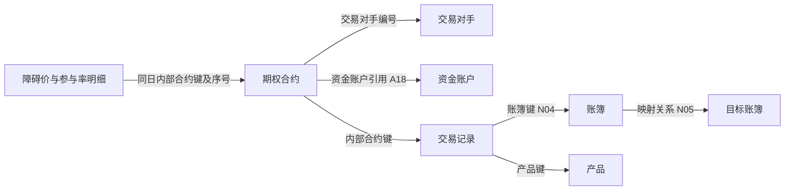

# 02.3 场外期权

**阅读重点：合约条款、对象关系与标准模型映射。**

```sql
SELECT
    KEY_OTC_TRADE_ID              AS "内部合约ID",
    CONTRACT_CODE                 AS "对外合约编号",
    KEY_CTPTY_ID                  AS "交易对手编号",
    PARTY                         AS "我司身份",
    CLEARING_HOUSE                AS "清算方身份",
    COUPON_PAYER                  AS "票息支付主体编号（本份数据及入模口径）",

    TRADE_DATE                    AS "交易达成日",
    PREMIUM_DATE                  AS "期权费支付日",
    PAYMENT_DATE_DELAY            AS "兑付日延期天数",
    PAYMENT_DATE                  AS "兑付日",
    TIME_TO_MATURITY              AS "期限(天)",

    MAXIMUM_LOSS_LEVEL            AS "本金最大亏损比例(%)",
    IS_ANNUALIZED                 AS "是否年化",
    NOTIONAL                      AS "名义本金",
    COLLATERAL_NOTIONAL           AS "绝对名义本金",
    COLLATERAL_NOTIONAL_CURRENCY  AS "绝对名义本金币种",
    SETTLEMENT_CURRENCY           AS "结算币种",

    PREMIUM_RATE                  AS "期权费率(%)",
    PREMIUM                       AS "期权费",
    MINIMUM_YIELD                 AS "最低收益率(%)",
    MAXIMUM_YIELD                 AS "最高收益率(%)",

    DIVIDEND                      AS "是否分红调整",
    COUPON_SETTLEMENT             AS "票息兑付方式",
    COUPON_CALCULATION            AS "票息计算方式",
    EARLY_TERMINATION_DELAY       AS "提前终止日递延天数",
    COUPON_PAYMENT_DELAY          AS "票息支付日递延天数",

    KEY_CONTACT_ID                AS "客户联系人ID",
    KEY_ACCOUNT_ID                AS "账号ID",
    ACCOUNT_SEQ_ID                AS "账号综合业务管理平台序列号",

    CREATED_DATETIME              AS "创建时间",
    CREATED_BY                    AS "创建人",
    UPDATED_DATETIME              AS "修改时间",
    UPDATED_BY                    AS "修改人",

    CUSTOMER_CONTACT              AS "客户联系人",
    PHONE_NO                      AS "电话",
    EMAIL                         AS "电子邮件",
    CONTACT_ADDRESS               AS "联系地址",

    CAPITAL_ACCOUNT_NAME          AS "资金账户户名",
    ACCOUNT_NUMBER                AS "账号",
    BANK_OF_DEPOSIT               AS "开户行",
    LARGE_PAYMENT_ACCOUNT         AS "大额支付号",

    SELLER                        AS "卖方交易对手ID",

    KNOCKOUT_DATE                 AS "敲出日期",
    KNOCKIN_DATE                  AS "敲入日期",
    EARLY_TERM_DATE               AS "提前终止日期",

    DATA_SOURCE                   AS "数据来源",
    TERMINATION_TYPE              AS "终止类型",
    CONTR_STATUS                  AS "合约状态",

    IS_NOT_CONSISTENT             AS "子交易数据是否与交易不一致",
    INTEREST_DAYS_CALC            AS "计息天数计算方式",
    PRIVATE_PLACEMENT             AS "是否限售",
    HEDGE_TYPE                    AS "对冲方式",
    IS_OPTION_AGGREE_END          AS "是否协议终止",
    OPEN_POSITION_TYPE            AS "建仓方式",

    ALGORITHM_ORDER_VOL           AS "算法下单比例",
    ALGORITHM_ORDER_STARTTIME     AS "算法下单开始时间",
    ALGORITHM_ORDER_ENDTIME       AS "算法下单结束时间",

    INITIAL_NOTIONAL              AS "初始名义本金",
    RELEASE_DATE                  AS "限售期结束日",

    KEY_CAPITAL_ACCT_ID           AS "资金账户ID",
    BUNDLE_ID                     AS "组合编号",

    BACK_FEE_RATIO                AS "后端费率(%)",
    BACK_FEE                      AS "后端费",
    FRONT_FEE_RATIO               AS "前端费率(%)",
    FRONT_FEE                     AS "前端费",

    DATA_TIME                     AS "数据时间",

    KNOCKOUT_SETTLEMENT_DATE      AS "敲出结算日",
    TERMINATION_DELAY             AS "终止日递延天数",

    LISTED_DATE                   AS "限售股上市日",
    COST_METHOD_BEFORE_LISTED     AS "上市日前是否使用成本估值法",
    KO_BARRIER_RESET_DATE         AS "重置敲出线日期",

    RELATE_PRODUCT_TYPE           AS "收益凭证类型",
    FUND_SETTLEMENT_TYPE          AS "资金交收类型",
    SUBSCRIBER_CTPTY_ID           AS "认购对象交易对手ID",

    REPEAT_CHECK_STATUS           AS "二次复核状态",
    DIVIDEND_MODE                 AS "分红调整方式",
    REDEMPTION_RELEASE_DATE       AS "兑回解禁日",
    FRONT_FEE_PAYMENT_DATE        AS "前端费支付日",

    TERMINATION_PRICE_TYPE        AS "期末观察价格类型",
    BACK_FEE_RATIO_TYPE           AS "后端费率类型",

    BINDING_CONTRACT_CODE         AS "绑定合约编号",
    COVERED_CALL_CONTRACT         AS "备兑合约编号",

    RECALC_HIS_POS                AS "是否重算历史持仓",
    NOTIONAL_CHECK_STATUS         AS "大额名义本金审批状态",

    VERSION                       AS "版本号",
    INITIAL_COLLATERAL_NOTIONAL   AS "初始绝对名义本金",
    DYNAMIC_NOTIONAL              AS "动态名义本金",

    VAL_TERM_DATE                 AS "估值终止日",
    BUSI_PLOT_ID                  AS "综合业务平台交易主键ID",

    ANNUALIZED_DAYS               AS "年化天数",
    INTEREST_ACCRUAL_DATE         AS "计息起始日",
    VERSION_CODE                  AS "版本编号",

    ENHANCED_RETURN_RATIO         AS "增强收益率(%)",
    ENHANCED_RETURN               AS "增强收益费",
    ENHANCED_RETURN_RATIO_TYPE    AS "增强收益费类型",

    COUPON_TRACE_METHOD           AS "分档票息追溯方式",
    USE_EARLY_LOCK_PRICE          AS "是否使用锁定价格终止",

    BUSI_DATE                     AS "业务日期"
FROM ODATA_N_TIT.D_REF_OTC_OPTION_DEAL
WHERE BUSI_DATE = '2026-09-11'
ORDER BY KEY_OTC_TRADE_ID
LIMIT 500;

```

## 1. 业务定位：合约级条款与结构明细共同描述一笔期权

**`D_REF_OTC_OPTION_DEAL` 保存场外期权的合约级信息：交易双方、资金账户、本金与费用、票息和分红约定、终止及控制状态。** 要读懂合约的收益结构，还要结合交易所引用的产品、障碍价和参与率等明细；本表的字段集合不能独立还原完整收益公式。

本份底稿为 **2026-09-11 的 500 条、98 字段**，内部合约 ID 在该样本内唯一。它是一个日期的合约快照，不是 500 笔当天新交易；样本中多数合约已终止，也不能据此推断当前业务规模或整体状态分布。文件虽名为“中英文字段”，表头主要为中文。文首保留完整字段查询并改为实际样本日期；原导出排序未附，当前排序写法不保证重现相同 500 条。

## 2. 对象关系：交易对手、支付方、账户、账簿各有职责

| 对象 | 源字段或关联 | 业务含义与使用方式 |
|---|---|---|
| 合约身份 | `KEY_OTC_TRADE_ID`、`CONTRACT_CODE` | 内部合约键与对外编号分开；内部关联使用前者，入模为期权协议 `20207` |
| 交易对手 | `KEY_CTPTY_ID` | 合约对手方；入模当事人编号添加 `TIT060-` 前缀 |
| 卖方与我司身份 | `SELLER`、`PARTY` | 前者为主体引用，后者为我司甲乙方角色；不能用甲方/乙方直接替代买方/卖方 |
| 清算方身份 | `CLEARING_HOUSE` | 本份数据为 `PARTY_A / PARTY_B`；指定甲乙哪一方，不是清算机构实体编号 |
| 票息支付方 | `COUPON_PAYER` | 本份非空值为数字主体编号，SQL 添加 `TIT060-` 后进入票息支付当事人编号 |
| 资金账户 | `KEY_CAPITAL_ACCT_ID` | 形成合约→资金账户的 `A18` 关系；与 `KEY_ACCOUNT_ID`、银行账号、账户序号不同 |
| 组合 | `BUNDLE_ID` | 保存为组合协议组编号；本次关系 SQL 的 `N02` 组合关系分支已注释，不能声称已形成组合关系边 |
| 账簿 | 合约→`D_TRD_OTC_TRADE`→`D_REF_BOOK` | 同日先按 `KEY_OTC_TRADE_ID` 关联交易，再用 `KEY_BOOK_ID` 找账簿；标准关系为 `N04` |
| 协议持有人 | 交易→账簿的 `KEY_CTPTY_ID` | 来自账簿归属主体，与合约自身的交易对手不同 |
| 合约间引用 | `BINDING_CONTRACT_CODE`、`COVERED_CALL_CONTRACT` | 绑定和备兑引用分开；源字段是编号，不能未经核对就当作内部合约键 |

**票息支付方存在明确的元数据冲突。** 源注释称其使用 `PARTY_A / PARTY_B`，源字典也有 `CouponPayer` 域，但本份数据与实际入模均按主体编号处理。因此文首别名按本份数据及入模注明“支付主体编号”，不把同名字典强套到这一列，也不把该观察外推为所有历史记录的格式。

样本还有 6 条资金账户 ID 为 `0`，不能把它计作已核实账户。关系查询须保留业务日期、来源和对象修饰符，连接前检查被关联表在这些条件下是否唯一。



图中是已查 SQL 支持的对象关联导航；最后一条账簿映射仍须结合映射条件，不表示这批期权一定触发该映射。

## 3. 金额与条款：先分清计算基数、费用和币种

| 信息组 | 主要字段 | 应怎样理解 |
|---|---|---|
| 本金基数 | `NOTIONAL`、`INITIAL_NOTIONAL`、`DYNAMIC_NOTIONAL` | 当前、初始和动态名义本金分列；当前证据未给出动态本金算法，不能直接视为市值或实时风险敞口 |
| 绝对名义本金 | `COLLATERAL_NOTIONAL`、`INITIAL_COLLATERAL_NOTIONAL` | 入模分别称绝对名义本金、初始绝对名义本金；不能仅凭 `COLLATERAL` 英文就当作实际缴存保证金，也不能未经计算规则证明等于 `ABS(NOTIONAL)` |
| 币种 | `COLLATERAL_NOTIONAL_CURRENCY`、`SETTLEMENT_CURRENCY` | 本金口径与结算口径分开；样本有 4 条两列不同，金额不能直接混加或默认都是人民币 |
| 期权费 | `PREMIUM_RATE`、`PREMIUM`、`PREMIUM_DATE` | 费率、费用金额、约定支付日是不同事实；该日期不单独证明款项已付 |
| 前后端费 | `FRONT_FEE_RATIO / FRONT_FEE`、`BACK_FEE_RATIO / BACK_FEE` | 各自保留费率、金额及适用类型；不能与期权费自动合并 |
| 收益与亏损约定 | `MINIMUM_YIELD`、`MAXIMUM_YIELD`、`MAXIMUM_LOSS_LEVEL` | 条款参数，结合产品结构和触发规则解释，不是已实现收益或损失 |
| 年化与计息 | `IS_ANNUALIZED`、`ANNUALIZED_DAYS`、`INTEREST_ACCRUAL_DATE` | 是否年化、年化天数、计息开始日期分别描述不同维度，不能统一补成 365 天 |
| 分红与增强收益 | `DIVIDEND / DIVIDEND_MODE`、增强收益率及费用字段 | 是否调整与调整方式分开；增强收益相关字段不能仅凭名称补造收费公式 |

SQL 对大部分金额、费率直接取源值，并未展示完整计价算法。中文表头中的“%”也不证明源数值已按百分数缩放；使用时需进一步核对源系统存储单位。

## 4. 字典：完整列出已核实的小代码域

下表列的是相应本地字典域的全部业务码值，排除 `! / ！` 等域说明行，不按样本是否出现删减。仓库域依据“源字段→目标字段→代码域”匹配；源字典用于交叉解释。

| 字段／字典域 | 全部码值及含义 |
|---|---|
| `PARTY`／源 `Party` | `PARTY_A` 甲方；`PARTY_B` 乙方 |
| `CLEARING_HOUSE`／源 `ClearingHouse` | `PARTY_A` 甲方；`PARTY_B` 乙方；此处表达清算方身份 |
| `CONTR_STATUS`／源 `ContrStatus` | `DRAFT` 草稿；`TOTRADE` 待交易；`EFFECTIVE` 生效；`TERMINATED` 终止；`CANCELED` 作废 |
| `TERMINATION_TYPE`／`CD706` | `EARLY_TERMINATION` 客户提前终止；`KNOCK_OUT` 合约敲出；`TERMINATION` 合约到期 |
| `COUPON_SETTLEMENT`／`CD713`、源 `CouponSettlment` | `END_PAYMENT` 期末兑付；`PERIOD_PAYMENT` 期间兑付。源域拼写为 `Settlment` |
| `COUPON_CALCULATION`／`CD714`、源 `CouponCalculation` | `ACTUAL_DAYS_CALC` 按实际天数计算；`KNOCKOUT_AVG_CALC` 按敲出点算术平均 |
| `INTEREST_DAYS_CALC`／`CD715` | `EXCLUDE_EARLY_TERM_DATE` 提前终止日不含；`INCLUDE_EARLY_TERM_DATE` 提前终止日含；`EXCLUDE_KO_DATE` 敲出观察日不含；`INCLUDE_KO_DATE` 敲出观察日含 |
| `HEDGE_TYPE`／`CD716` | `B2B` 字典标签仍为 B2B；`INITIATIVE_HEDGE` 主动对冲。该代码未给出具体对冲对手、交易或账簿映射 |
| `OPEN_POSITION_TYPE`／`CD717` | `LIMIT_PRICE` 限价；`MARKET_PRICE` 市价；`POV`、`TWAP` 字典保留原名，具体执行算法未在该域定义 |
| `DIVIDEND_MODE`／`CD1623` | `ADJUST` 调整；`CASH_DIVIDEND` 费用返还客户；`SPECIAL_ADJUST` 特殊分红调整。不能把 `CASH_DIVIDEND` 只译成“现金分红”就省略本域用途 |
| `TERMINATION_PRICE_TYPE`／`CD1719` | `MARKET_PRICE` 市场价格；`NEGOTIATION_PRICE` 协商价格。与建仓方式域的同名代码用途不同 |
| `RELATE_PRODUCT_TYPE`／`CD1035` | `DYNAMIC_INCOME_DOCUMENT` 非保本收益凭证；`GUARANTEE_INCOME_DOCUMENT` 保本收益凭证。描述关联产品类型，不能仅据此认定整笔期权的损益结构 |

`COUPON_SETTLEMENT`、`OPEN_POSITION_TYPE` 在这 500 条中都为空，但字典域有定义，空样本不等于无此功能。

以下保留为明确缺口，不按英文猜成正式口径：`BACK_FEE_RATIO_TYPE` 的 `FIXED_RATE / FLOAT_RATE` 经转码入仓，转换明细未取得；`COUPON_TRACE_METHOD` 有 `CURRENT_PERIOD / FULL_SEGMENT`，尚未核实其对应业务域；复核 `PASS / REJECT` 和大额本金审批 `PASS` 属于不同控制环节，不能替代合约状态或互相套用。

## 5. 生命周期：触发、终止、估值停止、结算分开看

- **交易与支付安排**：交易达成日、期权费支付日和兑付日分别保留；创建时间不等于业务审批生效时间。
- **触发事件**：`KNOCKIN_DATE / KNOCKOUT_DATE` 记录敲入、敲出日期；敲出结算日另有 `KNOCKOUT_SETTLEMENT_DATE`，不能把触发日视为资金到账日。
- **终止处理**：`TERMINATION_TYPE` 表达原因，`EARLY_TERM_DATE` 表达提前终止日期，`IS_OPTION_AGGREE_END` 表达是否协议终止；递延天数仍需结合条款规则。
- **估值与限售**：`VAL_TERM_DATE` 为估值终止日；限售结束、上市、兑回解禁分别有字段。它们不自动等于同一“到期日”。

合约状态为终止，只能解释当前状态，不能单凭本表认定费用、票息、本金或对冲头寸已全部结清。

## 6. 标准模型怎样重新组织这些信息

| 业务事实 | 模型表达 | 已查加工 |
|---|---|---|
| 合约主体 | `T03_AGT`，修饰符 `20207`；持有人经交易→账簿取得 | `105383` |
| 合约交易对手 | `T03_AGT_PTY_RELA_H`，关系类型 `06` | `103934` |
| 合约→资金账户 | `T03_AGT_RELA_H`，`A18`；本分支以合约放左端、账户放关联端 | `103936` |
| 合约→账簿 | `T03_AGT_RELA_H`，`N04`；账簿修饰符 `20411` | `105388` |
| 合约→产品 | `T03_AGT_PRD_RELA_H`，产品键由交易表 `KEY_INSTRUMENT_ID` 提供 | `105386` |
| 合约状态历史 | `T03_AGT_STAT_H`，状态类型 `10`，源状态经转换表处理 | `103937` |
| 合约详情及部分结构参数 | `T03_OTC_OPT_COMP_INFO`，组合、本金、费用、条款及控制信息 | `103943` |

**详情不是单表复制。** 障碍价来自 `D_REF_OPTION_DEAL_BARRIER` 的 `SEQ=0/1`，参与率来自 `D_REF_OPTION_DEAL_PR` 的 `SEQ=0/1`；均按同日合约键连接。限额审批另取 `D_TRD_OPTION_LIMIT_AUDIT`；机构和人员等属性另取 `D_TRD_OTC_CONTR_PROPS`。源侧明细不唯一时可能放大连接行数，本次未取得这些明细的业务行数据来验证唯一性。

**有两处消费时必须保留的口径冲突：**

1. 资金账户关系分支使用修饰符 `10220`，详情中的资金账户修饰符却写为 `10218`。两者不能不加核对直接拼接或在文档里统一“修正”为一个值。
2. 源 `IS_NOT_CONSISTENT` 表示“不一致”，SQL 将 `Y→1`，目标字段却命名为“子合约一致性标志”。因此目标 `1` 不能按中文正向理解成“一致”。

此外，主表将记录创建日填入生效日期，这是入模选择，不证明实际审批日期；源字段存在也不保证详情保留，当前详情的实际支付日期、买卖方向等目标列有置空处理。

## 依据与适用范围

- [期权底稿](../../../../../数综基础信息/原信息/关键表信息/D_REF_OTC_OPTION_DEAL_前500条_中英文字段.csv)：2026-09-11，500 条；本次不修改原 CSV。
- [源字典底稿](../../../../../数综基础信息/原信息/关键表信息/D_CFG_DICTIONARY_DESC_合并_中英文字段.csv)：2026-09-14，与期权样本不同日，仅作已有字典解释，不声称完成同日历史有效性核验。字典使用方式见 [TITANS 字典](%E9%99%84%E5%BD%95B%20TITANS%E6%BA%90%E5%AD%97%E5%85%B8.md)。
- 仓库字典：`CD706 / CD713—717` 的命中记录日期为 2023-05-30，`CD1035` 为 2023-11-28，`CD1623` 为 2025-02-20，`CD1719` 为 2025-06-12，来源均为 `MANU_MATN`。本地快照不保证实时完整。
- 元数据取 `odata_n_tit.d_ref_otc_option_deal`；SQL 为上表所列任务的本地快照。字段图谱（Native Facts）核对了 `Coup_Paid_Pty_Id ← COUPON_PAYER`、`Encb_Pric1 ← D_REF_OPTION_DEAL_BARRIER.BARRIER`，任务 `103943`、写入 `0`、版本 `a595d1ddd5a2570ef6905648cde90e4bb2854cb151db3f174fdbdd7fb6860bd9`；这是静态来源证据，运行状态为未核验。
- 账簿后的映射条件与盈亏方向见 [账簿映射](03.4%20%E8%B4%A6%E7%B0%BF%E6%98%A0%E5%B0%84.md)。本次没有验证生产运行、完整收益算法和实际资金交收。

返回 [02 合约主数据与条款](02%20合约主数据与条款.md)。
