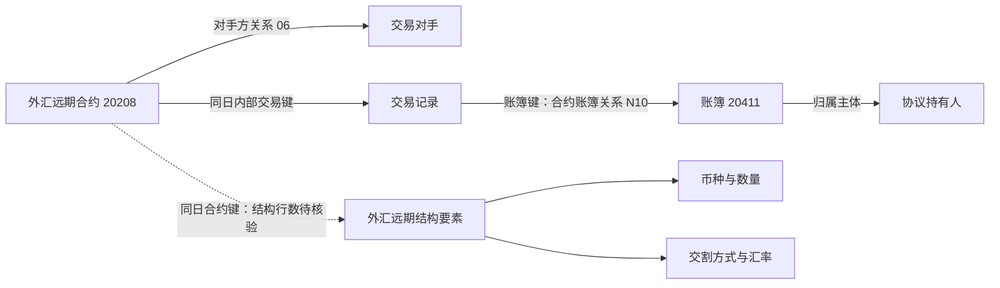

# 02.4 外汇远期

**阅读重点：合约要素、结构条款与标准模型映射。**

```sql

SELECT
    KEY_OTC_TRADE_ID        AS "TRADEFLOW内部交易流水号",
    KEY_CTPTY_ID            AS "交易对手ID",
    CONTRACT_CODE           AS "交易编号",
    SELLER                  AS "卖方交易对手ID",
    PARTY                   AS "我司身份",
    CLEARING_HOUSE          AS "清算方身份（甲方/乙方）",
    TIME_TO_MATURITY        AS "期限(天)",
    ACTUAL_TIME_TO_MATURITY AS "实际期限(天)",
    PAYMENT_DATE_DELAY      AS "兑付日延期",
    NOTIONAL                AS "名义本金(CCY1)",
    DYNAMIC_NOTIONAL        AS "动态名义本金(CCY1)",
    INPUT_DATE              AS "实际审批生效日",
    PAYMENT_DATE            AS "兑付日",
    ACTUAL_PAYMENT_DATE     AS "实际兑付日",
    CONTR_STATUS            AS "合约状态",
    TERMINATION_FEE         AS "终止结算金额",
    EARLY_TERM_DATE         AS "实际终止日",
    CREATED_BY              AS "创建人",
    CREATED_DATETIME        AS "创建时间",
    UPDATED_BY              AS "更新人",
    UPDATED_DATETIME        AS "更新时间",
    DATA_TIME               AS "数据时间",
    BUSI_DATE               AS "业务日期"
FROM ODATA_N_TIT.D_REF_FX_FORWARD
WHERE BUSI_DATE = '2026-09-14'
ORDER BY KEY_OTC_TRADE_ID
LIMIT 500;

```

## 1. 业务定位：合约要素与结构要素共同描述外汇远期

**`D_REF_FX_FORWARD` 保存一笔外汇远期的合约身份、参与方、本金、期限和生命周期信息。** 读一笔外汇远期，需要回答“与谁交易、涉及哪两种货币、按什么汇率和方式交割、何时兑付”；本表主要回答参与方和合约状态，币种与汇率要继续读结构要素表。

本份 CSV 是 **2026-09-14 的 500 条、23 字段**，`KEY_OTC_TRADE_ID` 在样本内 500 个唯一。这是业务日期下的合约快照，不代表当天新增 500 笔交易，也不证明全表主键约束。跨日使用应保留 `BUSI_DATE`；与标准模型连接还需保留来源、协议修饰符及历史有效区间。

文首查询按 CSV 日期整理，覆盖全部 23 个字段。原导出的取数排序未附，当前 `ORDER BY + LIMIT 500` 不保证复现原来的同一批记录。

## 2. 对象关系：主体、角色、账簿与结构分别表达什么

| 对象或信息 | 字段／关联入口 | 业务含义 |
|---|---|---|
| 合约身份 | `KEY_OTC_TRADE_ID` | 内部交易流水号；标准模型作为外汇远期协议编号，修饰符 `20208` |
| 交易编号 | `CONTRACT_CODE` | 源称交易编号，详情模型称内部合约编号；样本大量重复，不能代替内部交易键 |
| 合约对手方 | `KEY_CTPTY_ID` | 合约交易关系中的对手；入模当事人编号添加 `TIT060-` 前缀 |
| 卖方 | `SELLER` | 卖方主体引用，与交易对手字段分别保留；不能直接据此判断我司买卖哪一种货币 |
| 我司身份 | `PARTY` | 我司在合同中的甲乙方角色，不等于买卖方向 |
| 清算方身份 | `CLEARING_HOUSE` | 指定甲方或乙方，不是清算机构实体编号 |
| 交易与账簿 | 合约→`D_TRD_OTC_TRADE`→`D_REF_BOOK` | 同日按内部交易键找到交易，再按 `KEY_BOOK_ID` 找账簿；外汇远期→账簿关系代码为 `N10` |
| 协议持有人 | 交易对应账簿的 `KEY_CTPTY_ID` | 取自账簿归属主体，与合约本身的对手方不同 |
| 结构要素 | `D_REF_FX_FORWARD_STRUCTURE` | 币种、数量、定价日、汇率和交割方式；按合约键、业务日期核对，并先检查一笔合约有几条结构记录 |



图是 SQL 支持的对象导航，不是已验证的业务行连接结果。本次没有取得交易、账簿和结构要素的同日行数据，不能保证关联完整或一对一。若多个合约类别出现相同内部键，关系 SQL 的 `CASE` 先匹配 TRS、再期权、再外汇远期；不能忽略类别冲突直接认定为远期关系。

## 3. 本金与结构：单看金额还不能还原交割

| 信息组 | 字段 | 已核实口径与使用边界 |
|---|---|---|
| 名义本金 | `NOTIONAL` | CSV 注释为 CCY1 的名义本金；具体 CCY1 是什么货币，本表没有对应列 |
| 动态名义本金 | `DYNAMIC_NOTIONAL` | 当前 500 条均与 `NOTIONAL` 相等；详情 SQL 直接取源值，未展示动态计算算法 |
| 终止结算金额 | `TERMINATION_FEE` | 全部为空；空值不等于结算金额为零，也不证明没有结算 |
| 币种 | 结构表 `FIRST_CCY / SECOND_CCY / SETTLEMENT_CCY` | 分别入模币种1、币种2和结算币种；须核对后才能汇总或换算金额 |
| 数量 | 结构表 `INITIAL_QTY / FIRST_QTY / SECOND_QTY` | 入模期初数量、销售方支付币种1数量、销售方支付币种2数量；符号与支付方向仍应结合结构记录解释 |
| 汇率 | 结构表 `STRIKE_FX_RATE / SETTLEMENT_FX_RATE / MATURITY_FX_RATE` | 分别入模交割汇率、结算汇率、期末汇率，不能混成一个“汇率” |
| 交割与定价 | 结构表 `SETTLEMENT_METHOD / START_DATE / END_DATE` | 入模交割方式、期初定价日、期末定价日；本次未核实交割方式代码域和实际取值 |

本金样本中正数 **263 条**、负数 **237 条**，数值范围 **-3.5 亿至 3.5 亿**，带符号数值中位数 **100 万**。这些是源数值统计，不是统一币种下的业务规模。正负号应保留，但目前不能认定“正数就是我司买入”或“负数就是卖出”。

例如，一条合约写本金 2,000 万，只能先读作“CCY1 口径本金数值为 2,000 万”。没有结构中的币种、交割汇率和交割方式，不能补成“支付 2,000 万人民币、收到某金额外币”，也不能据此计算损益。

## 4. 字典：甲乙方角色与合约状态分开使用

以下为 2026-09-14 源字典底稿中对应域的全部业务码值，已排除 `! / ！` 域说明行并去重。

| 字段／源字典域 | 全部码值与标签 | 本份样本 |
|---|---|---|
| `PARTY`／`Party` | `PARTY_A` 甲方；`PARTY_B` 乙方 | 甲方 489，乙方 11 |
| `CLEARING_HOUSE`／`ClearingHouse` | `PARTY_A` 甲方；`PARTY_B` 乙方 | 甲方 240，乙方 260 |
| `CONTR_STATUS`／`ContrStatus` | `DRAFT` 草稿；`TOTRADE` 待交易；`EFFECTIVE` 生效；`TERMINATED` 终止；`CANCELED` 作废 | 终止 497，作废 3 |

`CLEARING_HOUSE` 的源表头和字典域标题均叫“清算机构”，但其子项明确是甲乙方，详情模型也叫“清算机构身份类型代码”。因此本文按“清算方身份”解释，不能将其连接成一家清算机构。

我司身份／清算方身份组合为：甲／乙 **260** 条、甲／甲 **229** 条、乙／甲 **11** 条。两列并不恒为相反角色。`SELLER = KEY_CTPTY_ID` 有 **482** 条，另外 **18** 条不同，说明卖方与合约对手方不能当作同一字段删除。

标准模型的状态使用 `REF_CD_CVT_MAP` 转码，未命中时通过 `NVL` 保留源状态。本次没有取得转换表的实际映射行，以上列的是源代码含义，不是宣称目标状态统一保存这些英文值。

## 5. 生命周期：日期含义与样本异常一起看

| 字段                        | 业务含义／入模方式             | 本份数据及解释                                                |
| ------------------------- | --------------------- | ------------------------------------------------------ |
| `INPUT_DATE`              | 实际审批生效日；主协议取其日期作为生效日期 | 有 50 条晚于约定兑付日；不能据此画出所有记录都遵循“先审批、后兑付”的时间顺序              |
| `PAYMENT_DATE`            | 约定兑付日                 | 与实际兑付日相等 491 条；其余 9 条不据此直接判为延期                         |
| `ACTUAL_PAYMENT_DATE`     | 源记录的实际兑付日             | 仍需资金流水或结算结果证明实际到账                                      |
| `EARLY_TERM_DATE`         | CSV 称实际终止日            | 497 条非空且等于实际兑付日；主协议映射到到期日期，详情映射到提前终止日期，三种名称不能当作同义词     |
| `TIME_TO_MATURITY`        | 期限天数                  | 本次没有取得起算日及计日公式                                         |
| `ACTUAL_TIME_TO_MATURITY` | 实际期限天数                | 497 条非空：计划减实际为 0 的 409 条、为 1 的 88 条；另 3 条为空，不能按 0 参与运算 |
| `PAYMENT_DATE_DELAY`      | 兑付日延期天数               | 500 条均为 0，只说明这批源记录该参数为 0                               |
| 创建／更新字段                   | 记录维护人及时间              | 用于追踪维护，不直接等于交易达成、审批或支付时间                               |
| `DATA_TIME / BUSI_DATE`   | 数据时间／业务快照日期           | 与合约业务事件日期分开；本批业务日期为 2026-09-14                         |

**终止状态不等于“提前终止”，也不等于所有资金均已结清。** 当前 CSV 没有终止原因，不能用英文列名 `EARLY_TERM_DATE` 推断这 497 笔都提前结束；期限差一天也不足以证明是是否包含起止日导致。

50 条审批日期晚于兑付日，可能涉及日期回填、审批维护或字段口径，但现有数据不能确定原因。文档保留异常，不替源系统补造解释。

## 6. 标准模型如何组织这些信息

| 业务事实 | 目标模型与关键映射 | SQL 快照任务 |
|---|---|---|
| 合约主体 | `T03_AGT`：合约键、修饰符 `20208`、账簿归属持有人、生效及到期日期；币种列置空 | `169636` |
| 合约对手方 | `T03_AGT_PTY_RELA_H`：关系类型 `06`，合约对手方加 `TIT060-` 前缀 | `169637` |
| 合约状态历史 | `T03_AGT_STAT_H`：状态类型 `10`，源状态转码，未命中保留源值 | `169638` |
| 合约→账簿 | `T03_AGT_RELA_H`：远期分支 `N10`，关联账簿修饰符 `20411`，账簿键来自交易表 | `105388` |
| 合约详情 | `T03_OTC_FX_FWD_COMP_INFO`：本金、期限、参与方身份、审批与兑付日期、终止金额等 | `163771` |
| 结构详情 | `T03_OTC_FX_FWD_COMP_STRU_ELMN_INFO`：源为 `D_REF_FX_FORWARD_STRUCTURE`，保存币种、数量、标的、汇率和交割方式 | `163772` |

这套模型把“统一协议身份”“协议关系”“合约要素”“结构要素”拆开。还原一笔远期时，先按协议键和 `20208` 定位，再看同日详情、结构及有效关系；不能仅拿 `CONTRACT_CODE` 在这些表之间连接。

两处命名差异尤其需要保留：

1. `CONTRACT_CODE → Inr_Comp_No`：从“交易编号”进入“内部合约编号”，但样本取值并未因此变得唯一。
2. `EARLY_TERM_DATE → T03_AGT.Due_Date`，同时进入详情 `Erly_Trmt_Date`：前者称到期日期，后者称提前终止日期。使用目标中文名时应同时保留源字段含义，不能据此认定约定到期日或提前终止原因。

上述内容来自静态 SQL 快照，说明加工表达，不证明任务当前发布版本、运行成功或目标业务行已正确落地。

## 7. 交易编号中的业务标签：保留线索，不直接建立对冲关系

`CONTRACT_CODE` 中较多的是 `Flexo`（191）、`Margin`（74）、`RSQK`（71）、`HKCompo`（56）、`DFGW`（34）、`Compo`（28）、`XW`（22），同时也有 `OTCHKFX-...` 形式的值。

**可以确认的是编号字段同时出现大量重复标签与编号形态的值；不能确认这是新旧版本切换或字段历史演变。** 这些标签可以作为继续查业务分类的线索，但当前 CSV 不包含被对冲合约键、对冲目的或对应头寸，不能据此把远期连到某笔 TRS、期权或客户交易，也不能把对手方编号直接解释为银行或内部主体。

## 依据与适用范围

- [外汇远期 CSV 底稿](../../../../../数综基础信息/原信息/关键表信息/D_REF_FX_FORWARD_500_中英文字段.csv)：2026-09-14，500 条、23 字段；本文统计重新从该文件计算，原 CSV 未修改。
- [源字典底稿](../../../../../数综基础信息/原信息/关键表信息/D_CFG_DICTIONARY_DESC_合并_中英文字段.csv)：2026-09-14，核对 `Party / ClearingHouse / ContrStatus`；同日快照不代表已核验全部历史版本。
- SQL 依据为上表六个任务在本地调度证据库中的快照，查询入口见 [本地 SQLite 查询导航](../../../local-sqlite-guide.md)。动态源表参数结合 SQL 内来源说明识别；未核验运行时参数和生产运行。
- 组织方式参照 [场外期权](02.3%20%E5%9C%BA%E5%A4%96%E6%9C%9F%E6%9D%83.md)；账簿后续映射的条件与方向见 [账簿映射](03.4%20%E8%B4%A6%E7%B0%BF%E6%98%A0%E5%B0%84.md)。本文未将账簿映射自动解释成外汇对冲链。
- CSV 所属测试或生产环境未随底稿说明，本次不据此判断真实业务规模、业务构成或实际资金交收；结构行、交易行、账簿行和状态转换明细仍待核验。

返回 [02 合约主数据与条款](02%20合约主数据与条款.md)。
