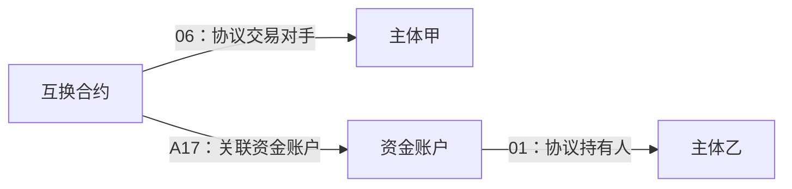

# 04 当事人与角色

**本篇描述“哪个主体，以什么身份，关联哪个账户、账簿或合约”。** 当事人可以是机构、产品或个人等主体；角色是该主体在具体业务对象中的身份，例如账户持有人、合约交易对手。

T03 将账户、账簿和合约统一作为“协议对象”管理。因此，模型中的“协议持有人”在不同场景下可以表示资金账户持有人、保证金账户持有人或账簿持有人。

**主体身份回答“是谁”，角色回答“相对于哪个对象，以什么身份参与”。** 一个机构可以持有某个账户，同时作为另一份合约的交易对手；角色随关联对象而确定，不是主体永久、唯一的分类。

## 1. 涉及表与资料范围

### 1.1 贴源表

以下贴源均位于 `ODATA_N_TIT`。本篇从各业务对象自身的记录取得对象编号和当事人引用。

| 英文表名 | 中文表名或说明 | 本篇表达的角色 |
| --- | --- | --- |
| `D_CAPITAL_ACCOUNT` | 客户资金账户信息〔元数据带 AI 标记〕 | 资金账户持有人、管理人 |
| `D_CAPITAL_ACCOUNT_P` | 客户资金账户信息 | 资金账户持有人、管理人的另一来源分支 |
| `D_MARGIN_ACCOUNT` | 保证金-交易对手保证金账户〔元数据带 AI 标记〕 | 保证金账户持有人 |
| `D_REF_BOOK` | 账簿信息表 | 账簿持有人 |
| `D_REF_TRS` | 场外交易-TRS | 普通互换合约交易对手 |
| `D_REF_FAST_TRS` | 极速互换合约要素表 | 极速互换合约交易对手 |
| `D_REF_OTC_OPTION_DEAL` | 场外交易-期权交易合同要素表 | 期权合约交易对手 |
| `D_REF_FX_FORWARD` | 外汇远期-合约要素 | 外汇远期合约交易对手 |

表名说明按本地元数据整理，已去除显示标签及重复英文装饰；源注释中的 AI 标记保留。

### 1.2 模型表

| 模型表 | 中文名称 | 保存内容 |
| --- | --- | --- |
| `PDATA_N.T03_AGT_PTY_RELA_H` | 协议当事人关系历史 | 协议对象、关联当事人及其角色 |
| `PDATA_N.T03_AGT_RELA_H` | 协议关系历史 | **对照模型**：合约、账户、账簿等业务对象之间的关系 |

前者表达“这个对象与谁有关”，后者表达“这个对象与哪个业务对象有关”。两种关系分别保存，可以衔接使用。

## 2. 一条当事人关系由什么组成

| 要素 | 模型字段 | 表达内容 |
| --- | --- | --- |
| 业务对象 | `Agt_Id`（协议编号） | 哪个具体账户、账簿或合约 |
| 对象类型 | `Agt_Type_Cd`（协议类型代码） | 该对象属于资金账户、互换合约等哪一类 |
| 当事人 | `Pty_Id`（当事人编号） | 与该对象关联的具体主体 |
| 角色 | `Agt_Pty_Rela_Type_Cd`（协议当事人关系类型代码） | 该主体是持有人、交易对手还是其他角色 |

一条关系应读作：**在某个具体业务对象中，某个主体承担某种角色。** 对象类型确定场景，角色确定主体在该场景中的身份。例如“互换合约＋主体甲＋交易对手”与“资金账户＋主体甲＋持有人”分别描述交易关系和账户持有关系，即使当事人相同也应分别保留。

这样的结构既能从合约、账户找到相关主体，也能从同一个主体反查其关联的合约和账户；反查结果仍需按角色区分，不能把全部关联对象都理解为该主体持有的资产。

本篇实际使用以下角色，代码域为 CD050：

| 角色代码 | 名称 | 本篇业务含义 |
| --- | --- | --- |
| `01` | 协议持有人 | 资金账户、保证金账户或账簿关联的持有当事人 |
| `06` | 协议交易对手 | 互换、期权、外汇远期合约的对手方 |
| `12` | 协议管理人〔按 SQL 注释解释〕 | 资金账户分支赋予的管理人角色，具体管理职责尚未核验 |

`01 / 06` 有本地字典记录；`12` 依据资金账户加工 SQL 的注释解释，原始字典快照未收录该值。完整角色字典见 [标准模型字典](附录A%20标准模型字典.md)。

## 3. 合约交易对手与账户持有人如何区分

一份合约关联资金账户后，会同时涉及两个问题：**这笔交易与谁订立，以及关联账户登记由谁持有。** 合约的交易对手来自合约资料，账户的持有人来自账户资料，合约与账户之间的关联只负责把两个业务对象连接起来。

图为关系示意，主体甲与主体乙可以相同，也可以不同。例如从互换合约出发，沿 `06` 得到的是合约交易对手；沿 `A17` 找到账户后再沿 `01`，得到的是账户持有人。**两条路径回答的问题不同，合约与账户相连并不会自动使两端当事人相同。** 实际是否同一主体，要比较各自关系中的编号。

| 业务问题 | 关系路径 | 所属模型 |
| --- | --- | --- |
| 合约的交易对手是谁？ | 合约 → `06` → 当事人 | 协议当事人关系历史 |
| 合约关联哪个资金账户？ | 互换合约 → `A17` → 资金账户 | 协议关系历史 |
| 这个账户由谁持有？ | 资金账户 → `01` → 当事人 | 协议当事人关系历史 |

各源表虽然都使用 `KEY_CTPTY_ID`（交易对手 ID）引用主体，但角色由记录所属对象及加工分支决定：合约表中的引用形成交易对手关系，账户表中的引用形成持有人关系。**字段同名不表示角色相同，也不保证引用的是同一主体。**

## 4. 不同对象怎样形成当事人关系

以下对象编号进入 `Agt_Id`（协议编号）；主体引用统一来自各源表的 `KEY_CTPTY_ID`（交易对手 ID），非空编号按对应加工加 `TIT060-` 前缀进入 `Pty_Id`（当事人编号）。

| 对象 | 源对象编号字段 | 协议类型代码及字典名称（CD039） | 角色 |
| --- | --- | --- | --- |
| 资金账户 | `KEY_CAPITAL_ACCT_ID`（资金账户 ID） | `10220`，投资管理客户资金账户信息 | `01` 持有人、`12` 管理人 |
| 保证金账户 | `KEY_MRG_ACCT_ID`（保证金账户 ID） | `10219`，交易对手保证金账户 | `01` 持有人 |
| 账簿 | `KEY_BOOK_ID`（账簿 ID） | `20411`，场外衍生品交易账簿 | `01` 持有人 |
| 普通／极速互换合约 | `KEY_OTC_TRADE_ID`（场外交易 ID） | `20206`，场外衍生品互换合约 | `06` 交易对手 |
| 期权合约 | `KEY_OTC_TRADE_ID`（场外交易 ID） | `20207`，场外衍生品期权合约 | `06` 交易对手 |
| 外汇远期合约 | `KEY_OTC_TRADE_ID`（场外交易 ID） | `20208`，场外外汇远期合约 | `06` 交易对手 |

### 同一主体可以承担多个角色

资金账户的持有人、管理人分支都取同一行的主体引用，所以同一个账户与同一个主体可以分别形成 `01`、`12` 两条关系。

| 源资料 | 模型表达 | 业务解释 |
| --- | --- | --- |
| 账户 A 引用主体 X | A → `01` → X | X 被登记为持有人 |
| 同一条源记录 | A → `12` → X | 同一个 X 又被赋予管理人角色 |

在这条源记录对应的两条关系中，主体仍是一个，只是被赋予了两个角色。删除其中一条会丢失角色信息，把两条都计为客户又会重复计算主体。**关系条数、角色数量和主体数量应分别理解。**

“管理人”在这里是资金账户加工赋予的角色名称，具体职责尚未核验；不能直接等同于产品管理机构、账户操作人或有系统权限的用户。类似地，账簿持有人说明账簿关联的主体，不直接表示具体交易员。

### 当前取数的必要限制

- 极速互换分支排除 `TRS_TYPE`（互换类型）为 `LONG_SHORT_SWAP` 的记录，不能据此代表全部极速互换。
- `D_CAPITAL_ACCOUNT_P` 分支的本地 SQL 写为 `BUSI_DATE = 'h1930'`，条件原因未核实，不能与普通资金账户分支视为同一份取数。
- 这些分支直接使用源主体引用，未连接当事人主表核验身份；空值处理也不一致。因此，存在一条关系记录，不等于已匹配到完整的当事人资料。
