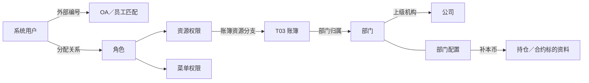

# 00 机构用户与权限全貌

**两条主线：公司、部门与配置解释账簿业务归属；用户、角色与权限解释访问配置。** 本专题沿用 T04“内部机构”主题，覆盖 TIT 已盘点的 **7 个贴源对象、9 张模型表、10 个来源分区条目、11 个入模调度**。

## 1. 对象与关系

| 主线 | 关键对象 | 阅读要点 |
| --- | --- | --- |
| 组织归属 | 公司、部门、部门配置 | 配置 ID、部门代码、公司代码各有用途；人员部门不等于账簿业务部门 |
| 用户身份 | 系统用户、外部编号 | 系统账号通过外部编号匹配人员资料，不预设一对一 |
| 访问配置 | 角色、用户角色关系、资源／菜单权限 | 分配关系说明给谁，权限说明对象及访问方式；部门归属不自动产生账簿权限 |

图表示已有加工或消费依据的查阅路径；外键唯一性、运行时授权仍需独立证据。菜单、功能、员工及账簿定义由其他主题补充。

## 2. 字段与规则

贴源对象位于 `ODATA_N_TIT`，以下模型位于 `PDATA_N`。

| 模型表 | 保存内容与关键标识 | 贴源对象 | 入模任务 |
| --- | --- | --- | --- |
| `T04_INR_ORG` | 公司／部门身份；类别 `17`，部门类型 `620`、公司类型 `621` | `D_BK_DEPARTMENT_PROPERTIES`＋名称字典 | 165634 |
| `T04_INR_ORG_NAME_H` | 机构名称历史；简称、全称共取字典标签 | 同上 | 165635 |
| `T04_INR_ORG_RELA_H` | 部门 → 公司；关系类型 `10` | `D_BK_DEPARTMENT_PROPERTIES` | 165637 |
| `T04_OTC_DERI_DEPT_ADTNL_INFO` | 配置 ID、部门、公司、本币、跨币种履保开关 | `D_BK_DEPARTMENT_PROPERTIES` | 165638、211773 |
| `T04_USER` | 用户身份：`TIT007-`＋源用户编号；类别 `50` | `A_ADM_USER` | 159422 |
| `T04_USER_STATI_INFO_H` | 外部编号历史；类型 `12`，内容为 `OUTSIDE_ID` | `A_ADM_USER` | 159420 |
| `T04_ROLE` | 角色定义：`TIT005-`＋源角色编号 | `A_ADM_ROLE` | 159423 |
| `T04_USER_ROLE_RELA_H` | 用户与角色分配历史；关系类型 `01` | `A_ADM_USER_ROLE` | 177461 |
| `T04_ROLE_RIGH_H` | 角色权限历史；资源类别 `2`、菜单类别 `1`，分来源保存 | `A_ADM_ROLE_ACCESS`／`A_ADM_MENU_ROLE_MAPPING` | 159421、178884 |

| 来源职责 | 原库 → 贴源 |
| --- | --- |
| 账簿业务配置 | `titans_dm.bk_department_properties` → `D_BK_DEPARTMENT_PROPERTIES` |
| 公司、部门名称 | `titans_dm.cfg_dictionary_desc` → `D_CFG_DICTIONARY_DESC`；按代码域＋代码查标签 |
| 系统身份与授权 | `titans_admin.adm_user`、`adm_role`、`adm_user_role`、`adm_role_access`、`adm_menu_role_mapping` → 对应 `A_ADM_*` 对象 |

**编号口径修正：**机构身份取 `DEPARTMENT/COMPANY AS ID`，配置原始 `ID` 进入附加表 `Src_Id`。工作簿“以配置 ID 建机构身份／名称”的说明不适用；原工作簿未修改。

## 3. 消费与实例

| 业务结果                                                                             | T04 提供什么              | 证据深度                                                  | 深读入口                                                  |
| -------------------------------------------------------------------------------- | --------------------- | ----------------------------------------------------- | ----------------------------------------------------- |
| 合约标的持仓 `pdata_n.t98_otc_swap_comp_trd_undrl_info`                                | 按账簿部门补本币              | 185234 SQL：`Bel_Dept = Inr_Org_Id`；211619 仅为工作簿所列另一分支 | [02 部门配置](02%20部门配置与账簿归属.md)                          |
| 对冲持仓 `dm_rsk_n.v_risk_hedging_position_tit`                                      | 部门配置与本币               | 工作簿用途＋148697、165949 表级读取关系                            | [02 部门配置](02%20部门配置与账簿归属.md)                          |
| 用户角色 `dm_ctms_n.wt_tit_sys_user_role_list_rt`／`dm_ctms_n.pwc_psn_sys_user_roles` | 用户、外部身份、角色分配          | 207500 固定 SQL；134442 表级及工作簿证据                         | [03 用户](03%20系统用户与外部身份.md)、[04 角色](04%20角色与用户角色关系.md) |
| 账簿权限 `dm_fii_n.acct_titans_user_book_right_day`                                  | 按用户、账簿聚合角色资源权限        | 177414 固定 SQL；角色／权限历史筛选不完整一致                          | [05 权限](05%20资源与菜单权限.md)                              |
| 菜单权限 `dm_ctms_n.wt_tit_sys_user_menu_rights_rt`                                  | 四级菜单＋第五级功能            | 207529 固定 SQL；功能只接第四级菜单                               | [05 权限](05%20资源与菜单权限.md)                              |
| 交易对手权限 `dm_ctms_n.wt_tit_sys_user_counterparty_rights_rt`                        | 类型 `51`、权限 `08` 的资源配置 | 207571 固定 SQL；名称用 CASE，未接 T01 主体                      | [05 权限](05%20资源与菜单权限.md)                              |

| 要回答的问题 | 查阅路径 |
| --- | --- |
| 持仓为什么用这个本币？ | 结果账簿 → 部门代码 → TIT 部门配置 → 本币；金额计算另追汇率与公式 |
| 用户为何出现在账簿权限清单？ | 用户 → 外部身份 → 角色分配 → 账簿资源权限 → 消费的日期筛选与聚合 |
| 角色怎样关联菜单功能？ | 已有源样本：角色 `10029` → 功能 `10196` → 功能代码 `190061` → 菜单 `2205`，详见第 05 篇 |

## 4. 查询入口

各篇固定采用“对象与关系 → 字段与规则 → 消费与实例 → 查询入口 → 证据与边界”。全貌用于定位，具体码值、Join 与查询留在对应子篇。

| 想了解什么 | 入口 |
| --- | --- |
| 公司、部门代码，名称与上级关系 | [01 公司与部门](01%20公司与部门.md) |
| 配置 ID、本币、履保开关与账簿匹配 | [02 部门配置与账簿归属](02%20部门配置与账簿归属.md) |
| 用户编号、状态、外部身份与人员匹配 | [03 系统用户与外部身份](03%20系统用户与外部身份.md) |
| 角色定义、分配关系与历史查询 | [04 角色与用户角色关系](04%20角色与用户角色关系.md) |
| 资源转码、菜单层级、权限实例与缺口 | [05 资源与菜单权限](05%20资源与菜单权限.md) |
| 机构／用户／角色取数 | [第一二批 SQL](第一二批-机构用户角色取数.sql)：第 02 份字典默认复用，其余六份各最多 500 条 |
| 权限样本复核 | [第三批 SQL](第三批-资源菜单权限取数.sql)：08–11 已收到，不需重复导出 |
| 相邻对象 | [T03 账簿](../T03-协议账户与合约/01.3%20账簿.md)、[T01 当事人与交易对手](../T01-主体与交易对手/00%20当事人与交易对手全貌.md) |
| 盘点与查询方法 | [TIT 入模去向](../02-TIT入模去向.md#t04-内部机构)、[关键链路](../03-关键入模链路.md#4-t04机构来自配置对象名称来自字典)、[图谱 CLI](../../../agent-graph-cli.md) |

