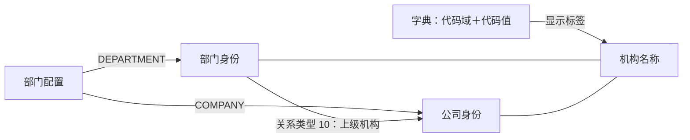

# 01 公司与部门

**公司、部门身份取自账簿部门配置中的代码，名称按代码域查字典，部门 → 公司关系单独保存历史。** 本篇范围是 TIT 业务组织归属。

## 1. 对象与关系



| 对象 | 标识／粒度 | 模型表达 |
| --- | --- | --- |
| 配置记录 | 源 `ID` | 附加表 `Src_Id`，不作为机构编号 |
| 部门 | 源 `DEPARTMENT` | `T04_INR_ORG.Inr_Org_Id`，类型 `620` |
| 公司 | 源 `COMPANY` | `T04_INR_ORG.Inr_Org_Id`，类型 `621` |
| 名称版本 | 机构编号＋来源＋历史区间 | `T04_INR_ORG_NAME_H` |
| 隶属版本 | 部门＋关系类型＋历史区间，终点为公司 | `T04_INR_ORG_RELA_H` |

## 2. 字段与规则

| 内容 | 源字段／条件 → 目标 | 关键规则 |
| --- | --- | --- |
| 机构身份，165634 | `DISTINCT DEPARTMENT AS ID`、`DISTINCT COMPANY AS ID` → `Inr_Org_Id` | 两支 `UNION ALL`；不加前缀。外层 `A.ID` 是代码别名，不是配置原始 `ID` |
| 类别与类型 | `Inr_Org_Cate_Cd=17`；部门 `Inr_Org_Type_Cd=620`、公司 `621` | 字典：场外衍生品机构／部门／公司；类别 `17` 不只指部门 |
| 名称，165634／165635 | 代码＝`DICT_ITEM_NAME`，类型＝`DICT_NAME`，两侧同一 `BUSI_DATE` | `LEFT JOIN` 取 `DICT_ITEM_LABEL`；未匹配可留空，重复匹配可能放大 |
| 简称、全称，165635 | `DICT_ITEM_LABEL` → `Inr_Org_Shor_Name`、`Inr_Org_Full_Name` | 两列共用同一标签 |
| 上级关系，165637 | `DEPARTMENT → Inr_Org_Id`；`COMPANY → Rela_Inr_Org_Id`；类型 `10` | 方向为部门 → 公司；按“部门＋关系类型”比对历史，公司是待比较属性；源行未额外去重 |
| 机构主表维护 | 按 `Inr_Org_Id` 比对，类型未进入该键 | 分支内去重不保证跨类型同码安全；状态、成立日、注销日在本分支为空 |
| 名称／关系历史 | `Strt_Date ≤ 查询日 < End_Date` | 属性变更关闭旧版本并新开版本；开链结束日 `2099-12-31`。主表不提供同样的版本区间 |

| 源字段说明 | 采用口径 |
| --- | --- |
| `DEPARTMENT` 原注释为“部门名称” | 加工实际用作代码；显示名称取字典标签 |
| `DICT_NAME`／`DICT_ITEM_NAME` | ENUM 类名／项名称；分别承担代码域／代码值 |
| `DICT_ITEM_COMMENTS` | 子项说明，不作为名称输出 |
| `INVALID_DATETIME` | 源字典失效时间；已查入模未用它额外筛选 |

**已知码值：**2026-09-14 字典快照含 Company 5 条、Department 14 条；以下 19 条未见同域同码重复，代码 `!` 跨域存在。

| 代码域 | 代码值 | 显示名称 |
| --- | --- | --- |
| `Company` | `!` | 空标签 |
| `Company` | `GFA` | 广发资管 |
| `Company` | `GFF` | 广发期货 |
| `Company` | `GFS` | 广发证券 |
| `Company` | `GFS_HK` | 广发全球资本 |
| `Department` | `!` | 空标签 |
| `Department` | `AM` | 另类投资部 |
| `Department` | `ED` | 权益及衍生品投资部 |
| `Department` | `EQD_JDSYZ` | 股衍部绝对收益组 |
| `Department` | `FICC_CROSS` | 固收自营跨境 |
| `Department` | `GFF_AM` | 广发期货资产管理部 |
| `Department` | `GFF_GFSM` | 广发商贸 |
| `Department` | `GFS_FICC` | 固定收益投资部 |
| `Department` | `GFS_FICC_COM` | 固收部商品组 |
| `Department` | `HK_FICC` | 香港FICC |
| `Department` | `HK_FINANCE` | 香港FINANCE |
| `Department` | `HK_GM` | 香港GM |
| `Department` | `OTC` | 股衍部 |
| `Department` | `OTC_HK` | 柜台交易市场(香港)部 |

`!` 的说明分别为“公司”“部门”，空标签不足以构造正式机构名称。字典定义不证明代码已被使用；公司与部门的配对取配置中的 `COMPANY/DEPARTMENT`。

## 3. 消费与实例

| 场景 | 使用方式 | 需保留的区别 |
| --- | --- | --- |
| 解释机构代码 | `Company/GFS → 广发证券`；`Department/OTC → 股衍部` | 两条是已见字典定义，不据名称推断隶属 |
| 查账簿组织归属 | 账簿部门／公司引用 → 机构身份与名称 | 账簿持有人、交易对手另属 T01 主体体系 |
| 查部门业务配置 | 部门代码 → 附加表的本币、履保开关 | 详见 [02 部门配置与账簿归属](02%20部门配置与账簿归属.md) |
| 还原历史名称与隶属 | 名称历史、关系历史各按同一查询日取区间 | 当前主表属性不自动代表历史当日属性 |

机构配置与账簿样本尚未收到；三张通用机构表的 TIT 来源消费仍待核验。

## 4. 查询入口

[第一二批取数 SQL](第一二批-机构用户角色取数.sql)：第 01 段按类型轮转并保留同日部门配置行数；第 02 段字典已有存量，仅在缺项或需同日核验时补取。

### 源配置字段速查（最多 500 条）

```sql
SELECT
    ID                       AS "部门属性ID",
    DEPARTMENT               AS "部门代码_源注释为部门名称",
    COMPANY                  AS "公司代码",
    BASE_CURRENCY            AS "本币",
    ENABLE_CURRENCY_MARGIN   AS "是否启用跨币种履保",
    CREATED_DATETIME         AS "配置创建时间",
    UPDATED_DATETIME         AS "配置更新时间",
    BUSI_DATE                AS "业务日期"
FROM ODATA_N_TIT.D_BK_DEPARTMENT_PROPERTIES
WHERE BUSI_DATE = '2026-09-15'
ORDER BY COMPANY, DEPARTMENT, ID
LIMIT 500;
```

### 指定日的部门 → 公司关系

```sql
SELECT Inr_Org_Id AS "部门编号",
       Inr_Org_Rela_Type_Cd AS "关系类型",
       Rela_Inr_Org_Id AS "上级公司编号",
       Strt_Date AS "版本开始日", End_Date AS "版本结束日"
FROM PDATA_N.T04_INR_ORG_RELA_H
WHERE SRC_TBL = 'ODATA_N_TIT.D_BK_DEPARTMENT_PROPERTIES'
  AND Inr_Org_Rela_Type_Cd = '10'
  AND Strt_Date <= '2026-09-15' AND End_Date > '2026-09-15'
ORDER BY Inr_Org_Id, Rela_Inr_Org_Id
LIMIT 500;
```

`End_Date=2099-12-31` 仅表示尚未闭链；历史日使用区间条件。速查按排序截取，正式样本覆盖方式以取数文件为准。

## 5. 证据与边界


| 证据 | 日期与范围 |
| --- | --- |
| 入模 SQL | 165634、165635、165637；模板 `${src_table}` 的物理来源结合盘点及图谱表达式解释 |
| [源字典合并导出](../../../../../数综基础信息/原信息/关键表信息/D_CFG_DICTIONARY_DESC_合并_中英文字段.csv) | 业务日 2026-09-14，共 1,086 条；完整性未与源库总数对照，未完成与其他日期配置的同日匹配 |
| 源元数据 | 部门配置、字典采集于 2026-08-21 |
| 模型字典 `MANU_MATN` | CD014／17、CD015／620、621：2024-08-02；CD018／10：2020-09-14；完整性 `UNVERIFIED` |
| 工作簿 | T04 第 5–7 行用于范围线索；“配置 ID 建机构身份／名称”已按 SQL 修正，原工作簿未改 |

**待核对：**公司部门同码、同域字典重复、同部门多公司配置可能影响匹配；缺少样本时不判定已发生。模型新增／删除不等于行政设立／撤销，TIT 隶属不扩展为法律控制、股权或全公司汇报线。

返回[机构用户与权限全貌](00%20机构用户与权限全貌.md)。


