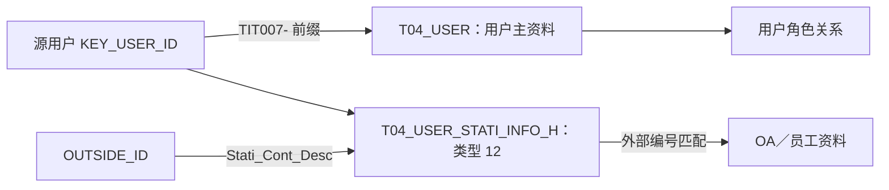

# 03 系统用户与外部身份

**TIT 用户编号识别系统账号；外部编号另存为历史属性，下游用它匹配 OA／员工资料。** 用户存在、用户状态、模型删除标志和人员在职状态分别判断。

## 1. 对象与关系



| 标识 | 保存位置 | 作用 |
| --- | --- | --- |
| 源用户编号 | `A_ADM_USER.KEY_USER_ID` | 系统用户身份；角色分配中的用户引用 |
| 模型用户编号 | `T04_USER.User_Id` | `TIT007-`＋源编号 |
| 外部编号 | 源 `OUTSIDE_ID`；模型类型 `12` 的 `Stati_Cont_Desc` | 匹配另一套身份资料，不由姓名推导 |
| 员工编号 | 员工／人员补充资料 | 通过外部编号匹配取得，不由用户入模生成 |
| T01 当事人编号 | 如交易对手 `TIT060-` 编号 | 业务参与方身份；本篇未建立系统用户与其通用映射 |

## 2. 字段与规则

| 目标与任务 | 源字段 → 目标字段 | 规则与含义 |
| --- | --- | --- |
| 用户主表 `T04_USER`，159422 | `KEY_USER_ID → User_Id` | `CONCAT('TIT007-', KEY_USER_ID)`；源元数据为 `double`，需核对平台字符串化形式 |
| 同上 | `NAME → User_Name`；`USER_DESC → User_Desc` | 名称与描述；是否实名／登录名需源语义确认 |
| 同上 | `STATUS → User_Stat_Cd` | 按转换配置映射，未命中回退源值 |
| 同上 | `CREATED_DATETIME → Oact_Date` | 取日期部分，表示源账号创建日 |
| 同上 | 固定 `User_Cate_Cd=50` | 字典“Titans系统管理用户” |
| 同上 | `User_Type_Cd`、`Clos_Date` 为空 | 本分支未提供；外部编号和源维护人／修改时间未一并承接 |
| 外部身份 `T04_USER_STATI_INFO_H`，159420 | 同规则生成 `User_Id`；固定类型 `12` | 类型含义“用户外部编号”；数值、数量、细项字段为空 |
| 同上 | `OUTSIDE_ID → Stati_Cont_Desc` | 未过滤空外部编号；有类型 `12` 记录不保证有可用编号 |
| 同上 | 按“用户编号＋信息类型”比较新旧值 | 外部编号变化维护历史区间；查询同时限定 TIT 来源、类型和日期 |

模型 `Data_Etl_Date/Data_Upt_Date/Data_Time` 来自加工维护；账号创建日、模型版本区间均不替代人员入职日或源身份正式生效日期。

## 3. 消费与实例

| 消费 | 关联路径 | 输出与读取条件 |
| --- | --- | --- |
| 177414 用户账簿权限清单 | 用户与外部身份的 `User_Id` 在子查询去前缀后关联；外部编号＝`T98_ORG_EMP_BASE_INFO.Oa_User_Id` | 补 OA 账号、员工名称，再接角色和账簿权限 |
| 207500 用户角色清单 | 同模型 `User_Id` 接外部编号；`tit_emp_dept_info.emp_oa_acct = outside_id` | 补员工编号、人员部门；人员资料先筛 `tit_id/emp_num` 非空，再按 OA 账号左连接，未按该账号去重 |

| 结果现象／差异 | 正确读法 |
| --- | --- |
| 人员名称／部门为空 | 可能未匹配；外部编号本身也可能为空，需保留中间编号定位 |
| 同用户多行 | 人员匹配与角色分配都可能一对多；结果行数不直接等于用户数 |
| 207500 的 `org_name` | 来自人员补充资料，不从 TIT 账簿部门配置推导 |
| 状态 `121` 的显示差异 | 既有全貌核验记录：207500 显示“注销”，本地 CD223 为“单边取消”；两种口径需核对，不据此直接判断在职／启用状态 |

用户样本尚待补充，外部编号与用户／人员是否一对一仍未验证。

## 4. 查询入口

[第一二批取数 SQL](第一二批-机构用户角色取数.sql)：第 04 段按状态及外部编号是否为空轮转取样；第 07 段取用户状态转换配置。中文别名依据加工语义整理，原贴源表及字段注释为空。

### 源用户字段速查（最多 500 条）

```sql
SELECT
    KEY_USER_ID        AS "源用户编号",
    NAME               AS "用户名称",
    USER_DESC          AS "用户描述",
    OUTSIDE_ID         AS "外部编号",
    STATUS             AS "源状态原值",
    CREATED_DATETIME   AS "用户创建时间",
    CREATED_BY         AS "创建人引用",
    UPDATED_DATETIME   AS "更新时间",
    BUSI_DATE          AS "业务日期"
FROM ODATA_N_TIT.A_ADM_USER
WHERE BUSI_DATE = '2026-09-15'
ORDER BY STATUS, KEY_USER_ID
LIMIT 500;
```

### 指定日的外部编号历史

```sql
SELECT 
       User_Id AS "模型用户编号",
       Stati_Cont_Desc AS "外部编号",
       Strt_Date AS "版本开始日", 
       End_Date AS "版本结束日"
FROM PDATA_N.T04_USER_STATI_INFO_H
WHERE SRC_TBL = 'ODATA_N_TIT.A_ADM_USER'
  AND User_Stati_Info_Type_Cd = '12'
  AND Strt_Date <= '2026-09-15' AND End_Date > '2026-09-15'
ORDER BY User_Id
LIMIT 500;
```

取数保留源编号类型；确认平台 `CONCAT` 结果前，不自行转整数或删去小数尾部再拼模型编号。

## 5. 证据与边界

| 证据 | 范围 |
| --- | --- |
| 入模 SQL 与源元数据 | 159422、159420；用户字段及编号类型 |
| 代表消费 | 177414、207500 已有固定 SQL |
| 状态显示差异 | 沿用本专题既有全貌记录，本次未重新查询 CD223 或消费 SQL |
| 待核验 | 用户状态转换实际值、外部编号可用性、人员匹配数；不预设系统用户与自然人一对一 |

角色分配见 [04 角色与用户角色关系](04%20角色与用户角色关系.md)。返回[机构用户与权限全貌](00%20机构用户与权限全貌.md)。


