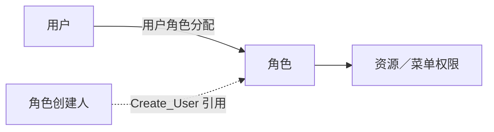

# 04 角色与用户角色关系

**角色定义一组有名称的权限配置，用户角色关系记录分配给谁，具体访问范围再查角色权限。** 角色名称不直接决定权限。

## 1. 对象与关系



| 记录／引用 | 一条记录表达什么 | 需区分什么 |
| --- | --- | --- |
| 角色定义 | 一个角色编号及名称、描述、创建资料 | 创建人不自动成为成员、管理员或审批人 |
| 用户角色分配 | 一个用户与一个角色的关联 | 被分配用户、角色创建人、分配记录创建人是三种引用 |
| 角色权限 | 角色关联的对象及访问方式 | 具体内容见 [05 资源与菜单权限](05%20资源与菜单权限.md) |

## 2. 字段与规则

| 目标与任务 | 源字段 → 目标字段 | 规则与含义 |
| --- | --- | --- |
| `T04_ROLE`，159423 | `KEY_ROLE_ID → Role_Id` | `TIT005-`＋源角色编号；源元数据为 `double`，字符串形式以平台为准 |
| 同上 | `ROLE_NAME → Role_Name`；`ROLE_DESC → Role_Desc` | 角色名称、描述 |
| 同上 | `CREATED_DATETIME → Create_Date` | 取日期部分 |
| 同上 | `CREATED_BY → Create_User` | 加 `TIT007-`；入模未连接用户表校验引用存在性 |
| 同上 | `ROLE_ALIAS` 未映射；状态、类型、类别、`Role_Cd` 为空 | 别名不直接当 `Role_Cd`；模型预留字段不表示源端已提供 |
| `T04_USER_ROLE_RELA_H`，177461 | `KEY_USER_ID → User_Id`；`KEY_ROLE_ID → Role_Id` | 分别加 `TIT007-`、`TIT005-` |
| 同上 | 固定 `User_Role_Rela_Type_Cd=01` | 字典“用户所属角色”；未区分长期、临时或管理员 |
| 同上 | `Vld_Strt_Date/Vld_End_Date` 为空 | 未提供业务授权有效期；源分配创建人／时间未承接为业务属性 |
| 同上 | `Strt_Date/End_Date` 由加工维护 | 模型版本区间；按“用户＋关系类型＋角色”比对，连接字段用 `NVL(...,'')` |

| 维护规则／代码域 | 阅读口径 |
| --- | --- |
| 角色主表按 `Role_Id` 对比源集合 | 源集合缺失的既有记录标 `Del_Flag=1` 并维护删除日期；不等于状态码“停用”，主表也不保存名称版本区间 |
| 关系历史新增／删除／变更 | 新增开链，删除关链，变更关闭旧版本并开新版本；开链结束日 `2099-12-31`，历史日左闭右开 |
| 关系入模未先连用户／角色，也未 `DISTINCT` | 端点存在性、关系唯一性需数据核对；`NVL` 不使空编号成为有效身份 |
| CD661 | `01=用户所属角色`；另有 `0101=长期`、`0102=临时`及管理员类，但本分支固定 `01` |
| `RoleDepartment` 与 `Department` | `GFS_FICC` 标签分别为“固收委场外衍生品部”／“固定收益投资部”；已查角色字段与入模未连接前者，不能据字典补出角色部门关系 |

## 3. 消费与实例

| 读取位置 | 207500 用户角色清单 | 177414 用户账簿权限清单 |
| --- | --- | --- |
| 用户 | TIT 来源、类别 `50`、`Del_Flag=0` | 同左 |
| 外部编号 | TIT 来源、类型 `12`、`End_Date=2099-12-31` | 同左 |
| 用户角色关系 | TIT 来源，限定 `End_Date=2099-12-31` | 限定 TIT 来源，已查 SQL 未同样限定历史结束日 |
| 角色定义 | TIT 来源、`Del_Flag=0`，左连接 | TIT 来源，内连接；已查子查询未加 `Del_Flag=0` |
| 后续处理 | 补人员信息、角色名称 | 继续筛账簿资源，并按用户、账簿等维度聚合 |
| 结果解释 | 用户可保留而角色名为空，需查分配／过滤／匹配 | 未匹配角色可被排除；不是全量用户名册 |

**教学示例：**用户 U 分配 R1、R2，两角色都指向同一本账簿 → 2 条分配、1 个用户、1 个账簿。三个计数各按自身身份计算，不能直接用展开行数替代。

角色可暂时没有用户分配；独立样本缺少端点不证明源表缺失。两清单的 Join 与历史条件差异已确认，是否违背业务预期仍需同日结果与验收口径。

## 4. 查询入口

[第一二批取数 SQL](第一二批-机构用户角色取数.sql)第 05、06 段：带角色名称、分配人数和端点匹配数；第 06 段先在全日集合计数，再截取最多 500 条。源字段注释缺失，下列中文别名依据加工语义。

### 源角色定义与分配速查（各最多 500 条）

```sql
SELECT
    KEY_ROLE_ID        AS "源角色编号",
    ROLE_NAME          AS "角色名称",
    ROLE_ALIAS         AS "角色别名原值",
    ROLE_DESC          AS "角色描述",
    CREATED_BY         AS "角色创建人引用",
    CREATED_DATETIME   AS "角色创建时间",
    BUSI_DATE          AS "业务日期"
FROM ODATA_N_TIT.A_ADM_ROLE
WHERE BUSI_DATE = '2026-09-15'
ORDER BY KEY_ROLE_ID
LIMIT 500;
```

```sql
SELECT
    KEY_USER_ID        AS "被分配用户编号",
    KEY_ROLE_ID        AS "被分配角色编号",
    CREATED_BY         AS "分配记录创建人引用",
    CREATED_DATETIME   AS "分配记录创建时间",
    BUSI_DATE          AS "业务日期"
FROM ODATA_N_TIT.A_ADM_USER_ROLE
WHERE BUSI_DATE = '2026-09-15'
ORDER BY KEY_ROLE_ID, KEY_USER_ID
LIMIT 500;
```

### 指定日的用户角色关系

```sql
SELECT User_Id AS "模型用户编号", Role_Id AS "模型角色编号",
       User_Role_Rela_Type_Cd AS "关系类型",
       Strt_Date AS "模型版本开始日", End_Date AS "模型版本结束日",
       Vld_Strt_Date AS "业务有效起始时间", Vld_End_Date AS "业务有效截止时间"
FROM PDATA_N.T04_USER_ROLE_RELA_H
WHERE SRC_TBL = 'ODATA_N_TIT.A_ADM_USER_ROLE'
  AND User_Role_Rela_Type_Cd = '01'
  AND Strt_Date <= '2026-09-15' AND End_Date > '2026-09-15'
ORDER BY User_Id, Role_Id
LIMIT 500;
```

历史关系接当前用户／角色主表时，应另核对两侧时点；空业务有效期不表示永久授权。

## 5. 证据与边界

| 证据 | 日期与范围 |
| --- | --- |
| 入模／消费 SQL | 159423、177461；207500 图谱版本 `9dbe562350452a41ae13c1b95f260a631fce9d2f9b8dceeba43e79dbf65f7c02`；177414 沿用 `243350d5ad79…`，未全量重验 |
| 元数据 | 角色／关系源：2026-09-02；关系模型：2026-08-22 |
| CD661，`MANU_MATN` | `01` 日期 2023-04-13；`0101/0102` 为 2026-06-05；完整性 `UNVERIFIED` |
| 部门字典 | 来源与快照见 [01 公司与部门](01%20公司与部门.md) |
| 待补样本 | 角色定义、用户分配；尚未据角色名称“管理员／只读”等推断权限 |

源分配创建时间、模型版本时间、业务授权有效期各有含义；实际授权操作人和执行结果需源记录或日志证据。

用户身份见 [03 系统用户与外部身份](03%20系统用户与外部身份.md)。返回[机构用户与权限全貌](00%20机构用户与权限全貌.md)。


