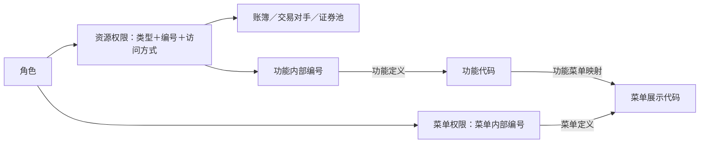

# 05 资源与菜单权限

**权限按“对象类型＋对象编号＋访问方式”解释：菜单分支记录角色关联的菜单，资源分支可指向账簿、交易对手、功能或证券池。** 本篇已有实际源样本，尚未验证运行时授权结果。

## 1. 对象与关系



| 辅助对象   | 来源 → 模型／任务                                                   | 编号与连接规则                                                                                       |
| ------ | ------------------------------------------------------------ | --------------------------------------------------------------------------------------------- |
| 菜单定义   | `A_ADM_MENU_PERMISSION → T99_SYS_MENU_INFO`，177760           | `MENU_ID → TIT288-Menu_Id`；`MENU_NUMBER → Menu_Disp_Num`；`PARENT_NUMBER → Prnt_Menu_Disp_Num` |
| 功能定义   | `A_ADM_FUNCTION → T00_SYS_FUNC_INFO`，242362                  | `KEY_FUNCTION_ID → Func_Id`（内部编号）；`FUNCTION_NUMBER → Func_Cd`（代码）                             |
| 功能菜单对应 | `A_ADM_FUNCTION_MENU_MAPPING → T99_SYS_FUNC_MENU_MAP`，242349 | `FUNCTION_NUMBER → Func_Id`、`MENU_NUMBER → Menu_Id`；此表同名 ID 列实际存代码                            |

**两条编号路径：**菜单权限 `Righ_Obj = 菜单定义.Menu_Id`；功能权限 `Righ_Obj = 功能定义.Func_Id → Func_Cd = 映射.Func_Id → 映射.Menu_Id = 菜单定义.Menu_Disp_Num`。这些辅助表不计入九张 T04 模型表。

## 2. 字段与规则

### 两种来源，共用 `PDATA_N.T04_ROLE_RIGH_H`

| 字段                 | 资源权限：159421                     | 菜单权限：178884                           |
| ------------------ | ------------------------------- | ------------------------------------- |
| 来源分区               | `ODATA_N_TIT.A_ADM_ROLE_ACCESS` | `ODATA_N_TIT.A_ADM_MENU_ROLE_MAPPING` |
| `Role_Id`          | `TIT005-`＋`KEY_ROLE_ID`         | `TIT005-`＋`ROLE_ID`                   |
| `Righ_Cate_Cd`     | `2`，数据权限                        | `1`，功能权限                              |
| `Righ_Obj_Type_Cd` | `RESOURCE_TYPE` 转码，未命中回退源值      | 固定 `11`，菜单                            |
| `Righ_Obj`         | `RESOURCE_ID` 原值                | 非空 `MENU_ID` 加 `TIT288-`，空白值写空串       |
| `User_Righ_Cd`     | `ACCESS_TYPE` 转码，未命中回退源值        | 空串，不表示“无权限”                           |
| 权限名称、启用标志、权限编号     | 为空                              | 为空                                    |
| 源创建人／创建时间          | 未作为专门业务属性承接                     | 同左；模型数据时间表示加工时间                       |

类别 `2` 虽称“数据权限”，也承接功能对象；解释对象必须继续看类型。数字型 ID 的字符串形式以平台为准。

### 实际转换配置

159421 限定源系统 TIT、源表 `ADM_ROLE_ACCESS`；`RESOURCE_TYPE → Righ_Obj_Type_Cd`、`ACCESS_TYPE → User_Righ_Cd`。以下 **12 行配置更新日期均为 2024-06-12**。

| 转换维度 | 源值 | 模型值 | 源含义 → 模型含义 | 本次权限样本是否出现源值 |
| --- | --- | --- | --- | --- |
| 资源类型 | `BOOK` | `50` | 交易账簿 → 交易账簿 | 是 |
| 资源类型 | `COUNTERPARTY` | `51` | 交易对手 → 交易对手 | 是 |
| 资源类型 | `FUNCTION` | `52` | 功能 → 功能 | 是 |
| 资源类型 | `INSTRUMENT_POOL` | `32` | 证券池 → 产品组权限 | 是 |
| 资源类型 | `PRICINGENV` | `53` | 定价环境 → 定价环境 | 未见 |
| 资源类型 | `REPORT` | `54` | 报表 → 报表 | 未见 |
| 访问类型 | `DELETE` | `06` | 删除权限 → 删除权限 | 是 |
| 访问类型 | `READ` | `01` | 可读权限 → 查询权限 | 是 |
| 访问类型 | `READONLY` | `07` | 只读权限 → 只读权限 | 是 |
| 访问类型 | `READWRITE` | `08` | 可读写权限 → 可读写权限 | 是 |
| 访问类型 | `UPDATE` | `09` | 更新权限 → 更新权限 | 是 |
| 访问类型 | `WRITE` | `10` | 写权限 → 写权限 | 是 |

`READ/READONLY` 对应不同代码；证券池转为 `32` 后仍保留源“证券池”含义。样本值均按原始大小写命中，SQL 未统一 `UPPER`；本批配置同字段无重复源值、无多个源值对应同一模型值，不构成长期一对一约束。

### 源枚举与模型字典：定义范围不等于实际授权范围

| 源代码域 | 值（保留大小写） | 标签／说明 |
| --- | --- | --- |
| `AccessType` | `ReadOnly`、`ReadWrite` | 可读、可读写 |
| `ResourceType` | `BOOK`、`Function` | Book／交易账簿、功能 |
| `ResourceType` | `Pricer`、`PricingEnv` | Pricer／定价模型、PricingEnv／定价环境 |
| 两域的 `!` | 说明记录 | 访问类型域为“访问类型／用于权限控制的访问类型”；资源类型域标签为空 |

源字典没有覆盖样本中的 `COUNTERPARTY/INSTRUMENT_POOL`；`Pricer/PricingEnv` 在本次样本未见，不证明全库未用。字典的 `Function/ReadWrite` 与样本、转换配置中的 `FUNCTION/READWRITE` 大小写不同。

| 模型代码域 | 已核对值与含义 |
| --- | --- |
| CD662／权限类别 | `1=功能权限`、`2=数据权限` |
| CD663／对象类型 | `11=菜单`（备注限定类别 1）；`50=交易账簿`、`51=交易对手`、`52=功能` |
| CD664／用户权限 | `07=只读权限`、`08=可读写权限` |

## 3. 消费与实例

### 三类清单的实际规则

| 清单 | 对象与条件 | 结果形成与关键差异 |
| --- | --- | --- |
| 账簿权限 177414 | 资源来源，类别 `2`、类型 `50`；`Righ_Obj = Book_Agt_Id` | 按用户、OA、人员名称、账簿编号／名称聚合权限代码及名称；外部身份限定开链，角色／资源权限未同样限定 |
| 交易对手权限 207571 | 资源来源，类型 `51`、权限 `08` | 资源编号非空显示“读写”；名称用固定 CASE，未接 T01 主体取名 |
| 菜单权限 207529 | 菜单来源＋资源来源功能类型 `52` | 补用户、角色、人员；四级菜单＋第五级功能，具体规则如下 |

| 207529 处理环节 | 关联与筛选 | 输出含义 |
| --- | --- | --- |
| 菜单集合 | 尚未闭链的用户角色关系＋菜单权限，接菜单定义；对角色及菜单属性 `DISTINCT` | 按同角色、父子展示编号拼 1–4 级；缺级授权／定义可能断路，不自动继承父菜单权限 |
| 功能集合 | 类型 `52`，沿本篇编号路径接功能、映射、菜单 | 未像菜单分支限定 `End_Date=2099-12-31`，也未仅保留 `07/08` |
| 访问类型反查 | `User_Righ_Cd = REF_CD_CVT_MAP.DW_CD_VAL`，取 `SRC_CD_VAL` | 本批无反查展开；以后多源值映射同代码仍可能展开，最终输出未显示访问类型 |
| 五级展示 | `menu_id_lvl1–4 = MENU_NUMBER`；`menu_id_lvl5 = FUNCTION_NUMBER`，名称列对应菜单／功能名 | 第五级只按同角色＋功能挂接菜单等于第四级菜单拼入；不是任意深度树，也不证明“当前可读写” |

### 源样本实例：角色 10029

| 环节 | 已收到的记录 | 含义 |
| --- | --- | --- |
| 资源权限 | `10029 / FUNCTION / 10196 / READWRITE` | 角色对功能内部编号 10196 的可读写配置 |
| 功能定义 | `10196 → 190061`，“获取系统中所有字典” | 内部编号转功能代码 |
| 功能菜单对应 | `190061 → 2205` | 功能挂在展示代码 2205 的菜单 |
| 菜单分配与定义 | 同角色关联内部 ID `88` → `2205`，“数据字典维护”，二级，父代码 `22` | 菜单与功能指向同一位置 |
| 上级菜单 | 同角色关联内部 ID `83` → `22`，“系统设置”，一级 | 路径：系统设置 → 数据字典维护 → 获取系统中所有字典 |

按入模规则预计为角色 `TIT005-10029`、对象类型 `52`、访问类型 `08`，菜单按 `TIT288-` 编码；尚未导出模型行确认实际编号与代码。样本不含用户分配及角色名称。

另一例：角色 `10333` 的 `FUNCTION / 12923 / READWRITE` → 功能代码 `150005`“切换云行情地址” → 三级菜单 `221407`“百宝箱”，上级为 `2214`“运营工具”、`22`“系统设置”。**这两例功能分别挂在二级、三级菜单，207529 的第四级挂接条件无法按源定义将其接为第五级；模型与下游结果尚未核验，未判定线上漏报。**

### 样本中的定义缺口

下列匹配数先在同日源表连接计算，再截取最多 500 行；不是独立文件之间查不到记录。

| 已返回样本中的现象 | 例子 | 可确认范围 |
| --- | --- | --- |
| 500 条菜单分配中，33 行菜单内部编号匹配数为 0 | 角色 `10001`、菜单内部编号 `110` | 当日按 `MENU_ID` 未找到定义 |
| 500 条功能菜单结果中，4 行功能代码匹配数为 0 | 功能 `700001 → 菜单 2107` | 映射存在，按 `FUNCTION_NUMBER` 未找到功能定义 |
| 同份功能菜单结果中，14 行菜单代码匹配数为 0 | 功能 `240045`“根据名称查询销售机构” → 菜单 `1005` | 功能有定义，按菜单展示代码未找到菜单定义 |

返回行的资源授权组合、菜单分配、功能菜单映射计数及已匹配定义计数均为 1；未据此断言全表唯一或计算总体缺失率。缺失原因待围绕具体编号核验。

## 4. 查询入口

[第三批取数 SQL](第三批-资源菜单权限取数.sql)的 08–11 四份结果已收到，可按具体编号复核。源字段注释为空，中文别名依据实际加工语义。

### 源资源权限与菜单分配速查（各最多 500 条）

```sql
SELECT
    KEY_ROLE_ID       AS "源角色编号",
    RESOURCE_TYPE     AS "资源类型原值",
    RESOURCE_ID       AS "资源对象编号",
    ACCESS_TYPE       AS "访问类型原值",
    CREATED_DATETIME  AS "权限记录创建时间",
    CREATED_BY        AS "创建人引用",
    BUSI_DATE         AS "业务日期"
FROM ODATA_N_TIT.A_ADM_ROLE_ACCESS
WHERE BUSI_DATE = '2026-09-15'
ORDER BY RESOURCE_TYPE, ACCESS_TYPE, KEY_ROLE_ID, RESOURCE_ID
LIMIT 500;
```

```sql
SELECT
    ROLE_ID     AS "源角色编号",
    MENU_ID     AS "菜单内部编号",
    CREATE_TIME AS "菜单分配记录创建时间",
    CREATE_BY   AS "创建人引用",
    BUSI_DATE   AS "业务日期"
FROM ODATA_N_TIT.A_ADM_MENU_ROLE_MAPPING
WHERE BUSI_DATE = '2026-09-15'
ORDER BY ROLE_ID, MENU_ID
LIMIT 500;
```

## 5. 证据与边界

| 证据 | 日期与范围 |
| --- | --- |
| 源权限样本 | 08 [资源权限，500 行](D:/downloadData/google/Document/20260916104109导出当前显示结果.csv)；09 [菜单分配与定义，500 行](D:/downloadData/google/Document/20260916104135导出当前显示结果.csv)；10 [功能与菜单对应，500 行](D:/downloadData/google/Document/20260916104201导出当前显示结果.csv)；业务日均为 2026-09-15 |
| 转换配置 | 11 [权限转码，12 行](D:/downloadData/google/Document/20260916104218导出当前显示结果.csv)；查询不限业务日，更新日均为 2024-06-12，不作为历史有效期证明 |
| [源字典](../../../../../数综基础信息/原信息/关键表信息/D_CFG_DICTIONARY_DESC_合并_中英文字段.csv) | 2026-09-14，`AccessType/ResourceType`；未证明覆盖源库全量 |
| 模型字典 `MANU_MATN` | CD662／1、2 和 CD663／11：2023-04-13；CD663／50、51、52 和 CD664／07、08：2024-06-12；完整性 `UNVERIFIED` |
| SQL 与图谱 | 入模 159421、178884，辅助 177760、242362、242349；图谱 `9dbe562350452a41ae13c1b95f260a631fce9d2f9b8dceeba43e79dbf65f7c02` 的 207529 固定 SQL；159421、178884 下游深度 2 分别查到 3、1 个消费任务，止于边界 |
| 复用范围 | 177414、207571 沿用前次固定 SQL，未全量重验；模板来源结合盘点与消费来源条件，不证明当前运行实参 |

**解释边界：**同一资源编号须连对象类型读取；多角色可重复或聚合到同一资源。源样本按字符串读取、保留缺失，尚未证明模型落地、运行时拒绝优先级／继承／动态校验或实际操作结果。

用户身份见 [03 系统用户与外部身份](03%20系统用户与外部身份.md)，角色分配见 [04 角色与用户角色关系](04%20角色与用户角色关系.md)。返回[机构用户与权限全貌](00%20机构用户与权限全貌.md)。


