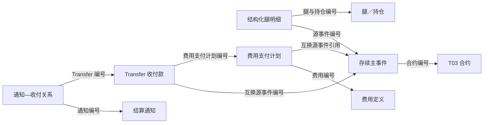

# 00 事件与业务处理全貌

**T05 记录业务处理中发生的变化，以及围绕这些变化形成的支付安排、收付款、通知和处理记录。** T03 的合约、账簿和费用定义提供业务背景；T05 帮助我们理解这些对象发生了什么，以及后续怎样处理。

本专题整理 TIT 范围内的 T05。阅读时先分清“一条记录表示什么”，再看它通过哪些编号与其他记录关联。

第一次阅读可先看第 1 节的业务分组和第 3 节的关系示例；第 2 节用于查表，第 4 节进入具体子篇。

## 1. 业务全貌

| 业务分组 | 包含对象 | 要回答的问题 |
| --- | --- | --- |
| 合约存续与结算处理 | 存续主事件、结构化腿变动明细、费用支付计划、收付款、结算通知及通知—收付关系 | 合约发生什么变化，涉及多少数量和金额，相关款项与通知怎样记录？ |
| 账户资金变化 | 资金账户流水、保证金账户流水 | 账户发生了什么变化，发生额、余额、可用和冻结金额分别怎样保存？ |
| 成交与回报分配 | 账簿成交、票据交易、互换成交回报、成交回报分配 | 一笔成交、收到的回报及其分配分别是什么记录？ |
| 报备与处理记录 | 协会报备、合约修改记录、流程实例、流程变量 | 业务办理、资料修改和流程处理留下什么记录？ |

这些对象的记录粒度不同。例如，**一次合约变化可以对应多条持仓明细，一项费用可以有多次支付安排，通知与收付款另有对应关系。** 因此，事件数、明细数、支付计划数和收付款笔数各自回答不同的问题。

## 2. 对象与模型导航

以下主要源表位于 `ODATA_N_TIT`，模型表位于 `PDATA_N`。表中分别列出共用模型的不同来源，方便按业务对象定位。

### 2.1 合约存续与结算处理

| 业务对象 | 一条记录表示什么 | 主要源表 → 模型表 | 深读入口 |
| --- | --- | --- | --- |
| 普通互换存续事件 | 一次合约变化，保存类型、状态、本金前后值和事件金额 | `D_TRD_TRS_EVENT → T05_OTC_COMP_DURA_CHG_EVT` | [01 存续事件](00-20260914-图谱认知/01-tit入模/T05-业务事件与资金收付/01%20合约存续事件与持仓变化.md) |
| 期权存续事件 | 一次期权变化，另有绝对／动态本金、提前终止及公司行为字段 | `D_TRD_OPTION_EVENT → T05_OTC_COMP_DURA_CHG_EVT` | [01 存续事件](00-20260914-图谱认知/01-tit入模/T05-业务事件与资金收付/01%20合约存续事件与持仓变化.md) |
| 极速互换存续事件 | 一次极速互换变化，按产品编号关联 `D_TRD_OTC_TRADE` 补合约 | `D_TRD_FAST_TRS_EVENT → T05_OTC_COMP_DURA_CHG_EVT` | [01 存续事件](00-20260914-图谱认知/01-tit入模/T05-业务事件与资金收付/01%20合约存续事件与持仓变化.md) |
| 互换结构化腿变动 | 某次事件下的一条腿／持仓变动明细，按腿关联 `D_REF_TRS_LEG` 补合约 | `D_TRD_TRS_EVENT_STRUC_DETAIL → T05_OTC_SWAP_COMP_HOLD_CHG_DET` | [01 存续事件](00-20260914-图谱认知/01-tit入模/T05-业务事件与资金收付/01%20合约存续事件与持仓变化.md) |
| 收付款记录 | 一条 Transfer，保存款项身份、日期、状态、金额和业务引用 | `D_TRD_TRANSFER → T05_OTC_RECV_PYMT_EVT` | [02 收付款](00-20260914-图谱认知/01-tit入模/T05-业务事件与资金收付/02%20收付款记录与金额口径.md) |
| 费用支付计划 | 一次支付安排，按费用编号关联 `F_TRD_FEE` 补合约 | `F_TRD_FEE_PAYMENT_SCHEDULE → T05_OTC_DERI_COMP_FEE_PYMT_PLAN` | [03 费用计划](00-20260914-图谱认知/01-tit入模/T05-业务事件与资金收付/03%20费用支付计划.md) |
| 结算通知单 | 一张通知的内容、状态、结算分项和业务引用 | `N_OPE_SETTLE_NOTICE → T05_OTC_DERI_COMP_SETT_NTFC_SEND_EVT` | [04 结算通知](00-20260914-图谱认知/01-tit入模/T05-业务事件与资金收付/04%20结算通知与收付关系.md) |
| 通知—收付关系 | 一组通知与 Transfer 的对应关系及模型有效区间 | `N_OPE_SETTLE_NOTICE_TRANSFER → T05_OTC_DERI_EVT_RELA_H` | [04 结算通知](00-20260914-图谱认知/01-tit入模/T05-业务事件与资金收付/04%20结算通知与收付关系.md) |

### 2.2 账户资金变化

| 业务对象 | 一条记录表示什么 | 主要源表 → 模型表 |
| --- | --- | --- |
| 资金账户流水 | 资金发生额，以及余额、可用、冻结等前后值；资金账户资料辅助补交易对手 | `D_CAPITAL_ACCOUNT_LEDGER → T05_OTC_DERI_CUTP_FND_CHG_EVT` |
| 保证金账户流水 | 保证金发生额、前后余额和生效时间；保证金账户资料辅助补交易对手 | `D_MARGIN_ACCOUNT_LEDGER → T05_OTC_DERI_CUTP_MARG_CHG_EVT` |

### 2.3 成交与回报分配

| 业务对象 | 一条记录表示什么 | 主要源表 → 模型表 |
| --- | --- | --- |
| 账簿成交 | 账簿内的一条成交记录 | `B_TRD_DEAL → T05_OTC_DERI_BOOK_MTCH_EVT` |
| 票据交易 | 一条产品交易流水，与账簿成交共用模型、分别保存来源 | `P_PRD_NOTES_TRADE_RECORD → T05_OTC_DERI_BOOK_MTCH_EVT` |
| 互换成交回报 | 一条成交回报，保存成交数量、金额等 | `D_TRD_TRS_UNDERLYING_DEAL → T05_OTC_DERI_SWAP_MTCH_RETU_EVT` |
| 成交回报分配 | 一条分配记录，引用成交回报及合约 | `F_TRD_TRS_UDLY_DEAL_ALLO → T05_OTC_DERI_SWAP_MTCH_RETU_ASGN_EVT` |

回报数量与分配数量处于不同层次。分配用于解释回报如何归属到业务对象，两者不重复相加。

### 2.4 报备与处理记录

| 业务对象 | 一条记录表示什么 | 主要源表 → 模型表 |
| --- | --- | --- |
| 协会报备 | 合约登记编码、报备及到期时限、状态；期权／互换资料辅助补充 | `D_TRD_OTC_CONTR_REPORT → T05_OTC_COMP_RGST_SAC_EVT` |
| 合约修改记录 | 一条修改留痕，与业务成交、存续事件分别保存 | `D_ADM_AUDIT_LOG → T05_SB_OTC_COMP_MODIF_LOG` |
| 流程实例 | 一次流程实例 | `W_ACT_HI_PROCINST／W_ACT_HI_PROCINST_P → T05_TIT_PROC_INSTC` |
| 流程变量 | 流程实例内的变量记录 | `W_ACT_HI_VARINST → T05_TIT_PROC_VAR_CHG_EVT` |

一次流程可以包含多个变量。变量记录数与流程实例数分别统计；具体流程对应哪种业务对象，需要按该流程的业务引用理解。

## 3. 主要业务关系

### 3.1 合约、事件、费用、收付款与通知

箭头表示记录之间的编号引用。收付款按所属业务使用相应引用，不要求每条记录同时关联所有对象；图中也没有规定各对象必须依次产生。

### 3.2 用一次提前终止理解记录分工

下面是**教学示意**，字母编号用于说明关系。

设合约 `C1` 提前终止，涉及两笔持仓，并有一条相关收付款及一张通知：

| 记录 | 示例编号 | 这条记录回答什么 |
| --- | --- | --- |
| 合约 | `C1` | 这次变化属于哪份业务约定？ |
| 存续主事件 | `E1`，引用 `C1` | 发生了什么变化，事件日期和处理状态是什么？ |
| 持仓变化明细 | `D1、D2`，都引用 `E1` | 各自影响哪笔持仓，变动数量、前后数量和金额是多少？ |
| 收付款 | `P1`，引用 `E1` | 相关款项怎样记录，支付日、状态和金额是什么？ |
| 通知及对应关系 | `N1`；关系记录连接 `N1` 与 `P1` | 通知了哪些结算内容，对应哪条款项？ |

这样读取时，`D1、D2` 是同一次事件的两条明细；`P1` 的金额属于收付款记录；`N1` 的状态属于通知。它们各有自己的含义。

费用支付走另一条分支：**费用定义说明费用是什么，支付计划说明何时安排支付，Transfer 保存相关收付款。** 有多次支付安排时，分别按计划编号识别，详见第 03 篇。

### 3.3 从业务记录到应用结果

源系统提供事件金额、本金变化、收付款和通知内容等业务记录；T05 将它们整理为模型身份、字段和关系，并维护相应记录。下游再按用途选择、关联和计算。

| 应用 | 如何使用 T05 | 结果的含义 |
| --- | --- | --- |
| T98 交易事件汇总 | 组合事件、持仓明细、收付款及费用计划，分别计算变动金额和现金收付金额 | 两种金额回答不同问题；详细计算见第 01–03 篇 |
| 结算异常监测 | 按事件、收付款、通知关系、通知状态和交易日历判断 | 找出不满足该项通知要求的记录，规则见第 04 篇 |
| 通知数量核对 | 比较模型未删除通知条数与当日源通知条数 | 回答数量是否一致，不替代逐条通知的业务判断 |

### 3.4 贯穿各篇的四个区别

| 阅读维度 | 需要分清什么 |
| --- | --- |
| 编号 | 主事件、明细、Transfer、支付计划和通知各有自己的编号；引用经常使用源编号，不能见到同名 `Evt_Id` 就直接连接 |
| 日期 | 事件日、支付日、实际支付日、清算日、审批时间各有用途；源 `BUSI_DATE` 还承担数据分区的作用 |
| 状态 | 事件、收付款、费用计划、通知各有状态；例如费用计划的 `SETTLED` 表示对应 Transfer 已确认，通知的 `VERIFIED` 表示已确认回复 |
| 金额与记录版本 | 事件金额、明细金额、计划金额、实际支付和收付款金额分别读取；当前记录、日数据和区间历史也使用不同查询条件 |

## 4. 阅读入口

| 想弄清的问题 | 入口 |
| --- | --- |
| 合约发生什么变化，为什么一个事件有多条明细？ | [01 合约存续事件与持仓变化](00-20260914-图谱认知/01-tit入模/T05-业务事件与资金收付/01%20合约存续事件与持仓变化.md) |
| 一条收付款怎样关联业务，日期和金额怎样选？ | [02 收付款记录与金额口径](00-20260914-图谱认知/01-tit入模/T05-业务事件与资金收付/02%20收付款记录与金额口径.md) |
| 费用定义、支付计划和收付款怎样区分？ | [03 费用支付计划](00-20260914-图谱认知/01-tit入模/T05-业务事件与资金收付/03%20费用支付计划.md) |
| 通知包含什么，如何找到对应收付款？ | [04 结算通知与收付关系](00-20260914-图谱认知/01-tit入模/T05-业务事件与资金收付/04%20结算通知与收付关系.md) |

初次阅读可按 01 → 02 → 03 → 04 的顺序。账户资金变化、成交与回报分配、报备与处理记录目前在本篇提供对象导航；其他系统的 T05 内容见 [T05 全主题入口](../../../00-20260911-认知实验/t05专题-事件/README.md)。

字段查询放在各子篇末尾，组合查询见 [事件、收付与通知查询 SQL](../../../attachments/README/IMG-README-20260918111629837.sql)。
