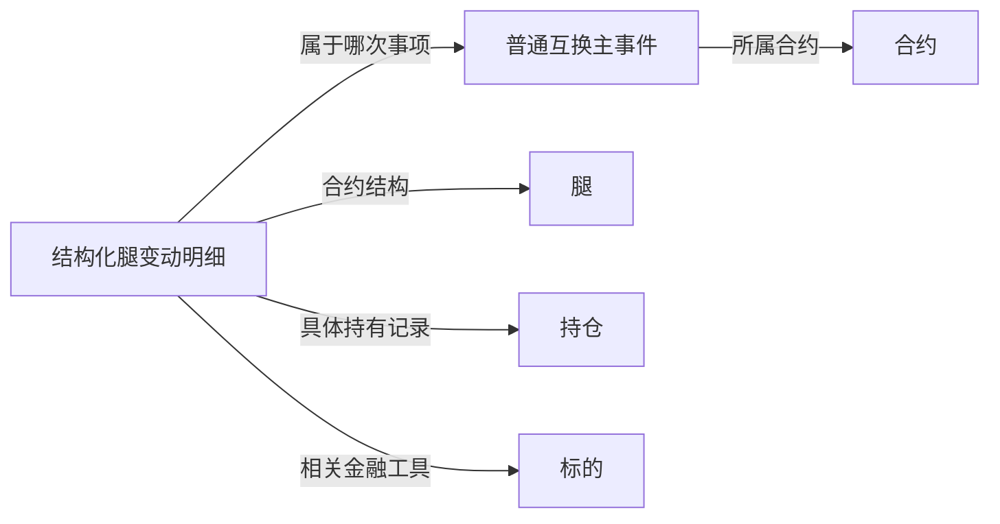

# 01.1 存续事件与持仓明细的关系

**合约、事件、腿、持仓和变动明细，分别描述业务约定、发生事项、合约结构、持有记录和具体变化。** 将这些概念分开，才能理解为什么主事件之外还需要持仓明细，以及相关收付款为什么另行保存。

## 1. 合约与存续事件分别记录什么

合约保存一项业务的类型、参与方、期限、规模和具体条款。存续事件记录围绕这份合约发生的事项，例如合约建立、加减仓、终止、重置、公司行为及费用收益处理。

不同事件关注的内容不同：

| 事项 | 主要表达什么 |
| --- | --- |
| 加仓、减仓、名义本金重置 | 合约规模或相关持仓的调整 |
| 提前终止、到期 | 合约的终止相关处理 |
| 合约重置、利率重置 | 条款相关的调整事项 |
| 公司行为、分红 | 相关标的的公司行为及对应调整、收益内容 |
| 费用、付息及其他收益 | 一项费用或收益处理事项 |

因此，“存续事件”比“持仓数量变化”的范围更大。读取事件先看类型，再看这一类型涉及的本金、价格、数量、费用或收益字段。

## 2. 主事件与变动明细为什么分开

主事件保存一次事项共同的业务信息，包括所属合约、类型、日期、状态，以及主事件层面的本金或金额等内容。

普通互换的结构化腿明细进一步定位到具体腿、持仓和标的，并保存相应的数量前值、变动值、后值及明细金额。

| 层次 | 说明什么 | 典型内容 |
| --- | --- | --- |
| 主事件 | 合约发生了什么事项 | 合约编号、事件类型、日期、状态、本金变化、事件金额 |
| 变动明细 | 事项涉及哪个具体对象、发生了什么变化 | 腿编号、持仓编号、标的编号、数量变化、明细金额 |

主事件中的共性信息与具体持仓的变化内容分别保存，才能同时表达合约层面的事项和持仓层面的影响。两者通过源事件编号关联。

这里展开的是普通互换的腿明细关系。期权和极速互换同样有主事件资料，但它们的专门变化内容应按各自字段理解。

## 3. 腿、持仓、标的怎样区分

| 概念 | 在本篇中的作用 | 明细中的对应字段 |
| --- | --- | --- |
| 腿 | 定位合约中的结构部分 | `KEY_LEG_ID` |
| 持仓 | 定位本次变化涉及的具体持有记录 | `KEY_LEG_POSITION_ID` |
| 标的 | 定位相关金融工具，继续查名称、类别和代码 | `UNDERLYING_INS_ID` |

三个编号各有用途。腿编号说明这项变化属于哪部分合约结构；持仓编号说明是哪笔持仓；标的编号说明相关金融工具是什么。

持仓前后数量与这次变动数量也分别保存：前值说明变化前的数量，变动值说明本次变化，后值说明变化后的数量。具体符号和前后关系按相应事件类型理解。

## 4. 本金、数量、价格、金额为什么分别看

| 内容 | 表达的业务含义 |
| --- | --- |
| 名义本金 | 合约规模的金额口径；期权还分别保存绝对、动态本金 |
| 持仓数量 | 具体持仓的数量及变化 |
| 价格与定价结果 | 例如期初价、提前终止价格、内在价值和现值 |
| 事件／明细金额 | 源系统在相应业务层次记录的金额内容 |
| 收付款金额 | Transfer 中保存的相关款项金额 |

这些字段共同描述业务，但各自的对象和单位不同。名义本金变化不能直接等同于持仓数量变化，事件金额也不能直接等同于相关款项的支付金额。

事件处理状态、生效更新标志、收付款状态也分别保存。它们对应事项处理、数据更新和款项处理的不同环节。

具体代码、源字段与模型字段对应关系见 [01 合约存续事件与持仓变化](00-20260914-图谱认知/01-tit入模/T05-业务事件与资金收付/01%20合约存续事件与持仓变化.md)；款项资料见 [02 收付款记录与金额口径](00-20260914-图谱认知/01-tit入模/T05-业务事件与资金收付/02%20收付款记录与金额口径.md)。
