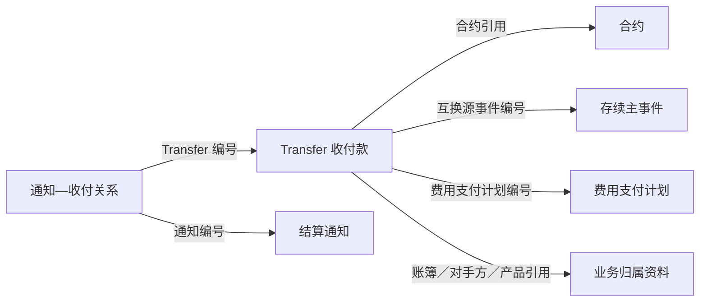

# 02 收付款记录与金额口径

**Transfer 是一条收付款记录，保存款项的编号、类型、状态、日期、金额和业务归属。** 它通过交易、合约、存续事件或费用计划等引用，说明这笔款项与什么业务有关。

理解一条 Transfer，可以依次看四件事：款项属于谁、是什么类型、采用哪种日期、读取哪个金额字段。

## 1. 对象与业务关系

源表为 `ODATA_N_TIT.D_TRD_TRANSFER`，模型为 `PDATA_N.T05_OTC_RECV_PYMT_EVT`。每条 Transfer 有自己的 `TRANSFER_ID`，模型用 `TIT157-` 前缀形成 `Evt_Id`。



这些引用按款项所属业务使用。一份合约可以关联多条收付款，一次事件也可能涉及多个支付日。Transfer 的记录数量因此与合约数、事件数分别计算。

收付款状态描述源系统中这条款项的处理情况；实际支付日期保存源系统登记的支付时间。银行到账属于另外的业务确认，不能只凭这两个字段作等同解释。

## 2. 字段与处理规则

### 2.1 自身编号与业务引用

| 业务含义 | 源字段 → 模型字段 | 使用方式 |
| --- | --- | --- |
| 收付款身份 | `TRANSFER_ID → Evt_Id=TIT157-TRANSFER_ID`；`Recv_Pymt_No` 保留原值 | 分别识别模型记录与源收付款 |
| 交易编号 | `TRADE_ID → Trd_Id` | 某些期权消费分支用它连接合约编号 |
| 合约编号 | `KEY_CONTRACT_ID → Comp_No` | 保存直接的合约引用，与 `Trd_Id` 分开 |
| 账簿归属 | `BOOK_ID → Book_Agt_Id` | 账簿修饰符固定 `20411` |
| 对手方 | `KEY_CTPTY_ID → Pty_Id` | 非空时加 `TIT060-`，关联 T01 身份 |
| 产品 | `KEY_INSTRUMENT_ID → Src_Prd_Id / Prd_Id` | 前者保留原值，后者加 `TIT-` |
| 互换事件 | `KEY_TRS_EVENT_ID → Swap_Dura_Evt_No` | 关联主事件的源编号 `Src_Id` |
| 持仓与腿 | `TRS_LEG_POSITION_ID / KEY_LEG_ID → Swap_Hold_Id / Leg_Glbl_Seq_No` | 解释相关持仓和腿 |
| 费用支付计划 | `KEY_FEE_PAYMENT_ID → Paid_Date_Id` | 保存计划源编号；这里的 `Paid_Date_Id` 不是日历日期键 |

同为编号，作用各不相同。例如，按互换事件查款项使用 `Swap_Dura_Evt_No`；查费用计划对应款项使用 `Paid_Date_Id`，不能统一换成合约编号。

### 2.2 类型、状态与收付方向

| 内容 | 源字段 → 模型字段 | 说明 |
| --- | --- | --- |
| 收付款类型 | `TRANSFER_TYPE → Recv_Pymt_Type_Cd` | 说明款项属于哪类业务 |
| 收付款状态 | `TRANSFER_STATUS → Recv_Pymt_Stat_Cd` | 说明这条款项的处理状态 |
| 收付方向 | `PAYRECEIVE_TYPE → Recv_Pymt_Dir_Cd` | 与金额、币种一起解释款项方向 |

三列均直接保留源值，不经过 `REF_CD_CVT_MAP` 转码。相关代码包括：

| 代码域 | 代码 |
| --- | --- |
| `TRANSFER_STATUS` | `CANCELED`、`PENDING`、`PEND_REVIEW`、`SEND`、`SETTLED`、`VERIFIED` |
| `TransferType` | `COUPON`、`EXERCISE_FEE`、`FEE`、`INTEREST`、`PAYOUT`、`PREMIUM`、`PRINCIPAL`、`REBATE`、`TERMINATION_FEE` |

代码域中的 `!` 是说明项。终止通知监测还使用 `TERMINATION_INCOME`，所以上表用于查阅，不能作为全部业务取值的封闭清单。

不同应用选择不同状态：交易事件汇总取 `VERIFIED`，结算异常监测的相关分支取 `VERIFIED/SETTLED`。这里保留各自的选择条件，不统一称为同一套“有效付款”。

### 2.3 支付日期、清算日期与记录时间

| 业务含义 | 源字段 → 模型字段 | 用于什么问题 |
| --- | --- | --- |
| 支付日期 | `PAYMENT_DATE → Paid_Date` | 某个支付日归集了哪些款项？ |
| 实际支付日期 | `ACTUAL_PAYMENT_DATE → Actl_Paid_Date` | 源系统登记的实际支付日期是什么？ |
| 清算日期 | `CLEARING_DATE → Clr_Date` | 款项按哪个清算日归属？期权消费以此对齐事件日 |
| 收付起止区间 | `START_DATE / END_DATE → Begn_Date / End_Date` | 这条收付记录对应哪个起止区间？ |
| 创建／更新时间 | `CREATED_DATETIME / UPDATED_DATETIME` | 记录何时创建、何时修改？ |

业务日期字段入模多用 `SUBSTR(...,1,10)` 截取到日，创建／更新时间保留原值。收付款的 `End_Date` 表达收付区间终点，与通知关系模型的历史结束日含义不同。

### 2.4 金额的两个维度：调整前后、我司收付

金额需要同时区分“调整前还是调整后”“总金额还是我司应收／应付”，原币金额另外保存。

| 金额角色 | 源字段 → 模型字段 |
| --- | --- |
| 调整前总金额 | `AMOUNT → Amt`；`AMOUNT_ORG → Ocrrc_Amt` |
| 调整后总金额 | `AMOUNT_ADJUSTED → Aft_Adj_Amt`；`AMOUNT_ADJUSTED_ORG → Aft_Adj_Ocrrc_Amt` |
| 调整前我司应付 | `PAYABLE → Our_Payb_Amt`；`PAYABLE_ORG → Our_Payb_Ocrrc_Amt` |
| 调整前我司应收 | `RECEIVALBE → Our_Rcvb_Amt`；`RECEIVALBE_ORG → Our_Rcvb_Ocrrc_Amt` |
| 调整后我司应付 | **`AMOUNT_RECEIVALBE → Aft_Adj_Our_Payb_Amt`**；原币字段同方向 |
| 调整后我司应收 | **`AMOUNT_PAYABLE → Aft_Adj_Our_Rcvb_Amt`**；原币字段同方向 |

最后两项容易因英文名称而误读：现有字段定义及入模对应将 `AMOUNT_RECEIVALBE` 用作“调整后我司应付”，将 `AMOUNT_PAYABLE` 用作“调整后我司应收”。按上表理解对应关系，不自行交换两列。

读取金额时先确定所需口径，再结合 `CURRENCY`、收付方向、金额符号和适用汇率解释。`AMOUNT` 并不统一表示人民币金额；总金额与应收／应付分项分别保存，本篇不将它们定义为固定的相减公式。

### 2.5 当前记录与删除标志

入模按 `Evt_Id` 比较源记录与模型现有来源分区，区分新增、变化、相同和源缺失。源中不再出现的旧记录保留，并设置 `Del_Flag=1`。因此模型保存当前内容及删除信息，不逐次保存状态变化历史。

两条入模分支写入相同模型和来源分区，读取源表时均未限定 `BUSI_DATE`。查询入口中的日期条件用于选定一个源数据日，不代表入模始终只读该日；两条入模分支也不能当成两份互斥数据相加。

## 3. 业务应用与实例

### 3.1 同一事件可以分不同日期收付

以下为**教学示例**，金额假设使用同一币种：

| 收付款 | 引用事件 | 支付日期 | 调整后金额 |
| --- | --- | --- | ---: |
| `P1` | `E1` | 9 月 15 日 | 100 |
| `P2` | `E1` | 9 月 16 日 | 200 |

按支付日查看，会看到两个日期的款项；按事件查看，在所选两条记录范围内合计为 `300`。两种结果回答的问题不同，不能把第一天的 `100` 当成事件全部款项。

若事件 `E1` 还有两条持仓明细，直接把事件款项连接到两条明细，款项会在展开结果中重复出现。分析时要保留收付款编号和支付日期，先明确需要的是款项层、事件层还是持仓明细层的结果。

### 3.2 交易事件汇总怎样关联收付款

T98 交易事件汇总对普通互换与期权采用不同的连接方式：

| 处理环节 | 普通互换分支 | 期权部分终止分支 |
| --- | --- | --- |
| 收付款范围 | `TRS`、指定来源、`Del_Flag=0`、`VERIFIED` | `OTC_OPTION_CONTRACT`、指定来源、`Del_Flag=0`、`VERIFIED` |
| 金额 | `Aft_Adj_Amt` | `Aft_Adj_Amt` |
| 先按什么汇总 | 支付日＋`Swap_Dura_Evt_No` | 支付日＋清算日＋`Trd_Id` |
| 再怎样连接 | 源事件号连接互换主事件 | `Trd_Id = 事件.Otc_Comp_Agt_Id`，且 `Clr_Date = 事件.Evt_Date` |

普通互换按源事件定位，再与事件明细组合。期权分支按“合约＋清算日”连接，并未使用源期权事件编号逐条定位；同一合约同日有多条符合条件的事件时，汇总款项可能被接到多条事件记录。

因此，输出的“现金收付金额”需要连同分支、支付日和连接粒度一起理解。它与存续事件自己的 `Evt_Amt` 也不是同一个字段。

## 4. 查询入口

下面查看指定源业务日的收付款。中文别名保留不同日期、金额和业务引用，方便与正文对照。

```sql
SELECT TRANSFER_ID AS "收付款ID",
       TRADE_ID AS "交易ID",
       KEY_CONTRACT_ID AS "合约ID",
       INS_FAMILY AS "源产品类型",
       TRANSFER_TYPE AS "收付款类型",
       TRANSFER_STATUS AS "收付款状态",
       PAYRECEIVE_TYPE AS "收付方向",
       CURRENCY AS "币种",
       PAYMENT_DATE AS "支付日期",
       ACTUAL_PAYMENT_DATE AS "实际支付日期",
       CLEARING_DATE AS "清算日期",
       AMOUNT AS "金额",
       AMOUNT_ADJUSTED AS "调整后金额",
       AMOUNT_ORG AS "原币金额",
       AMOUNT_ADJUSTED_ORG AS "调整后原币金额",
       KEY_TRS_EVENT_ID AS "互换源事件ID",
       KEY_FEE_PAYMENT_ID AS "费用支付计划ID",
       BUSI_DATE AS "源业务日期"
FROM ODATA_N_TIT.D_TRD_TRANSFER
WHERE BUSI_DATE = '2026-09-15'
ORDER BY INS_FAMILY, TRANSFER_TYPE, TRANSFER_STATUS, TRANSFER_ID
LIMIT 500;
```

按业务分类选取记录的查询见 [查询 SQL 第 05 段](../../../attachments/README/IMG-README-20260918111629837.sql)。

相关阅读：[01 存续事件](00-20260914-图谱认知/01-tit入模/T05-业务事件与资金收付/01%20合约存续事件与持仓变化.md) · [03 费用支付计划](00-20260914-图谱认知/01-tit入模/T05-业务事件与资金收付/03%20费用支付计划.md) · [04 结算通知](00-20260914-图谱认知/01-tit入模/T05-业务事件与资金收付/04%20结算通知与收付关系.md) · [返回全貌](00-20260914-图谱认知/01-tit入模/T05-业务事件与资金收付/00%20事件与业务处理全貌.md)。
