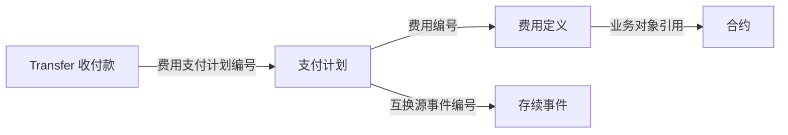

# 03 费用支付计划

**费用定义说明费用是什么、属于哪项业务；支付计划说明某次安排何时支付、计划多少，并保存源系统登记的实际支付信息。** 相关款项以 Transfer 的形式另行记录。

因此，理解费用支付要同时分清费用编号、支付计划编号和收付款编号。一项费用有多次支付安排时，各次安排分别读取。

## 1. 对象与业务关系

源表位于 `ODATA_N_TIT`，模型位于 `PDATA_N`。

| 对象 | 一条记录表示什么 | 保存位置与职责 |
| --- | --- | --- |
| 费用定义 | 一项费用及其业务归属 | `F_TRD_FEE` 提供费用编号、合约／业务对象引用，作为计划入模的辅助来源 |
| 支付计划 | 一次支付安排 | `F_TRD_FEE_PAYMENT_SCHEDULE → T05_OTC_DERI_COMP_FEE_PYMT_PLAN`，保存日期、金额和状态 |
| 收付款 | 一条相关款项记录 | `D_TRD_TRANSFER → T05_OTC_RECV_PYMT_EVT`，通过计划编号保留引用 |



计划入模读取同日计划和费用定义，按 `计划.KEY_FEE_ID = 费用.KEY_FEE_ID` 左连接。没有匹配费用定义时，计划仍保留，但合约无法完整补充；同一个费用编号匹配多条定义时，计划会随匹配记录展开。

## 2. 字段与处理规则

### 2.1 支付计划身份与引用

| 业务含义 | 源字段 → 模型字段 | 用途 |
| --- | --- | --- |
| 计划身份 | `KEY_FEE_PAYMENT_ID → Evt_Id=TIT327-KEY_FEE_PAYMENT_ID`；`Src_Id` 保留原值 | 识别本次支付安排 |
| 所属费用 | `KEY_FEE_ID → Trd_Fee_Src_Id` | 关联费用定义或对应费用资料 |
| 互换事件 | `KEY_TRS_EVENT_ID → Dura_Chg_Evt_Src_Id` | 保存存续源事件引用 |
| 收付款中的计划引用 | `Transfer.KEY_FEE_PAYMENT_ID → Paid_Date_Id` | 从收付款找到对应计划的源编号 |

费用编号用于识别费用，计划编号用于识别一次安排。它们不能互相替代，也不限定一项费用只能有一期计划、一份计划只能关联一条 Transfer。

### 2.2 合约归属如何补充

模型合约编号 `Otc_Comp_Agt_Id` 从费用定义中取得：

| 费用定义字段条件 | 合约编号取值 | 合约修饰符 |
| --- | --- | --- |
| `KEY_OTC_TRADE_ID` 非空且不为字符串 `0` | `KEY_OTC_TRADE_ID` | `20207` |
| `KEY_OTC_TRADE_ID` 为空或为 `0` | `ENTITY_ID` | `20206` |

这里按字段取值选择分支，不能只凭 `KEY_OTC_TRADE_ID` 的名称认定业务类型。若费用定义未匹配，表达式仍可能进入回退分支：修饰符为 `20206`，但合约编号为空。解释合约归属时，两列一起读取。

### 2.3 日期、金额、币种与汇率

| 业务含义 | 源字段 → 模型字段 | 使用方式 |
| --- | --- | --- |
| 计划／实际支付日期 | `PAYMENT_DATE / ACTUAL_PAYMENT_DATE → Paid_Date / Actl_Paid_Date` | 区分支付安排与源系统登记的实际支付日期，入模截取到日 |
| 计划金额 | `AMOUNT / AMOUNT_ORG / AMOUNT_CNY → Lcrrc_Amt / Ocrrc_Amt / Rmb_Amt` | 分别保存本币、原币、人民币计划金额 |
| 实际支付金额 | `ACTUAL_PAYMENT / ACTUAL_PAYMENT_ORG → Actl_Paid_Amt / Ocrrc_Actl_Paid_Amt` | 保存实际支付金额及原币实际金额，与计划金额分列 |
| 汇率 | `EXCHANGE_RATE / EXCHANGE_RATE_CNY / SETTLE_PAIRS_EXCHANGE_RATE → Rate / Rmb_Rate / Disp_Rate` | 普通汇率、人民币汇率、展示汇率各有用途 |
| 支付类型与费率 | `PAYMENT_TYPE / FEE_RATE → Otc_Deri_Paid_Type_Cd / Fee_Rate` | 保留源值 |
| 费用状态 | `STATUS → Fee_Stat_Cd` | 保留源值，含义见下一节 |
| 互换费用补录标志 | `TRS_FEE_ADDITIONAL → Swap_Fee_Supp_Flag` | `Y → 1`、`N → 0`，其他值保留 |

计划模型没有独立输出计划币种列。解释金额时，应结合费用定义及合约／收付款上下文明确币种。本币、原币、人民币金额表达不同口径，不重复相加。

### 2.4 费用状态

费用状态 `CD1759` 描述计划及其对应 Transfer 的处理情况：

| 状态 | 含义 | 怎么理解 |
| --- | --- | --- |
| `NEW` | 新增 | 计划已有记录，Transfer 是否生成另看相关记录 |
| `PENDING` | 金额待定 | 金额尚未确定，空值不表示零费用 |
| `USER_INPUT` | 待用户输入 | 仍有待补充的输入内容 |
| `SENT` | Transfer 已生成 | 已形成对应的收付款记录 |
| `SETTLED` | 支付日期对应 Transfer 已确认 | 表达对应 Transfer 的确认情况 |
| `UNKNOWN` | 支付日期对应 Transfer 状态未知 | 对应收付款的状态尚不明确 |

这里的 `SENT` 指 Transfer 已生成，`SETTLED` 指对应 Transfer 已确认。它们都围绕系统中的支付记录解释，不能直接换成银行发送或到账结论。

### 2.5 记录维护

计划入模覆盖自己的来源分区，没有汇总或按期次去重，也没有把源 `BUSI_DATE` 输出为模型日分区。计划模型因此不能直接套用按业务日保存多份快照的查询方式。

## 3. 业务应用与实例

### 3.1 一项费用分两次安排支付

以下是**教学示例**，金额假设使用同一币种：

| 对象 | 编号与引用 | 内容 |
| --- | --- | --- |
| 费用定义 | `F1` | 一项金额为 `1000` 的费用 |
| 支付计划 | `S1`，引用 `F1` | 9 月 15 日计划支付 `600` |
| 支付计划 | `S2`，引用 `F1` | 9 月 30 日计划支付 `400` |
| 收付款 | `P1`，引用 `S1` | 与第一份计划相关的一条金额为 `600` 的收付款记录 |

这组示意记录中，有一项费用、两次支付安排和一条收付款。查费用总额看费用定义，查每次安排看计划，查已形成的款项看 Transfer。

计划内的实际支付字段还可以保存源系统登记的实际金额；计划金额、实际支付金额和 Transfer 金额的对应关系，需要结合具体业务读取，不能仅因关联就把它们视作同一列。

### 3.2 交易事件汇总用了计划的日期、费用的金额

T98 交易事件汇总的费用分支这样使用计划：

| 处理环节 | 使用方式 |
| --- | --- |
| 连接 | `T03_SB_OTC_COMP_TRD_FEE.Src_Id = 计划.Trd_Fee_Src_Id` |
| 业务范围 | 费用类型 `14`，并按部门、账簿、合约状态筛选 |
| 支付日期 | 取计划的 `Paid_Date` |
| 资金收付金额 | 取 T03 费用的 `Fee_Amt`，未取计划的 `Actl_Paid_Amt` |
| 来源区别 | 计划入模按 `F_TRD_FEE` 补归属；消费中的 T03 费用限定 `ODATA_N_TIT.D_TRD_FEE` 来源 |

因此，该项输出应解释为“按计划日期组织的费用金额”，不直接称为计划登记的实际支付金额。`F_TRD_FEE` 与 `D_TRD_FEE` 是不同来源，连接按上述源费用编号条件进行，不能仅凭表名相似合并。

如果一项费用关联两份计划，费用金额会被带到两份计划的结果中。以上面的 `F1` 为教学示意，直接带出费用总额会在两行各出现 `1000`；这时两行表达日期安排下的结果，不能再相加当成费用总额 `2000`。

## 4. 查询入口

下面查看指定源业务日的支付计划，保留费用、事件引用以及计划／实际金额。

```sql
SELECT KEY_FEE_PAYMENT_ID AS "支付计划ID",
       KEY_FEE_ID AS "费用定义ID",
       KEY_TRS_EVENT_ID AS "互换源事件ID",
       PAYMENT_TYPE AS "支付类型",
       PAYMENT_DATE AS "计划支付日期",
       ACTUAL_PAYMENT_DATE AS "实际支付日期",
       AMOUNT AS "本币计划金额",
       AMOUNT_ORG AS "原币计划金额",
       AMOUNT_CNY AS "人民币计划金额",
       ACTUAL_PAYMENT AS "实际支付金额",
       ACTUAL_PAYMENT_ORG AS "原币实际支付金额",
       STATUS AS "费用状态",
       TRS_FEE_ADDITIONAL AS "互换费用补录标志",
       BUSI_DATE AS "源业务日期"
FROM ODATA_N_TIT.F_TRD_FEE_PAYMENT_SCHEDULE
WHERE BUSI_DATE = '2026-09-15'
ORDER BY STATUS, PAYMENT_TYPE, KEY_FEE_ID, KEY_FEE_PAYMENT_ID
LIMIT 500;
```

同时查看费用归属、合约和币种的组合查询见 [查询 SQL 第 06 段](../../../attachments/README/IMG-README-20260918111629837.sql)。

相关阅读：[01 存续事件](00-20260914-图谱认知/01-tit入模/T05-业务事件与资金收付/01%20合约存续事件与持仓变化.md) · [02 收付款](00-20260914-图谱认知/01-tit入模/T05-业务事件与资金收付/02%20收付款记录与金额口径.md) · [返回全貌](00-20260914-图谱认知/01-tit入模/T05-业务事件与资金收付/00%20事件与业务处理全貌.md)。
