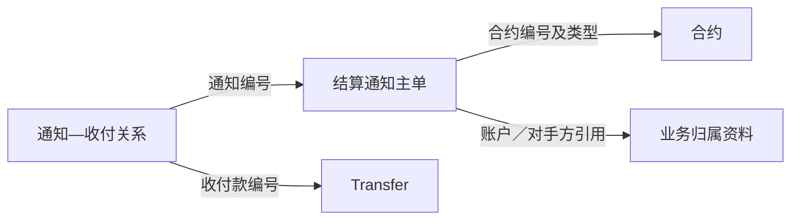

# 04 结算通知与收付关系

**结算通知单保存一次通知的业务内容和处理状态，通知—收付关系说明它对应哪些 Transfer。** 阅读时先看通知本身，再沿关系找到相关款项，分别理解通知状态、收付款状态和各类日期。

模型名称中的“结算通知发送事件”包含通知主单的各类状态，一行首先表示一张通知记录，而不是一次邮件发送日志。

## 1. 对象与业务关系

源表位于 `ODATA_N_TIT`，模型位于 `PDATA_N`。

| 对象 | 一条记录表示什么 | 源表 → 模型表 |
| --- | --- | --- |
| 结算通知主单 | 一张通知的状态、结算分项和业务归属 | `N_OPE_SETTLE_NOTICE → T05_OTC_DERI_COMP_SETT_NTFC_SEND_EVT` |
| 通知—收付关系 | 一个通知编号与一个收付款编号的对应关系 | `N_OPE_SETTLE_NOTICE_TRANSFER → T05_OTC_DERI_EVT_RELA_H` |
| 收付款 | 一条款项的日期、状态和金额 | `D_TRD_TRANSFER → T05_OTC_RECV_PYMT_EVT`，详见第 02 篇 |



主单负责通知内容，关系表负责通知与款项的配对。需要找通知对应的收付款时，应沿关系表读取，不把“合约相同、日期相同”直接当成两者唯一对应。

## 2. 字段与处理规则

### 2.1 通知身份、业务归属与日期

| 业务含义 | 源字段 → 模型字段 | 使用方式 |
| --- | --- | --- |
| 通知身份 | `ID → Evt_Id=TIT292-ID`；`Sett_Ntfc_Id` 保留原值 | 分别识别模型通知与源通知 |
| 合约归属 | `KEY_OTC_TRADE_ID / CONTRACT_TYPE → Otc_Comp_Agt_Id / Otc_Comp_Agt_Modifr` | `TRS → 20206`、`OPTION → 20207`，其他类型保留原值 |
| 资金账户 | `KEY_CAPITAL_ACCT_ID → Ast_Acct_Agt_Id` | 账户修饰符固定 `10220` |
| 对手方 | `KEY_CTPTY_ID → Pty_Id` | 非空时加 `TIT060-` |
| 结算日期 | `CLEARING_DATE → Sett_Date` | 说明通知对应的结算日 |
| 兑付日期 | `PAYMENT_DATE → Pay_Date` | 保存兑付安排的日期 |
| 审批日期 | `APPROVAL_DATE → Appr_Date` | 保存审批日期 |
| 通知状态 | `STATUS → Sett_Ntfc_Stat_Cd` | 保留源值，含义见下一节 |

结算、兑付和审批日期分别保留，入模截取到日。源记录还保存创建时间及发件、收件、抄送信息；模型承接相应通知资料，通知状态与邮件实际送达情况分别理解。

### 2.2 通知状态

结算通知状态 `CD1531` 的含义如下：

| 状态 | 含义 |
| --- | --- |
| `DRAFT` | 草稿 |
| `AUDIT` | 审核中 |
| `AUDITED` | 已审核 |
| `GENERATING` | 文件生成中 |
| `GENERATED` | 文件已生成 |
| `NOTIFIED` | 已发送邮件通知 |
| `REPLIED` | 已回复邮件 |
| `VERIFIED` | 已确认回复 |
| `WITHDRAW` | 已提取 |

`GENERATED` 说明文件已生成，`NOTIFIED` 说明已发送邮件通知，两者表达不同环节。这里的 `VERIFIED` 指“已确认回复”，与 Transfer 上的同名状态分别解释。

`WITHDRAW` 沿用“已提取”的含义，不改写为撤回或撤销。上表用于解释状态，不要求每张通知依次经历所有状态。

### 2.3 结算分项、总额与名义本金

| 业务含义 | 源字段 → 模型字段 |
| --- | --- |
| 浮动收益／固定收益 | `FLOATING_PNL / FIX_PNL → Flot_Yield_Amt / Fix_Yield_Amt` |
| 平仓费用／现金分红 | `CLOSE_FEE / CASH_DIVIDEND → Ofst_Fee / Cash_Divd` |
| 其他资金／返还保证金 | `OTHER_FUNDS / RETURN_MARGIN → Oth_Fnd / Retu_Marg_Amt` |
| 总结算金额／总金额 | `TOTAL_SETTLEMENT_AMOUNT / TOTAL_AMOUNT → Tot_Sett_Amt / Tot_Amt` |
| 总名义本金／剩余名义本金 | `TOTAL_NOTIONAL / REMAIN_NOTIONAL → Tot_Nom_Prin / Remn_Nom_Prin` |

结算分项说明通知包含哪些内容，两种总额分别承接源值；名义本金用于描述合约规模，与付款金额分开读取。

该入模没有独立的币种投影，也没有重新计算分项合计公式。读取时结合所属合约和业务上下文解释币种，不自行把所有分项相加替代 `Tot_Sett_Amt` 或 `Tot_Amt`。

### 2.4 通知与收付款如何连接

| 关系表源字段／常量 | 模型结果 | 关联位置 |
| --- | --- | --- |
| `KEY_SN_ID` | `Evt_Id=TIT292-KEY_SN_ID` | 通知主单的 `Evt_Id` |
| `TRANSFER_ID` | 非空时 `Rela_Evt_Id=TIT157-TRANSFER_ID`，空值保留空字符串 | 收付款模型的 `Evt_Id` |
| 关系类型 `01` | `Otc_Deri_Evt_Rela_Type_Cd` | 表示结算通知书与收付款记录的关系 |

关系入模直接读取源关系，没有先连接主单和 Transfer，也没有过滤空的收付款编号。关系记录与两侧业务内容因此需要分别读取。

关系对比键是 `Evt_Id + Rela_Evt_Id`，按通知与款项这一对编号识别记录。输出的 `DISTINCT` 用于去重，并不把通知与收付款限定为一对一。

### 2.5 主单保存当前内容，关系保存历史区间

| 对象 | 保存方式 | 查询时如何使用 |
| --- | --- | --- |
| 通知主单 | 按 `Evt_Id` 比较源记录与模型现有记录；源中消失的旧记录保留并设置删除标志 | 查看当前通知内容时，结合删除标志筛选 |
| 通知—收付关系 | 新增关系在加载业务日开始，结束日为 `2099-12-31`；消失关系在加载业务日结束 | 查指定日期时使用 `Strt_Date ≤ 查询日 < End_Date` |

主单不逐次保存每个状态版本，关系的有效区间则说明某一配对何时在模型中有效。历史关系接当前主单时，看到的是历史配对与当前通知内容的组合，不能据此还原通知当日状态。

## 3. 业务应用与实例

### 3.1 有通知记录，为什么还会被提示“缺少通知”

下面用**教学示例**说明：提前终止事件 `E1` 关联收付款 `P1`，关系表将 `P1` 连到通知 `N1`。假设其他条件相同，分别看 `N1` 的两种状态：

| 通知状态 | 源表中有通知吗？ | 终止通知监测如何使用 |
| --- | --- | --- |
| `DRAFT`，草稿 | 有 | 不进入该监测分支接纳的通知状态集合，可能被识别为缺少符合要求的通知 |
| `GENERATED`，文件已生成 | 有 | 进入接纳的状态集合，再按通知创建时间判断是否延迟 |

所以，监测中的“没有通知”可以表示**没有满足该项业务条件的通知**。排查时除了找记录，还要看状态和时间条件。

### 3.2 终止通知监测的完整关联路径

结算异常监测的互换终止通知分支依次使用：

1. **合约与事件**：事件类型为 `EARLY_TERMINATION/TERMINATION`，事件状态为 `3`。
2. **收付款**：按源互换事件号关联未删除的 Transfer，收付类型为 `TERMINATION_INCOME`，状态为 `VERIFIED/SETTLED`。
3. **通知关系**：沿查询日期内有效的通知—收付关系找到通知主单。
4. **通知主单**：限定未删除，状态接纳 `GENERATED/NOTIFIED/REPLIED/VERIFIED/WITHDRAW`。
5. **时间判断**：结合审批结束时间、事件日和交易日历，判断候选记录是否缺少通知创建时间，或创建时间晚于业务阈值。

草稿、审核中、文件生成中的通知不进入上述通知集合。合约状态、起始日期及交易号等其他过滤条件也限定监测范围，不能把这套条件当作所有通知场景的统一标准。

通知数量核对是另一项用途：比较模型未删除通知条数与当日源通知条数，回答数量是否一致；它与上述逐条通知是否满足业务条件分别使用。

## 4. 查询入口

下面查看指定源业务日的通知主单。需要同时查看对应款项时，使用末尾的关系查询入口。

```sql
SELECT ID AS "结算通知ID",
       KEY_OTC_TRADE_ID AS "合约ID",
       CONTRACT_TYPE AS "合约类型",
       STATUS AS "通知状态",
       CLEARING_DATE AS "结算日期",
       PAYMENT_DATE AS "兑付日期",
       APPROVAL_DATE AS "审批日期",
       KEY_CAPITAL_ACCT_ID AS "资金账户ID",
       FLOATING_PNL AS "浮动收益",
       FIX_PNL AS "固定收益",
       RETURN_MARGIN AS "返还保证金",
       TOTAL_SETTLEMENT_AMOUNT AS "总结算金额",
       TOTAL_AMOUNT AS "总金额",
       CREATED_DATETIME AS "创建时间",
       BUSI_DATE AS "源业务日期"
FROM ODATA_N_TIT.N_OPE_SETTLE_NOTICE
WHERE BUSI_DATE = '2026-09-15'
ORDER BY CONTRACT_TYPE, STATUS, KEY_OTC_TRADE_ID, ID
LIMIT 500;
```

模型中的历史关系按如下日期条件读取；这里的 `d` 表示查询业务日：

```sql
Strt_Date <= d AND d < End_Date
```

通知与关系的组合查询见 [查询 SQL 第 07、08 段](../../../attachments/README/IMG-README-20260918111629837.sql)。

相关阅读：[01 存续事件](00-20260914-图谱认知/01-tit入模/T05-业务事件与资金收付/01%20合约存续事件与持仓变化.md) · [02 收付款](00-20260914-图谱认知/01-tit入模/T05-业务事件与资金收付/02%20收付款记录与金额口径.md) · [返回全貌](00-20260914-图谱认知/01-tit入模/T05-业务事件与资金收付/00%20事件与业务处理全貌.md)。
