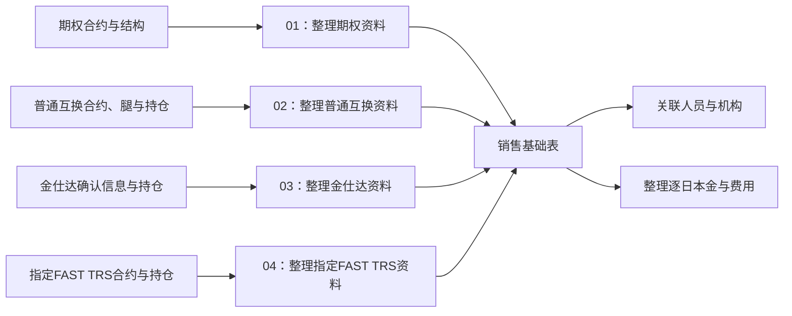

# 合约主信息：销售基础的四个生产分支

**这一步把四路合约资料整理成同一张销售基础表，供后续计算使用。** 它先回答：这是什么合约、客户是谁、属于什么经营类别、带多少本金、何时开始和结束。

目标表是 `pdata_n.t98_otc_deri_comp_sale_info`。可以把它理解为销售分析的“合约基础资料”：后面再关联销售人员与机构、整理逐日金额，继续计算收入和规模。

本页先认清四路来源；逐段读SQL时进入[SQL阅读导航](sql/README.md)，按期权、普通互换、金仕达、指定FAST TRS选择分支。经营类别的具体判断查[分类规则](02.1-销售基础经营分类规则.md)，模块组织方式查[公共视图与模块说明](公共视图抽取.md)。

## 1. 四个分支是什么关系

四个分支是**并行的四路来源**，各自写入这张表的一组数据。`grp_id` 用来区分来源分组；01、02、03、04不是先后执行的四个步骤。

| 分组                | 处理什么资料                 | 为什么要单独处理                                          |
| ----------------- | ---------------------- | ------------------------------------------------- |
| **01：期权**         | 交易、期权合约，以及标的和条款所在的合约结构 | 本金主要取合约字段；标的、日期、产品条款还要从结构补齐                       |
| **02：普通互换**       | 交易、互换合约、合约腿、历史持仓       | 本金要从持仓计算；结构腿用于连接标的持仓，其他腿提供利率等资料                   |
| **03：金仕达（KS）**    | 确认信息及其持仓               | 用确认编号识别记录；本金直接取确认信息，与其他三路的取数方式不同                  |
| **04：指定FAST TRS** | FAST TRS合约及历史持仓        | 当前只收 `N_CROSS_DMA_SWAP`，按工具汇总持仓金额，不代表全部FAST TRS业务 |

“合约腿”是合约下的一组结构或收付安排。一份合约可能对应多条腿；本页所说的结构腿和非结构腿，是SQL中分开读取的两类记录。

## 2. 整理完，得到哪些基础资料

| 读者关心的问题 | 表里形成的内容 | 主要加工 |
| --- | --- | --- |
| 这是谁的什么合约 | 合约标识、源合同编码、客户编号及名称 | 从各分支取身份，再关联客户资料 |
| 应归入什么经营类别 | 源合约类型、经营分类、标的类型 | 保留源类型，另生成经营分类，详见[02.1 经营分类规则](02.1-销售基础经营分类规则.md) |
| 合约涉及多少本金 | 初始本金、动态本金、汇率 | 有的直接取合约，有的汇总持仓，见下一节 |
| 何时开始、结束，目前什么状态 | 开始日、结束日、提前终止日、状态 | 从对应合约或确认资料取值 |
| 后面算费用、收入还需要什么 | 保证金、利率、期权费及条款等 | 按产品补充；四路并非都有这些字段 |

**列名统一了，取值方式仍然不同。** 例如四路都有“初始本金”列，却不能一律理解为“签约当天固定下来的金额”。

## 3. 最重要的差异：本金怎么来

这里的“当日”指任务的加工参数日。“首条持仓”指当前读取的快照里，按源业务日期排序能找到的最早记录。

| 分支 | 初始本金怎么取 | 动态本金怎么取 |
| --- | --- | --- |
| **01：期权** | 合约记录的初始名义本金 × 汇率 | 在开始日至有效结束日内，取合约当前名义本金 × 汇率；区间外为0。有效结束日优先用提前终止日，否则用结束日 |
| **02：普通互换** | 每条腿内，对各标的取首条持仓，汇总“初始价格 × 初始数量”，再乘汇率 | 按腿汇总当日持仓的“初始价格 × 当前数量”，再乘汇率 |
| **03：金仕达** | 通常取确认信息的名义本金；`B_LONG_SHORT_SWAP` 类型改取动态本金 | 直接取所选确认信息的动态本金 |
| **04：指定FAST TRS** | 每个工具内，对各标的取首条持仓，再汇总记录中的动态本金 | 按工具汇总当日持仓记录中的动态本金 |

02、04的各标的首条持仓**可能来自不同日期**；03的部分初始本金直接使用动态本金。因此，初始本金是否等于业务上的“最初签约规模”，要结合分支判断。

### 用三个小例子理解

以下只演示取值规则，不是真实业务数据；前两个例子假设汇率为1。

| 情形 | 这一步怎样取本金 |
| --- | --- |
| 期权合约记录初始本金100万元，当前本金80万元，加工日在有效期间内 | 初始本金100万元，动态本金80万元；区间外动态本金为0，但该记录是否进入表还要看状态等范围条件 |
| 普通互换某条腿仅有一个标的：首条持仓的初始价格10元、初始数量100；当日数量60 | 初始本金为10×100＝1,000元；动态本金为10×60＝600元。这里用初始价格，不是当日市场价格 |
| 金仕达某条确认记录类型为 `B_LONG_SHORT_SWAP`，名义本金100万元、动态本金80万元 | 输出的初始本金和动态本金都取80万元；“初始”这一列在此分支没有取100万元 |

### 币种还要单独看

| 分支 | 当前金额处理 |
| --- | --- |
| 01：期权 | 按币种条件选择1、初始汇率或中间价，并用于上述本金计算 |
| 02：普通互换 | 按币种条件选择1或对应初始汇率；条件都不满足时汇率为空，金额不能当作已补0 |
| 03：金仕达 | 两项本金直接取源金额，没有乘汇率；结算币种输出为CNY，汇率列为空 |
| 04：指定FAST TRS | 本金直接汇总源金额，汇率列固定为1；结算币种仍取合约字段 |

仅凭输出列名或汇率常量，不能确认四路金额都已经按同一种人民币口径处理。逐项汇率条件保留在[字段与公式对照](../99_证据/销售基础四分支字段与公式对照.md)。

## 4. 哪些合约会进入，是否一份合约一行

**这张表包含已终止合约，不等于当日存续合约清单。** 四路都保留 `EFFECTIVE`、`TERMINATED`，以及 `EFFECTIVE_PENDING`、`TERMINATING`、`TERMINATING_PENDING` 这些状态。

| 分支 | 还会怎样筛选或整理 |
| --- | --- |
| 01／02／04 | 限定OTC、OTC_HK部门账簿，排除两个指定测试账簿；交易还必须匹配对应产品合约 |
| 03：金仕达 | 每个确认编号按业务日期倒序选一条；要求开始日和整理后的标的代码非空。没有套用前三路同一套账簿过滤 |
| 04：指定FAST TRS | 进一步限定合约类型为 `N_CROSS_DMA_SWAP` |

输出也**尚未证明“一份合约只有一行”**：期权可能连接多条结构，普通互换可能连接多条腿，其他属性连接也可能带来多行。虽然部分输入已聚合，四路最终没有统一按合约标识去重。后续统计合约数或汇总本金时，需要核对实际行数与重复情况。

## 5. SQL怎样拆分

目标表DDL、3个公共视图、4个分支脚本的目录结构、可复用次数、示意SQL和CTE拆分方案，见[公共视图抽取](公共视图抽取.md)。该页是重构设计，不表示相应文件或视图已经创建、部署或验收。

## 6. 后面怎样接着使用

| 后续加工 | 从这张基础表继续解决什么问题 |
| --- | --- |
| [03 销售管理归属](../02_销售管理归属/README.md) | 关联哪些人员、机构及介绍关系比例参与这份合约 |
| [04 逐日本金与费用](../03_逐日本金与费用/README.md) | 结合事件、持仓和费用资料，整理各计提日的金额与费率 |
| [05 收入与规模消费](../07_公共结果如何进入收入与规模.md) | 在基础、归属、逐日金额等公共结果上，继续应用各自的计算规则 |

连接时还要区分三种编号；它们都出现在基础表里，但用途不同：

| 编号 | 可以怎样理解 | 分支差异 |
| --- | --- | --- |
| `Agt_Id` | 基础与后续结果的主要合约连接入口 | 01／02／04取内部交易编号；03取金仕达确认编号 |
| `Inr_Seri_No` | 回到源交易或合约记录时使用的编号 | 01／02／04取源交易键；03取合同编码 |
| `Otc_Seri_No` | 回到工具层持仓、金额或费用时使用的编号 | 01／02／04取工具编号；03为空 |

具体连接应沿用对应下游SQL；这三个编号不能互换，也不能单凭某一列就认定跨分支唯一。

## 查阅入口

本文按已保存的四段SQL解释加工逻辑。完整表名、连接键、过滤条件、日期、方向码、公式及证据行号，保留在[销售基础四分支字段与公式对照](../99_证据/销售基础四分支字段与公式对照.md)。

| 分支 | 生产任务与SQL |
| --- | --- |
| 01：期权 | [业务说明](sql/04_业务模块/01_期权/README.md)；[86840原始SQL](sql/06_原始SQL/86840.sql) |
| 02：普通互换 | [业务说明](sql/04_业务模块/02_普通互换/README.md)；[86841原始SQL](sql/06_原始SQL/86841.sql) |
| 03：金仕达 | [业务说明](sql/04_业务模块/03_金仕达/README.md)；[86842原始SQL](sql/06_原始SQL/86842.sql) |
| 04：指定FAST TRS | [业务说明](sql/04_业务模块/04_指定FAST_TRS/README.md)；[220650原始SQL](sql/06_原始SQL/220650.sql) |

物理身份和快照版本见[证据索引](../99_证据/README.md)。
