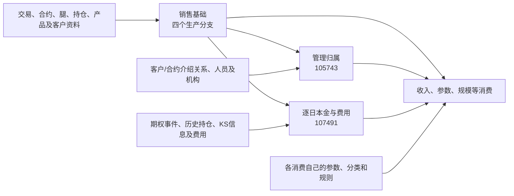

# 公共加工

公共加工解释多个消费共同依赖的结果：它们从哪些对象取数，一行表示什么，在哪一步改变身份、金额、日期或归属，以及下游使用时必须保留哪些条件。业务专题引用这些结果，再解释各自新增的筛选、计算、汇总与交付。

## 阅读顺序

先在本页看清各块分工：01—03是共同基础，04—06和08是按需追溯的经营参数，07解释这些结果怎样进入不同消费。编号用于导航，不是调度执行顺序；不必先读完所有公共SQL，才进入一份收入专题。

经营参数说明配置从哪里来、怎样形成，消费端说明这份合约怎样选中并使用它们。[交叉收入](../销售与经营分析/118141_交叉销售收入/README.md)、[对内收入](../销售与经营分析/114013_对内销售收入/README.md)、[香港收入](../销售与经营分析/220979_香港销售收入/README.md)分别提供完整阅读路径。各子文档统一按[SQL拆解与业务说明标准](../建设台账/SQL拆解与业务说明标准.md)组织；先沿同一份构造合约读通正常路径，再核对改变条件后的结果，构造案例不代表生产数据与制度均已验收。

| 阅读顺序 | 内容 | 读完应能回答 |
| --- | --- | --- |
| 01 | [合约主信息](01_合约主信息/README.md) | 四路合约怎样整理到同一张表，本金、标的、日期和编号有哪些差别？ |
| 02 | [销售管理归属](02_销售管理归属/README.md) | 合约级、客户级关系怎样选出三组人员机构，几套经办角色有何不同？ |
| 03 | [逐日本金与费用](03_逐日本金与费用/README.md) | 某天的本金与费用从哪些事件或持仓而来，150日展开与历史分区是什么关系？ |
| 04 | [经营系数：价差](04_经营系数_价差/README.md) | 共同合约价差怎样分INR／非INR，交叉与香港客户侧怎样分别匹配？ |
| 05 | [经营系数：基准](05_经营系数_基准/README.md) | 合约、类型、对内基础参数怎样选择，系数乘数与收益率怎样区分？ |
| 06 | [经营系数：资金成本](06_经营系数_资金成本/README.md) | 交叉与香港怎样选择成本参数，成本率与逐日用资成本怎样区分？ |
| 07 | [公共结果如何进入收入与规模](07_公共结果如何进入收入与规模.md) | 同一公共结果为何得到不同范围、不同日期和不同含义的消费结果？ |
| 08 | [经营系数：佣金](08_经营系数_佣金/README.md) | 香港合约／客户佣金按哪个日期选择，费率怎样交给事件金额计算使用？ |

需要并排查118141价差、基准和成本时，使用[经营系数参数对照](90_参考/经营系数参数对照.md)；对内、香港分支从相应参数专题进入，不能沿用118141的全部条件。`90_参考`放对照资料，`99_证据`放公共冻结依据；各参数专题另保留自己的SQL与元数据来源。证据不是第一遍阅读的必经步骤。

第一组正文以销售与规模为切入点。经营参数被收入日报和参数查询分别读取，且有身份转换、分类和日期处理，因此共同的来源说明归在这里。**共用来源，不代表消费SQL可以整段共用。** 各分支的实际匹配和公式仍由收入主脚本承接；不能将113993／220981等参数查询结果画成日报必经上游。

香港若干配置同时存在ODATA源表与T99生产任务。220979当前冻结SQL仍直接读取这些ODATA配置：本专题分别说明源配置及其T99映射，但不把并行的T99结果插入日报实际路径。对内基础参数的分类映射也只提供候选类型，114013自己的优先CASE和回退仍在对内专题中解释。

## 全貌：三个公共结果怎样协作

销售收入、客户规模和机构贡献会反复遇到三个问题：**合约及规模基础是什么、这份合约归到哪些人员机构、每个计提日应使用什么金额。** 当前仓内分别由销售基础、管理归属和逐日附加明细承接。把三者先说明，后面的收入和规模专题才能明确自己新增了什么规则。

### 三个结果各自回答什么

| 公共结果    | 物理表                                        | 生产任务                     | 输出表达与使用要点                                                |
| ------- | ------------------------------------------ | ------------------------ | -------------------------------------------------------- |
| 销售基础    | `pdata_n.t98_otc_deri_comp_sale_info`      | 86840、86841、86842、220650 | 分四个 `grp_id` 整理合约、客户、标的、账簿、金额和条款。分区是加工快照日；同一合约是否多行需按分支判断 |
| 管理归属    | `pdata_n.t98_otc_comp_mng_rela_info`       | 105743                   | 合约上横向保留三组介绍人员、机构及比例，并补多类经办角色。它尚未计算分配后的收入金额               |
| 逐日本金与费用 | `pdata_n.t98_otc_deri_comp_sale_adtnl_det` | 107491                   | 从销售基础记录展开计提日，按分组使用事件或历史持仓形成金额；输出 `busi_date` 是计提日        |

这里的“公共”表示这些结果被多个已核对消费使用，不意味着它们适用于全部股衍业务。销售基础中的“初始本金”也没有跨产品完全相同的生成方式，需看[四分支对照](01_合约主信息/README.md)。

### 加工关系

图中的最后一个节点概括多个分支，不表示每个分支都读取全部三表。例如 171364、171347 取销售基础计算新增规模；118141、224351、206208 使用三类公共结果，但增加的规则不同。详见[消费边界](07_公共结果如何进入收入与规模.md)。

### 先对齐身份，再连接结果

| 身份或日期 | 当前表达 | 连接时要保留的区别 |
| --- | --- | --- |
| `Agt_Id` | 01/02/04 分支取交易 `internal_trade_id`；03 取 KS `key_trade_comfirm_id` | 它是本组公共结果的主要连接入口；不能统一解释成外部合同号 |
| `Inr_Seri_No` | 01/02/04 为 `key_otc_trade_id`；03 为 KS `contract_code` | 107491 的事件／持仓分支分别采用对应身份，不能互换使用 |
| `Otc_Seri_No` | 01/02/04 为交易 `key_instrument_id`，03 为空 | 逐日 FAST TRS 金额、费用等使用该类身份，不等同 `Agt_Id` |
| `Ext_Comp_No` | 源合同编码 | 与内部交易键、KS确认键分开 |
| 销售基础 `busi_date` | 本次加工参数日 | 用于选择本次合约资料快照 |
| 逐日明细 `busi_date` | 展开的 `Accrued_Date` | 一次加工可以写入多个计提日分区 |
| 管理归属 `busi_date` | 本次加工参数日 | 消费读取该分区，并不自动获得计提日当时的历史关系 |

当前若干消费只按 `Agt_Id` 连接基础和逐日明细。它说明实际 SQL 的连接方式，不能证明一对一或分组间编号不会碰撞。公共说明保留这些事实，不通过自行去重把风险隐藏起来。

### 与其他模块怎样衔接

第一模块已解释的产品、合约、客户、事件和人员对象，可按边界引用；这里专门解释将它们整理为经营消费基础时新增的选择、组合和计算。有些公共加工直接读取 ODATA，不能为了画整齐的层次而假定它们都先经过某张标准模型。

收入专题继续解释参数有效期、产品公式、收入分摊和累计；规模专题继续解释新增、存续、期间分母及主体聚合。第四模块说明结果送到哪里、如何筛选和转换，折叠已确认的搬运段。

依据：六个公共任务的[冻结 SQL 与写入索引](99_证据/README.md)，以及 118141、224351、171364、171347、171370、206208 的消费查询。所有行粒度描述来自 SQL 组织，未完成数据唯一性验证。

## 怎样安排其他公共加工

| 方向 | 目前入口 | 下一步核对内容 | 当前状态 |
| --- | --- | --- | --- |
| 销售与规模共同基础 | 本目录三类结果 | 由正文进入交叉、对内、香港收入及规模分支 | 三类公共加工已形成正文 |
| 经营系数 | 价差、基准、成本及佣金专题；含对内121683／121685与香港配置 | 由三份收入主线回查共同来源、分支匹配和参数作用 | 现有交叉路径保留，对内与香港配套说明按各专题入口展开 |
| 人员、机构、账簿、客户映射 | 105743 已使用人员与组织结果；既有权限样本 177414 | 哪些直接引用第一模块，哪些另有跨源映射或有效期规则 | 已见依赖，尚未另建完整加工说明 |
| 互换、期权的持仓与定价共同结果 | 既有加工网络中的互换、期权候选组 | 合约、腿、持仓、定价结果的连接身份和跨结果复用 | 候选，不能整组确认为公共加工 |
| 指标主体、分类标签与期间统计 | 本轮核对 171364、171347、171370、206208 的使用入口 | 主体映射、分类、期间边界及通用与专题规则的分界 | 已确认这些消费使用相关资料，独立公共层待核 |
| NDS／源视图承载的公共结果 | 既有财务、报送入口；旧 topics 提供源视图导航 | 当前源视图定义、来源身份及本地采集边界 | 旧资料仅作线索，尚未验证当前源实现 |

基础资料被很多任务读取，不意味着它本身存在复杂加工。日历、汇率、码值字典优先保留依赖和引用。经营系数已经有身份转换、`Coef_Type` 分流和有效期，不按「共享输入」略过。相同字段名和共同输入也不足以把多个输出合并成同一个业务口径。

`t98_otc_deri_undrl_income_rwd_sum`（203358）目前只见到交叉收入期权保底在用。复用范围不够时先当该专题的输入说明，不升格成与 T99 同级的公共加工。

## 建设边界与证据

本版核对日期为 **2026-09-18**，使用主工作区已发布图 `9dbe5623…`，发布时间为 2026-09-16 09:27。六个公共加工任务为 86840、86841、86842、220650、105743、107491；105743 另保留一个任务内中间写入。消费任务用于验证复用与使用边界，没有在此完成所有收入、指标或报送口径。

2026-09-22补充经营系数阅读专题：生产依据为本地任务SQL快照，118141消费依据仍为冻结发布绑定SQL。各专题注明实际来源日期、元数据缺口和校验范围；不把补充整理日当作源SQL更新日。

同日继续补充对内114013、香港220979的公共衔接：消费分别采用8月31日、9月1日的离线SQL；新增参数生产采用9月5日快照。共同三类基础不因消费范围差异重新改写，新增说明保留真实引用路径与各分支差异。

正文的实现依据是[本轮证据索引](99_证据/README.md)中的发布绑定 SQL，旧 topics 的贡献和不采用内容另见[参考取舍](90_参考/20260918-topics参考取舍.md)。原文中的“当前”“已确认”“技术已验证”标签均未作为本轮可信结论继承。

文章中的关系图表示已读 SQL 的输入与输出组织。表级查询仍有 `TASK_SCHEDULE` 范围、深度边界和未证明分区范围；不得据此宣称所有跨任务字段路径或生产运行均已闭合。实际唯一性、Join 扩行和历史数据覆盖需要数据证据，本版没有进行生产数据查询。
