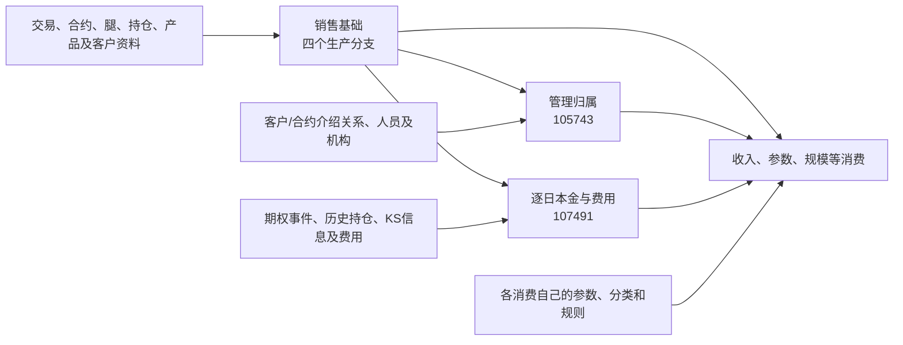

# 销售与规模公共加工全貌

销售收入、客户规模和机构贡献会反复遇到三个问题：**合约及规模基础是什么、这份合约归到哪些人员机构、每个计提日应使用什么金额。** 当前仓内分别由销售基础、管理归属和逐日附加明细承接。把三者先说明，后面的收入和规模专题才能明确自己新增了什么规则。

## 三个结果各自回答什么

| 公共结果    | 物理表                                        | 生产任务                     | 输出表达与使用要点                                                |
| ------- | ------------------------------------------ | ------------------------ | -------------------------------------------------------- |
| 销售基础    | `pdata_n.t98_otc_deri_comp_sale_info`      | 86840、86841、86842、220650 | 分四个 `grp_id` 整理合约、客户、标的、账簿、金额和条款。分区是加工快照日；同一合约是否多行需按分支判断 |
| 管理归属    | `pdata_n.t98_otc_comp_mng_rela_info`       | 105743                   | 合约上横向保留三组介绍人员、机构及比例，并补多类经办角色。它尚未计算分配后的收入金额               |
| 逐日本金与费用 | `pdata_n.t98_otc_deri_comp_sale_adtnl_det` | 107491                   | 从销售基础记录展开计提日，按分组使用事件或历史持仓形成金额；输出 `busi_date` 是计提日        |

这里的“公共”表示这些结果被多个已核对消费使用，不意味着它们适用于全部股衍业务。销售基础中的“初始本金”也没有跨产品完全相同的生成方式，需看[四分支对照](02-销售基础的四个生产分支.md)。

## 加工关系

图中的最后一个节点概括多个分支，不表示每个分支都读取全部三表。例如 171364、171347 取销售基础计算新增规模；118141、224351、206208 使用三类公共结果，但增加的规则不同。详见[消费边界](05-公共结果如何进入收入与规模.md)。

## 先对齐身份，再连接结果

| 身份或日期 | 当前表达 | 连接时要保留的区别 |
| --- | --- | --- |
| `Agt_Id` | 01/02/04 分支取交易 `internal_trade_id`；03 取 KS `key_trade_comfirm_id` | 它是本组公共结果的主要连接入口；不能统一解释成外部合同号 |
| `Inr_Seri_No` | 01/02/04 为 `key_otc_trade_id`；03 为 KS `contract_code` | 107491 的事件／持仓分支分别采用对应身份，不能互换使用 |
| `Otc_Seri_No` | 01/02/04 为交易 `key_instrument_id`，03 为空 | 逐日 FAST TRS 金额、费用等使用该类身份，不等同 `Agt_Id` |
| `Ext_Comp_No` | 源合同编码 | 与内部交易键、KS确认键分开 |
| 销售基础 `busi_date` | 本次加工参数日 | 用于选择本次合约资料快照 |
| 逐日明细 `busi_date` | 展开的 `Accrued_Date` | 一次加工可以写入多个计提日分区 |
| 管理归属 `busi_date` | 本次加工参数日 | 消费读取该分区，并不自动获得计提日当时的历史关系 |

当前若干消费只按 `Agt_Id` 连接基础和逐日明细。它说明实际 SQL 的连接方式，不能证明一对一或分组间编号不会碰撞。公共说明保留这些事实，不通过自行去重把风险隐藏起来。

## 与其他模块怎样衔接

第一模块已解释的产品、合约、客户、事件和人员对象，可按边界引用；这里专门解释将它们整理为经营消费基础时新增的选择、组合和计算。有些公共加工直接读取 ODATA，不能为了画整齐的层次而假定它们都先经过某张标准模型。

收入专题继续解释参数有效期、产品公式、收入分摊和累计；规模专题继续解释新增、存续、期间分母及主体聚合。第四模块说明结果送到哪里、如何筛选和转换，折叠已确认的搬运段。

依据：六个公共任务的[冻结 SQL 与写入索引](证据/README.md)，以及 118141、224351、171364、171347、171370、206208 的消费查询。所有行粒度描述来自 SQL 组织，未完成数据唯一性验证。
