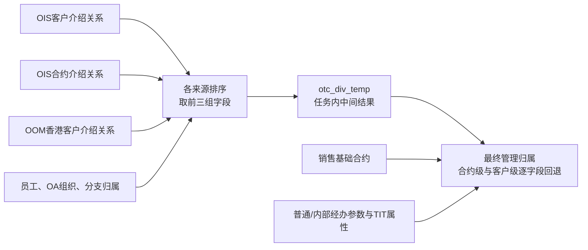

# 销售管理归属

任务 **105743** 为销售基础中的合约补充“由哪些人员和机构开发、各组关系的比例是多少、哪些经办角色参与”。最终结果 `pdata_n.t98_otc_comp_mng_rela_info` 以一行多组字段表达关系，供收入、规模和查询继续使用；它本身没有把合约金额分配成人员收入。

逐段阅读入口：[105743分模块SQL与业务说明](105743_销售管理归属/README.md)。先区分介绍关系与经办角色，再跟随同一份合约A1看排序、横排、最终选择；随后对照03和07的SQL。目录平铺，保留原SQL两次写入，不把三组重复字段另拆成文件。

## 先整理关系，再连接合约



源介绍关系的对象背景可参考第一模块[OIS产品合约与销售归属](../../00-ois入模/02-产品合约与销售归属.md)。105743 当前直接读取贴源关系，新增了排序、横向整理、人员机构补充和合约关联，需要在公共加工中单独解释。

## 关系怎样变成三组字段

| 步骤 | 当前SQL | 对输出的影响 |
| --- | --- | --- |
| 客户介绍关系 | `o_counterparty_introduction` 按客户、比例降序和经理编号排序；筛 `Is_Deleted='N'` | 获得客户级序号 |
| 合约介绍关系 | `o_contract_introduction` 按合约、比例降序和经理编号排序；同样筛删除标志 | 获得合约级序号 |
| 香港介绍关系 | `odata_n_oom.g_hk_counterparty_introduction` 按客户、比例降序及转介人排序 | 当前分支只显式筛快照日期，不能宣称与OIS分支采用相同删除过滤 |
| 员工与组织 | 经理编号匹配员工 `OA_User_Id`；员工编号`Emp_Id`为NULL才回退OA编号，空串不回退；部门补齐4位并关联OA组织、分支归属 | 姓名、员工编号、状态、引入部门与分公司共同进入关系字段 |
| 横向整理 | 按 `client_id, Contract_Code` 分组，以 `max(case when seq=1/2/3 …)` 形成三个槽位 | 超过第三位不展示自身值，但仍贡献ELSE空串／0；SQL没有把保留比例重新归一化 |

员工资料使用参数日；OA组织子查询按部门层级排序取一条，当前查询未显式加 `busi_date` 条件；分支归属使用 `default.pretradedate(date_add(参数日,1),1)`。三者不能笼统表述为同一个历史生效时点。[SQL L11–88](证据/105743-query.sql)

三个来源各自排名后才合并；同一客户若同时出现在OIS和香港来源，可能都有`seq=1`，横排又按字段分别取MAX，不能理解为跨来源按比例择出一整条关系。经办回退中的香港资料则用源表`seq='1'`，不是这里重新计算的排名。

## 合约级优先发生在每个字段

最终处理从销售基础取 `Agt_Id, Cutp_Pty_Id, Inr_Seri_No, Book_Bel_Dept` 的不同组合，限定OTC和OTC_HK。`ci` 以合约号连接，`cpi` 以客户号连接；特定客户与浮动收益凭证条件下会改用产品中的客户字段，不能假定全部合约都只按 `Cutp_Pty_Id` 查客户关系。[SQL L162–188](证据/105743-query.sql)

核心表达式按字段分别执行：

```sql
coalesce(ci.Inr_Org_Id_1, cpi.Inr_Org_Id_1)
coalesce(ci.Cust_Mngr_Emp_Id_1, cpi.Cust_Mngr_Emp_Id_1)
coalesce(ci.Allo_Prop_1, cpi.Allo_Prop_1)
```

这不是整套关系的二选一。某字段可能来自合约关系，另一字段可能回退客户关系。中间聚合还使用空字符串和0作为缺省值，它们不是NULL，因此不会触发 `coalesce` 回退。当前SQL也没有由此保证人员、机构、比例总是来自同一条源关系。[SQL L15–44、L105–128](证据/105743-query.sql)

## 介绍关系与经办角色分开

| 字段组 | 来源处理 | 与三组分配比例的关系 |
| --- | --- | --- |
| 客户经理／引入机构1、2、3 | 上述客户、合约介绍关系 | 保留 `Allo_Prop_1/2/3`，由下游决定怎样使用 |
| `Main_Oper_*`、`Intro_Oper_*` | 普通经办参数与客户资料回退，再补员工资料 | 当前公共段补角色，没有据此计算通用40%／60%分成 |
| `Inr_Main_Oper_*`、`Inr_Intro_Oper_*` | 内部销售专用经办参数及人员资料 | 不能与普通经办角色合并 |
| `Tit_Oper_*`、`Tit_Cust_Mngr_*` | TIT合约属性，按内部交易身份连接，再补员工组织 | 与客户经理三槽位是不同字段组 |

依据：[SQL L129–161、L189–250](证据/105743-query.sql)。旧稿出现的40%／60%线索不能提升为本公共加工的统一制度或公式。

## 下游引用时必须说明

最终写入按参数日分区，`select distinct` 针对完整投影行，不等同只按 `Agt_Id` 去重。本版尚未证明每合约唯一、比例合计为1、人员状态与历史计提日一致。

下游可以保留三个槽位，也可以展开成人员／机构行；展开后是否乘比例、过滤空关系、按哪个组织层级汇总，属于消费自身的规则。取当前归属分区去关联历史金额，也不自动等于历史当日归属。

中间写入为 `write-observation:105743:8`，最终写入为 `write-observation:105743:17`。中间表随本篇一起解释，不单列业务专题。最终结果的使用例子见[消费边界](05-公共结果如何进入收入与规模.md)。
