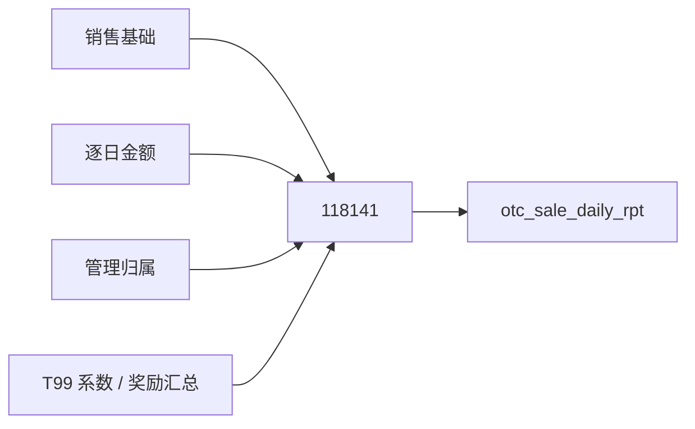

# 交叉销售收入

**先读[118141完整阅读主线](118141_交叉销售收入/README.md)**：普通期权、普通互换、AIRBAG及关联保证金、金仕达均有从输入到日报的连续算例。本篇保留为规则索引，不再承担第一次阅读的主线；主要计算路径的解释与静态核对，不等于真实数据和全部制度已验收。

本篇只钉任务 `118141` 写进 `dm_otc_n.otc_sale_daily_rpt` 的事实。公共三张表的生产见 [销售基础](../公共加工/01_合约主信息/README.md)、[逐日金额](../公共加工/03_逐日本金与费用/README.md)、[管理归属](../公共加工/02_销售管理归属/README.md)。系数和奖励表在本任务中的**选用规则**见第 3 节，不在这里追它们的入模。

经营系数的生产资料见[价差](../公共加工/04_经营系数_价差/README.md)、[基准](../公共加工/05_经营系数_基准/README.md)、[资金成本](../公共加工/06_经营系数_资金成本/README.md)，对应消费JOIN已接入主线。三者的角色与日期对照见[参数参考](../公共加工/90_参考/经营系数参数对照.md)。保底使用的历史金额另有[奖励来源说明](118141_交叉销售收入/奖励来源说明.md)，不是已付款证明。

| 项              | 值                                                                                                                  |
| -------------- | ------------------------------------------------------------------------------------------------------------------ |
| 输出             | 场外衍生品合约交叉销售收入日报                                                                                                    |
| 图版本            | `9dbe5623…`（2026-09-16）                                                                                            |
| SQL            | [118141冻结原SQL](../公共加工/04_经营系数_价差/99_证据/证据_118141.sql) |
| 一行             | 销售基础快照 × 逐日计提日，带三组介绍字段                                                                                             |
| 分区 `busi_date` | 加工参数日，不是计提日                                                                                                        |

图内该表向下无 `READS_TABLE`。

## 1. 范围

| 条件 | 行号 |
| --- | --- |
| `info.busi_date = 参数日` | L298–299 |
| `Src_Contr_Type != 'FEE_SWAP'` | L299 |
| `grp_id != '04'` | L300 |
| `Book_Bel_Dept != 'OTC_HK'` | L300 |
| `info.agt_id = det.agt_id`（INNER，**不滤** `det.busi_date`） | L302–304 |
| 三组机构去空后均视为 `8846` 则丢弃；10 个 `OPT-OTC2022…` 例外 | L404–405 |

未滤协议状态、提前终止、结束日下界。CASE 无 `ELSE` → 未命中则当日收入 `NULL`。

## 2. 日期

| 字段 | 赋值 |
| --- | --- |
| 分区 `busi_date` | 参数日 |
| `Accrued_Date` | `det.busi_date` |
| `End_Pric_Date` / `Accrued_End_Date` | `coalesce(Early_Term_Date, End_Pric_Date)` |
| `Accrued_Strt_Date` | 写成 `Strt_Pric_Date` |
| `Actl_Days` | `datediff(IF(Accrued_Date > End_Pric_Date, End_Pric_Date, Accrued_Date), Strt_Pric_Date)+1`，不进收入公式；不把IF改述为NULL语义可能不同的least |
| `Undrl_Ins_Id` | 恒 `''` |

连接只用 `Agt_Id`，不再按 `grp_id` 分支换键。

## 3. 本任务怎么连、怎么选参

| 别名     | 表                                       | 连接                                                   | 对齐哪一天           |
| ------ | --------------------------------------- | ---------------------------------------------------- | --------------- |
| `info` | `t98_otc_deri_comp_sale_info`           | 驱动                                                   | 加工日             |
| `det`  | `t98_otc_deri_comp_sale_adtnl_det`      | `Agt_Id` INNER                                       | 无日期谓词           |
| `m`    | `t98_otc_comp_mng_rela_info`            | `Agt_Id` LEFT                                        | 加工日             |
| `s_sp` | `t99_deri_comp_sprd_coef_ref`           | `Inr_Comp_No = info.Agt_Id`                          | 计提日；有效期展开       |
| `c_sp` | `t99_deri_cutp_comp_type_sprd_coef_ref` | 客户 + `Contr_Type_Cd`                                 | 期初定价日           |
| `s_ba` | `t99_deri_comp_base_coef_ref`           | `Inr_Comp_No = info.Agt_Id`                          | 无日期             |
| `c_ba` | `t99_deri_comp_type_base_coef_ref`      | `Contr_Type_Cd`，`Src_Dept_No='OTC'`                  | 期初定价日           |
| `cc`   | `t99_deri_comp_type_fnd_cost_ref`       | 同上                                                   | 期初定价日           |
| `actl` | `t98_otc_deri_undrl_income_rwd_sum`     | `Contr_Id = Agt_Id` 且 `Qtr_End_Date < End_Pric_Date` | `Sett_Time` 见过滤 |

参数均限定各自源表分区及`Del_Flag='0'`。合约价差另筛`coalesce(Coef_Type,'')!='INR'`和`Agt_Id!=''`；合约基准读取`O_CONTRACT_BASE_RATE`分区并要求`Agt_Id!=''`，没有额外的Coef_Type过滤。类型基准、资金成本另筛`Src_Dept_No='OTC'`，不能把这些规则合成一个通用条件。历史部门所得收入（不代表已付款）：`src_tbl=ODATA_N_OIS.G_CROSS_INCOME_REWARD`，`Sett_Time >= '202502'` 且 `< concat('${yyyy}0', quarter(参数日))`。

价差逐字段优先合约级、回退客户＋类型级；基准逐字段优先合约级、回退类型级（没有客户键）。普通收入公式给缺失价差类型默认`'ABSOLUTE'`，基准类型没有默认。仅合约价差使用`lead(Vld_Date)`划分生效期并按计提日匹配；合约基准无日期选取，其余三类参数按各自区间展开后匹配合约期初定价日。没有统一DISTINCT。

## 4. 当日收入

`P = coalesce(Early_Term_Date, End_Pric_Date)`。普通OPTION/TRS的年化项：计提日 ∈ `[Strt_Pric_Date, P]`；绝对项：计提日 = `Strt_Pric_Date`。前置特殊分支没有同样的日期IF。下表AIRBAG只指AIRBAGX/M/L；Annu/Absl符号概括选出的系数，实际公式直接读取两路参数，不从展示列读取。

| # | 条件 | 表达式 |
| --- | --- | --- |
| 1 | AIRBAG 且抵扣 | `0` |
| 2 | AIRBAG 非抵扣，无保证金子合约 | `Dyna×(1-Init_Marg_Prop)×(fee_rate/1.06−cost)/365×0.3` |
| 3 | AIRBAG 非抵扣，有保证金子合约 | `Dyna×(1-Base_Marg_Rate)×(fee_rate×(1-Init_Marg_Prop)/(1-Base_Marg_Rate)/1.06−cost)/365×0.3` |
| 4 | `LONG_HOLD_SWAP` 且有保证金子合约 | `0` |
| 5 | `TRS_KINGSTAR_SWAP` | `(Inta×0.94+Trd_Cms−Trd_Cms_Cost−Fnd_Cost×cost/365)×0.5` |
| 6 | OPTION/TRS 价差年化+基准年化 | 区间内 `Dyna×Annu_Sprd/365 + Dyna×Annu_Base/365` |
| 7 | 价差年化+基准绝对 | 区间年化价差；开始日再加 `Init×Absl_Base` |
| 8 | 价差绝对+基准年化 | 开始日绝对价差；区间年化基准 |
| 9 | 价差绝对+基准绝对 | 开始日两项都加在 `Init` 上 |
| — | 其余 | `NULL` |

然后 `Curr_Prvs_Sales_Income_n`：KS 再减当日该类型占比 × `150万/365×0.5`；个股/ETF 期权在结束日且累计 `< Init×0.1%` 时走保底（`Dev_Dept_Rwd`、无 `ORDER BY` 的全分区 `sum`，空季度截止用 `2025-03-31`）。`Adtnl_Rwd` 有列，不进公式。

## 5. 两套分成

| 套 | 规则 | 作用列 |
| --- | --- | --- |
| 经办 40/60 | 引入经办人空 → 主 100%；非空 → 主 40% 引入 60% | `*_Main` / `*_Intro` 本金 |
| 介绍三槽位 | × `Allo_Prop_1/2/3` | 当日/累计收入 `_1/_2/_3` |

40/60 只在本任务。累计：`gfgreatest(按 Agt_Id,Contr_Type_Cd 序计提日求和, 0)`。`Absl_Nom_Prin` 仅 `grp_id='01'`；`Accum_Absl` 仍累加动态本金。

## 6. 与 118143

| | 118141 | 118143 |
| --- | --- | --- |
| 逐日明细 | 读 | 不读 |
| 价差 | 按计提日展开 | 最新 `Vld_Date` 一条 |
| 收入公式 | 有 | 无 |
| 结束日下界 | 无 | `> '2021-09-30'` |

118141 不读 `otc_sale_para`。

## 7. 交付

`WRITES_TABLE` 已确认。无图内读取。调度邻居 `158050`（hive2mysql，缺投影）不能当已送达。质检任务 113728、152678 不是数据消费。

## 8. 未确认

| 缺口 | 本任务已看见 |
| --- | --- |
| `det` 无日期过滤时一次写入多少计提日 | SQL 无谓词 |
| `Inr_Comp_No = info.Agt_Id` 两套编号是否经常命中 | 连接如此写；未核数据 |
| 系数展开 / 基础多行是否扩行 | 无去重 |
| 历史金额是否等同实际支付、源核算码是否全部合规 | 已解释保底加回当日的作用和SQL预期季度编码；支付事实及实际数据仍未核验 |
| 40/60 与制度、三槽位是否归一 | 仅 SQL |
| 158050 是否取本表 | 缺投影 |

参数生产和奖励来源由上述链接承接，不在本篇重复；对内／香港公式尚未展开。
