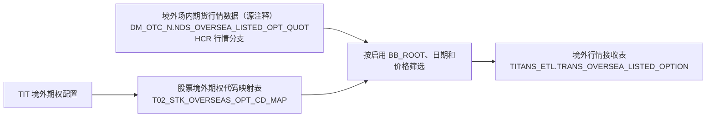

# 典型链路与加工边界

[返回总览](README.md)

核对日期：2026-09-18。图谱：`9dbe5623`，状态 READY。范围与来源见 [统计口径与证据](05-统计口径与证据.md)。

下面用四条实际链路解释本模块怎样分类。规则取自当前发布图绑定的 SQL；描述范围只到列明的起点和终点。

## 1. TIT 提供已有白名单和保证金参数

`odata_n_tit.d_ref_instrument_pool_whitelist_p`（一站通白名单标的池） → **219432** → `dm_otc_n.ref_instrument_pool_whitelist`（一站通白名单标的池）

| 观察点 | 已确认内容 |
| --- | --- |
| 传递对象 | 标的、业务方案、交易对手、实例及标的池，以及初保线、维持线、基础保证金率 |
| 范围 | 读取 `busi_date='h1230'` 批次，输出业务日期由加工日期补入 |
| 本段加工 | 主要业务字段直接取源字段，没有在本段重新计算保证金率 |
| 归类 | 从该贴源批次到 DM 表这一段属于数据传递和技术适配；保证金参数在 TIT 内部如何生成不在本段证据内 |

同名 DM 表还有任务 146823 读取 `pdata_nds.ref_instrument_pool_whitelist`（一站通白名单标的池）。两条输入路径分别保留，不能把核验过的 219432 规则推广给同表所有写入。

## 2. RCC ETF 基本信息送入 TIT

`odata_n_rcc.u_etfcode_p`（ETF代码表） → **237781 / 239937** → `dm_otc_n.trans_etfcode`（ETF基本信息表） → **237796 / 238372 / 240002 / 240006** → `titans_etl.trans_etfcode`（ETF基本信息表）

本次精读 237781 与 237796 两段。237781 读取 `busi_date='h12'`，承接 ETF 基本资料并补 `src_id='RCC'`；237796 选择 RCC 分区，将业务列写入 TIT 目标。`etfcode_type` 在这两段均直接传递，没有看到另加 GOLD 映射。其他并列任务表示图中存在的候选配置，未用这两个任务的 SQL 代替它们逐一验收。

这条链路适合放在“ETF、指数成分与基金份额”下。这里的 RCC 在本地 CD100 字典中是“零售柜台新一代清算系统”，不是把 `dm_otc_n` 当作最初数据源。

## 3. TIT 提供配置，外部行情再送回 TIT

当前图中 96471 和 234508 都参与这个目标写入。本次精读 234508：读取 `dm_otc_n.nds_oversea_listed_opt_quot`（境外场内期货行情数据） 的 `src_id='HCR'`，关联 `pdata_news_n.t02_stk_overseas_opt_cd_map`（股票境外期权代码映射表） 的 `TIT / 01`，要求 `whth_enable='Y'` 且 `bb_root=overseas_bb_root`。

行情 01、02、03 组取当日成交价，04 组取当日结算价；相应价格还须非空。**TIT 配置决定允许推送哪些代码，价格由行情表提供。** 所以该链路同时包含 TIT 作为源和 TIT 作为目标，属于带业务筛选的基础加工，不能称为 TIT 提供全部行情值。HCR 的供应商含义在本次没有核验，不按缩写猜测。

原清单 L0167 记录的就是配置这一支。本模块把它作为交叉角色例子，不计入出向 47 张外部命名空间落点。源表中文注释写作“境外场内期货行情数据”，目标名包含 listed_option；这里保留原注释，品种范围按实际 SQL 与业务定义再核对。对象解释见 [外部编码与境外期权映射](../01-tit入模/T02-产品标的与市场数据/01-产品基础资料/05.1%20外部编码与境外期权映射.md)。

## 4. 曲线接口包含多来源和期限规则

`pdata_news_n.t02_ira_ibor`（银行间同业拆借利率）、`pdata_news_n.t02_idx_data`（指标数据） → **220488** → `dm_otc_n.trans_wind_yield_curve_tit`（WDFR007曲线信息_TIT） → TIT 曲线接口。实际推送任务和目标见[完整表清单](03-向TIT供数表清单.md)。

| 输入分支 | SQL 中的处理 |
| --- | --- |
| WD 利率分支 | 限定 WD / 03；读取 HIBORON.IR，并赋期限 0.0833 |
| TL 指标分支 | 限定 TL，选择指标 3010601474，取 data_val 作为 ytm |
| WD HIBOR 期限分支 | 按 1M、2M、3M、6M、12M 映射期限 0.0833、0.17、0.25、0.5、1 |
| 日期范围 | 取加工日及前 5 个交易日的区间，再合并三个分支 |

该任务没有在此重新拟合整条收益率曲线，但确实选择特定来源、指标、期限并合并输出。应写成“多来源曲线接口整理”，不能仅因为最终 SELECT 很短就归为无业务规则的原样同步。

## 5. 统一的记录方式

每条链路保留 **业务对象 → 来源与范围 → 中间加工 → 交付目标 → 本段规则 → 未核验边界**。端到端是否简单要沿全链判断，任务数量少、表名带 trans、最后一段直接 SELECT 都不能单独决定分类。
