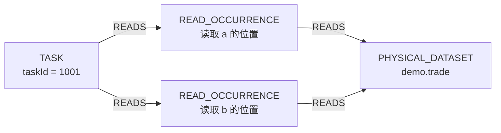
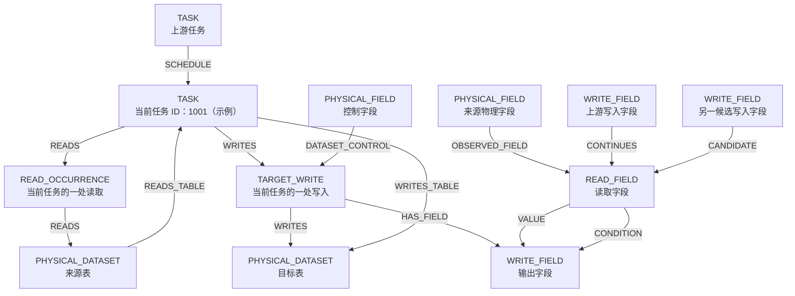

# 当前资产图：节点、边与存储全貌

核对日期：2026-09-07。依据当前源码的 `compileTask → publish → AssetGraphStore` 主链；这是类型与定义清单，不是某个 Neo4j 发布快照的实测数量。

**当前发布主链生成 7 类领域节点、12 类领域边。** 局部投影、正式发布图、独立目录扩展使用的类型有所不同，本文分别列出，不混为一张已经发布的图。

## 1. 截图中的“任务 1001 的这处读取”究竟是什么

对应真实节点类型 **`READ_OCCURRENCE`**：静态 SQL 中一个可识别的表读取位置。不是表本身，不是字段，也不是调度任务某天实际执行的一次运行。

例如，假设任务 `1001` 中有：

```sql
SELECT a.amount, b.amount
FROM demo.trade a
JOIN demo.trade b ON a.parent_id = b.id;
```

这里应区分 `a`、`b` 两处读取。它们可以连接同一个物理表节点，但各有自己的读取身份；身份能否成功解析仍取决于实际 Facts。



节点 ID 的真实生成规则：

```text
read-occurrence:<SHA256(canonicalJson({
  consumerTaskId,
  occurrenceId,
  readRelationId
}))>
```

`occurrenceId` / `relationId` 来自 Facts 的读取与关系证据，不是展示时随手编的“第几次”。兼容旧材料时，代码尝试用同任务、同语句、同物理表的关系证据恢复；仍缺证据则保留 legacy 标识与边界，不能因此认为读取已确认。

节点属性如下：

| 属性                                              | 含义                                                                            |
| ------------------------------------------------- | ------------------------------------------------------------------------------- |
| `taskId`                                          | 所属调度任务 ID                                                                 |
| `occurrenceId`                                    | Facts 中的读取标识                                                              |
| `relationId`                                      | 对应的读取关系 ID                                                               |
| `statementId`                                     | 所属 SQL 语句 ID                                                                |
| `datasetNodeId`                                   | 被读取的物理表节点 ID                                                           |
| `physicalDataset`                                 | 被读取的表名                                                                    |
| `identityStatus`                                  | 表身份：`CONFIRMED / CANDIDATE_DATASET / UNRESOLVED`                            |
| `readDisposition`                                 | `EXTERNAL_READ / LOCAL_MATERIALIZATION / SELF_READ`                             |
| `partitionPredicates`、`partitionPredicateStatus` | 读侧分区谓词摘要及其状态，不等于全部 WHERE 条件                                 |
| 可选边界属性                                      | `qualificationStatus`、`identityReasonCode`、`materializationBoundaryReason` 等 |

发布后这些属性主要序列化在 `detail` 中，并提取 `taskId`、`table` 等通用字段。因此截图里的“来源表 trade”是这个读取节点的属性说明；表本身还单独有一个 `PHYSICAL_DATASET` 节点。

## 2. 当前发布图的全部节点类型：7 类

| 类型 `kind`        | 一个节点代表什么               | 唯一身份的主要组成                                                                | 关键内容                                               |
| ------------------ | ------------------------------ | --------------------------------------------------------------------------------- | ------------------------------------------------------ |
| `TASK`             | 一个调度任务                   | `task:<taskId>`                                                                   | 调度 ID；名称、分类、调度引用等可用元数据              |
| `PHYSICAL_DATASET` | 一张物理表的身份或待确认身份   | platform + dataSource + qualifiedName，规范化后哈希                               | 表名、物理身份与确认状态                               |
| `PHYSICAL_FIELD`   | Facts 识别的物理字段身份       | platform + dataSource + stableTableId + qualifiedName + column，规范化后哈希      | 字段名、物理身份及状态；不等同于仅按“表名＋字段名”合并 |
| `READ_OCCURRENCE`  | SQL 中一处表读取               | consumerTaskId + occurrenceId + readRelationId，规范 JSON 哈希                    | 所属任务、语句、读取关系、表与分区谓词                 |
| `TARGET_WRITE`     | SQL／配置证据中的一处写入定义  | taskId + datasetNodeId + writeObservationId，规范 JSON 哈希                       | writeObservationId、目标表名；不是运行实例             |
| `READ_FIELD`       | 某个任务的某处读取里的一个字段 | `read-field:` + SHA256(JSON.stringify([taskId + ':' + occurrenceId, 小写字段名])) | taskId、occurrenceId、表、字段及来源物理身份           |
| `WRITE_FIELD`      | 某处写入的一个输出字段         | `write-field:` + SHA256(JSON.stringify([TARGET_WRITE 节点 ID, 小写字段名]))       | taskId、writeId、表和输出字段                          |

`READ_FIELD` 仅在值／条件边的源读次成功解析时生成；它不是表的全部 DDL 字段清单。`WRITE_FIELD` 来自输出绑定或字段依赖边，即使某列没有来源边，也可能因输出绑定而存在。

所有发布节点共有：`id, kind, taskId, table, column, writeId, label, detail`。不适用的字段可以为空字符串；物理表、物理字段的顶层 `taskId` 为空，因为它们不是某一任务专属。

## 3. 当前发布图的全部边类型：12 类

箭头方向按当前代码填写，不按中文名称猜测方向。

| 边类型 `kind`     | 起点 → 终点                                                                 | `layer`  | 含义与关键证据                                                                    |
| ----------------- | --------------------------------------------------------------------------- | -------- | --------------------------------------------------------------------------------- |
| `READS`           | `TASK → READ_OCCURRENCE`；`READ_OCCURRENCE → PHYSICAL_DATASET`              | catalog  | 谁在何处读哪张表；带读取 ID，第二段带分区谓词摘要                                 |
| `WRITES`          | `TASK → TARGET_WRITE`；`TARGET_WRITE → PHYSICAL_DATASET`                    | catalog  | 谁通过哪处写入写哪张表；带 writeObservationId                                     |
| `HAS_FIELD`       | `TARGET_WRITE → WRITE_FIELD`                                                | catalog  | 输出字段属于哪处写入                                                              |
| `OBSERVED_FIELD`  | `PHYSICAL_FIELD → READ_FIELD`                                               | catalog  | 来源物理字段对应哪个读取字段                                                      |
| `VALUE`           | `READ_FIELD → WRITE_FIELD`；读次未解析时可为 `PHYSICAL_FIELD → WRITE_FIELD` | field    | 字段值来源；带 expressionId、bindingId、读次解析状态和加工 subtype 等             |
| `CONDITION`       | `READ_FIELD → WRITE_FIELD`；读次未解析时可为 `PHYSICAL_FIELD → WRITE_FIELD` | field    | 分支选择依赖，区别于直接值来源                                                    |
| `DATASET_CONTROL` | `PHYSICAL_FIELD → TARGET_WRITE`                                             | control  | Join、过滤、分组、排序、窗口等控制；带 subtype、relationId、statementId、grain 等 |
| `READS_TABLE`     | **`PHYSICAL_DATASET → TASK`**                                               | table    | externalReads 的表级汇总；带 readOccurrenceId                                     |
| `WRITES_TABLE`    | `TASK → PHYSICAL_DATASET`                                                   | table    | finalWrites 的表级汇总；带 writeObservationId                                     |
| `CONTINUES`       | 上游 `WRITE_FIELD →` 下游 `READ_FIELD`                                      | field    | 接续索引候选满足 `l1Eligible` 后建立的字段接续；带读写 ID、分区匹配状态           |
| `CANDIDATE`       | 上游 `WRITE_FIELD →` 下游 `READ_FIELD`                                      | field    | 未达到上述条件但保留的候选；`DISJOINT` 候选不生成这条边                           |
| `SCHEDULE`        | 上游 `TASK →` 下游 `TASK`                                                   | schedule | 调度参考依赖；状态为 `SCHEDULE_REFERENCE_ONLY`，不能当字段来源                    |

所有发布边共有：`id, from, to, kind, layer, owner, status, detail`。`detail` 保留原始边属性。**`status` 不是统一的“血缘是否确认”枚举**：普通编译边默认 `OBSERVED`，接续边保存分区匹配状态，调度边为 `SCHEDULE_REFERENCE_ONLY`；还要看 `kind`、`detail` 中的解析状态及 INDEX 资格。

分区接续遵循项目规则：写入侧 `busi_date` 未赋值时，该维度直接通过匹配，不因为动态日期值未知降为候选。Facts 仍保留原始未知值；这里的确认来自匹配规则。明确提供的日内批次（如 `h13`、`h15`）仍须比较，`grp_id`、`src_tbl` 等其他分区维度仍执行各自的筛选与匹配规则，物理身份和写入资格检查也不变。SQL 动态分区 Facts 应携带指向输出绑定和表达式的 `partition_assignments`；无赋值的 SQL 分区不应被表示为运行时字符串 `UNKNOWN`。

### 全部 7 类节点与 12 类边的总图

下图是类型图；同一种类型可能画多个框来区分来源／目标和上下游。不是说任意任务都必然有全部这些关系。



说明：`VALUE` 与 `CONDITION` 并列展示的是两类可能关系，不代表示例字段必然同时具有两种角色。读次不明时的物理字段直连回退见上表，没有叠加到图里。

**此主链没有显式 `READ_OCCURRENCE → READ_FIELD` 边。** 二者通过 taskId + occurrenceId 关联。也没有通用的 `PHYSICAL_DATASET → PHYSICAL_FIELD` 归属边。此前中文示意里的“读取的字段”连线只是属性关联说明，不应被理解为实际存储边；这正是本轮纠正的地方。

SQL 语句、公式、Join 关系、过滤条件的完整定义保存在加工证据中，通过 `processing` 查询。当前发布主链不把它们作为 `SqlStatement`、`Expression`、`Join`、`Filter` 领域节点保存。

## 4. 局部投影与发布图的类型映射

当前局部投影 schema 为 **1.3.0**，它有 5 类节点与 5 类边。

| 局部投影                                                                        | 发布图如何处理                                              |
| ------------------------------------------------------------------------------- | ----------------------------------------------------------- |
| 节点：TASK / PHYSICAL_DATASET / PHYSICAL_FIELD / TARGET_WRITE / READ_OCCURRENCE | 全部保留，类型由 nodeType 映射到 kind                       |
| READS / WRITES / DATASET_CONTROL                                                | 保留原端点与类型                                            |
| FIELD_DIRECT：PHYSICAL_FIELD → TARGET_WRITE，outputColumn 在属性里              | 生成 WRITE_FIELD；源读次解析后生成 READ_FIELD；发布成 VALUE |
| FIELD_CONDITIONAL：PHYSICAL_FIELD → TARGET_WRITE，outputColumn 在属性里         | 同上，发布成 CONDITION                                      |

发布阶段另外增加字段归属／观察、表级汇总、跨任务接续、调度关系，因此不能把两阶段的边名都列成“正式发布图里同时存在”。

边属性中的子类型：

- `FIELD_DIRECT` / `VALUE`：`IDENTITY / TRANSFORMATION / AGGREGATION / UNKNOWN`。
- `FIELD_CONDITIONAL` / `CONDITION`：当前生成器和 1.3.0 校验使用 `CONDITIONAL`；旧架构文档里的 `BRANCH_SELECTION` 不能当作当前代码枚举。
- `DATASET_CONTROL.subtype`：`JOIN / FILTER / GROUP_BY / SORT / WINDOW / CONDITIONAL`。
- `DATASET_CONTROL.grain` 的当前类型：`REDUCE / PRESERVE / EXPAND_RISK`。
- `joinType`：`SEMI / ANTI / INNER / LEFT / RIGHT / FULL / CROSS / N/A`。
- `controlSide`：`LEFT / RIGHT / BOTH / N/A`。

这些都是边属性，不是额外节点类型或边类型。

## 5. 代码中另有目录扩展，但当前主发布器未调用

`compileCatalogTask` 是独立 opt-in 入口。当前 `publish.ts` 调用的是 `compileTask`，因此不能把以下类型宣称为当前主链已发布能力。

| 扩展内容                       | 定义                                                                                            |
| ------------------------------ | ----------------------------------------------------------------------------------------------- |
| 新节点 `COLUMN`                | 已确认的 platform + dataSource + qualifiedName + column 目录身份，不包含 Facts 的 stableTableId |
| 新节点 `UNRESOLVED_READ_FIELD` | 按原字段边隔离的未知读次边界；替换源读次不明时共享物理字段直接承担值流端点的情况                |
| 新边 `HAS_COLUMN`              | PHYSICAL_DATASET → COLUMN                                                                       |
| 新边 `IDENTIFIES_COLUMN`       | PHYSICAL_FIELD → COLUMN                                                                         |
| 新边 `OBSERVES_COLUMN`         | READ_FIELD / WRITE_FIELD → COLUMN                                                               |
| 新边 `DERIVED_FROM`            | 目标 COLUMN → 来源 COLUMN，局部值依赖的资产摘要                                                 |
| 新边 `CONDITIONED_BY`          | 目标 COLUMN → 条件来源 COLUMN，局部分支依赖的资产摘要                                           |
| 扩展现有边 `HAS_FIELD`         | 增加 READ_OCCURRENCE → READ_FIELD，现有 TARGET_WRITE → WRITE_FIELD 保留                         |

目录扩展提供资产映射与摘要，不改变精细接续规则；资产摘要连通不等于跨任务字段链确认。目录覆盖的是已观察字段，不是 DDL 全字段。

## 6. 真正写入 Neo4j 时长什么样

上面的类型是业务语义 `kind`，不是 Neo4j 独立标签／关系类型。

```text
节点：(:SLAssetNode {kind: 'READ_OCCURRENCE', id: '...', taskId: '1001', ...})
关系：-[:SL_ASSET_EDGE {kind: 'READS', layer: 'catalog', ...}]->
```

所有领域节点共用 `SLAssetNode` 标签，领域关系共用 `SL_ASSET_EDGE`，具体类型放在 `kind` 属性。节点存储键为 `graphId|nodeId`；边键包括 graphId、owner 和 edgeId。

此外还有管理数据：

- `SLAssetGraph`：发布状态、版本、manifest、报告、发布时间。
- `SLAssetOwner`：记录导入归属和哈希，支持增量替换；不是业务负责人。
- `SL_ASSET_OWNS`：SLAssetOwner → SLAssetNode 的维护关系。

这些不计入前面的 7 类领域节点和 12 类领域边。

## 7. 代码依据

- [局部投影类型合同](../scripts/project-graph/task-local/contract.ts)
- [节点与边 ID 规则](../scripts/project-graph/task-local/ids.ts)
- [读取节点属性与 READS 两段边](../scripts/project-graph/task-local/project-task-local.ts)
- [发布节点、VALUE/CONDITION 与汇总边编译](../packages/data-graph/src/asset-graph/compile.ts)
- [调度与跨任务接续发布](../packages/data-graph/src/asset-graph/publish.ts)
- [Neo4j 实际存储标签与属性](../packages/data-graph/src/asset-graph/store.ts)
- [独立目录扩展](../packages/data-graph/src/asset-graph/catalog.ts)及[扩展调用入口](../packages/data-graph/src/asset-graph/compile-catalog.ts)
- [加工证据查询](../packages/data-graph/src/asset-graph/agent-api.ts)

本文不包含对现网图的查询与统计，也不承诺每个任务都有全部类型或完整证据。
读取明确为 `partitionPredicateStatus=NONE` 且无分区谓词时，覆盖所有已知静态写入分区；不会因为没有可比较的谓词而判为 UNKNOWN。非字面量读取谓词、未知写入范围及冲突证据仍保留原判断。

动态分区的直接字段输出可复用同一路径上、直接约束物理读取的 `EQ`/`IN` 字面量过滤证据。解析器沿唯一字段来源及已确认的同任务临时表绑定追值，支持字段改名、保留字段的 CTE/子查询和 INNER JOIN、外连接保留侧；严格非 NULL 传值路径不消费可能补 NULL 的外连接侧，该情况按下述有限值域规则处理。来源歧义、表达式变换和 OR 下的条件仍不推断。UNION 的所有分支须分别证明并保留各自的范围组合；跨临时表得到多值时，仅在单分区字段情况下使用，避免丢失多字段组合关联。

Facts 计划适配器为集合运算根节点补建 CTE 子图，CTE 不计入 UNION/EXCEPT/INTERSECT 的分支列表。准备产物使用 `evidence-v4.json`，携带 `task-local-materializations.jsonl`；旧版证据文件不会因为同名缓存而遮蔽新字段。分区消费者要求读取表达式、写入实例、字段绑定和语句先后顺序一致。

分区值传递采用有限值域：未知、完整非 NULL 值集合、完整非 NULL 值集合加可能的 SQL NULL。字段引用/改名沿绑定传递；UNION 必须证明所有分支后合并；外连接给非保留侧增加 `mayBeNull`，不把已知值集合清空。这里的集合是值域上限，不单独构成确认依据。仅当单分区字段的每个非 NULL 值另有不依赖外连接补 NULL 假设的分支证据时，写入范围才消费这个扩展。纯 NULL、缺分支或没有非 NULL 分支证据时保留未知。读取字面值可与有证据的非 NULL 值比较；若复杂或多字段的扁平读取条件无法排除 NULL，不因为字面值不同就判不相交。多分区字段没有组合关联证明时不启用该扩展。范围身份与显示保留 `mayBeNull`，不会把 `A` 与 `A（可能含 NULL）` 合并为同一范围。该规则没有任务 ID、表名、字段名或业务常量特判。

补充：UNION 所有分支均有已证明值时，也允许分支值不同。分区项的 `alternatives` 用分支关系标识或 Pack 行标识保存组合，匹配器逐个组合比较，表卡逐组展示，不生成字段值的笛卡儿积。单一平台目标写入的完整 Pack 分区数组使用同一表示；多写入、冲突或不完整配置不适用。

防回归：默认 `npm test` 包含 `write-partition-evidence.test.ts` 与 `partition-alternatives.test.ts`，覆盖字段数字后缀、合法数字常量、多组 Pack、UNION 多字段组合、范围展示及冲突/缺项。发布器拒绝分组键不一致的范围，不能静默发布组合错配。
