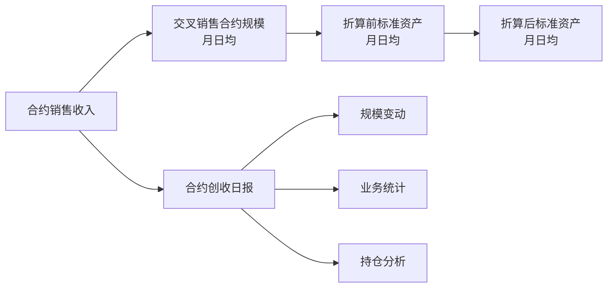

探索后，**最值得深入的是“销售收入 → 交叉销售合约规模 → 标准资产”这段连接**。它揭示了 OTC 加工如何进入更广的资产考核体系。你的几个思路可以组合起来，但表权重应先分成“复用、加工承载、连接作用”，分别判断。

本轮保持只读，沿用交接中的发布版本及排除口径。

四张基础表排除后，**222 张保留表的度数发生变化，49 张改变了角色**：

| 角色变化            | 数量 | 具体发现                                                                         |
| ------------------- | ---: | -------------------------------------------------------------------------------- |
| 多入多出 → 单入多出 |   16 | 包括机构标准资产月日均、证券行情、产品底层资产等；公共输入消失后，显露出业务分叉 |
| 汇聚终点 → 单入终点 |   20 | 包括财务 OTC 期权信息、货币市场利率、白名单标的池等                              |
| 变成单入单出        |    5 | 证券编码、证券基本信息批次表、基金净值、货币利率属性、每日行情                   |
| 变成源头            |    4 | 上游被排除导致，不能理解为实际源系统                                             |
| 变成孤立节点        |    4 | 包括香港证券基本信息、定价环境分红曲线定义等                                     |

新增的五个串行中间节点是：

- `odata_n_tit.d_ref_instrument_code`
- `odata_n_tit.d_ref_instrument_pb`
- `pdata_news_n.t02_prd_unit_nav_s_tit`
- `pdata_news_n.t02_tit_ira_crrc_attr`
- `pdata_news_n.tyzx_exch_quot_h`

同时有三个原串行节点变成源头，所以单入单出只净增两个。

**完整线性链共 199 条，194 条与剥离前完全相同。**按包含两端的表数统计：3 表链 173 条、4 表链 24 条、5 表链和 6 表链各一条；共包含 228 个可折叠中间节点，没有发现纯单入单出循环。

最长链为：

```text
titans_dm.v_otcm_se_report
→ odata_n_tit.d_v_otcm_se_report_p
→ odata_n_tit.d_v_otcm_se_report_pb
→ pdata_nds.otcm_se_report_pb
→ dm_otc_n.otcm_se_report
→ gf_otc.ref_otc_option_deal
```

抽查原 SQL 后，这条链主要承担字段传递和数据分发。其中进入 PDATA_NDS 的一步，37 个绑定输出字段全部来自上一张表的对应字段。因此，**链长适合衡量阅读时能压缩多少层，并不直接代表业务解释价值。**[对应加工证据](E:/02_area/股衍数据-数据cookbook/sql-static-lineage-data/task-projections/tasks/152123/versions/57503348cbfe9f3463274f01927f9e3cce97c41ffc3300310c0586ecc515ea32.evidence-v3.json)

我进一步试算了连接作用：统计全图中各对节点的最短有向表路径经过某张表的程度，也就是介数。结果与出度排名明显不同：

| 表及中文说明                                                              | 入度 / 出度 | 下游 schema 数 | 介数排名 | 当前判断                               |
| ------------------------------------------------------------------------- | ----------: | -------------: | -------: | -------------------------------------- |
| `pdata_n.t03_otc_deri_book_adtnl_info` 账簿附加信息                       |     2 / 155 |             14 |       19 | 广泛复用的公共业务对象                 |
| `pdata_n.t03_agt_rela_h` 协议关系历史                                     |      9 / 98 |             12 |        7 | 公共关系资产，需要解释关系类型和有效期 |
| `pdata_n.t98_otc_deri_comp_sale_info` 合约销售收入                        |     31 / 44 |              6 |    **1** | 承载复杂加工的共享结果                 |
| `dm_index_n.index_grp2_std_ast_aft_covt_mth_apd` 折算后标准资产月日均     |     28 / 46 |              4 |    **2** | 核心资产计算模型                       |
| `dm_index_n.index_grp3_compscal_otcderi_cs_mthapd` 交叉销售合约规模月日均 |       3 / 4 |              1 |    **4** | 出度不高，但连接作用突出               |
| `dm_otc_n.otc_rev_daily_rpt` 合约创收日报                                 |     16 / 11 |              3 |       11 | 下游经营分析的共享加工结果             |

这里的 schema 数只是复用范围的代理，不能直接等同于业务领域数。恢复四张基础表，或在敏感性试算中去掉仅由多输出任务支持的 175 条关联后，销售收入、折算后标准资产、交叉销售规模的介数排名仍分别为 **1、2、4**。

这使“谁承载、谁连接”有了具体对象：



图中只展示已核对的这些关联，各模型还有其他输入。交叉销售规模表还读取销售附加明细和合约管理关系；SQL 中能看到组织归属分支、`UNION ALL`，以及按当月经过天数计算平均规模。这比单纯找一串单入单出表，更接近值得解释的加工片段。[交叉销售规模加工证据](E:/02_area/股衍数据-数据cookbook/sql-static-lineage-data/task-projections/tasks/159763/versions/c87821fad514ef930309c036b4a8b04a78b1be5539385b41aa0ce1a3ddc81a31.evidence-v3.json)

**字段比例和 Machine Facts 确实能继续细分，但需要一起使用。**本轮核对了 16 个任务的证据，发现两个很直接的反例：

- **公共资产不能只按“辅助输入”忽略。**基金净值表的 20 个具有物理输入的输出字段中，16 个来自行情表，4 个来自证券基础表，分别是统一证券编号、源系统产品编号、证券代码、货币代码。剥离后它看起来是串行节点，但解释时仍必须保留这条证券身份补充关系。[基金净值加工证据](E:/02_area/股衍数据-数据cookbook/sql-static-lineage-data/task-projections/tasks/207284/versions/7eaf83d31c4455e99031efc5aff2013849087a813ce2da23cf9c915498c59a08.evidence-v3.json)
- **全部依赖同一上游，也可能是实质加工。**规模变动表的 5 个输出字段都关联创收日报，但其中使用 `SUM(CASE...)`，按公司和日期汇总。Machine Facts 已能区分：`busi_type` 负责分支选择，`dyna_nom_prin` 贡献数值。它与前面逐字段传递的报备链应采用不同讲法。[规模汇总加工证据](E:/02_area/股衍数据-数据cookbook/sql-static-lineage-data/task-projections/tasks/227697/versions/dde02898bbcc610245d3e308de389be76c8094f2531be7b7802b18a9601ee6d9.evidence-v3.json)

字段集合的重叠也有启发：规模变动使用日报中的 5 个可定位字段，持仓分析使用 7 个，前者全部包含于后者，交并比为 **5/7≈71%**；持仓分析增加标的代码、标的名称，并增加相应汇总维度。它们适合放在同一经营分析片段中，内部再区分统计粒度。不过这是当前可定位字段的试算，`PARTIAL`、`DERIVED_OUTPUT` 不能算作零贡献。

因此，我建议接下来按三个层次理解加工网络：

| 层次           | 判断依据                                 | 当前适合深入的对象                                     |
| -------------- | ---------------------------------------- | ------------------------------------------------------ |
| 公共知识       | 复用广度、对象身份、关系键、有效期       | 账簿附加信息、协议关系历史                             |
| 核心模型       | 输出粒度、字段来源、聚合与展开、规则分支 | 销售收入、标准资产、创收日报                           |
| 模型之间的片段 | 连接作用、字段使用重叠、粒度转换         | **交叉销售规模进入标准资产**；**创收日报生成经营统计** |

公共资产在阅读时折叠为可引用输入；共享加工结果保留为解释中心。加工簇可以围绕这些中心重叠，同一张宽表的不同字段也可能服务不同片段。当前证据已经足以选出上述候选，尚不足以给全图自动划出可信的业务簇。
