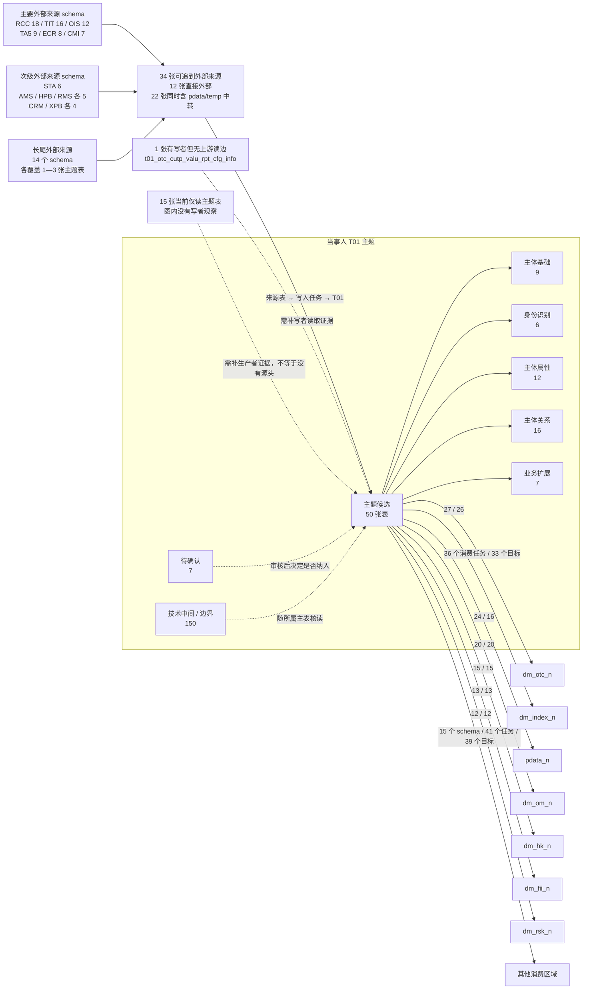
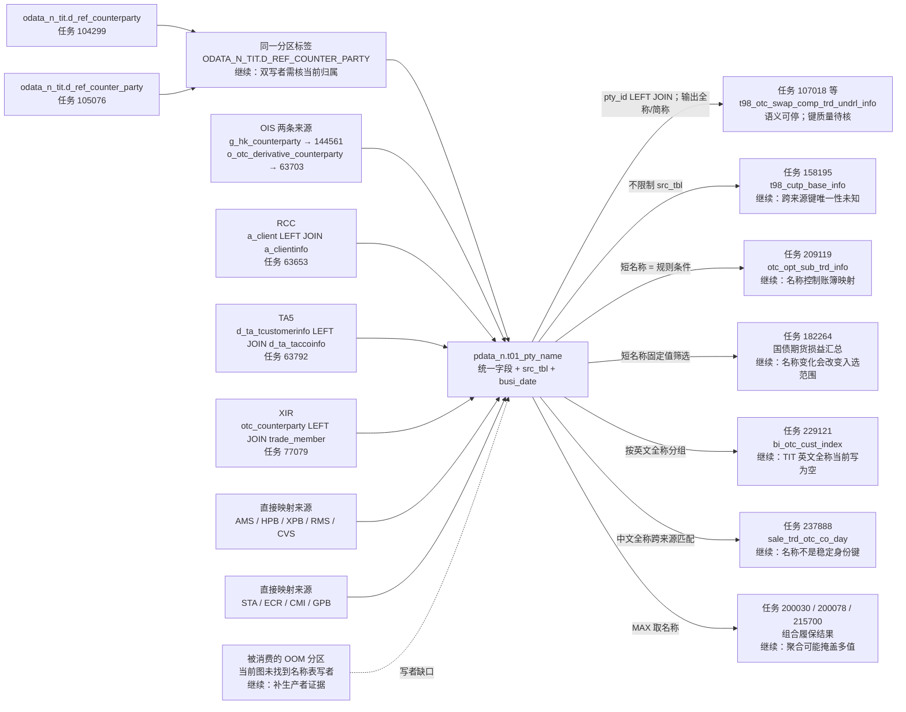

# 当事人主题范围说明

本文件先建立主题底账和图谱结构归组，再按小分支消费 Facts。主题范围见 [IMG-范围说明-20260910151651389.csv](attachments/范围说明/IMG-范围说明-20260910151651389.csv)，35 张有写者主题表的直接上游见 [当事人主题上游归组.csv](当事人主题上游归组.csv)；目前只完成了 `pdata_n.t01_pty_name` 名称分支分析，其他主题表尚未进入 Facts。

## 当前范围

- 当前图状态：`READY`。
- 图版本：`fd7070e0a37c10e99ec235fdd0db10f355c581d0a2e5679410d95d9cc984489a`。
- 在线图中共有 207 个限定表名以 `t01_` 开头的物理身份。
- 另保留 4 个名称中含 T01 的 ECIF 来源对象，标为“来源边界”，不计入仓库 T01 主题主体。

左侧来自当前发布图对 35 张有写者主题表逐表执行向上遍历：`T01 表 ← 写入任务 ← 直接上游表`，不是根据表名猜来源，也不是扫描 Horae/SZData 快照得到的。34 张已经落到外部来源 schema；其中 12 张的直接上游全部来自外部，22 张还同时读取 `pdata_n` 或 `temp` 中转表。`pdata_n.t01_otc_cutp_valu_rpt_cfg_info` 有写者，但该写者在当前图中没有上游读取边，单独保留为证据缺口。另有 15 张主题候选只有读取观察、没有写者观察，不能写成“没有源头”。图中 schema 后的数字表示其直接覆盖的主题表数；一张主题表可以接收多个来源，因此不能相加。

来源覆盖最高的是 `odata_n_rcc`（18 张）、`odata_n_tit`（16 张）和 `odata_n_ois`（12 张）。当前可以确认的是图上存在多来源结构输入；在逐分支读取 Facts 之前，不能据此断定具体业务数据由谁提供，也不能直接下结论说整个主题不是某一主数据体系的镜像。

右侧连线来自“50 张主题候选表 → 读取任务 → 任务写入 schema”的结构投影。共有 188 个不同消费任务；一项任务可能写多个 schema，因此各边任务数不能直接相加。除下面已经核读的名称分支外，其余连线尚未用 Facts 证明 T01 字段对具体输出的因果作用，当前只能称为消费区域候选。

## 名称分支：不是纯展示属性，控制类用法必须保留

`pdata_n.t01_pty_name` 把多个来源的名称、来源代码和当事人类别统一到同一张按 `src_tbl + busi_date` 分区的表中。当前图完整返回 17 个生产任务、20 张直接来源表、95 个读取发生、60 个消费任务和 51 张目标表，查询未截断。17 个生产任务和 60 个消费任务均有 Facts bundle；bundle 状态均为 `SUCCESS`，但这只表示静态证据生成成功，不证明任务实际运行或数据质量正确。

**结论不是“名称都是属性，可以到此剔除”。** 60 个消费者全部使用 `pty_id` 参与关联，56 个任务还能确认名称字段进入最终输出，主体用途确实是给合约、客户、交易对手、保证金和报表补充可读名称；但另外存在固定名称筛选、名称规则匹配、跨来源名称匹配和按名称聚合。这些控制类分支会影响行是否保留、如何归组或匹配到哪个业务规则，不能作为普通展示属性整体停止追踪。

### 名称怎样从来源进入

- 17 个任务都写同一套名称模型：`pty_id`、当事人类别、中文全称/简称、英文全称/简称、来源和加载元数据，再按 `src_tbl + busi_date` 分区。表 DDL 没有声明主键或唯一约束。
- `pty_id` 是来源定制映射：TIT、AMS、HPB、XPB、RMS、TA5、CMI、XIR 等分支拼接来源前缀；RCC、OIS、ECR 等分支直接或清洗后使用来源编号。当前静态证据不能证明这些编号在同一天、跨全部 `src_tbl` 分区全局唯一。
- 中文名称以直接映射为主，但 RCC 在全称为空时回退到客户名称，TA5/STA 在简称为空时回退到全称；部分来源把同一字段同时写入全称和简称。
- 英文名称覆盖不完整。当前 SQL 中大多数分支写空串；TIT、OIS、RMS、XIR 只提供部分英文字段，XIR 相对完整。因而英文名称不能默认视作普遍可用属性。
- 三条生产路径包含 `LEFT JOIN`：RCC 用客户附表辅助分类，TA5 用账户资料补名称和客户类型，XIR 用交易成员表补英文名称。若被连接表在连接键上不唯一，会扩行；若匹配不到，RCC/TA5/XIR 会产生不同程度的空值或默认分类。当前 Facts 和 DDL 均未证明这些键唯一。
- 只有 CMI 的 `g_lp_org` 分支显式使用 `DISTINCT`；其余生产 SQL 没有形成统一的跨来源去重步骤，因此不能从加载逻辑推导出名称表在 `pty_id + busi_date` 上天然唯一。
- 来源侧还有明确的业务筛选：AMS 排除产品代码为空、OIS 境内分支排除香港部门、RMS 排除删除标志；CMI 的 `a_hsi_tenant` 实际读取已切到 CMI，但写入的 `src_tbl` 仍保留旧 MOT 标签，不能把分区标签当成当前物理来源。
- GPB 任务 63634 的 SQL表达了 `ORGID/ORGLONGNAME/ORGNAME` 映射，但 Facts 将这三个字段标为 `PHYSICAL_FIELD_UNRESOLVED`，因此这条来源只能保留 SQL 意图，不能写成已完成字段级确认。

### 下游怎样消费名称

| 消费模式          | 全量 Facts 结果                                                                         | 影响判断                                                                              |
| ----------------- | --------------------------------------------------------------------------------------- | ------------------------------------------------------------------------------------- |
| 身份关联          | 60/60 个任务在 Join 中使用 `pty_id`                                                     | 名称表先承担“编号 → 名称”的查找表角色                                                 |
| 名称值输出        | 56/60 个任务有名称字段到最终目标字段的直接血缘                                          | 中文简称覆盖 43 个任务、中文全称 38 个、英文简称 20 个、英文全称 7 个；任务集合有重叠 |
| Join 行为         | 51 个任务出现名称表 `LEFT JOIN`，17 个出现 `INNER JOIN`；部分任务两者都有               | `INNER JOIN` 可能因名称记录缺失而过滤主记录；两类 Join 都可能在名称键不唯一时扩行     |
| 分区控制          | 60/60 个任务按 `busi_date` 约束；55/60 还用 `src_tbl` 约束                              | 大部分消费绑定具体来源快照；5 个任务跨来源读取，风险更集中                            |
| 名称作控制条件    | 任务 162676/176525 按英文简称排除，182264 按中文简称固定选取；209119 用简称匹配规则条件 | 名称变化可能改变记录是否保留或规则归属，不是展示字段                                  |
| 名称作聚合/匹配键 | 229121 按英文全称分组，237888 用中文全称跨来源匹配；组合履保任务对名称取 `MAX`          | 名称空值、别名和多值会影响分组、关联及最终取值                                        |

5 个没有用 `src_tbl` 约束名称表的任务是 158195、176874、37438、66147、66148。其中 158195 和 176874 只按日期读取名称；37438、66147、66148 再按当事人类别区分个人/企业。它们依赖 `pty_id` 在跨来源分区下不会重复，但当前 DDL 和静态 Facts 没有给出唯一性证明，所以只能标为风险待核，不能断言已经扩行。

4 个任务没有确认“名称值 → 最终输出字段”的直接血缘：107481 的 Facts 没有生成输出绑定；182264 用名称筛选特定交易对手；209119 用名称参与规则匹配；234575 只在中间的交易对手引用关系中使用名称。后三者不是“没有消费名称”，而是名称主要承担控制或中间关联作用。

### 停止与继续建议

| 建议                     | 分支                                                                                                         | 理由                                                                                                                                        |
| ------------------------ | ------------------------------------------------------------------------------------------------------------ | ------------------------------------------------------------------------------------------------------------------------------------------- |
| 可停止继续做业务语义追溯 | AMS、HPB、XPB、RMS、CVS、STA、ECR、两条 OIS、两条 CMI 的直接名称映射；以及 107018 等只把名称落到显示列的下游 | 来源字段、统一名称字段和最终显示字段关系已清楚；保留键唯一性的数据质量验证即可                                                              |
| 继续，优先级高           | TIT 任务 104299/105076                                                                                       | 两个任务读取新旧物理表名，却写同一个 `src_tbl` 分区标签；45 个消费者明确选择该标签，需要确认当前有效写者和分区归属                          |
| 继续，优先级高           | 任务 229121                                                                                                  | TIT 两个生产 SQL 都把 `full_name_en` 写成空串，但该任务按 `full_name_en` 分组并用它关联公司名称；静态证据显示口径冲突，实际影响仍需数据验证 |
| 继续，优先级高           | OOM 分区 → 任务 237888                                                                                       | 消费 SQL读取 `ODATA_N_OOM.F_OTC_DERIVATIVE_COUNTERPARTY` 分区，但当前图的17个名称生产任务中没有对应写者                                     |
| 继续                     | RCC、TA5、XIR 三条多表生产路径                                                                               | `LEFT JOIN` 的匹配率和连接键唯一性决定空名称、默认分类及是否扩行                                                                            |
| 继续                     | 158195、176874、37438、66147、66148                                                                          | 跨 `src_tbl` 分区按 `pty_id` 关联，必须确认同日全局唯一性或实际去重策略                                                                     |
| 继续                     | 147185、182264、209119、229121、237888，以及162676/176525                                                    | 名称参与身份匹配、固定筛选、规则选择、分组或排除条件；名称变化会改变业务结果                                                                |
| 证据不足                 | GPB 任务 63634、消费者任务107481                                                                             | 前者三个关键来源字段未解析到物理字段；后者没有输出字段绑定，需补齐 Facts/表结构后再判断                                                     |

### 证据定位与边界

- 名称表结构：[DDL](E:/02_area/股衍数据-数据cookbook/sql-static-lineage-data/tables/hive/pdata_n.t01_pty_name__gfhive/ddl.sql)。
- 生产示例：[TIT 104299 SQL](E:/02_area/股衍数据-数据cookbook/sql-static-lineage-data/tasks/hiveTask/104299/sql/query.sql)、[RCC 63653 SQL](E:/02_area/股衍数据-数据cookbook/sql-static-lineage-data/tasks/hiveTask/63653/sql/query.sql)、[RCC Facts manifest](E:/02_area/股衍数据-数据cookbook/sql-static-lineage-data/field-facts/registry/tasks/63653/bundle/manifest.json)。
- 展示属性示例：[任务107018 SQL](E:/02_area/股衍数据-数据cookbook/sql-static-lineage-data/tasks/hiveTask/107018/sql/query.sql)、[Facts manifest](E:/02_area/股衍数据-数据cookbook/sql-static-lineage-data/field-facts/registry/tasks/107018/bundle/manifest.json)。
- 控制类示例：[任务209119 SQL](E:/02_area/股衍数据-数据cookbook/sql-static-lineage-data/tasks/sparkIndex/209119/sql/query.sql)、[任务229121 SQL](E:/02_area/股衍数据-数据cookbook/sql-static-lineage-data/tasks/sparkIndex/229121/sql/query.sql)、[任务237888 SQL](E:/02_area/股衍数据-数据cookbook/sql-static-lineage-data/tasks/sparkIndex/237888/sql/query.sql)。
- 本轮对生产侧17/17个任务的 SQL/Facts 做了字段映射核读；对消费侧60/60个任务做了关系节点、过滤、Join 和最终输出绑定的全量扫描，并对上述控制类路径逐条核读。60个消费 Facts 中有34个 bundle 含至少一个 `unknown`，这些 unknown 不一定都与名称字段有关；本轮只采用已解析到 `pdata_n.t01_pty_name` 的关系和字段，不把 bundle 的整体 `SUCCESS` 当成业务正确。
- 所有结论均为静态 SQL/Facts 证据。尚未读取真实业务行，因此不能证明连接键唯一、名称非空、实际扩行、运行成功或下游业务验收。

| 范围状态      | 数量 | 当前处理方式                             |
| ------------- | ---: | ---------------------------------------- |
| 纳入候选      |   50 | 进入后续 Facts 消费模式分析              |
| 待确认        |    7 | 先确认是否属于当事人主题，再决定是否分析 |
| 技术中间/边界 |  150 | 不单独解释业务含义；随所属主表或任务核读 |
| 来源边界      |    4 | 留到主题向上溯源时核对                   |

50 个纳入候选暂分为：主体基础 9、身份识别 6、主体属性 12、主体关系 16、业务扩展 7。分类依据当前表名和已有中文注释，只是主题编排候选，不是 Facts 已确认结论。

## 图证据状态

| 状态                     | 数量 |
| ------------------------ | ---: |
| 当前读写均有             |   38 |
| 当前仅读观察             |   50 |
| 当前仅写观察             |    3 |
| 当前目录存在，无读写观察 |  120 |

当前物理身份中 172 个为 `CONFIRMED`，39 个为 `CANDIDATE_DATASET`。候选身份保留图中的原因码；不能因进入底账而升级为确认身份。目录存在但无读写观察，也不能据此判断表无用、已停用或属于纯属性。

## 数据源快照怎样使用

- Horae 数据源快照观测于 2026-09-02，本次查询返回 1,097/1,097 条。
- SZData 数据源快照观测于 2026-09-02，返回 1,034/1,051 条；快照标记 `complete=false`，有 17 条覆盖缺口、3 条失败记录和 14 组重复候选。
- 两份快照只按 schema/service 提供系统名称和数据库类型背景。一个 schema 可能匹配多个环境，因此底账明确标为“仅作系统背景”，不把它当成物理表身份或业务归属证明。
- 表身份、读写观察和身份状态以当前图为准；中文注释沿用同物理表 ID 的既有本地元数据。目前只有名称分支进入 Facts/SQL，其余主题仍停留在结构归组。

## 本轮边界

本轮完成的是“当前图 T01 候选分母已登记”“35 张有写者主题表的直接上游已归组”和“名称分支的生产、消费及停止/继续建议”。名称分支没有被整体剔除：直接展示型路径可以停止语义追溯，控制型、跨来源和证据缺口路径继续保留。

下一轮仍按一个小分支推进，不扩展到全主题；150 个技术中间表不单独起篇。
