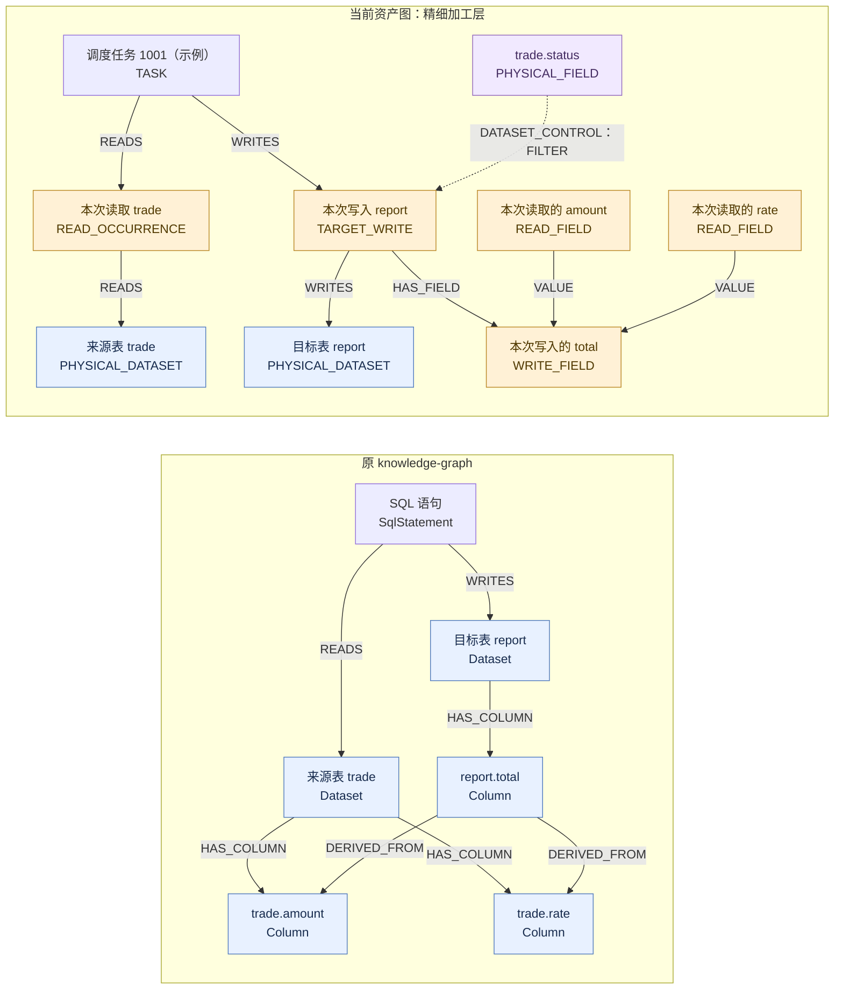
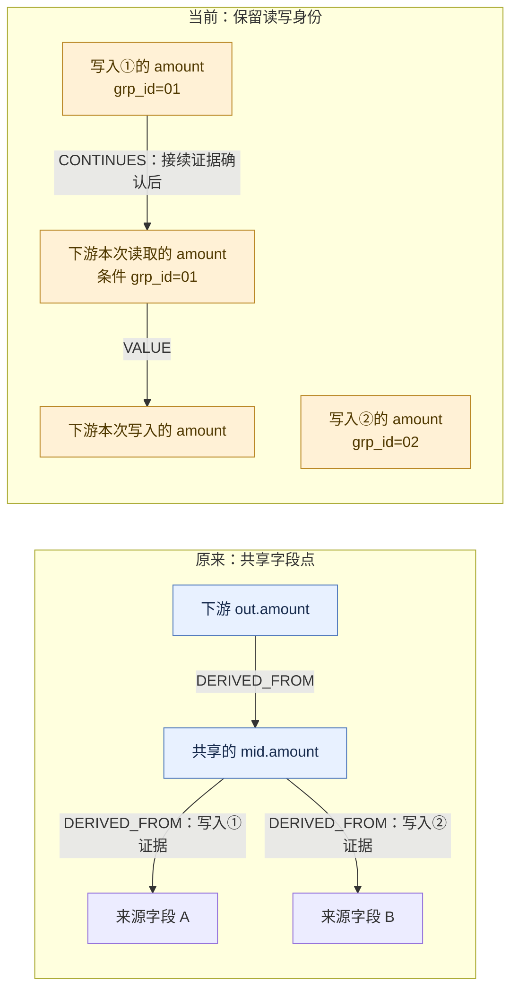
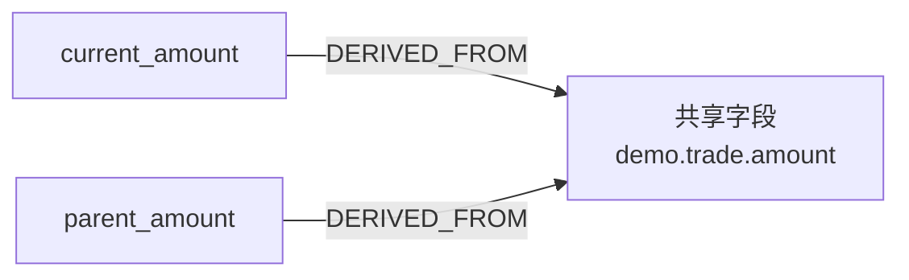
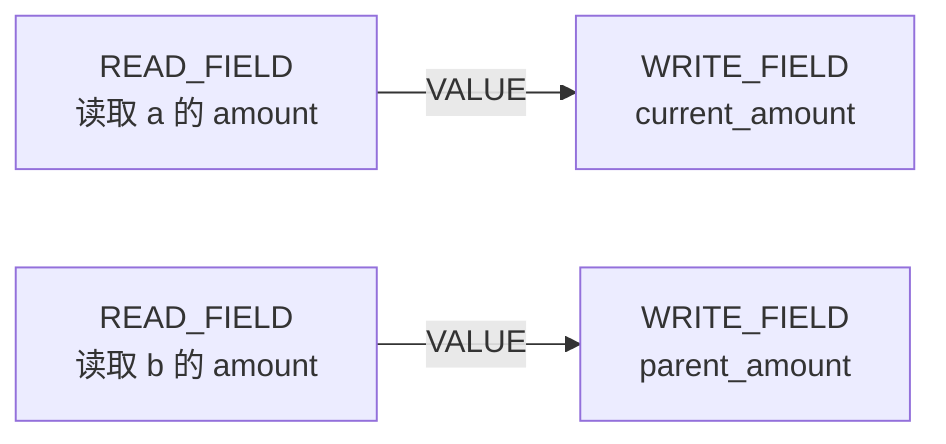

# 原 knowledge-graph 与当前资产图：模型、证据与消费方式对比

整理日期：2026-09-07。本文记录本轮讨论的结论，供后续回看；不是新的实施计划。

阅读顺序：第 2–6 节是两套模型的概览；第 7–9 节记录证据消费建议；**第 10 节是排除页面、指标、标签和管理元信息后的技术内核深度比较**，包含具体 SQL、实现机制、信息损失与证据边界。

消费目标已明确不局限于 Agent，还包括数据地图等应用；knowledge 可以补充业务标签与说明。第 10 节不以这些消费或元信息能力判断技术内核优劣。

**需要准确的节点、边类型与 ID 定义时，先看[当前资产图：节点、边与存储全貌](asset-graph-node-edge-reference.md)。** 其中明确区分局部投影、当前发布主链和独立目录扩展，并纠正中文示意图中的非存储连线。

> **当前方向：保留读次、写次和精细加工证据。原图谱的指标、业务归属等能力暂缓；近期若完善证据消费，优先核查已有查询返回，不先引入新的证据包系统。**

## 1. 比较对象与证据边界

| 对象                   | 本文所指                                                                                                  |
| ---------------------- | --------------------------------------------------------------------------------------------------------- |
| 原来的 knowledge-graph | `股衍-知识图谱/docs/knowledge-graph`，以任务、SQL、表、字段、指标及口径等实体组织关系                     |
| 当前资产图             | 本仓库的任务局部投影及 `packages/data-graph/src/asset-graph` 发布、查询模型，保留读次、写次和字段接续身份 |

本文依据本轮读取的模型文档与构图代码。**模型中有某种边，不等于每个已发布图里都有；静态证据也不证明实际运行成功或业务结果正确。** 下文 SQL 和图均为解释模型的示例，没有执行示例任务。

“当前资产图”还应区分两个层次：任务局部投影使用 `FIELD_DIRECT`、`FIELD_CONDITIONAL` 等边；发布给 Agent 查询时，分别映射为 `VALUE`、`CONDITION`，并增加按读写身份组织的字段节点。

## 2. 一眼看懂两边的重点

**原图谱主要把资产和业务对象串起来；当前模型进一步区分同一资产的不同读写，并把值来源与控制条件分开。两边都有字段血缘。**

| 比较维度         | 原 knowledge-graph                                       | 当前资产图                                                                   |
| ---------------- | -------------------------------------------------------- | ---------------------------------------------------------------------------- |
| 资产组织         | 任务、SQL、表、字段、指标、登记口径、负责人、数据层等    | 任务、物理表、物理字段，以及读写和加工证据                                   |
| 字段身份         | `Column` 按表名与字段名组织；不同 SQL 的来源在边上带证据 | 物理字段作为资产身份，同时建立读次字段 `READ_FIELD` 和写次字段 `WRITE_FIELD` |
| 多次写入同一字段 | 汇到共享字段点，边携带语句、任务、分支、输出位置等信息   | 不同写入保留各自 `TARGET_WRITE` 和 `WRITE_FIELD`                             |
| 字段值来源       | `目标 Column → DERIVED_FROM → 来源 Column`               | `来源 READ_FIELD → VALUE → 目标 WRITE_FIELD`（读次成功解析时）               |
| 条件与行集控制   | 本轮核对的核心字段链没有按当前模型的方式独立分类         | `CONDITION` 与 `DATASET_CONTROL` 区分于值来源                                |
| 跨任务连接       | 共享表、字段实体承载关联；仍需检查边的具体证据           | 通过具体写入与消费读次匹配，发布 `CONTINUES` 或 `CANDIDATE`                  |
| 业务与口径       | 已设计指标、登记口径、证据包及口径生成审计链             | 本轮明确：指标入口放到后期；负责人、业务归属不是当前重点                     |
| 证据表达         | 来源、置信度、是否推断、构建批次及边上 SQL/任务等属性    | Facts、SQL 定位、证据状态、读写身份、发布版本与内容哈希                      |

注意：两边的 `DERIVED_FROM` 与 `VALUE` 箭头方向不同，不能凭箭头方向判断哪边更完整。节点更细也不自动意味着更好用，消费层仍需要适当汇总与按需下钻。

## 3. 同一条 SQL，两种图表达

```sql
INSERT INTO report
SELECT amount * rate AS total
FROM trade
WHERE status = '有效';
```



图例：蓝色为资产，黄色为具体读写及其字段，紫色为控制字段。省略部分资产映射边和证据属性；虚线表示控制关系，不表示候选状态。读取节点与读取字段通过 taskId + occurrenceId 关联，当前发布主链没有二者之间的显式 HAS_FIELD 边；全量类型见上方专门文档。

- 原模型的 `report.total` 是共享字段点；当前模型进一步区分“本次写入的 total”。
- `amount` 与 `rate` 参与计算值，`status` 决定保留哪些行。当前模型将两类依赖分开。
- 乘法公式、过滤、Join 等可在加工证据里继续查询；不能把这张示意图理解为每个运算符都已经独立入图。
- 原模型还有 `GeneratedExpression`，主要用于没有真实源字段的常量、系统表达式等，不是通用的全部算式节点。

## 4. 为什么要区分读次和写次

假设两个写入分别写 `mid` 表的 `grp_id=01`、`grp_id=02`，下游只读取 `01`。



右侧写入②没有接线，前提是本例物理身份、读写绑定与分区证据足以确认接续并证明②不匹配。不是仅凭两个分区字符串就断定实际生产者；证据不足时需要保留候选或缺口。

左图也不表示原模型完全没有语句证据。差别在于：**当前模型把读写身份直接放进可遍历的结构里，而不只依赖共享字段点之间的边属性。** 物理字段适合作为目录入口，不应绕过接续证据成为不同写入之间的快捷连接。

## 5. 原模型的点边速查

| 关系组             | 主要连接                                                                                                                                        |
| ------------------ | ----------------------------------------------------------------------------------------------------------------------------------------------- |
| 项目与调度         | `Project → HAS_ENTRY_TASK → ScheduleTask`；下游任务 `→ DEPENDS_ON →` 上游任务                                                                   |
| 任务和数据         | `ScheduleTask → PRODUCES / CONSUMES → Dataset`                                                                                                  |
| 任务和证据         | `ScheduleTask → EMITS_SQL → SqlStatement`；`→ HAS_RUNTIME_LOG → RuntimeLog`                                                                     |
| SQL 读写           | `SqlStatement → READS / WRITES → Dataset`                                                                                                       |
| 表级依赖           | 目标表 `→ DATASET_DEPENDS_ON →` 来源表                                                                                                          |
| 字段归属与血缘     | `Dataset → HAS_COLUMN → Column`；目标字段 `→ DERIVED_FROM →` 来源字段                                                                           |
| 生成值             | `Column → GENERATED_BY_EXPRESSION → GeneratedExpression`                                                                                        |
| 指标与业务         | `Metric → STORED_IN → Dataset`；`→ COMPUTED_BY → ScheduleTask`；`→ HAS_DEFINITION → MetricDefinition`                                           |
| 归属与分层         | `Owner → OWNS →` 任务／表／指标；表／任务 `→ BELONGS_TO_LAYER → DataLayer`                                                                      |
| 指标证据与口径生成 | `EvidenceBundle` 连接 SQL／表／字段；`CodeDefinition`、`PromptRun`、`PromptTemplate`、`ModelVersion`、`DefinitionComparison` 记录口径生成与比对 |

原模型的 `confidence` 与 `inferred` 等属性用于区分直接采集与推断。特别是 `DATASET_DEPENDS_ON` 可以有不同来源，不能只看边名认为证据同等强。

## 6. 是否需要吸收：本轮收敛后的判断

**有选择地吸收，不迁移替换，也不立即搬入整套业务节点。**

| 能力                                      | 判断与当前优先级                                                                   |
| ----------------------------------------- | ---------------------------------------------------------------------------------- |
| 统一资产入口                              | 保留这种组织思路。当前已有物理表、物理字段基础，按需汇总其读写，不另造重复资产身份 |
| 指标进入精细血缘                          | 用户明确放到很后面；本轮不作为近期建议或实施任务                                   |
| 项目、负责人、业务归属                    | 用户明确不是重点；暂不推进                                                         |
| 证据可追溯                                | 值得吸收“结论能回到依据”的原则，优先复用当前 Facts、SQL、版本和引用                |
| 整套指标 EvidenceBundle、模型调用审计节点 | 目前不建议照搬；尚无本轮需求证明需要新增这套结构                                   |
| 共享字段直接承担跨任务连接                | 不照搬；继续保留读次、写次、物理身份和分区接续                                     |

讨论中曾建议先做一个指标入口验证，随后用户明确了更晚的优先级。**最终结论以本节为准，指标试点不属于当前待办。**

## 7. 证据消费最值得关注什么

现有接口已有版本、内容哈希、加工详情和固定 SQL 查询能力。当前并未通过实际查询证明存在某个接口缺口，因此以下是核对标准，不是已确认缺陷。

例如查询得到“写入①的 amount 接续到下游读次的 amount”，应能顺手回答：

| 核对问题         | 所需信息                                                 |
| ---------------- | -------------------------------------------------------- |
| 哪两次读写？     | 生产任务、写入 ID、消费任务、读次 ID、物理表与字段       |
| 为什么能接上？   | 物理身份、读侧条件、写侧分区、采用的规则及判定理由       |
| 依据在哪里？     | Facts 记录 ID、固定版本 SQL 的定位、可继续调用的查询入口 |
| 还有什么没证明？ | 当前关系状态、其他候选、缺口，以及静态证据的适用边界     |
| 以后还能复核吗？ | 发布版本、证据内容哈希及与该版本绑定的材料               |

最有价值的增量是**可核对的判定理由**，不是再保存一份大而全的原始材料。只有 `CONFIRMED` 和文件路径，仍可能迫使 Agent 重新翻材料、重新推导。

## 8. 两项建议主要属于消费层

### 8.1 按问题取证据

查一个字段时，先返回相关表达式、输入字段与必要条件，再允许展开 SQL 或关系详情。避免默认返回整个任务的所有证据。

### 8.2 单边状态与整条路径结论分开

五跳中有一跳是候选，不能把整条路径称为已确认。还要区分：

- **已返回路径的边状态**：这条具体路径中，哪些边满足接续证据要求。
- **查询范围是否完整**：是否达到深度／数量限制，是否还有未展开分支或缺材料。

即使已返回路径上的边都确认，也不能由此宣称已经找全所有上游。图连通、查询完成和业务正确是不同结论。

| 职责 | 图谱生产层                   | 图谱消费层：查询服务／CLI                          |
| ---- | ---------------------------- | -------------------------------------------------- |
| 证据 | 保存证据、读写身份、定位引用 | 按字段／关系筛选、分页、按需展开                   |
| 状态 | 保留单边状态、缺口、判定依据 | 汇总本次路径状态，标出候选、断点、截断和未展开范围 |
| 版本 | 发布并绑定可复核材料         | 返回版本，确保详情查询使用同一批证据               |

**这两项本身不要求重设计点边，也不是必须从原图谱搬来的能力。** 底层证据已齐备时，属于当前图谱的消费体验和查询语义完善；确实缺信息时才补生产层。

## 9. 后续若继续，最小核查范围

本轮只整理文档，不修改图谱与 CLI。若后续决定推进，可选一条已有跨任务字段边，读取现有 trace、detail、processing 返回，核对第 7 节的五个问题，以及第 8 节的路径与范围表达。

缺哪一项再讨论补哪一项；不先新增证据包节点、扩扫描范围或建设新系统。

## 10. 技术内核深度比较

### 10.1 比较范围、方法与总体判断

本节回答：**如果不看页面、指标、标签、负责人等内容，仅看血缘与加工关系的技术内核，原 knowledge-graph 与当前模型有什么实质区别？**

调度任务 ID 在本节只作为读取、写入和语句的技术作用域，不讨论“谁负责加工”等管理信息。

比较时固定两个观察层次：

| 观察层次                   | 比较内容                                      | 不能混淆的地方                               |
| -------------------------- | --------------------------------------------- | -------------------------------------------- |
| 图中直接保存的结构         | 实体身份、节点、边、边属性、归并粒度          | 图里没有某种节点，不等于整套系统没有对应证据 |
| 产生并解释这些结构的技术链 | 来源抽取、Facts、局部投影、读写接续与状态判定 | 有机制不等于每一批 SQL 都已经解析成功        |

本轮进行了有界源码核对：原实现的 `extract_sql_facts.py`、`extract_column_lineage.py`、`build_graph_facts.py`；当前实现的身份定义、字段证据、局部投影、资产编译和跨任务接续代码。没有执行同输入 A/B 对照，没有对两套已发布图做全量统计。

因此，下文明确区分：

- **代码事实**：源码直接显示的数据结构、生成方式、判断条件。
- **结构性判断**：这些实现使哪些信息得到保留，或在哪一步归并。
- **未验证**：真实 SQL 的覆盖率、准确率、性能及某个疑点是否已经造成实际错误。

**总体判断：当前模型在区分来源角色、读写位置、依赖性质和跨任务接续上更强。原模型更简洁，并将 SQL 语句和无源生成表达式直接建成图节点。当前模型不是原模型的严格超集，也不是仅仅多画几个节点。**

### 10.2 资产身份与读取身份：两边在哪一步归并

#### A. 物理表、物理字段身份

| 内容         | 原 knowledge-graph                                    | 当前模型                                                                    |
| ------------ | ----------------------------------------------------- | --------------------------------------------------------------------------- |
| 表节点 ID    | `dataset:<规范化表名>`                                | 对 platform、dataSource、qualifiedName 规范化后计算稳定 ID                  |
| 字段节点 ID  | `column:<表名>.<字段名>`                              | 物理字段 ID 包含 platform、dataSource、stableTableId、qualifiedName、column |
| 同名异数据源 | 当前核对的原节点 ID 不单独包含数据源维度              | 身份模型显式区分数据源                                                      |
| 身份不足     | 别名、单读表、schema 唯一字段、唯一表名后缀等解析机制 | 身份状态、限定状态及原因，并结合 Facts 证据定位                             |

**结构性判断：** 原模型更容易把名称一致的对象归到一起；当前模型更重视是否是同一个物理对象。

代价也不同：严格身份可降低误合并风险，但不同材料提供的身份不完整或不一致时，可能留下未对齐对象和断点。不能把“不连接”一律理解为代码错误，也不能把“连接更多”一律理解为覆盖更完整。

边界：当前接续代码还存在依据调度关联表寻找写入的备用路径，不能把上述身份设计概括为“所有接续分支都只依赖同一个完整身份等值条件”。不同来源路径要分别审查。

依据：[原节点身份生成](E:/02_area/股衍-知识图谱/docs/knowledge-graph/kg_probe/build_graph_facts.py)、[当前身份函数](../scripts/project-graph/task-local/ids.ts)、[当前身份解析](../scripts/project-graph/task-local/identity.ts)。

#### B. 同一字段的不同读取角色

```sql
SELECT
    a.amount AS current_amount,
    b.amount AS parent_amount
FROM demo.trade a
JOIN demo.trade b ON a.parent_id = b.id;
```

原来源抽取先把别名映射到表，再以 `(dataset, column)` 去重。两个输出仍是两个输出字段，但来源都归到 `demo.trade.amount` 这个共享字段。



当前模型在证据能够解析时，将同一物理字段在 `a`、`b` 中的读取分别保留：



这里保留的不是两张表，而是同一张表的两个读取角色。原图的边仍可定位 SQL、分支和输出位置，因此不能说原系统完全没有相关证据；但它没有在字段来源端点上保留这两个读取身份。

**信息损失：** 仅从原图共享字段的连通关系，无法恢复来源属于 `a` 还是 `b`，需要回看 SQL 并重新解释。当前模型在成功定位时直接保留该区分。

**当前限制：** 读次解析仍要求在对应关系范围内找到唯一匹配。遇到多候选会返回 `AMBIGUOUS`，例如 `SELF_JOIN_NO_QUALIFIER`。如果同一个表达式同时引用同表同列的多个别名，不能仅凭当前模型支持 READ_FIELD 就承诺全部来源位置已拆分成功。

依据：[原 source_columns / table_aliases](E:/02_area/股衍-知识图谱/docs/knowledge-graph/kg_probe/extract_column_lineage.py)、[当前 resolveSourceReadOccurrence](../scripts/project-graph/field-evidence-v1/source-read-occurrence.ts)。

### 10.3 字段依赖：统一来源边与角色分类

#### A. 数值来源和条件选择

```sql
SELECT CASE
         WHEN status = '有效' THEN amount
         ELSE 0
       END AS result
FROM demo.trade;
```

原抽取器遍历投影表达式中的 `Column`，收集 `status`、`amount` 等字段，主要通过统一的 `DERIVED_FROM` 表达来源依赖。

当前模型具有不同的角色通道：

| 角色         | 该例的含义                  | 当前表达机制                                 |
| ------------ | --------------------------- | -------------------------------------------- |
| 值来源       | amount 提供选中分支的字段值 | VALUE                                        |
| 条件选择     | status 决定选择哪一个分支   | CONDITION                                    |
| 无物理源的值 | ELSE 0 的常量               | 在绑定／表达式证据中解释，不虚构物理来源字段 |

上表描述模型意图与现有生成机制；具体 SQL 是否完整分类，仍取决于 Facts 的角色和依赖信息，没有在本轮执行该 SQL 验证。

**判断：** 原 `DERIVED_FROM` 是较宽的“有关联／依赖”表达，并不等于它声称每个来源字段都参与算术。当前分类的价值是能够区分“提供什么值”和“决定选哪个值”。

#### B. WHERE、JOIN、GROUP BY 等行集影响

```sql
SELECT amount * rate AS total
FROM demo.trade
WHERE status = '有效';
```

原字段来源抽取主要从输出投影表达式查找字段，WHERE 中的 `status` 不会因此成为输出表达式的字段来源。相关条件仍可在 SQL 中找到，但原核心字段图没有当前模型这种独立控制边。

当前模型使用 `DATASET_CONTROL`，从控制字段连到写入；属性细分 `JOIN / FILTER / GROUP_BY / SORT / WINDOW / CONDITIONAL`，并保留关系与语句引用。

**能力边界：** 有控制边不等于已经证明所有输出字段受到相同方式、相同程度的影响。行集控制首先是关系／写入范围的证据，不能直接当作每个字段的数值来源或完整字段因果路径。

依据：[原投影抽取](E:/02_area/股衍-知识图谱/docs/knowledge-graph/kg_probe/extract_column_lineage.py)、[当前局部边生成](../scripts/project-graph/task-local/project-task-local.ts)、[当前控制范围计算](../scripts/project-graph/field-evidence-v1/control-scope.ts)。

### 10.4 写入身份与跨任务接续：不仅是“同一张表”

假设存在两处静态写入定义：

```text
写入①：mid.amount，产品分区 A
写入②：mid.amount，产品分区 B
下游读取：mid.amount，条件限定产品 A
```

#### 原图谱怎样组织

两个写入产生的字段依赖可以有不同的语句、分支、投影位置证据，但目标端点都是共享的 `mid.amount`。下游再通过共享字段连接到来源结构。

这能表达有哪些局部来源，不足以仅凭连通性判断下游实际应接哪处写入。原构图还会按“同一 SQL 的读表与写表”生成表依赖，并按调度上游产出推断另一类表依赖，通过来源属性区分。

#### 当前模型怎样组织

1. 保存每处 `TARGET_WRITE` 和对应 `WRITE_FIELD`。
2. 为消费方找到具体 `READ_OCCURRENCE` 和 `READ_FIELD`。
3. 枚举候选写入，结合物理身份、写入绑定和已有分区证据判断。
4. 保留 `CONFIRMED / ASSUMED / UNKNOWN / DISJOINT` 等分区匹配状态。
5. 发布阶段在端点存在时，按 `l1Eligible` 区分 `CONTINUES` 与 `CANDIDATE`；排除 DISJOINT。

**结构性判断：** 当前实现不仅保存局部依赖，还增加了局部依赖之间“是否允许接续”的规则。这是相比共享字段直接串联更实质的能力。

#### 接续确认的四个限制

| 容易被误读的说法                       | 准确含义                                                             |
| -------------------------------------- | -------------------------------------------------------------------- |
| 分区确认，所以所有 SQL 条件都匹配      | 当前只比较已有分区谓词、值及对应规则，不是任意谓词逻辑证明           |
| CONTINUES，所以只有这个生产者          | 多个写入可以同时满足规则；不能由单边推导唯一生产者                   |
| 已确认，所以实际运行确实消费了这次写入 | 写观察是静态写入定义，未证明运行时消费、执行次序或数据到达           |
| 所有候选均来自同一种物理身份匹配       | v2 还支持 SCHEDULE_RELATION_TABLE 备用路径，需分别检查来源与资格条件 |

源码细节：`isL1Eligible` 对读取身份、候选来源和分区状态进行判断，允许 `IN_UNION_FINAL_WRITE` 或 `SCHEDULE_RELATION_TABLE` 来源；调度关联表备用路径仍要求对应任务有投影和 finalWrites，不是直接把一个调度父任务当作已确认字段源。

这既说明当前实现不是纯表名连通，也说明不能把所有 `CONTINUES` 都口头概括为一套比源码更严格的证明条件。本轮未验证备用路径是否造成实际误连。

依据：[原表关系构图](E:/02_area/股衍-知识图谱/docs/knowledge-graph/kg_probe/build_graph_facts.py)、[当前候选与分区判定](../packages/data-graph/src/continuation/continuation-v2.ts)、[当前接续发布](../packages/data-graph/src/asset-graph/publish.ts)。

### 10.5 CTE、UNION、星号、中间表：两边均有能力，但机制不同

不能把原模型概括为“只支持简单 SELECT”。原代码已有 CTE 来源映射、UNION 分支序号、星号展开、CTAS schema 推断和同步目标解析。

| SQL 结构          | 原实现                                            | 当前图谱技术链                                                                  |
| ----------------- | ------------------------------------------------- | ------------------------------------------------------------------------------- |
| CTE               | 建立 CTE 输出字段到来源字段映射                   | 利用关系树、表达式所属关系与读取位置定位                                        |
| UNION / UNION ALL | 按分支和投影位置输出来源事实                      | 按输出位置下钻具体分支表达式，再过滤不属于该分支的来源                          |
| `*`               | 用 DMS 字段、CTAS 推断 schema、唯一后缀匹配等展开 | 图投影消费已经生成的 Facts 和 schema 证据；不能把上游解析能力当作新增图节点能力 |
| 本地中间物化      | 通过表、字段关系保留依赖；CTAS 可补充 schema      | 对唯一、已解析且有绑定的物化证据展开，并保留 materializationBridgeIds           |
| 不完整物化证据    | 记录解析错误或留下局部关系                        | 保留来源边界／typed gap，不无条件展开                                           |

例如：

```sql
WITH x AS (
  SELECT amount AS v FROM demo.source_a
  UNION ALL
  SELECT amount AS v FROM demo.source_b
)
SELECT v FROM x;
```

两边都可以具有“v 来自 A、B 两个分支”的表示能力。当前实现进一步使用 branch expression 与读取关系，避免把汇总表达式中所有来源都错误配到同一个分支叶子上。

**限制：** 这说明实现中有分支隔离机制，不证明所有嵌套 UNION/CTE 组合均已覆盖。原实现也保存分支序号，不能说它完全丢失分支信息。

当前物化展开要求唯一候选、RESOLVED、完整绑定等条件，保留桥接证据。它并不等于 SQL 运行时的临时表生命周期或任意多语句程序语义已经全部解决。

依据：[原复杂投影抽取](E:/02_area/股衍-知识图谱/docs/knowledge-graph/kg_probe/extract_column_lineage.py)、[当前字段证据下钻](../scripts/project-graph/field-evidence-v1/field-evidence-emission.ts)、[当前物化展开](../scripts/project-graph/task-local/project-task-local.ts)。

### 10.6 同表读写：原表集合算法的具体限制

```sql
INSERT INTO demo.t
SELECT * FROM demo.t;
```

此 SQL 仅用于说明读写角色，不是建议执行的任务。

原 `parse_statement` 的表读取推导是：

```text
read_tables = all_tables - write_tables
```

因此这条抽取路径会从读取集合中排除写入表 `demo.t`。表集合表示无法在该步骤保留同一表的两个角色。

当前投影分别建立读取和写入节点，还会将读取目标表的情况标为 `SELF_READ`。因此结构上可以同时保存“读 t”和“写 t”。

**判定边界：** 原抽取路径排除同表读取是本轮看到的明确代码行为；没有据此断言整个原系统的所有补充来源都无法恢复该信息。当前有 SELF_READ，也不能据此保证历史回读、分区覆盖、增量更新和运行顺序已完整解析。

依据：[原 SQL 读写表抽取](E:/02_area/股衍-知识图谱/docs/knowledge-graph/kg_probe/extract_sql_facts.py)、[当前 readDisposition 生成](../scripts/project-graph/task-local/project-task-local.ts)。

### 10.7 图本身与图外证据：当前模型不是原模型的严格超集

| 内容               | 原 knowledge-graph                                                                                    | 当前发布主链                                                   |
| ------------------ | ----------------------------------------------------------------------------------------------------- | -------------------------------------------------------------- |
| SQL 语句对象       | 独立 SqlStatement 节点，关联任务和读写表                                                              | 语句身份保留在证据属性／Facts 中；无独立 SqlStatement 领域节点 |
| SQL 正文           | 通过语句文件等引用保留，不是全部正文必然入图                                                          | 发布绑定的加工材料与 SQL 源证据                                |
| 无源生成值         | GeneratedExpression 节点；保存 expression_sql、generation_type 等                                     | 输出绑定可保留 WRITE_FIELD；常量与系统表达式主要从 Facts 解释  |
| 普通公式           | 字段抽取产物有 expression_sql；原构图的普通 DERIVED_FROM 边主要保留定位属性，没有复制这项完整公式文本 | VALUE 边保留 expressionId 等，完整表达式通过对应证据查询       |
| Join／过滤完整结构 | 主要需要回到 SQL                                                                                      | 可回到结构化关系 Facts 及 SQL                                  |

例如：

```sql
SELECT 'A' AS product_type, current_timestamp AS created_at;
```

原模型可以用目标字段到 GeneratedExpression 的边直接展示无物理来源的生成表达式。当前模型可以保留输出字段及其绑定，但不会为了这个例子自动生成两个表达式图节点。

**判断：**

- 比较“图＋关联证据＋接续编译”，当前系统保留的加工区分更精细。
- 只比较“图数据库里的独立证据节点”，原模型有当前主链没有的对象。
- 表达式不直接入图不等于证据丢失；但必须保证图版本与外部证据绑定可靠。
- 当前 7 类节点、12 类边并不是一张完整 SQL 关系算子图。不能把上游 Facts 的全部表达能力都算成 Neo4j 图本身的表达能力。

原提取器还对表达式片段使用了长度上限，这不等于原 SQL 文件也被同样截断。图内、抽取产物和原 SQL 文件需分别判断。

依据：[原字段表达式产物](E:/02_area/股衍-知识图谱/docs/knowledge-graph/kg_probe/extract_column_lineage.py)、[原生成表达式构图](E:/02_area/股衍-知识图谱/docs/knowledge-graph/kg_probe/build_graph_facts.py)、[当前图编译](../packages/data-graph/src/asset-graph/compile.ts)、[当前加工证据读取](../packages/data-graph/src/asset-graph/agent-api.ts)。

### 10.8 不确定性：当前能细分缺口，但尚未统一全部语义

| 问题             | 原模型主要怎么记录                 | 当前模型主要怎么记录                        |
| ---------------- | ---------------------------------- | ------------------------------------------- |
| 字段来源怎样解析 | source_resolution、confidence      | 字段依赖及 sourceReadOccurrenceStatus、原因 |
| 物理身份是否成立 | 表名、来源与置信度等               | identityStatus、qualificationStatus 等      |
| 是否有推断       | inferred、source_type              | 候选来源、证据状态、typed gaps、资格条件    |
| 分区是否匹配     | 核心字段构图没有相同的专门接续机制 | CONFIRMED / ASSUMED / UNKNOWN / DISJOINT    |
| 物化能否继续展开 | 解析／产物记录                     | 唯一绑定、物化状态、bridge 引用与缺口       |

原图谱的 high/medium/low 主要体现来源和解析规则。例如显式别名可以为 high，单读表或 schema 唯一匹配为 medium。它不是统计校准后的正确概率。

当前的状态也不是准确率或业务验收结论。相比给一个总体置信度，其价值在于说明**哪一步证据不足**。

当前仍有三处需要保留的边界：

1. **未知来源端点没有完全统一。** 源读次无法解析时，正式编译器可保留 PHYSICAL_FIELD 作为 VALUE/CONDITION 起点；独立目录扩展才通过 UNRESOLVED_READ_FIELD 隔离。结构上值得审查，不等于本轮已证明存在实际错连。
2. **状态分散在不同字段。** 普通边默认 OBSERVED、接续边记录分区状态，节点又有身份状态。不能仅取一个 status 就断言整条链可靠。
3. **加工分类仍有工程规则。** 当前 subtype 分类结合依赖状态、关系类型和表达式文本模式；AGGREGATION 或 TRANSFORMATION 标签不等于完整关系代数或业务公式的等价证明。

以上说明模型有更细的边界表达，但每条构图、接续路径是否遵守这些边界，还需要针对实际产物核验。

依据：[原 confidence_for_edge](E:/02_area/股衍-知识图谱/docs/knowledge-graph/kg_probe/build_graph_facts.py)、[当前编译状态](../packages/data-graph/src/asset-graph/compile.ts)、[当前未知读次隔离扩展](../packages/data-graph/src/asset-graph/compile-catalog.ts)、[当前子类型分类](../scripts/project-graph/field-evidence-v1/subtype-classifier.ts)。

### 10.9 模型成本、信息保留与合理性

不能只比较节点数量。需要看增加结构换来了什么，以及新增结构有没有一致地连接起来。

| 设计                                | 增加的成本               | 保留的信息／得到的能力                     |
| ----------------------------------- | ------------------------ | ------------------------------------------ |
| READ_OCCURRENCE / READ_FIELD        | 更多节点与身份关联       | 区分同表自连接、重复读取的角色             |
| TARGET_WRITE / WRITE_FIELD          | 更多输出身份与绑定       | 区分同表不同写入，避免仅靠共享目标字段串联 |
| VALUE / CONDITION / DATASET_CONTROL | 分类逻辑、状态和证据要求 | 区分数值、分支和行集影响                   |
| 接续索引与候选判定                  | 编译成本、分区与身份规则 | 为跨任务连接提供可核对的条件               |
| 图外加工证据                        | 版本绑定与引用维护       | 无需把全部 SQL 细节重复建成图节点          |

原模型把多次出现归并成共享字段，结构更小、更直接；代价是某些区分只能回到 SQL 重建。当前模型避免其中一部分信息损失，代价是模型和证据链更复杂。

当前发布图的读取字段与读取节点没有显式 HAS_FIELD，而是靠属性关联；写入侧已有该边。这是不对称的表示方式，不是 SQL 业务复杂性必然要求。独立目录扩展已经有读取侧归属边，但当前正式主链没有启用。

**合理性判断：** 读次、写次和依赖角色分类有明确技术价值，不应为了图看起来简单就删除。读取归属不对称、未知端点回退、状态分散则属于可收敛的实现问题，不能全部解释成“精细化必然复杂”。

### 10.10 最终结论与未验证事项

| 比较目标                       | 本轮判断                             |
| ------------------------------ | ------------------------------------ |
| 表和字段关联的简单表示         | 原图谱更简洁                         |
| 区分同表不同读取、不同写入     | 当前模型明显更有表达能力             |
| 区分值来源、条件选择、行集控制 | 当前模型明显更细                     |
| 跨任务接续判定与证据边界       | 当前模型机制更丰富、更有约束         |
| SQL／无源生成表达式独立入图    | 原图谱更直接                         |
| 不确定性细分                   | 当前模型更强，但使用方式尚未完全统一 |
| 实际解析准确率、完整率、性能   | 没有同输入对照，本轮不排名、不量化   |

**当前模型的主要进步，是减少资产归并导致的不可分辨信息，并为跨任务连接增加判定条件。它不是单纯把原模型复杂化，但也没有自动获得全部 SQL 场景的正确性。**

本轮没有验证的内容包括：

- 同一批真实 SQL 下，两套实现各自漏了多少或错了多少关系。
- 分支、窗口、自连接、重复写入的组合是否全部受支持。
- 当前物理字段回退是否已在实际字段路径中产生错误串联。
- 备用接续路径是否在同名异数据源等实际材料下产生误匹配。
- 两套实现的运行成本、图规模、更新耗时与资源差异。

这些不是已确认缺陷，也不是本轮新建的实施任务。后续若需要判断实际优劣，应围绕明确案例取两边结果对照；不能仅靠类型数量、连通数量或测试通过数代替结论。

## 11. 依据与阅读入口

- [原 knowledge-graph 模型](E:/02_area/股衍-知识图谱/docs/knowledge-graph/GRAPH_MODEL.md)
- [原 knowledge-graph 构图代码](E:/02_area/股衍-知识图谱/docs/knowledge-graph/kg_probe/build_graph_facts.py)
- [原 SQL 表读写抽取](E:/02_area/股衍-知识图谱/docs/knowledge-graph/kg_probe/extract_sql_facts.py)
- [原字段来源抽取](E:/02_area/股衍-知识图谱/docs/knowledge-graph/kg_probe/extract_column_lineage.py)
- [当前资产图架构](domain-asset-graph-architecture.md)
- [当前 Agent CLI 与查询合同](agent-graph-cli.md)
- [当前资产图节点、字段端点与边编译](../packages/data-graph/src/asset-graph/compile.ts)
- [当前跨任务字段接续发布](../packages/data-graph/src/asset-graph/publish.ts)
- [当前读次与分支解析](../scripts/project-graph/field-evidence-v1/source-read-occurrence.ts)
- [当前字段证据生成](../scripts/project-graph/field-evidence-v1/field-evidence-emission.ts)
- [当前接续判定内核](../packages/data-graph/src/continuation/continuation-v2.ts)

文档描述的是本轮核对时的设计与实现结构；后续代码或发布合同变动时，应以对应版本重新核对。
