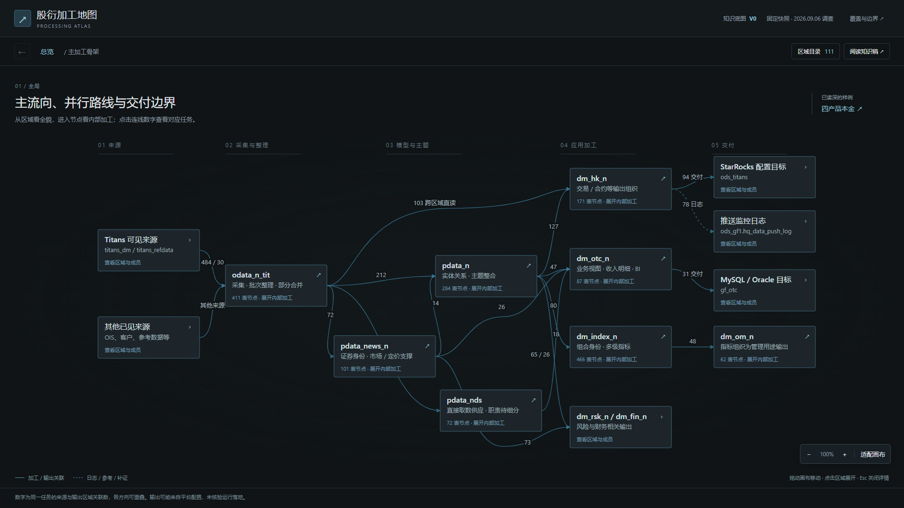
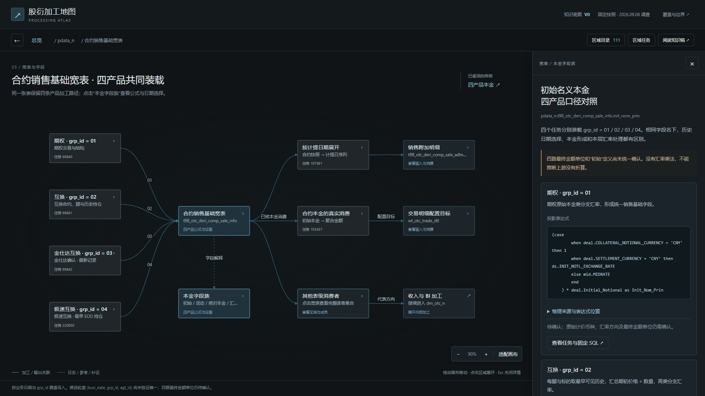

# 股衍加工地图：当前进展与阅读入口

**2026-09-07 当前接续入口：[PDATA 理解与推进指引](pdata-understanding-guide.md)。先把本批 PDATA 整体讲清楚，沿用现有交互，重点复核分类、结果粒度和复杂加工内部过程。** [打开当前 PDATA 加工图](../processing-map-pdata.html)。本页其余内容保留各阶段记录，当前工作顺序见指引。

2026-09-07：已增加 [OData 业务对象与加工路线穿透页](../processing-map-odata.html)，总览点击 `odata_n_tit` 可进入。首屏按六组业务对象组织全部 411 张表，再进入完整相关表、任务与 SQL；加工方式作为辅助导航。该页使用本轮区域分析及本地 SQL 留存，具体范围与重建方式见 `scripts/processing-map/README.md`。

路径更新：共享知识现位于 `config/workspace-paths.json` 的 `dataRoot/knowledge`，当前对应 `../sql-static-lineage-data/knowledge`。下文 `knowledge/...` 均相对于 dataRoot；读取脚本仍在代码仓库，命令保持不变。

记录日期：2026-09-06。范围：本轮加工骨架调查、四产品本金样例及本地 HTML 阅读原型。

2026-09-07：下一批的[骨架复用与逐层分析实施方案](next-iteration/README.md)已单独编写，包含架构、详细实现、任务与验收，**尚未实施**。下文继续记录原页面的已实现状态；新方案不会自动替换原入口。

背景讨论见[知识重建讨论要点与推进路径](knowledge-reconstruction-discussion.md)：记录 AI 注释可使用、表与视图独立区分及公共知识积累等共识；本轮优先级以 [PDATA 指引](pdata-understanding-guide.md)为准。

**目前已经把全局区域、层内代表链、宽表解释和字段证据连接成一个可阅读的地图原型。** 用户已认可其作为理想数据地图的初步构想；这属于阅读方式的正向反馈，尚不等于全域业务知识或图架构已经完成验收。

已补充一条 [共享知识路径验证](shared-knowledge.md)：任务 `107491` 的说明、标签和三个机器观察由公共知识源供 HTML 与 CLI 共同读取。其余任务保持原有整理方式。

已补充[销售合约到按日创收的加工说明](../../../sql-static-lineage-data/knowledge/scenarios/sales-contract-to-income.md)：沿四路基础合约、107491 日明细及 223867 收入分支，解释日期含义、产品金额来源、创收组成和待确认问题，并附锁定 SQL 选段与机器观察引用。文稿保存在共享知识库，已接入 HTML 的“合约到创收”入口；尚未接入任务知识 CLI。

## 1. 从哪里开始

公共知识的下一步整理方式见[数据知识整理方法 V0](../../../sql-static-lineage-data/knowledge/methods/organization-v0.md)：已用源表、任务、宽表和字段四类对象验证分类维度、条件口径和证据引用。这是方法与样例交付，尚未接入 HTML，也未升级为生产知识合同。

| 入口                                                  | 适合做什么                                                     |
| ----------------------------------------------------- | -------------------------------------------------------------- |
| [加工地图 HTML](../processing-map.html)               | 用浏览器离线打开，从总览下钻到加工与证据                       |
| [设计思路](design.md)                                 | 理解为什么这样组织地图、如何使用图与 Facts、知识应怎样继续积累 |
| [实现说明](implementation.md)                         | 查文件职责、取数方式、构建校验、更新步骤和当前实现限制         |
| [整体与各层加工骨架 V0](../processing-skeleton-v0.md) | 阅读调查结论、并行路线及逐层证据边界                           |
| [全部区域清单](../processing-skeleton-inventory.md)   | 查找本批 111 个 schema 名称的结构位置                          |
| [四路合约本金样例](../value-case-otc-principal.md)    | 阅读宽表字段族、四产品公式与日期选择、真实下游和待确认问题     |

建议先体验一条完整路线：**总览 → pdata_n → 合约销售基础宽表 → 本金字段族 → 极速互换任务 220650 → 固定 SQL**。也可以点击总览 `odata_n_tit → pdata_n` 的 `212`，查看对应任务集合。



## 2. 当前已经完成什么

| 工作         | 当前结果                                                                    | 不能由此推出什么                                   |
| ------------ | --------------------------------------------------------------------------- | -------------------------------------------------- |
| 局部价值场景 | 四产品按分区汇入销售基础宽表；已对照初始本金及一个真实下游                  | 尚未证明统一金额单位、正式初始定义或 Join 后唯一性 |
| 全局盘点     | 固定批次的 3,615 任务、2,740 表节点、111 个 schema 名称与 245 组区域方向    | 范围不是全公司；方向数量不是独立业务流程数量       |
| 各层骨架     | 来源整理、PDATA 并行加工、共享证券身份、DM 收入/指标代表链及出口区别        | 并非每个区域都已完整展开，也不是所有任务都已解释   |
| HTML 阅读    | 9 个预先编排的视图，支持区域下钻、连线任务集合、任务详情、公式和 SQL 展开   | 点击时不会自动生成新层级或业务解释                 |
| 原型证据     | 内置任务/表关系快照、四写者表达式摘录及 24 个代表任务的固定 query SQL       | SQL 数量不代表业务规则已全部核验，也不证明运行成功 |
| 原型验证     | 构建成功；浏览器中的主要阅读路径、任务筛选、返回、缩放保持和 SQL 展开已通过 | 当前是本地验证，没有新增正式 CI 或全域语义验收     |

图快照覆盖状态为：2,258 个任务有投影材料，1,177 个只有调度材料，180 个采集失败。有投影材料也可能存在输入输出缺口；仅调度材料的任务不一定应该有 SQL，但不能补成数据读写关系。

完整调查统计和覆盖说明以[加工骨架稿的证据范围](../processing-skeleton-v0.md#7-这版的证据范围和完成程度)为准。

## 3. 页面当前读的是 Facts，还是整理内容

**两者都有：阅读骨架和解释预先整理，机器材料提供实际成员、关系及加工证据。生成 HTML 时统一打包，浏览器点击时只读取内置数据。**

| 页面内容                                         | 当前来源与处理方式                                              |
| ------------------------------------------------ | --------------------------------------------------------------- |
| 哪些区域出现在主图、展开哪条代表链、节点坐标     | `content.mjs` 中预先编排；来自本轮调查的阅读选择                |
| 区域职责、任务加工说明、字段族和待确认问题       | 阅读图、Facts/发布证据及 SQL 后归纳；不是机器自动生成的业务结论 |
| 区域数字、连线对应任务、表的读写者、任务输入输出 | 图的固定导出快照；构建时装入页面，点击时筛选显示                |
| 四产品本金表达式、物理来源字段、表达式位置       | `four-writer-evidence.json` 中已有的 Facts/发布证据摘录         |
| 固定 query SQL、摘要与分区材料                   | 从 `fixed-sql.json` 读取已核历史 query 的留存正文，核对锁定摘要 |
| 完整知识稿                                       | 三份 Markdown 在构建时内置；HTML 不会实时跟随 Markdown 更新     |

详细路径、校验范围与运行方式见[实现说明](implementation.md)。

## 4. 9 个视图分别覆盖哪里

| 视图                 | 当前阅读范围                                              |
| -------------------- | --------------------------------------------------------- |
| 总览                 | 主要来源、采集整理、模型/主题、应用加工和交付的来去       |
| odata                | 采集 → 批次整理；保证金参数跨来源合并                     |
| pdata_n              | 合约实体 → 腿/持仓整合；产品直接形成销售宽表 → 日序列展开 |
| pdata_news_n         | 标准证券身份 → TIT 属性补充 → 多路消费                    |
| pdata_nds            | 直接取数供应的结构位置及历史持仓代表任务                  |
| dm_otc_n             | 收入明细 → 年度创收/客户标签/客户指标；本金的实际下游     |
| dm_index_n / dm_om_n | 身份依赖、年度动态本金、资产折算与管理指标的代表分支      |
| dm_hk_n 与出口       | 业务交付、统计日志和独立文件导出；并未还原全部内部表族    |
| 合约销售基础宽表     | 四产品分区装载、本金字段族、日序列扩展及直接消费          |



## 5. 已验证的交互和修正

本轮实现时使用本机 Edge 的无界面浏览器进行了操作验证。验证脚本位于本地 `tmp/processing-map-check.mjs`；它是本次检查记录，不是正式项目测试入口。这一段记录初版交互验证；后续共享知识改动及其单独核验见 [验证记录](shared-knowledge.md)。

- 总览存在 14 个主图节点；点击 `212` 能看到对应的去重任务集合，并可进入任务后返回列表。
- 能从 PDATA 进入销售基础宽表，看到四个产品的本金公式，再打开 220650 的固定 SQL。
- 区域目录可筛选 `dm_otc_n` 并查看 83 个输出关联任务；空筛选有明确提示。
- 9 个视图可按页面地址片段直接打开；页内返回与浏览器后退已核验。
- 发现并修正了“浏览器后退重复追加层级”以及“打开详情重置缩放/位置”两处交互问题。
- 检查了 1920 × 1080、1440 × 900 和 390 × 844 视口；窄屏详情可用，页面没有横向溢出。窄屏地图需要拖动阅读，未宣称全图在手机上同时清晰可见。
- 检查期间没有页面脚本错误，没有外部 HTTP 请求。

代码评审已复核上述两项修正。截图随本文保存在 `assets/`，保留的是本次原型的实际画面。

## 6. 尚未完成，以及下一步从哪里接

当前原型**已经验证了可行的阅读方式和现有材料的消费能力**。它还没有完成任意区域自动生成解释、全部表族的层内骨架、通用字段族自动归纳、正式口径确认、运行批次接续、实际数据唯一性及交付到达验证。

后续建议先用真实工作问题继续阅读现有几条链，记录：在哪个位置找不到对象、哪次展开丢失上下文、哪个解释缺证据。先补对应知识，再根据重复出现的困难决定是否新增能力。详细方法见[设计思路中的后续积累方式](design.md#5-后续怎样继续积累)。这里记录的是建议顺序，不表示已经启动新的全域重建或架构重构。

本轮没有修改 Facts 合同、图投影、发布器或已有调查页，也没有裁决应删除字段端口、候选接续或目录扩展。与 [KG 风格查询视图方案](../kg-view/README.md) 的关系是并行消费探索，本原型不能算作该方案的查询接口已经实施。

## 7. 固定批次

本稿及 HTML 关联的图版本：

```text
4f61cee7134b1cba7686191bc0e8606ab28cc4d673935a50298e7ba792babf9a
```

HTML 可单独离线阅读。重建依赖原始本地快照和其引用的证据文件；这些输入主要位于 Git 忽略的 `tmp/` 及独立数据根中，不能假设新检出仓库就具备重建材料。保存源码与 HTML、保存重建证据是两件事，操作方式见[实现说明](implementation.md)。
