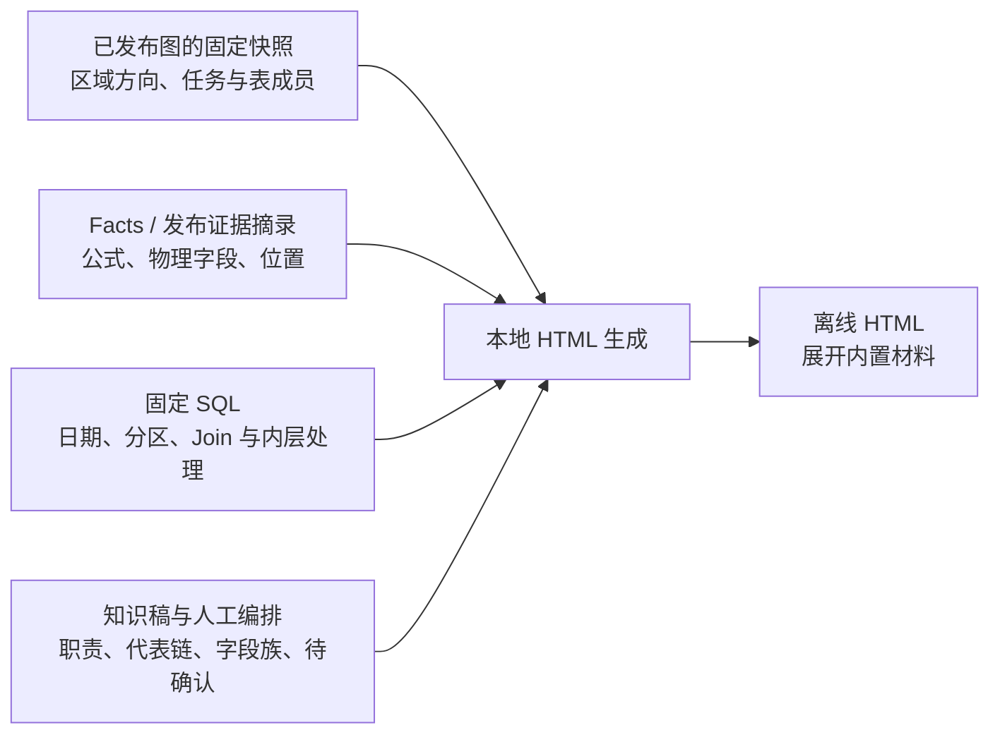

# 加工地图的设计思路

记录日期：2026-09-06。本文记录已采用的阅读组织方式、目前能得出的判断，以及后续积累建议。当前成果见[进展入口](README.md)，代码与取数方式见[实现说明](implementation.md)。

本文保留初版设计过程。后续关于公共知识方法、来源分类、AI 注释、表/视图区分和内容积累优先级的更新，统一见[讨论要点与推进路径](knowledge-reconstruction-discussion.md)。其中建议仍未实施的部分已明确标注，不将方法验证视作业务覆盖完成。

## 1. 要让读者理解什么

读者需要先看清整个加工体系的实际形状：来源如何进入仓库，每个区域内部加工了什么，哪些路线并行，哪些对象提供横向支撑，最终怎样交付。进一步阅读时，应当能进入宽表、字段口径和证据。

一棵预设的“业务主题 → 宽表 → 字段”目录不足以表达这些关系。当前系统包含绕过中间区域的直读、模型入模与直接成宽表的并行路线、共享身份与参考依赖，以及交付和日志旁路。地图需要允许它们以实际位置出现。

因此，**层级承担阅读上的收放，关系保留加工中的来去**。一张表可以在多个阅读场景中出现，但它的物理身份、任务与写入上下文不能因为展示归类而被混为一体。

本版的主图分组来自已见结构和代表 SQL，是可修订的现状解释，不是一份已经得到业务确认的标准分层。

## 2. 三种阅读单位

| 阅读目的       | 阅读单位                 | 页面应回答的问题                             | 当前处理                                                     |
| -------------- | ------------------------ | -------------------------------------------- | ------------------------------------------------------------ |
| 看全貌         | 加工区域及其来去         | 数据从哪来、往哪走、哪里并行或绕行           | 总览和区域目录；主图精选方向，完整方向按成员查询             |
| 理解加工与宽表 | 层内单元、代表链或一张表 | 本步做什么，整合哪些材料，粒度与时间怎样改变 | 预先编排代表链，关联任务和表详情；销售宽表深入字段族         |
| 审查与确认     | 一条具体发现             | 证据是什么，影响到哪里，哪个结论还需要确认   | 本金样例给出公式差异、真实下游和条件性风险；尚无通用审查引擎 |

这三种消费分别调用所需材料。表级全貌不要求先完成全部字段接续，字段解释也不能只靠区域箭头得出。

## 3. 图、Facts、SQL 和知识稿怎样分工

图让阅读者能够发现候选上游、下游和完整的任务成员，避免先人工挑出所有 SQL 才开始分析。Facts/发布证据把表达式和物理来源组织成可定位材料。固定 SQL 用来复核本地上下文、日期选择、内部聚合和声明性质。知识稿承担归纳与解释，并记录确认边界。

**当前没有自动完成从结构到业务知识的全部转换。** HTML 的展开位置、代表路线、节点职责与主要结论都经过预先整理。公式和任务清单有机器材料支撑；点击时并不重新查询 Facts 或现场生成业务说明。

当前也有内容重复：MD 中的解释被摘写进 `content.mjs`，少量说明在 `view.js` 中。它便于快速验证阅读方式，但两边不会自动同步。应当先保持这份关系透明，再依据后续编辑频率决定是否统一内容来源；不能把“未来统一”写成已经实现。

## 4. 本轮形成的设计判断

### 4.1 先让人看见加工体系，再逐层读深

用户明确喜欢整体流向图，不认可原有调查页作为当前知识地图的主要入口。本版因此采用暗色横向总览、矩形节点和克制的连线，首次打开即可看到实际主干。

点击区域会进入一个预先组织的内部视图；面包屑和返回操作保留层级，任务或公式用侧栏展开。打开侧栏保持缩放和可视中心。当前“展开/收起”通过进入子视图与返回父视图实现，没有在同一画布内自动展开、折叠任意节点集合。

这种交互先解决“我在哪、这一步做什么、下一层能看到什么”。它仍需要在更多工作问题中检验，尤其是地图更密、区域解释更全以后。

### 4.2 一个聚合数字必须能查到成员

总览的 `212` 应能进入它对应的任务集合，不能只作为装饰性统计。当前清单来自固定快照，并在构建时核对成员与来源/输出区域。

同一任务可能同时出现在多个方向中，多个方向数字不能相加作为总任务量。`484 / 30`、`65 / 26` 等复合标签保持分组，点击后分别查看。数字描述同任务的区域关联，不表示逐字段因果。

### 4.3 层内骨架保留并行路线和横向依赖

`pdata_n` 中，源合约先进入实体模型、再结合腿和持仓整合，与四产品来源直接形成销售基础宽表，是并行存在的做法。`pdata_news_n` 的标准证券身份支撑多个分支，也不适合摊平成单一串行步骤。

`grp_def`、码表或证券身份的高引用说明它们值得被识别为共享支撑，并不自动说明它们是独立业务阶段。同层读写还可能包含临时过程或未解析来源，不能根据 schema 自环宣布业务循环。

### 4.4 宽表要解释日期和粒度变化

从销售基础表进入任务 `107491` 后，当前合约快照被展开为计提日期序列，目标 `busi_date` 使用 `Accrued_Date`。读者需要在这一位置看到日期维度和粒度意图发生变化，不能只看到两个表名之间的一条箭头。

候选粒度、实际唯一性和正式业务粒度分别记录。SQL 中的聚合、去重或 Join 键提供分析线索，但不自动证明最终结果唯一。

### 4.5 口径差异必须带着产品和加工上下文

四个产品任务分别写 `grp_id=01/02/03/04`，本版保持它们的差异。`init_nom_prin` 的外层赋值可能仍依赖内层历史选择和汇总，例如极速互换先选择最早可见 EOD 持仓，再汇总动态本金。

这可以支持“本金生成与本层汇率处理不同”的结论；最终金额单位是否一致、最早可见记录是否符合正式初始定义，需要额外确认。没有汇率乘法不意味着上游没有折算。

对下游 `103457`，已经确认的是本金字段参与 `sum(coalesce(...,0))`。保留产品等分组维度意味着不能说已经将四产品混加；NULL 转 0 的风险也是有前提的，尚无运行数据证明发生。

### 4.6 交付、日志和导出有不同含义

`dm_hk_n → ods_titans` 的配置交付、指向 `hq_data_push_log` 的统计日志、以及 `hive2file` 导出，应当在阅读时分开。前缀看起来“回到 ods”或出现同表输出关联，都不足以直接判定架构违规或重复写入。

原型中的实线、虚线和文字用于帮助区分这些含义。输出声明仍不是送达证明；日志 SQL 中的常量也不代表下游业务数据成功到达。

## 5. 后续怎样继续积累

先沿已有区域补充能解决实际阅读问题的内容。建议每补一个加工单元，至少交代：

| 应积累的内容 | 写清什么                                                                 |
| ------------ | ------------------------------------------------------------------------ |
| 所在位置     | 属于哪个阅读视图，与哪些上下游或横向依赖相关                             |
| 本步职责     | 原来的材料经过什么处理，产出什么，和前一步的区别是什么                   |
| 成员与依据   | 对应的表、任务、固定材料和可定位公式；哪些连接来自 SQL 补证              |
| 粒度与时间   | 候选键、Join、分区、源历史日期、目标业务日期及其变化                     |
| 确认状态     | 哪些是机器观察、阅读解释、正式确认、尚待验证；目前这些状态主要以文字表达 |
| 待确认问题   | 需要什么补充证据、业务判断或实际数据验证才能继续                         |

这是一份编辑检查表，不是已经实现的新元数据合同。`content.mjs` 并没有通用的确认记录、变更历史或知识审定工作流。后续仅对 `107491` 跑通了 [公共知识源与双入口消费](shared-knowledge.md)，不代表本检查表已全量结构化。

继续推进的建议顺序是：

1. 用几条真实工作链验证当前地图，记录定位、理解和追证据时的具体困难。
2. 将新结论和证据补回原有 MD；需要可视化的位置再同步进 HTML 编排，并重建验证。
3. 等同一种整理或查询动作多次重复，再考虑结构化编排、通用字段对照或自动生成部分内容。
4. 根据真实使用频率、正确性和维护成本，评估底层哪些能力需要保留、补强或简化。

当前不需要先承诺一套能自动生成全部业务地图的通用方法论，也没有启动全域语义重建。

## 6. 对原有架构可以得出什么结论

本轮说明：已有元数据、任务—表关系和精细加工证据，能够共同支持有用的业务阅读结果。面向业务理解的职责、入口和验收需要明确设计，不能只把消费理解为显示节点、边或原始 JSON。

但单个原型不能证明现有每层架构都必要，也不能证明某一层应被删除。四产品样例通过现有比较和字段定位入口间接使用过字段读写与写观察；跨任务候选接续没有用于本次字段因果结论。具体使用记录见[本金样例的能力使用表](../value-case-otc-principal.md#7-这次实际用了哪些能力)。

因此，本轮采用独立阅读原型，保留现有 Facts、图投影、CLI 和调查页。它与 [KG 风格查询视图](../kg-view/README.md) 的目标可以互补，但没有实施该方案的 `column_context`、`task_context` 或 `compare_columns` 接口，也没有解决 `COLUMN` / `PHYSICAL_FIELD` 是否过重的所有争议。
