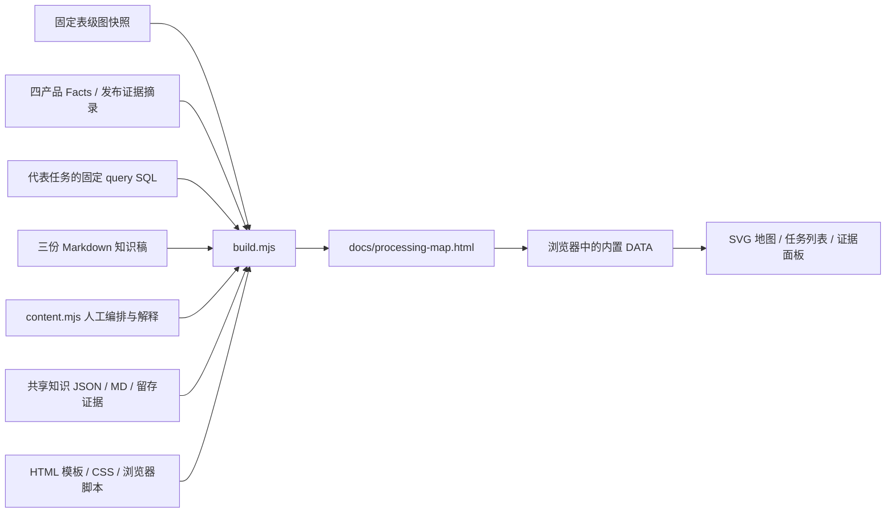

# 加工地图 V0：实现与复现

路径更新：共享知识现位于 `config/workspace-paths.json` 的 `dataRoot/knowledge`，当前对应 `../sql-static-lineage-data/knowledge`。下文 `knowledge/...` 均相对于 dataRoot；读取脚本仍在代码仓库，命令保持不变。

最后更新：2026-09-06。依据当前 `scripts/processing-map/` 源码及本地输入快照整理。

当前交付是一个可离线打开的静态 HTML。构建脚本把固定图快照、已摘录的加工证据、代表任务 SQL、知识稿和人工编排一起写入页面；浏览器展开节点时只读取页面内置数据，不查询 Neo4j、不读取外部 Facts 文件，也不重新解析 SQL。

阅读入口：[加工地图](../processing-map.html)。知识内容仍保留在 [加工骨架](../processing-skeleton-v0.md)、[区域盘点](../processing-skeleton-inventory.md) 和 [四产品本金案例](../value-case-otc-principal.md) 中。

2026-09-06 增补：任务 `107491` 的解释现由 `knowledge/tasks/107491.json` 与 MD 提供，CLI 与地图共用 reader；地图构建核验三个机器观察。24 个旧 SQL 证据路径失效、替代版本又在验证期间被清理后，现用 `fixed-sql.json` 留存已核 query 正文；107491 的三个观察另保存在数据目录中的最小证据摘录中。详细边界见 [共享知识验证](shared-knowledge.md)。

## 1. 构建阶段与阅读阶段



构建阶段完成文件读取、部分一致性校验、环境地址替换、数据裁剪和内联打包。HTML 包含数据、CSS 和 JavaScript，移动这个 HTML 后仍可阅读。

阅读阶段用原生 JavaScript 生成 SVG 节点和曲线，并根据节点、区域或连线的身份查找内置数据。这里的“展开”是切换已经编排好的视图或打开详情面板，不是现场生成新的业务解释。页面中的 Markdown 以原文文本显示；地图本身并不在浏览器中运行 Mermaid。

## 2. 文件职责

| 文件                                                        | 当前职责                                                                                |
| ----------------------------------------------------------- | --------------------------------------------------------------------------------------- |
| [build.mjs](../../scripts/processing-map/build.mjs)         | 读取固定输入，检查版本和部分身份、成员、SQL 摘要，将数据与模板合成 HTML                 |
| [content.mjs](../../scripts/processing-map/content.mjs)     | 保存固定版本约束、代表任务说明、视图集合、节点坐标、阅读关系及证据边界                  |
| [view.js](../../scripts/processing-map/view.js)             | 绘制 SVG；区域下钻；连线与任务清单；宽表读写索引；本金公式与 SQL 面板；导航、缩放和筛选 |
| [view.css](../../scripts/processing-map/view.css)           | 暗色视觉、节点与连线、右侧面板、桌面及窄屏布局                                          |
| [template.html](../../scripts/processing-map/template.html) | 页面结构、地图容器、导航和详情容器、数据及资源插槽、内容安全策略                        |
| [README.md](../../scripts/processing-map/README.md)         | 最短打开方式、重建命令和输入约束                                                        |
| [processing-map.html](../processing-map.html)               | 构建结果，供浏览器直接打开；不应作为主要编辑源                                          |

此生成脚本只使用 Node.js 内置模块，没有引入新的前端构建器或运行时框架。它也没有调用图投影、发布或 SQL 采集程序。

## 3. 页面信息逐项来自哪里

| 页面信息                                                         | 输入材料                                                 | 构建与展示方式                                                                   |
| ---------------------------------------------------------------- | -------------------------------------------------------- | -------------------------------------------------------------------------------- |
| 任务编号、名称、类型、覆盖状态、输入和输出关联                   | `tmp/processing-skeleton/table-network.json` 的 `tasks`  | 构建时选取字段写入 `DATA.tasks`，点击任务时读取                                  |
| 表身份及表级读者、输出关联任务                                   | 同一快照的 `tables`                                      | 保留表身份、名称、读者和写者索引；页面按表名查找匹配身份                         |
| 区域流向数字及相应任务集合                                       | `tmp/processing-skeleton/schema-flows.json`              | 通过 `from/to` 查找方向；复合连线分别展示各组数量和成员                          |
| 区域目录、表节点数、区域读者与输出关联任务                       | `tmp/processing-skeleton/schema-summary.json`            | 页面读取预计算摘要；区域成员按任务编号去重                                       |
| 九个视图、哪些节点可展开、节点位置、代表路线、区域职责和任务说明 | `content.mjs`                                            | 人工阅读调查材料后编排；并非自动聚类或自动业务分类                               |
| 四产品 `init_nom_prin` 表达式、表达式角色、物理来源列、字符位置  | `tmp/otc-principal-value-case/four-writer-evidence.json` | 这是之前从 Facts / 发布证据提取的摘录；本次构建直接读取，不重新扫描完整 Facts 包 |
| 代表任务的固定 SQL                                               | `fixed-sql.json` 中已核历史版本的留存 SQL 正文           | 读取 `sqlSources` 中的 `query` slot，核对任务编号与 SQL 摘要后内置               |
| 完整调查上下文、解释与待确认项                                   | 三份 Markdown 知识稿                                     | 构建时读取原文并内置，不随外部 Markdown 修改即时更新                             |

因此，目前可以自动带入的是已有结构索引和已提取证据；“该怎样分层、怎样组织路线、如何解释职责”仍由内容文件和知识稿承担。页面并没有收录所有任务的加工语义。

主图的区域关联计数来自快照。少量解释性数字仍直接写在内容中，例如 `pdata_nds` 的“67 个输出关联任务、66 个读取 odata、另 1 个读取 pdata_n”。更新批次时，这类文字也必须复核，不能只依赖连线数字刷新。

### 当前固定材料的规模

| 项目                        | 本批记录                                                           |
| --------------------------- | ------------------------------------------------------------------ |
| 发布版本                    | `4f61cee7134b1cba7686191bc0e8606ab28cc4d673935a50298e7ba792babf9a` |
| 发布时刻                    | `2026-09-05T11:36:23.083000000Z`                                   |
| 快照导出时刻                | `2026-09-05T23:49:32.438Z`                                         |
| 任务 / 表节点 / schema 名称 | 3,615 / 2,740 / 111                                                |
| 区域方向记录                | 245                                                                |
| 页面预编排视图              | 9，包括总览和 8 个内部或专题视图                                   |
| 本金产品写入任务摘录        | 4                                                                  |
| 生成 HTML 初版大小          | 2,663,321 字节；以后重建可能变化                                   |

12,256 条原始图边包含读取发生次与写观察，不能作为去重任务—表关系数。区域流向表示同一个任务读取某区域，并具有另一区域的输出关联；不同方向的任务集合可以重叠。平台配置目标也可能形成输出关联，不能据此证明 SQL 已写表、数据已经送达或字段因果成立。

## 4. 校验实际保证了什么

这些检查在 `build.mjs` 内运行。输入检查失败时构建抛错，既不会采集补齐，也不会自动更新解释或重新发布图。

| 检查                                         | 实际保证                                                                                 | 未覆盖的范围                                                           |
| -------------------------------------------- | ---------------------------------------------------------------------------------------- | ---------------------------------------------------------------------- |
| `network.version === snapshotVersion`        | 表网络声明的版本与人工内容锁定版本相同                                                   | 未重新计算网络文件哈希；不能发现同版本标记下的任意内容变更             |
| 区域方向的去重成员数量、任务存在性及区域匹配 | `taskIds` 去重数量等于方向计数；每个成员任务存在，且有相应来源区域输入与目标区域输出关联 | 不证明方向集合完整，也不证明某输入实际影响某个输出字段                 |
| 视图节点身份、跳转目标、显式任务和连线端点   | 同视图节点 ID 不重复；目标视图、节点绑定任务和连线两端存在；显式区域对在流向索引存在     | 人工代表路线没有逐条做 SQL 因果或运行接续校验                          |
| 代表 evidence 的 任务键                      | 留存 SQL 的任务键存在于本批表网络                                                        | 不是全量证据文件的身份审计                                             |
| 留存 query 正文的 SHA-256                    | 留存 SQL 正文与锁定的原始 query 摘要一致                                                 | 不是对外部可信摘要或实时源 SQL 的核验；不证明运行和业务正确性          |
| 本金摘录的 `evidencePath`                    | 四路摘录声明的证据路径与表网络中对应任务的路径一致                                       | 没有重新计算摘录表达式、来源列或字符范围，也没有逐表达式回查完整 Facts |
| 数据插槽存在                                 | 模板具有预期的数据注入位置                                                               | 不是通用模板完整性验证                                                 |

`schema-summary.json` 的统计没有在这里从表网络重算；知识稿也没有做内容哈希绑定。代表 SQL 摘要检查限于 `taskNotes` 中被收录的已阅读样本，`230202`、`231146`、`229121`、`149048` 明确跳过 SQL 收录并保留“待详读”说明。不能把“代表样本通过检查”扩展成“所有任务都经过验证”。

### 表身份与位置引用

任务以快照中的任务编号检索。宽表面板按完整表名、不区分大小写查找表身份；如同名对应多个身份，页面合并展示任务索引，同时提示不认定这些身份为同一物理实例。

SQL 行号是内置 `query` slot 从第 1 行开始的展示行号。公式位置则是摘录保留的原始 Facts 字符范围，两者不是同一种坐标。当前没有从公式字符范围直接定位 SQL 行的交互。

## 5. 内容处理与离线边界

构建脚本对任务名称、SQL 和 Markdown 中匹配到的 URL、JDBC/HDFS 地址、IPv4 地址和 Windows 本地路径作替换，尽量保留 SQL 换行。页面显示的 SHA-256 对应替换前的原始 SQL；不能用替换后的展示文本重新计算后要求相等。

这是一组针对环境地址的正则替换，不是对所有内容字段的完整脱敏检查。公式摘录和表名等字段并未全部经过相同替换。离线可读不等于可以对外发布。

JSON 内联前转义 `<`、U+2028、U+2029，浏览器在 HTML 文本插入位置使用文本转义。模板通过内容安全策略设置 `connect-src 'none'`，并限制外部资源；页面不需要 CDN、API、本地服务或 Neo4j。

## 6. 导航与画布交互

九个视图是 `overview`、`odata`、`pdata`、`news`、`nds`、`otc`、`index`、`delivery`、`principal`。节点中的 `view` 指向另一个预编排视图，其余节点根据绑定的任务、表、区域或本金专题打开对应面板。

| 交互           | 实现与当前行为                                                                                |
| -------------- | --------------------------------------------------------------------------------------------- |
| 区域下钻与返回 | `trail` 记录阅读路径；浏览器 History 和 `#view` 保留视图地址；直接打开内部地址也可返回总览    |
| 保持阅读位置   | 每个视图缓存平移位置和缩放；进入详情不重新适配画布；尺寸变化时平移补偿，保持缩放              |
| 区域连线       | 根据区域对查精确快照成员；一条视觉连线对应多个区域对时分组显示，不把可能重叠的计数直接相加    |
| 内部代表连线   | 优先展示端点绑定的任务作为阅读入口；没有绑定集合时解释为知识稿归纳连接，不伪造精确成员        |
| 任务清单       | 在当前集合内按任务编号、任务名或输入输出表名筛选；每次先显示 30 项，可再加载 30 项            |
| 任务详情       | 展示图快照的输入、输出关联、材料状态、人工说明、已收录固定 SQL；无 SQL 的任务明确提示材料边界 |
| 画布移动与缩放 | 指针拖动平移；按钮围绕画布中心缩放，范围 25%–250%；提供“适配画布”                             |
| 窄屏           | 详情面板覆盖画布；适配时保留最低 65% 缩放以避免文字过小，宽图通过拖动阅读                     |
| 键盘入口       | 节点和连线可获得焦点，Enter/空格触发；Esc 关闭详情，关闭时尝试恢复原焦点                      |

区域展开目前是视图切换，尚未实现在同一张总图中就地展开和收拢子图。也没有自动布局、鼠标滚轮缩放、多指缩放、跨刷新保存画布位置或交互编辑知识内容。

## 7. 打开与重建

已有 HTML 可以直接用浏览器打开，无须安装项目依赖。重建则需要符合仓库要求的 Node.js（`>=20.11`）以及当前本地材料。在仓库根目录运行：

```powershell
node scripts/processing-map/build.mjs
```

输出固定为 `docs/processing-map.html`。控制台输出路径、字节数、视图数、任务数、方向数和收录 SQL 样本数。这个专用命令不等同于仓库的 `npm run build`。

### 重建输入清单

| 输入                                                     | 是否由本脚本生成               |
| -------------------------------------------------------- | ------------------------------ |
| `tmp/processing-skeleton/table-network.json`             | 否，需已有固定图导出           |
| `tmp/processing-skeleton/schema-flows.json`              | 否，需已有区域流向摘要         |
| `tmp/processing-skeleton/schema-summary.json`            | 否，需已有区域统计摘要         |
| `tmp/otc-principal-value-case/four-writer-evidence.json` | 否，需已有本金证据摘录         |
| `fixed-sql.json` 与 `knowledge/evidence/107491.json`     | 否，须保留随仓库维护的留存材料 |
| 三份 Markdown 知识稿                                     | 否，维护后需重建才进入页面     |
| `scripts/processing-map/` 的内容、样式、模板与脚本       | 否，属于可维护源码             |

这两组 `tmp` 输入受 Git 忽略规则覆盖；图快照和本金摘录仍来自本地调查材料。因此，**只克隆仓库源码，不足以保证重建此 HTML**。保留现成 HTML 可以继续离线阅读；要在另一环境重建，必须另外恢复同批图快照和本金摘录，或重新完成一批材料的导出、解释复核和版本绑定。当前尚无把这些输入打成可搬迁材料包的正式命令。

只修改 CSS、模板或界面脚本时，使用原批输入重建即可。任务 `107491` 只修改公共 JSON / MD，再重建地图；其余尚未迁出的知识仍需维护 `content.mjs` 与对应 Markdown。切换图批次时，应先重新核验区域职责、代表路线、成员、样本 SQL、本金摘录及文字中的固定数字，再更新版本约束；不能把改版本字符串视为更新已经完成。

## 8. 验证记录与现有空白

当前存在临时浏览器检查脚本 `tmp/processing-map-check.mjs`。这里记录初版检查范围；该脚本不是正式 CI 入口。后续共享知识改动单独核验，见 [验证记录](shared-knowledge.md)。

脚本覆盖的交互包括：总览节点、212 个方向任务成员、任务详情与返回、PDATA 下钻、四产品公式、固定 SQL、页面及浏览器返回、区域目录筛选、83 个 OTC 输出关联任务、无结果筛选、九个视图直接地址，以及窄屏面板与 Esc 关闭。它还检查页面异常、外部 HTTP 请求和窄屏页面溢出，并在 1920×1080、1440×900、390×844 尺寸记录截图。

这些交互检查不能替代业务验收。当前仍未实现或证明的内容包括：

- 自动从全量 Facts 生成区域职责、阅读层级和所有任务解释。
- 全量 SQL、所有字段族、分区批次接续、Join 后唯一性及正式业务口径的验证。
- Markdown、编排内容和最新图发布之间的自动增量同步。
- 对 schema 摘要、所有证据摘录与所有人工连线的完整一致性检查。
- 输入材料的可搬迁复现包，以及正式接入项目检查的浏览器测试入口。

当前实现完成的是固定材料从整体加工结构到代表证据的阅读连接；新增区域或口径时，仍需要先补齐可解释的材料，再将阅读入口接入页面。

## 合约到创收：共享文稿阅读入口（2026-09-06）

在 PDATA、销售合约基础宽表和 OTC 收入视图的顶部点击“合约到创收”。任务 107491、223867 及对应基础表、日明细表、收入表的详情中也提供入口。

- 正文与证据分别读取配置 dataRoot 下的 `knowledge/scenarios/sales-contract-to-income.md` 和 `knowledge/evidence/sales-contract-to-income.md`，构建时内置，保留源文件摘要。正文只有共享文件这一份维护来源。
- 7 个章节可折叠，金额与日期对照表按表格显示。正文的加工骨架从其 Mermaid 定义展示为来源—去向清单，完整交互地图仍在左侧，不引入外部图表服务。
- 文内证据链接在阅读面板内定位对应章节；返回恢复展开状态和滚动位置。既有本金专题、加工骨架、107491 任务与六项固定 SQL 都可从文内继续阅读。
- 修改共享 Markdown 后运行 `node scripts/processing-map/build.mjs`；页面不会在打开时实时读取文件。范围仍为四路基础合约、107491 和一个收入分支，未新增业务确认或自动语义识别。

验证：`node --test scripts/processing-map/reading.test.mjs` 的 4 项渲染与链接安全检查通过；本次浏览器检查覆盖两个视图入口、章节/表格、证据定位、返回状态、窄屏及无外部请求。原有地图阅读回归检查也通过。检查中修复了阅读面板宽度变化触发浏览器自动滚动的问题。
