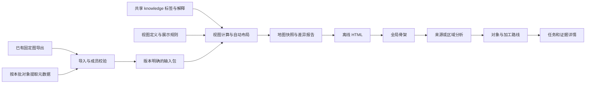

# 架构方案：固定输入、规则计算、逐层阅读

日期：2026-09-07。状态：待实现。范围以[本批入口](README.md)为准。

## 1. 核心决定

**本批采用构建期计算、离线快照消费。** 图提供已发布的任务—表关系，元数据补对象类型与原生说明，knowledge 提供有依据的分类与解释，视图配置决定这次怎样分组和呈现。前端只消费计算结果。

“用图”与“用快照”不是二选一：图是关系查询／导出的上游，地图快照是本次阅读的固定结果。图本身仍是 Facts 等正式产物的可重建投影，不成为事实源。

### 已定取舍

| 问题                   | 本批选择                   | 原因                                                           |
| ---------------------- | -------------------------- | -------------------------------------------------------------- |
| 每次点击查图还是先构建 | 先构建有限的分析视图与索引 | 同一页面版本一致、能离线复现、避免切换到最新图后解释过期       |
| 首次是否必须连接 Neo4j | 否，导入现存固定导出       | 这批输入已足以验证骨架重算；不把图运行状态变成前置障碍         |
| 是否新建表关系引擎     | 否                         | 重算同任务读—输出集合与视图聚合，不推导 SQL 因果或调度因果     |
| 是否自动发现业务分层   | 否                         | 区域职责、来源系统归属与主路线选择需要知识；自动化负责兑现规则 |
| 是否换绘图库           | 否，沿用 SVG               | 当前需要解决计算和阅读组织；视图规模有界                       |
| 布局                   | 新视图全部规则计算         | 同输入确定、可重跑；不在配置或 knowledge 存节点坐标            |
| 原页面兼容             | 原入口保留，新入口并列     | 可与用户认可的页面对照，避免覆盖基线                           |
| 解释变化               | 按证据依赖判定适用性       | 图更新不应把旧 SQL 解释直接贴到新证据上，也不应一律删掉知识    |

## 2. 现有能力与真实缺口

1. `build.mjs` 已做版本、任务、区域成员、固定 SQL 摘要和部分知识核验，能打包离线 HTML。
2. `content.mjs` 同时承担领域说明、代表链、视图选择和坐标，尚没有独立的可重跑视图计算层。
3. 图导出器位于 `tmp/processing-skeleton/export.mjs`：读取当时 READY 的发布图，读前后核对版本，导出 TASK、PHYSICAL_DATASET 及表层关联。该脚本有 10,000 节点／20,000 边上限，不适合作为十几万对象的正式导出能力。
4. `schema-flows.json`、`schema-summary.json` 是没有版本字段的裸数组。已用 `network.tasks` 重算当前 245 个方向、111 个 schema，成员和数字均匹配；未来仍须每次校验，不能因目录相同就认定同版。
5. 正式图 CLI 的 Neo4j 查询并不普遍支持任意历史版本选择。已有 `--publication-version` 仅用于部分本地 INDEX 命令；本批不承诺浏览器能重新查询任意旧图版本。
6. 源对象分类、表／视图区分、来源主画面分析尚未接入原地图。共享 knowledge 已有一个任务和若干正文的读取实践，不能假定已有通用实体标签服务。

## 3. 输入包与版本

### 3.1 第一批的输入方式

新增显式的 `import` 命令，将旧导出和本批实际需要的证据整理为输入包。输入包放在配置解析后的 `dataRoot/processing-map/inputs/<bundleId>/`，不依赖 `tmp` 永久存在。

导入器只复制明确传入的必要材料并建立清单，不扫描整个 dataRoot。图导出是必需项；元数据缺失可保留 UNKNOWN；原有专题的留存 SQL／摘录需要与对应历史模块一起保存，以继续支持既有阅读。

`bundleId` 由参与导入的规范化清单及文件摘要计算。**相同输入文件字节**在不同导入时间、导入位置或构建机器上得到相同身份。原材料自身包含的 exportedAt、manifestPath 等内容若发生变化，其文件摘要和 inputRevision 可以变化；本批不承诺两次重新导出的“语义相同”材料必有同一个 ID。必须保留 `graphVersion` 与各源材料摘要，不能只给一个自增版本号。

### 3.2 最小版本组成

| 版本               | 描述                                             |
| ------------------ | ------------------------------------------------ |
| graphVersion       | 导出声明的发布图版本；不宣称这是当前线上最新版本 |
| inputRevision      | 实际消费的关系、元数据摘录和证据文件摘要         |
| knowledgeRevision  | 本次消费的结构化分类与解释正文摘要               |
| definitionRevision | 视图配置、阶段规则、筛选参数摘要                 |
| algorithmVersion   | 计算与布局合同版本；影响结果的代码改动须更新     |
| snapshotId         | 上述内容身份合成；与构建机器、构建时间无关       |

对输入包文件进行摘要检查。旧 sidecar 仅作为导入一致性对照，正式计算以 network 任务和表身份重建的索引为准。修改标签后允许沿用同一个输入包重跑，产生新的 knowledgeRevision 和 snapshotId。

### 3.3 更新与旧解释

- 相同图输入、标签变化：重新计算归组与视图，保留原关系及其成员身份。
- 图输入变化：先校验新包，再重算所有本批定义视图；输出新增／消失对象、方向及说明适用性的差异。
- 结构有效、业务说明缺失：显示结构与“待整理”，不阻止构建。
- 证据摘要失配：该解释标为 `STALE` 或留在有独立历史版本标识的旧案例中；不得当成当前已验证说明。
- 文件损坏、身份冲突、成员不匹配：失败且不覆盖上次完整产物。
- 旧本金与未迁移视图仅在其原始输入版本匹配时通过兼容层挂接；不在新图版本下强行显示旧成员。仍可通过独立的历史参考入口阅读，需显示其版本。

关系输入与旧专题附件分别验证。一般新图导入不要求旧 SQL／本金摘录；本次旧基线的兼容验收必须带齐。新输入需要历史专题时，build 显式传入一个独立 `--legacy-input` 包，按该包自己的图版本／摘要构建历史材料，再由兼容层判断能否并入当前视图；不以旧 `content.mjs` 的固定版本闸拒绝新结构。

## 4. 关系、身份与数字

### 4.1 可以计算什么

对一个任务，输入 schema 集合与输出关联 schema 集合的笛卡尔积，形成该任务的 schema 共现方向；每个方向内部按 taskId 去重。区域成员按图中 datasetId 去重。区域的读取任务和输出关联任务各自做集合并集。

可视边可以包含多个 schema 方向。每个方向保留独立成员；需要联合数量时使用任务集合并集，并标明“去重任务”。`484 / 30` 这类原有分项不能改成直接相加后的数字。

### 4.2 不能升级的语义

当前旧导出的 `WRITES_TABLE.detail` 没有完整 `outputQualification`，其中不少 writeObservationId 对应 platform-target。统一用“输出关联”；只有存在额外明确证据的案例才进一步说明 SQL 写入、目标配置或文件导出。

schema 方向仅表示同一任务读某区域且有另一区域输出关联，不能表示每个输入对每个输出都存在字段因果。调度邻居不加入本地图的数据关联。

当前原始表关联边数为 12,256；任务输入输出去重后的关联数为 8,960。二者计量单位不同，不互相替代。

### 4.3 物理身份与元数据匹配

图中 datasetId 为成员主键。schema 和完整表名用于显示与检索，不按末段表名合并身份。

元数据匹配结果分为 `EXACT`、`CANDIDATE`、`MISSING`：能以已有稳定标识或来源范围＋完整名称唯一绑定，才可作为该对象的直接事实；仅同名或多候选时保留候选及来源范围。不同时间的元数据与历史图并存须显示材料时间，不能伪装成同一时刻的状态。

对象类型仅取受支持的元数据／DDL 证据，值为 `TABLE`、`VIEW`、`UNKNOWN`。`PHYSICAL_DATASET` 节点名不等于已经证实是物理表，`v_` 前缀也不等于 VIEW。

## 5. knowledge 与视图配置

### 5.1 唯一维护位置

新增本批最小的共享目录 `dataRoot/knowledge/catalogs/titans-otc/`，保存标签词表、schema／对象分类、区域说明和来源分析结论。复用现有 dataRoot 解析；不建立仓库内另一套业务 knowledge，不迁移或改写既有 `tasks/107491` 合同。

结构化 JSON 供计算与查询，Markdown 供长解释。标签和判断需要对象绑定、适用范围、依据及状态。AI 注释可以作为初步分类材料，按证据一致性评估；不因 AI 来源要求额外人工批准。

### 5.2 分开保存

| 内容                                                                      | 归属               |
| ------------------------------------------------------------------------- | ------------------ |
| schema、原生对象类型、字段注释、输入输出关联                              | 源事实／元数据摘录 |
| 来源系统、业务对象、产品范围、数据角色、加工职责及解释                    | 共享 knowledge     |
| 本视图的分组维度、区域 selector、阶段顺序、主路线选择、展开目标、视图上限 | 仓库里的视图定义   |
| 节点坐标、当前分组归属、聚合数量、实际成员                                | 计算结果           |

对象允许多标签。画布在当前分组维度中显示一个主归属：优先使用明确指定的首选分类，否则按词表顺序稳定选择；其他标签保留为交叉筛选。分类集合可以重叠，联合统计仍按对象身份去重。全体未分类对象必须可进入，不得因缺标签消失。

## 6. 页面层级与价值

### 6.1 全局骨架

默认总览保留原有区域职责与五阶段阅读顺序。第一阶段验证 14 节点／18 可视边对应的真实成员与数字，随后来源细化允许配置驱动地改变框数，不能反过来硬凑基线。

全图实际还有未选入主骨架的方向。计算结果同时保留已展示、聚合隐藏、尚未映射的方向及成员；“其他关联／待解释方向”进入主画面的分析入口，不悄悄丢弃，也不把所有连线同时塞进总览。

### 6.2 来源分析页

主画面分成“来源组成—对象类别—消费去向”的关系阅读。可在 schema、业务对象、对象类型维度间切换。类别点击后进入该类成员的主画面页；成员分页或筛选展示，不在画布上一次铺 234 个对象。

具体对象继续展开：本体用途与已知类型、关键字段说明、可见读者／输出关联任务、实际消费区域；任务点开右侧已有详情与证据。来源内部没有定义 SQL 时，显示可见边界，不从采集关系补出源系统内部加工。

需要交付有证据的阅读发现，例如哪些源对象被跨层直接使用、交易与参考数据承担何种不同作用、哪些返回源区域的输出关联需要进一步判定。本批已知 `odata_n_tit → titans_dm` 4 个任务和 `dm_tit → titans_dm` 1 个任务可作为调查入口；它们不是已经证实的实际回写。

### 6.3 odata 区域分析页

`odata` 保持原地址入口，但内容改为区域分析：解释输入来自哪里、有哪些已经有依据的加工职责、产物被哪些主要下游使用。未分类对象单独可见。

原 144134／144141／41540 移入显式“代表加工案例”第二层。保留完整 schema、表与任务类型区别、每段证据性质。144134 的采集目标来自配置；144141 读取 `h15`，同批接续未证实；41540 证明来源标识下的 UNION ALL，不证明去重或业务口径统一。

### 6.4 交互兼容

导航支持完整路径、返回、直达、逐视图缩放和平移状态。主要分析与对象穿透发生在主画面，任务／SQL／证据仍可用侧栏；侧栏开合不重置相机。保留原销售知识正文、固定 SQL 和本金专题入口。

## 7. 自动布局和资源上限

第一版采用 Node 构建期确定布局：阶段规则定列；列内按稳定的分组顺序初始化，再用有限次相邻关联重心排序；相同分数按稳定 ID 打破平局。节点宽高、列距与边通道来自统一样式参数，禁止逐节点坐标补丁。

逆向、跨列与同列关联不能被布局算法删除。对跨层直读和横向支撑安排统一的外侧通道；拥挤时减少当前展开范围或切换关系焦点，不修改某个节点的 x/y。布局质量若仍无法达到基线阅读效果，应交付真实截图和阻塞原因，再评估布局库，不能擅自换 G6。

初始可配置预算：总览 24 节点／40 可视边；来源及区域摘要 36／60；单对象邻域 60／100；成员页每页 30 项；案例 30／50。超出时构建需要明确分组或分页定义，不能生成半张冒充完整的图。

HTML 默认体积预算 12 MiB；只嵌本批范围、索引、精简元数据和需要的 SQL 摘录。体积阈值是产品保护参数，不是性能保证；最终记录实际字节数、最大视图规模与浏览器体验。JSONL 原始全库材料和全投影集合不进入页面。

## 8. 后续扩展边界

本批用 OIS 等本批真实存在的另一个来源检验配置迁移。迁移允许补知识和数据范围，不允许复制算法或新增特定 schema 的前端分支。

任意对象实时展开、全库输入增量索引、正式版本化图导出、十几万任务覆盖是后续工作。届时可把相同视图计算器接到有界服务；若需要历史查询，先核对上游是否保留相应版本，不能只给命令加一个参数就承诺版本一致性。
