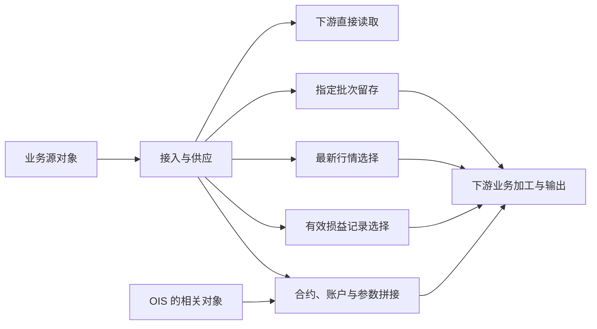

# odata_n_tit：进入仓库的业务数据，怎样变成下游可用的数据

分析日期：2026-09-07。范围为当前加工地图的 3,615 个任务中，与 `odata_n_tit` 有表读写关联的部分。

**这个区域的核心职责，是接入业务源数据，并提供直接读取、指定批次留存、最新行情、有效损益记录和跨来源拼接等不同的数据供给方式。** 内部加工主要改变数据的时间版本、记录选择和组织方式。合约属性补充、证券编码衔接、盈亏汇总等进一步加工，可以在下游看到。

这意味着穿透首屏首先要回答：这里接进了哪些业务对象，下游为什么能从这里拿到不同版本的数据，各种结果分别流向哪里。区域内部存在多条并行路径，不能画成所有数据都依次经过“采集 → 批次整理 → 来源合并”。

## 一、先看整个区域

本图有 **411 张区域表**。按任务与区域的读写关系，涉及 576 个接入任务、69 个内部处理任务、521 个外部读取任务，三组任务互不重复。

576 个接入任务写入 361 张表，69 个内部任务写入 44 张表，两者有 1 张重合；另外 7 张表在本图中没有写入任务关联。因此，411 张表的构成为 **360 张仅接入写入 + 43 张仅内部加工写入 + 1 张两者都写入 + 7 张本图未关联写入**。

按“向下游提供什么”组织，可以分为以下五部分。这里的分支是本次依据 SQL 和读写关系形成的职责解释，尚不能等同于业务部门认可的正式职责划分。

| 部分 | 接收什么 | 这里实际改变什么 | 提供什么 | 完整范围 |
| --- | --- | --- | --- | --- |
| 业务源数据接入与直接供应 | 合约、交易、持仓、资金、保证金、证券及参考信息等源对象 | 将源对象接入仓库；具体字段转换需看对应任务 | 区域中的源数据表，供下游直接读取或继续整理 | 576 个任务、361 张目标表 |
| 按日期保留指定批次的数据 | 指定批次的合约、持仓、账户、估值及参考数据 | 选择输入批次，保存批次标识和日期分区 | 下游可按日期、批次选取的版本 | 54 个任务、37 张目标表 |
| 按标的与报价日保留最新行情 | 新采集行情及已有行情记录 | 按标的和报价日，选择采集时间最新的一条 | 每个标的、每个报价日保留一条行情记录 | 4 个任务、1 张目标表 |
| 按合约与账簿选择有效损益记录 | 已有或新采集的损益结果 | 排除晚于目标日的记录，再选择每个合约、账簿下日期最新的一条 | 供后续盈亏加工读取的损益记录 | 5 个任务、2 张目标表 |
| 合约、账户与参数的跨来源拼接 | Titans、OIS 及区域内不同对象的记录 | 对齐列、填充缺省值、添加标记并追加记录 | 四类合并后的合约、账户或参数结果 | 6 个任务、4 张目标表 |

五部分完整覆盖 645 个区域写入任务，其中后四部分完整覆盖 69 个内部任务。目标表和下游消费者可能重合，不能把各部分的表数或消费者数直接相加。

上图表达职责关系。具体物理读写还包括已有结果的回读和临时表中转，不表示每条数据都会走过所有分支。

**区域整体最重要的事实是：521 个外部读取任务中，474 个没有读取上述 44 张内部加工目标表，47 个至少读取了其中一张。** 因此，解释区域时必须同时讲清直接供给和局部整理。只讲内部加工，会遗漏这里的大部分可见消费关系；这一统计也不意味着那 474 个任务在下游没有自己的加工。

## 二、业务源数据接入与直接供应

576 个接入任务中，574 个的输入来自 13 个 `titans_*` schema，另有 `management`、`marketrisk` 各 1 个任务。OIS 还通过后面的来源拼接进入区域。

当前证据能识别出以下业务内容：合约与交易要素；TRS 等对象的持仓和估值；资金账户余额与保证金结果；证券、产品和参考属性；组织、用户及流程相关对象。其中，资金和保证金对象能看到余额、可用金额、冻结金额、保证金比例等实际字段。这些内容帮助理解区域装了什么；本轮没有把 361 张接入目标逐一认定为一套完整的业务分类。

接入关系最多的来源为 `titans_dm`：484 个任务涉及 213 张来源表、290 张区域目标表；`titans_refdata` 为 30 个任务、16 张来源表、22 张区域目标表。完整的 15 个来源 schema 范围见证据索引。

一个源对象可以对应多个接入任务，也可能形成多个区域表。361 张接入目标中，184 张关联不止一个接入任务。因此，576 既不是业务对象数量，也不能直接解释成 576 个不同业务场景。

**对读者的价值：** 找到所需业务对象最初在哪里进入仓库，以及它是否另有按日期、批次整理的版本。接入任务类别和表关系可以证明路径；不能据此认定所有字段都是原样复制。

## 三、按日期保留指定批次的数据

54 个任务覆盖 37 张结果表，涉及合约、交易、持仓、估值、账户、保证金以及参考数据。它们共同完成的是：从输入中选定一个批次，把批次标识和日期一起保存在结果分区中。

例如，输入表里的 `busi_date='h15'` 在这里是批次标识；写入结果时，它进入 `grp_id`，另行提供日期作为结果的 `busi_date`。因此，相同名称的 `busi_date` 在两端不一定表达同一种时间。见 [批次与日期的写入 SQL](/E:/02_area/股衍数据-数据cookbook/sql-static-lineage-data/tasks/hiveTask/144141/sql/query.sql:1)。这条 SQL 是共同规则的证据入口，分支范围仍是全部 54 个任务。

日期的来源也不完全一致：49 个保留的 SQL 使用日期字面量；5 个从记录的 `src_busi_date` 或 `create_time` 派生日期。字面量可能来自模板展开，不能直接当成长期固定配置，也不能把所有结果分区都解释成同一个业务日口径。见 [源记录日期派生](/E:/02_area/股衍数据-数据cookbook/sql-static-lineage-data/tasks/hiveTask/198710/sql/query.sql:9)。

核查这 54 个任务后，没有发现通过 JOIN、UNION、聚合或窗口排序形成新的组合结果。该部分能够确认的主要作用，是批次选择和日期组织。

**下游确实在利用这种组织方式。** 37 张结果中有 24 张在本图里存在区域外读者，共 35 个任务；其 SQL 能看到对 `grp_id` 的选择。例如，合约读取选择 `h15`，证券参考数据读取选择 `exchange_titans_to_sps`，另有持仓消费选择 `h22`、`h23` 或 `h1730`。这些是实际过滤值，标签本身不能证明任务的执行时刻。

对应证据：[合约版本选择](/E:/02_area/股衍数据-数据cookbook/sql-static-lineage-data/tasks/hiveTask-2.0/160830/sql/query.sql:72)、[参考数据版本选择](/E:/02_area/股衍数据-数据cookbook/sql-static-lineage-data/tasks/hiveTask-2.0/152124/sql/query.sql:27)、[持仓版本选择](/E:/02_area/股衍数据-数据cookbook/sql-static-lineage-data/tasks/sparkIndex/218455/sql/query.sql:83)。

**对读者的价值：** 当两份合约、余额或持仓数据看起来不一致时，先能辨别它们是否取了不同批次或不同日期口径。这里解决的是“取哪一版数据”，并未证明完成统一业务口径。

## 四、按标的与报价日保留最新行情

4 个任务共同写入 `d_mkt_ins_daily_info`。SQL 将新采集批次与已有结果追加到一起，以 **`key_instrument_id + 报价日期`** 分组，按 `data_time` 倒序保留第一条。

这表达的是“同一标的、同一报价日，保留采集时间最新的记录”。报价日仍是分组的一部分，历史报价日的记录可以并存。见 [行情选择规则](/E:/02_area/股衍数据-数据cookbook/sql-static-lineage-data/tasks/hiveTask-2.0/143404/sql/query.sql:49)。若排序时间相同，当前排序条件未给出进一步的取舍依据。

本图有 7 个外部任务读取该结果，写向 `pdata_news_n.tyzx_exch_quot_h` 或 `pdata_news_n.tyzx_exch_quot_h_fk`。其中已核查的报价加工还通过证券基础信息衔接证券编码。见 [下游证券编码关联](/E:/02_area/股衍数据-数据cookbook/sql-static-lineage-data/tasks/hiveTask-2.0/144765/sql/query.sql:53)。

**对读者的价值：** 知道报价记录为什么留下这一条，以及随后在哪里衔接到证券报价对象。本区进行记录选择；进一步的证券编码加工发生在下游。

## 五、按合约与账簿选择有效损益记录

5 个任务覆盖 `d_v_risk_plreport_contract` 和 `d_v_risk_plreport_contract_pb` 两张结果表。共同规则是：先限定目标日期及记录的日期上界，再按 **`internal_reference + book`** 分组，以 `src_busi_date` 倒序选择第一条。

这里所说的“有效”，仅指满足 SQL 日期条件的候选记录。该词不代表损益金额经过业务验收。这些任务主要筛选已有损益结果；SQL 中的记录选择不能解释成一套损益计算公式。见 [日期约束与选择规则](/E:/02_area/股衍数据-数据cookbook/sql-static-lineage-data/tasks/hiveTask/200585/sql/query.sql:109)。

其中任务 `244357` 虽然输出表名以 `_pb` 结尾，却同时处理新批次、已有结果、日期约束和按合约账簿取最新的逻辑，所以应归入损益记录选择。仅按表后缀分组会掩盖它的实际职责。见 [该任务的候选记录与过滤](/E:/02_area/股衍数据-数据cookbook/sql-static-lineage-data/tasks/hiveTask/244357/sql/query.sql:164)。

本图有 4 个外部读取任务，其中 3 个写向 `pdata_n.t98_otc_opt_inr_comp_pal_sum`，另 1 个输出到 `public` 下的同类结果表。核查的下游 SQL 还存在日期窗口、代码映射等进一步加工。

**对读者的价值：** 能解释合约盈亏加工所用的源记录，如何从多个日期或版本的候选记录中被选出来。源记录的选择日期、下游采用的日期窗口，需要分别看。

## 六、合约、账户与参数的跨来源拼接

6 个任务覆盖以下全部 4 张结果表。共同处理包括列对齐、缺省值填充、来源或业务标记以及 `UNION ALL` 追加。

| 结果表 | 拼接内容 | 本图中的后续使用 |
| --- | --- | --- |
| `otc_o_margin_parameter` | 区域内保证金参数与 OIS 保证金参数 | 未见读取任务 |
| `otc_o_margin_account` | 区域内保证金账户与 OIS 保证金账户 | 未见读取任务 |
| `otc_o_otc_trs` | 区域内 TRS 结果与 OIS TRS 多空结果 | 任务 42142 输出到 `gfval.src_otc_trs` |
| `otc_o_option_parameter` | 区域内 TRS 参数与零售期权参数 | 未见读取任务 |

**能够确认的是结果放到了一起，业务口径统一与跨来源去重尚未被证明。** `UNION ALL` 会保留各输入的记录，仅靠相似列名和同一输出表无法确认对象一一对应。

还有一处应保留的具体疑点：期权参数拼接把其中一支标为 `sys_area_code='otc'`，但这一支读取的 `d_v_retail_option_param`，接入 SQL 实际来自 `titans_dm.v_retail_option_param`。因此，该标记不能直接用作物理来源系统说明；它可能表达另一种业务区分，含义需要另行核实。见 [拼接标记](/E:/02_area/股衍数据-数据cookbook/sql-static-lineage-data/tasks/hiveTask-2.0/41831/sql/query.sql:353)、[实际接入来源](/E:/02_area/股衍数据-数据cookbook/sql-static-lineage-data/tasks/oracle2hive/75089/sql/query.sql:65)。

**对读者的价值：** 找到跨来源比较、汇集的结果入口，同时知道哪些差异没有被消除。三张表在本图中没有读者，只能描述当前范围内的可见性，不能断言无人使用；对已有读者的 TRS 结果，可继续查看 [下游输出 SQL](/E:/02_area/股衍数据-数据cookbook/sql-static-lineage-data/tasks/hive2oracle/42142/sql/query.sql:37)。

## 七、把各部分放回下游全貌

区域整体的主要可见方向如下。任务数按“同一任务读取本区、写入目标区域”统计，跨目标任务可能重复计数；关系表示同任务共现，不能当作每个输入字段都流向每个输出。

| 目标区域 | 关联任务数 | 目前能说清的关系 |
| --- | ---: | --- |
| `pdata_n` | 212 | 承接多类业务对象；已核查到合约属性补充、盈亏结果加工 |
| `dm_hk_n` | 103 | 存在大量应用侧加工与输出；本轮未逐项判定所有输出的业务职责 |
| `pdata_news_n` | 72 | 承接证券及行情相关对象；最新行情分支接入这里的报价加工 |
| `pdata_nds` | 66 | 承接合约、持仓、证券参考等对象；指定版本的消费关系在这里可见 |
| 其他方向 | 见完整索引 | 包括 `dm_fii_n`、`dm_otc_n`、`gfval`、`public` 等 |

这些下游任务同时从其他区域读取什么，可能影响最终结果。区域首屏应先解释上述分工，进入具体分支后再展示完整的相关输入、输出和消费者。

## 八、穿透页面应该先让人看懂什么

建议首屏标题围绕“业务源数据如何供下游使用”，先呈现区域职责、接入内容、五部分关系和主要下游方向。分支入口使用上面的用途名称，并明确每一支涉及的完整范围。

进入一个分支后，沿用同一个阅读顺序：**输入对象 → 改变了什么 → 结果对象及其时间或记录粒度 → 下游使用 → 全部表与任务 → SQL 证据**。证据 SQL 用于解释规则；分支本身始终覆盖全部成员，不能被一两个演示链条替代。

这份分析已经能支撑区域与分支两层的内容组织。它没有把区域内每张表都完成业务释义；接入对象的完整业务分类、部分输出的实际消费者，以及来源标记的业务含义，仍需要按具体对象补充。

## 证据范围与复核入口

- 结构基线来自现有 `table-network.json`：3,615 个任务，图发布时间为 2026-09-05；69 个内部任务的保留 SQL 均已读取，并按上述共同规则和差异核查。576 个接入任务的范围来自图中的读写关系，其本地 SQL 文件均存在；接入字段语义和 521 个消费者的全部业务逻辑未逐项审阅。
- SQL 证据来自当前保留的 Input Pack，不同任务保留的日期和宏展开状态不同。它们没有逐项与该历史图版本的原始 SQL 做同一性确认，也不构成当前生产运行结果证明。
- 图中的输入列表未完整表现行情、损益任务对已有结果的回读；两张损益临时表虽在图中未关联写入任务，SQL 中能看到写入。不能把“本图无生产者”直接当成“已确认源表”。
- 411 张表中有 84 张在本图里没有读取任务。这是范围内的结构观察，不能解释成资产无用或应删除。

[完整成员与证据索引](/E:/02_area/股衍数据-数据cookbook/sql-static-lineage/docs/processing-map/odata-region-analysis-evidence.json) 包含：三种任务角色的完整 ID 集合、五部分全部成员及输入输出表、411 张表的读写关联、各来源与下游的完整任务集合，以及 116 份用于内部加工、版本消费和相关来源核查的 SQL 路径与摘要值。索引不复制原始 SQL 或连接配置。
