# PDATA 输出节点定位与整体图修正

## 1. 范围、证据与覆盖摘要

本文作为定位底稿和核对附录，承接上一轮 PDATA 导读和销售说明；新人阅读仍以上一轮导读为正文。本文只登记固定输出成员、定位依据、解释覆盖及本轮有界修正。范围来自 [固定表网络](E:/02_area/股衍数据-数据cookbook/sql-static-lineage/tmp/processing-skeleton/table-network.json)，业务解释复用 [第一轮报告](E:/02_area/股衍数据-数据cookbook/sql-static-lineage/docs/processing-map/pdata调研v1.md)。

- 固定网络版本：`4f61cee7134b1cba7686191bc0e8606ab28cc4d673935a50298e7ba792babf9a`；发布时间：`2026-09-05T11:36:23.083000000Z`。页面说明版本：`2026-09-07T08:11:21.199Z`。
- pdata_n 可见节点 284 个：本批有写入关联 132 个、只读 151 个、无读写 1 个；关联写入任务去重 263 个。本轮不将 pdata_news_n、pdata_nds 加入这个集合。
- 固定输出以 table 名称和网络节点身份逐项核对；同表多任务仍为一行。网络均标记 PHYSICAL_DATASET，这是网络元数据标签，不是本轮重新确认的物理身份。
- 只读边界中，31 个被本批输出关联任务读取，120 个仅被其他消费任务读取；前者仍含任务内临时阶段和未解析对象。无读写节点为 pdata_n.t99_idx_rela_h。

定位状态：**已有依据**表示已有对象／加工／消费证据足以支持本文给出的具体位置；**暂定**表示主要依据仍是注释、任务元数据或旧页面分组；**仍待解释**表示这些材料也不足以确定位置。状态不等于唯一性、运行或业务验收状态。

解释覆盖单列：**关键写入已解释**只限列明任务及本文说明的阶段；**对象／消费已解释**可支持定位，但不表示生产写入已分析。未解释任务逐项列出。已有依据的记录也可保留未解释分支。

证据层级：**A**＝复用第一轮或上一轮已读 SQL 解释；**Q**＝本轮选定问题的留存 SQL；**M**＝页面保存的表注释／DDL 元数据；**N**＝固定网络的读写关联。每行完整列出 N 层写入任务；任务链接定位到页面采用的留存证据，未阅读的链接不被当成已验证 SQL 结论。

最终定位：**已有依据 42 个，暂定 90 个，仍待解释 0 个**。这只是位置的证据状态；暂定项的生产职责仍未解释。初步为33／98／1，本轮复用既有消费证据并补读五个问题，将9个暂定或待解释节点升级，220154所在节点保留暂定。

已有关键写入阶段解释的节点 26 个；仅对象或消费证据支持定位的节点 16 个。这些类别不表示整表所有字段和来源已核。

版本处理：A层直接引用第一轮报告；Q层引用页面相同文件名的留存v3。只核本轮新增10项写入query与页面保存hash相符；消费者118141／118143沿用上一轮核过的留存版本。230202的固定v2缺失，补充v3另行注明，见Q5。

交付核对：132个节点名称与固定节点身份一一对应，无遗漏或重复；各行写入关联与固定网络逐项相符；9个分组成员索引与表中路线一致；267个本地引用入口均可定位。此核对不等于132项加工语义已验证。

### 整体图位置与成员索引

路线可以重叠。下列成员编号可回到唯一的输出节点行；代码与 Mermaid 聚合节点一致。

| 代码与路线 | 成员数 | 输出行编号 | 成员解释范围 |
|---|---:|---|---|
| **A 主体与组织共享基础** | 16 | [006](#out-006)、[007](#out-007)、[008](#out-008)、[009](#out-009)、[010](#out-010)、[011](#out-011)、[012](#out-012)、[013](#out-013)、[014](#out-014)、[015](#out-015)、[016](#out-016)、[025](#out-025)、[067](#out-067)、[068](#out-068)、[086](#out-086)、[087](#out-087) | 客户、交易对手、身份属性和内部机构；实际消费范围依证据列，未逐表承诺跨路线使用。 |
| **B 对象与关系共享基础** | 45 | [003](#out-003)、[017](#out-017)、[018](#out-018)、[019](#out-019)、[021](#out-021)、[022](#out-022)、[023](#out-023)、[024](#out-024)、[025](#out-025)、[026](#out-026)、[027](#out-027)、[033](#out-033)、[034](#out-034)、[035](#out-035)、[036](#out-036)、[037](#out-037)、[039](#out-039)、[040](#out-040)、[042](#out-042)、[043](#out-043)、[044](#out-044)、[045](#out-045)、[046](#out-046)、[047](#out-047)、[048](#out-048)、[049](#out-049)、[050](#out-050)、[051](#out-051)、[052](#out-052)、[053](#out-053)、[056](#out-056)、[057](#out-057)、[058](#out-058)、[059](#out-059)、[060](#out-060)、[061](#out-061)、[063](#out-063)、[064](#out-064)、[092](#out-092)、[099](#out-099)、[109](#out-109)、[115](#out-115)、[118](#out-118)、[121](#out-121)、[124](#out-124) | 协议、合约、腿、子交易、账簿、组合及关系；关系类型与有效期需按分支解释。 |
| **S 销售、归属与按日信息** | 6 | [020](#out-020)、[024](#out-024)、[094](#out-094)、[100](#out-100)、[101](#out-101)、[108](#out-108) | 销售合约基础、管理归属、按日金额，以及有依据的销售关系结果。 |
| **P 销售经营参数** | 2 | [126](#out-126)、[127](#out-127) | 销售消费实际读取的基础系数、价差系数；不代表所有来源生产分支已解释。 |
| **R 持仓、定价与风险结果** | 30 | [030](#out-030)、[034](#out-034)、[035](#out-035)、[036](#out-036)、[040](#out-040)、[055](#out-055)、[062](#out-062)、[090](#out-090)、[091](#out-091)、[093](#out-093)、[095](#out-095)、[098](#out-098)、[102](#out-102)、[103](#out-103)、[104](#out-104)、[105](#out-105)、[106](#out-106)、[107](#out-107)、[110](#out-110)、[111](#out-111)、[112](#out-112)、[113](#out-113)、[114](#out-114)、[115](#out-115)、[116](#out-116)、[117](#out-117)、[122](#out-122)、[123](#out-123)、[125](#out-125)、[129](#out-129) | 持仓、定价、估值、盈亏、集中度、限额及相关结果。 |
| **L 账户、履保与存续事件** | 32 | [005](#out-005)、[018](#out-018)、[021](#out-021)、[026](#out-026)、[028](#out-028)、[029](#out-029)、[031](#out-031)、[032](#out-032)、[033](#out-033)、[037](#out-037)、[038](#out-038)、[041](#out-041)、[042](#out-042)、[054](#out-054)、[056](#out-056)、[065](#out-065)、[066](#out-066)、[071](#out-071)、[073](#out-073)、[074](#out-074)、[075](#out-075)、[076](#out-076)、[077](#out-077)、[078](#out-078)、[079](#out-079)、[080](#out-080)、[093](#out-093)、[096](#out-096)、[097](#out-097)、[098](#out-098)、[103](#out-103)、[108](#out-108) | 账户、余额、履保参数与结果、资金及合约存续事件；内部保持对象区别。 |
| **F 财务与报备材料** | 6 | [072](#out-072)、[083](#out-083)、[084](#out-084)、[085](#out-085)、[119](#out-119)、[120](#out-120) | 财务合约与事件、报备状态及材料；不推断已完成报送。 |
| **C 公共规则配置** | 5 | [001](#out-001)、[002](#out-002)、[030](#out-030)、[128](#out-128)、[129](#out-129) | 代码、精度和指标定义等参考资料；具体复用关系按已读证据。 |
| **W 权限、流程与外围记录** | 11 | [004](#out-004)、[069](#out-069)、[070](#out-070)、[081](#out-081)、[082](#out-082)、[086](#out-086)、[088](#out-088)、[089](#out-089)、[130](#out-130)、[131](#out-131)、[132](#out-132) | 系统功能、用户权限、流程日志，以及两项非 OTC 主线客户补全。 |

## 2. 完整输出节点定位表

表名均保留 pdata_n。加工职责中明确写“未核”的记录，不被算作 SQL 已解释。证据链接中的未解释任务仅用于后续定位。

| 输出节点名称 | 业务含义 | 加工职责 | 整体图位置 | 判断依据 | 解释覆盖 | 定位状态 | 主要疑点 |
|---|---|---|---|---|---|---|---|
| 001 `pdata_n.ref_dw_cd_val` | 仓库代码取值及描述；在保证金结果中补履保状态说明 | 176877 读取 CD719 的代码与描述并按状态代码匹配；142305 的生产规则未读 | [C 公共规则配置](#route-c) | Q：§3 Q3（任务及query行号见该问题）；N 写入：[142305][ev-142305] | 生产写入未展开；未解释写入：142305 | 已有依据 | 已确认该消费，不将全部代码集或35个读取任务都视为已解释 |
| 002 `pdata_n.ref_dw_cd_val_h` | 注释称“仓库代码取值历史”；对象范围暂据此定位 | 尚未核实实际处理；仅登记现有写入关联，不由名称推断转换、汇总或历史维护 | [C 公共规则配置](#route-c) | M：[页面注释及旧分组][meta]（仅暂定）；N 写入：[212728][ev-212728] | 生产写入未展开；未解释写入：212728 | 暂定 |  |
| 003 `pdata_n.t00_otc_deri_prd_pool_adtnl_info` | 注释称“场外衍生品产品池附加信息”；对象范围暂据此定位 | 尚未核实实际处理；仅登记现有写入关联，不由名称推断转换、汇总或历史维护 | [B 对象与关系共享基础](#route-b) | M：[页面注释及旧分组][meta]（仅暂定）；N 写入：[208592][ev-208592] | 生产写入未展开；未解释写入：208592 | 暂定 |  |
| 004 `pdata_n.t00_sys_func_info` | 注释称“系统功能信息”；对象范围暂据此定位 | 尚未核实实际处理；仅登记现有写入关联，不由名称推断转换、汇总或历史维护 | [W 权限、流程与外围记录](#route-w) | M：[页面注释及旧分组][meta]（仅暂定）；N 写入：[242362][ev-242362] | 生产写入未展开；未解释写入：242362 | 暂定 |  |
| 005 `pdata_n.t01_cutp_perf_marg_plan_info` | 注释称“交易对手履保方案信息”；对象范围暂据此定位 | 尚未核实实际处理；仅登记现有写入关联，不由名称推断转换、汇总或历史维护 | [L 账户、履保与存续事件](#route-l) | M：[页面注释及旧分组][meta]（仅暂定）；N 写入：[200060][ev-200060] | 生产写入未展开；未解释写入：200060 | 暂定 |  |
| 006 `pdata_n.t01_indv` | 注释称“个人”；对象范围暂据此定位 | 尚未核实实际处理；仅登记现有写入关联，不由名称推断转换、汇总或历史维护 | [A 主体与组织共享基础](#route-a) | M：[页面注释及旧分组][meta]（仅暂定）；N 写入：[104298][ev-104298]、[105075][ev-105075] | 生产写入未展开；未解释写入：104298、105075 | 暂定 | 个人主体与客户角色的边界、两来源合并规则未核。 |
| 007 `pdata_n.t01_otc_deri_cust` | 注释称“OTC衍生品客户”；对象范围暂据此定位 | 尚未核实实际处理；仅登记现有写入关联，不由名称推断转换、汇总或历史维护 | [A 主体与组织共享基础](#route-a) | M：[页面注释及旧分组][meta]（仅暂定）；N 写入：[150757][ev-150757] | 生产写入未展开；未解释写入：150757 | 暂定 | OTC 客户与 T01_PTY_CUTP 的对象范围和编号关系未核。 |
| 008 `pdata_n.t01_pty` | 主体身份；是多个业务对象关联参与方的入口 | 第一轮已解释主体身份与客户编号区别；逐项写入规则未展开 | [A 主体与组织共享基础](#route-a) | A：[第一轮 L119](E:/02_area/股衍数据-数据cookbook/sql-static-lineage/docs/processing-map/pdata调研v1.md:119)；N 写入：[76984][ev-76984]、[77078][ev-77078] | 生产写入未展开；未解释写入：76984、77078 | 已有依据 | 不能直接认定跨系统唯一法律主体 |
| 009 `pdata_n.t01_pty_cutp` | 交易对手角色及其属性 | 第一轮已解释角色与主体的区别；各来源转换规则未展开 | [A 主体与组织共享基础](#route-a) | A：[第一轮 L119](E:/02_area/股衍数据-数据cookbook/sql-static-lineage/docs/processing-map/pdata调研v1.md:119)；N 写入：[105379][ev-105379]、[105518][ev-105518] | 生产写入未展开；未解释写入：105379、105518 | 已有依据 |  |
| 010 `pdata_n.t01_pty_idty_info` | 主体证件及其他鉴别属性 | 第一轮已解释属性拆分；本写入的筛选规则未展开 | [A 主体与组织共享基础](#route-a) | A：[第一轮 L119](E:/02_area/股衍数据-数据cookbook/sql-static-lineage/docs/processing-map/pdata调研v1.md:119)；N 写入：[219164][ev-219164] | 生产写入未展开；未解释写入：219164 | 已有依据 | 一主体可能有多种鉴别信息 |
| 011 `pdata_n.t01_pty_imp_lkman` | 注释称“当事人重要联系人”；对象范围暂据此定位 | 尚未核实实际处理；仅登记现有写入关联，不由名称推断转换、汇总或历史维护 | [A 主体与组织共享基础](#route-a) | M：[页面注释及旧分组][meta]（仅暂定）；N 写入：[150755][ev-150755] | 生产写入未展开；未解释写入：150755 | 暂定 |  |
| 012 `pdata_n.t01_pty_name` | 主体名称属性 | 第一轮已解释名称独立保存及整合用途；来源分支未逐项解释 | [A 主体与组织共享基础](#route-a) | A：[第一轮 L119](E:/02_area/股衍数据-数据cookbook/sql-static-lineage/docs/processing-map/pdata调研v1.md:119)；N 写入：[104299][ev-104299]、[105076][ev-105076] | 生产写入未展开；未解释写入：104299、105076 | 已有依据 | 一主体多种名称的选择规则尚未解释 |
| 013 `pdata_n.t01_pty_rat` | 主体评级属性，需区分评级类型与日期 | 第一轮已解释评级属性的对象与时间区别；写入规则未逐项解释 | [A 主体与组织共享基础](#route-a) | A：[第一轮 L119](E:/02_area/股衍数据-数据cookbook/sql-static-lineage/docs/processing-map/pdata调研v1.md:119)；N 写入：[104300][ev-104300]、[105077][ev-105077] | 生产写入未展开；未解释写入：104300、105077 | 已有依据 | 不能按主体号单独认定唯一 |
| 014 `pdata_n.t01_pty_rela_h` | 注释称“当事人关系历史”；对象范围暂据此定位 | 尚未核实实际处理；仅登记现有写入关联，不由名称推断转换、汇总或历史维护 | [A 主体与组织共享基础](#route-a) | M：[页面注释及旧分组][meta]（仅暂定）；N 写入：[105079][ev-105079] | 生产写入未展开；未解释写入：105079 | 暂定 | 需区分两端主体、关系类型和有效区间。 |
| 015 `pdata_n.t01_pty_stati_info_h` | 注释称“交易参数-交易对手”；对象范围暂据此定位 | 尚未核实实际处理；仅登记现有写入关联，不由名称推断转换、汇总或历史维护 | [A 主体与组织共享基础](#route-a) | M：[页面注释及旧分组][meta]（仅暂定）；N 写入：[114423][ev-114423] | 生产写入未展开；未解释写入：114423 | 暂定 | 注释为交易对手参数；统计属性、状态及有效历史的实际边界未核。 |
| 016 `pdata_n.t01_same_pty_rela_adtnl_info` | 注释称“同一当事人关系附加信息”；对象范围暂据此定位 | 尚未核实实际处理；仅登记现有写入关联，不由名称推断转换、汇总或历史维护 | [A 主体与组织共享基础](#route-a) | M：[页面注释及旧分组][meta]（仅暂定）；N 写入：[150759][ev-150759] | 生产写入未展开；未解释写入：150759 | 暂定 | 同一主体映射的标识与匹配规则未核，不能视为已经去重的法律主体。 |
| 017 `pdata_n.t03_agt` | 协议模型承载合约、资金账户、保证金账户、账簿等对象 | 第一轮已确认对象范围并非仅法律合约；各写入标识转换未逐一解释 | [B 对象与关系共享基础](#route-b) | A：[第一轮 L121](E:/02_area/股衍数据-数据cookbook/sql-static-lineage/docs/processing-map/pdata调研v1.md:121)；N 写入：[103928][ev-103928]、[103929][ev-103929]、[103930][ev-103930]、[105053][ev-105053]、[105054][ev-105054]、[105055][ev-105055]、[105381][ev-105381]、[105383][ev-105383]、[105521][ev-105521]、[105522][ev-105522]、[169636][ev-169636]、[183084][ev-183084]、[211541][ev-211541] | 生产写入未展开；未解释写入：103928、103929、103930、105053、105054、105055、105381、105383、105521、105522、169636、183084、211541 | 已有依据 | 需编号、修饰符和来源区分对象；不能整体当法律主协议 |
| 018 `pdata_n.t03_agt_agt_grp_rela_h` | 注释称“协议协议组关系历史”；对象范围暂据此定位 | 尚未核实实际处理；仅登记现有写入关联，不由名称推断转换、汇总或历史维护 | [B 对象与关系共享基础](#route-b)；[L 账户、履保与存续事件](#route-l) | M：[页面注释及旧分组][meta]（仅暂定）；N 写入：[109798][ev-109798]、[109799][ev-109799]、[141600][ev-141600] | 生产写入未展开；未解释写入：109798、109799、141600 | 暂定 | 协议组是否为履保组合、各写入关系端点未核。 |
| 019 `pdata_n.t03_agt_clas_h` | 注释称“协议分类历史”；对象范围暂据此定位 | 尚未核实实际处理；仅登记现有写入关联，不由名称推断转换、汇总或历史维护 | [B 对象与关系共享基础](#route-b) | M：[页面注释及旧分组][meta]（仅暂定）；N 写入：[106676][ev-106676]、[211812][ev-211812] | 生产写入未展开；未解释写入：106676、211812 | 暂定 | 分类维度与各写入适用对象未核。 |
| 020 `pdata_n.t03_agt_div_rati` | 合约介绍关系的分成对象与比例记录 | 134215 从合约介绍关系取人员及比例，匹配交易和人员标识，映射删除标志 | [S 销售、归属与按日信息](#route-s) | Q：§3 Q1（任务及query行号见该问题）；N 写入：[134215][ev-134215] | 关键写入已解释：134215；本批全部关联写入均有关键阶段解释，非逐字段核验 | 已有依据 | 表注释误写结算信息；模型 Agt_Id 与销售 Agt_Id 来源不同；固定网络无读取 |
| 021 `pdata_n.t03_agt_grp` | 注释称“协议组”；对象范围暂据此定位 | 尚未核实实际处理；仅登记现有写入关联，不由名称推断转换、汇总或历史维护 | [B 对象与关系共享基础](#route-b)；[L 账户、履保与存续事件](#route-l) | M：[页面注释及旧分组][meta]（仅暂定）；N 写入：[109800][ev-109800] | 生产写入未展开；未解释写入：109800 | 暂定 | 协议组与履保组合是否同范围未核。 |
| 022 `pdata_n.t03_agt_inr_list_det` | 注释称“协议内部名单明细”；对象范围暂据此定位 | 尚未核实实际处理；仅登记现有写入关联，不由名称推断转换、汇总或历史维护 | [B 对象与关系共享基础](#route-b) | M：[页面注释及旧分组][meta]（仅暂定）；N 写入：[246200][ev-246200] | 生产写入未展开；未解释写入：246200 | 暂定 | 内部名单用途及名单对象范围未核，不直接归为权限或风险控制。 |
| 023 `pdata_n.t03_agt_name_h` | 注释称“协议名称历史”；对象范围暂据此定位 | 尚未核实实际处理；仅登记现有写入关联，不由名称推断转换、汇总或历史维护 | [B 对象与关系共享基础](#route-b) | M：[页面注释及旧分组][meta]（仅暂定）；N 写入：[106674][ev-106674] | 生产写入未展开；未解释写入：106674 | 暂定 | 协议对象范围及名称有效区间未核。 |
| 024 `pdata_n.t03_agt_prd_rela_h` | 协议与产品的有效关系，为日计提费用补模型合约标识 | 124561 按源产品号、关系类型01及本次有效区间接费用记录；生产规则未展开 | [B 对象与关系共享基础](#route-b)；[S 销售、归属与按日信息](#route-s) | Q：§3 Q5（任务及query行号见该问题）；N 写入：[105526][ev-105526] | 生产写入未展开；未解释写入：105526 | 已有依据 | 当前有效关系搭配历史计算日费用；该消费不验证关系表唯一性 |
| 025 `pdata_n.t03_agt_pty_rela_h` | 注释称“协议当事人关系历史”；对象范围暂据此定位 | 尚未核实实际处理；仅登记现有写入关联，不由名称推断转换、汇总或历史维护 | [A 主体与组织共享基础](#route-a)；[B 对象与关系共享基础](#route-b) | M：[页面注释及旧分组][meta]（仅暂定）；N 写入：[105058][ev-105058] | 生产写入未展开；未解释写入：105058 | 暂定 |  |
| 026 `pdata_n.t03_agt_rela_h` | 合约—账户、互换—互换、合约—账簿及账簿—账簿关系历史 | 105529 沿用完整开闭链分析；补读其他三任务的两端对象、关系类型、有效期及比较键 | [B 对象与关系共享基础](#route-b)；[L 账户、履保与存续事件](#route-l) | Q：§3 Q2（任务及query行号见该问题）；N 写入：[105061][ev-105061]、[105063][ev-105063]、[105529][ev-105529]、[108070][ev-108070] | 105529：全阶段沿用首轮；105061、105063、108070：关系端点、比较键及开闭链模式已核；各分支全部异常规则和数据唯一性未核 | 已有依据 | 108070 比较键还含关联账簿；105529 的比较键不能推广到整表 |
| 027 `pdata_n.t03_agt_stati_info_h` | 注释称“协议统计信息历史”；对象范围暂据此定位 | 尚未核实实际处理；仅登记现有写入关联，不由名称推断转换、汇总或历史维护 | [B 对象与关系共享基础](#route-b) | M：[页面注释及旧分组][meta]（仅暂定）；N 写入：[105069][ev-105069]、[105527][ev-105527] | 生产写入未展开；未解释写入：105069、105527 | 暂定 | 统计属性与历史维护规则未核。 |
| 028 `pdata_n.t03_ast_crrc_acct_bal` | 账户业务日余额记录 | 保证金和资金账户分支组织账户 ID、修饰符与源业务日期 | [L 账户、履保与存续事件](#route-l) | A：[第一轮 L130](E:/02_area/股衍数据-数据cookbook/sql-static-lineage/docs/processing-map/pdata调研v1.md:130)；N 写入：[107280][ev-107280]、[107646][ev-107646]、[112620][ev-112620]、[112644][ev-112644] | 关键写入已解释：107280、112620；未解释写入：107646、112644 | 已有依据 | 已读分支币种为空，源 BALANCE 写入 Begn_Bal；不能直接解释为分币种日初余额 |
| 029 `pdata_n.t03_deri_comp_sett_info` | 结算流水中的处理日、清算日、结算事项及应收应付金额 | 134213 读取结算流水，按源合约号补模型合约标识；交易父表匹配清算日 | [L 账户、履保与存续事件](#route-l) | Q：§3 Q1（任务及query行号见该问题）；N 写入：[134213][ev-134213] | 关键写入已解释：134213；本批全部关联写入均有关键阶段解释，非逐字段核验 | 已有依据 | 不是介绍分成；应收应付不直接证明实收实付 |
| 030 `pdata_n.t03_otc_comp_calc_idx_precision_ref` | 注释称“场外合约计算指标精度参数”；对象范围暂据此定位 | 尚未核实实际处理；仅登记现有写入关联，不由名称推断转换、汇总或历史维护 | [C 公共规则配置](#route-c)；[R 持仓、定价与风险结果](#route-r) | M：[页面注释及旧分组][meta]（仅暂定）；N 写入：[139660][ev-139660] | 生产写入未展开；未解释写入：139660 | 暂定 |  |
| 031 `pdata_n.t03_otc_comp_perf_marg_ref` | 注释称“场外合约履保参数”；对象范围暂据此定位 | 尚未核实实际处理；仅登记现有写入关联，不由名称推断转换、汇总或历史维护 | [L 账户、履保与存续事件](#route-l) | M：[页面注释及旧分组][meta]（仅暂定）；N 写入：[105397][ev-105397]、[105946][ev-105946]、[147138][ev-147138] | 生产写入未展开；未解释写入：105397、105946、147138 | 暂定 | 合约／账户／组合参数范围及多来源差异未核。 |
| 032 `pdata_n.t03_otc_cutp_marg_acct_perf_guar_rslt` | 已读写入以组合编号承载履保计算结果 | 普通批／提前批转换源组合履保字段到同一逻辑来源分区 | [L 账户、履保与存续事件](#route-l) | A：[第一轮 L131](E:/02_area/股衍数据-数据cookbook/sql-static-lineage/docs/processing-map/pdata调研v1.md:131)；N 写入：[147139][ev-147139]、[165155][ev-165155] | 关键写入已解释：147139、165155；本批全部关联写入均有关键阶段解释，非逐字段核验 | 已有依据 | 账户和合约字段多处为空；最终批次取决于执行覆盖 |
| 033 `pdata_n.t03_otc_deri_agt_agt_grp_rela_adtnl_info` | 账户—组合与合约—组合关系的附加资料 | 176877 用账户—组合映射连接资金，另将合约—组合映射连接证券资料，排除关联后记录数大于一的组合；生产规则未展开 | [B 对象与关系共享基础](#route-b)；[L 账户、履保与存续事件](#route-l) | Q：§3 Q3（任务及query行号见该问题）；N 写入：[141595][ev-141595]、[141596][ev-141596] | 生产写入未展开；未解释写入：141595、141596 | 已有依据 | 已定位消费中的两类关系；COUNT(1) 未按合约去重，重复匹配可能影响排除范围；141595、141596 的生产分支尚未解释 |
| 034 `pdata_n.t03_otc_deri_agt_rela_adtnl_info` | 注释称“场外衍生品账簿协议关系附加信息”；对象范围暂据此定位 | 尚未核实实际处理；仅登记现有写入关联，不由名称推断转换、汇总或历史维护 | [B 对象与关系共享基础](#route-b)；[R 持仓、定价与风险结果](#route-r) | M：[页面注释及旧分组][meta]（仅暂定）；N 写入：[122239][ev-122239] | 生产写入未展开；未解释写入：122239 | 暂定 |  |
| 035 `pdata_n.t03_otc_deri_book_adtnl_info` | 注释称“场外衍生品账簿附加信息”；对象范围暂据此定位 | 尚未核实实际处理；仅登记现有写入关联，不由名称推断转换、汇总或历史维护 | [B 对象与关系共享基础](#route-b)；[R 持仓、定价与风险结果](#route-r) | M：[页面注释及旧分组][meta]（仅暂定）；N 写入：[105382][ev-105382]、[106096][ev-106096]、[144293][ev-144293] | 生产写入未展开；未解释写入：105382、106096、144293 | 暂定 |  |
| 036 `pdata_n.t03_otc_deri_book_agt_map_regu` | 注释称“场外衍生品账簿协议映射规则”；对象范围暂据此定位 | 尚未核实实际处理；仅登记现有写入关联，不由名称推断转换、汇总或历史维护 | [B 对象与关系共享基础](#route-b)；[R 持仓、定价与风险结果](#route-r) | M：[页面注释及旧分组][meta]（仅暂定）；N 写入：[177928][ev-177928]、[211620][ev-211620] | 生产写入未展开；未解释写入：177928、211620 | 暂定 | 账簿映射规则不能直接当作已生效的合约—账簿关系。 |
| 037 `pdata_n.t03_otc_deri_comp_comb_adtnl_info` | 注释称“场外衍生品合约组合附加信息”；对象范围暂据此定位 | 尚未核实实际处理；仅登记现有写入关联，不由名称推断转换、汇总或历史维护 | [B 对象与关系共享基础](#route-b)；[L 账户、履保与存续事件](#route-l) | M：[页面注释及旧分组][meta]（仅暂定）；N 写入：[142888][ev-142888] | 生产写入未展开；未解释写入：142888 | 暂定 |  |
| 038 `pdata_n.t03_otc_deri_comp_comb_marg_call_info` | 注释称“场外衍生品合约组合追保信息”；对象范围暂据此定位 | 尚未核实实际处理；仅登记现有写入关联，不由名称推断转换、汇总或历史维护 | [L 账户、履保与存续事件](#route-l) | M：[页面注释及旧分组][meta]（仅暂定）；N 写入：[232684][ev-232684] | 生产写入未展开；未解释写入：232684 | 暂定 | 组合追保记录的状态与实收资金不是同一事实。 |
| 039 `pdata_n.t03_otc_deri_comp_contr_file_info` | 注释称“场外衍生品合约合同文件信息”；对象范围暂据此定位 | 尚未核实实际处理；仅登记现有写入关联，不由名称推断转换、汇总或历史维护 | [B 对象与关系共享基础](#route-b) | M：[页面注释及旧分组][meta]（仅暂定）；N 写入：[207946][ev-207946] | 生产写入未展开；未解释写入：207946 | 暂定 | 文件元数据与实际附件内容、版本的关系未核。 |
| 040 `pdata_n.t03_otc_deri_comp_hedg_prd_info` | 注释称“场外衍生品合约对冲品信息”；对象范围暂据此定位 | 尚未核实实际处理；仅登记现有写入关联，不由名称推断转换、汇总或历史维护 | [B 对象与关系共享基础](#route-b)；[R 持仓、定价与风险结果](#route-r) | M：[页面注释及旧分组][meta]（仅暂定）；N 写入：[210926][ev-210926] | 生产写入未展开；未解释写入：210926 | 暂定 |  |
| 041 `pdata_n.t03_otc_deri_comp_marg_info` | 注释称“场外衍生品合约保证金信息”；对象范围暂据此定位 | 尚未核实实际处理；仅登记现有写入关联，不由名称推断转换、汇总或历史维护 | [L 账户、履保与存续事件](#route-l) | M：[页面注释及旧分组][meta]（仅暂定）；N 写入：[208637][ev-208637] | 生产写入未展开；未解释写入：208637 | 暂定 | 合约保证金信息与组合履保结果的关联及范围未核。 |
| 042 `pdata_n.t03_otc_deri_comp_undrl_lend_info` | 注释称“场外衍生品合约标的出借信息”；对象范围暂据此定位 | 尚未核实实际处理；仅登记现有写入关联，不由名称推断转换、汇总或历史维护 | [B 对象与关系共享基础](#route-b)；[L 账户、履保与存续事件](#route-l) | M：[页面注释及旧分组][meta]（仅暂定）；N 写入：[209839][ev-209839] | 生产写入未展开；未解释写入：209839 | 暂定 |  |
| 043 `pdata_n.t03_otc_fx_fwd_comp_info` | 注释称“场外外汇远期合约信息”；对象范围暂据此定位 | 尚未核实实际处理；仅登记现有写入关联，不由名称推断转换、汇总或历史维护 | [B 对象与关系共享基础](#route-b) | M：[页面注释及旧分组][meta]（仅暂定）；N 写入：[163771][ev-163771]、[211809][ev-211809] | 生产写入未展开；未解释写入：163771、211809 | 暂定 |  |
| 044 `pdata_n.t03_otc_fx_fwd_comp_stru_elmn_info` | 注释称“场外外汇远期合约结构要素信息”；对象范围暂据此定位 | 尚未核实实际处理；仅登记现有写入关联，不由名称推断转换、汇总或历史维护 | [B 对象与关系共享基础](#route-b) | M：[页面注释及旧分组][meta]（仅暂定）；N 写入：[163772][ev-163772] | 生产写入未展开；未解释写入：163772 | 暂定 |  |
| 045 `pdata_n.t03_otc_opt_comp_barr_line_info` | 注释称“场外期权合约障碍线信息”；对象范围暂据此定位 | 尚未核实实际处理；仅登记现有写入关联，不由名称推断转换、汇总或历史维护 | [B 对象与关系共享基础](#route-b) | M：[页面注释及旧分组][meta]（仅暂定）；N 写入：[139658][ev-139658] | 生产写入未展开；未解释写入：139658 | 暂定 |  |
| 046 `pdata_n.t03_otc_opt_comp_barr_pric_adtnl_info` | 注释称“场外期权合约障碍价格附加信息”；对象范围暂据此定位 | 尚未核实实际处理；仅登记现有写入关联，不由名称推断转换、汇总或历史维护 | [B 对象与关系共享基础](#route-b) | M：[页面注释及旧分组][meta]（仅暂定）；N 写入：[124563][ev-124563]、[211549][ev-211549] | 生产写入未展开；未解释写入：124563、211549 | 暂定 |  |
| 047 `pdata_n.t03_otc_opt_comp_conf_pric` | 注释称“场外期权合约协商价格”；对象范围暂据此定位 | 尚未核实实际处理；仅登记现有写入关联，不由名称推断转换、汇总或历史维护 | [B 对象与关系共享基础](#route-b) | M：[页面注释及旧分组][meta]（仅暂定）；N 写入：[126200][ev-126200]、[211813][ev-211813] | 生产写入未展开；未解释写入：126200、211813 | 暂定 |  |
| 048 `pdata_n.t03_otc_opt_comp_coup_rate` | 注释称“场外期权合约票息率”；对象范围暂据此定位 | 尚未核实实际处理；仅登记现有写入关联，不由名称推断转换、汇总或历史维护 | [B 对象与关系共享基础](#route-b) | M：[页面注释及旧分组][meta]（仅暂定）；N 写入：[112814][ev-112814] | 生产写入未展开；未解释写入：112814 | 暂定 |  |
| 049 `pdata_n.t03_otc_opt_comp_exer_pric` | 注释称“场外期权合约执行价格”；对象范围暂据此定位 | 尚未核实实际处理；仅登记现有写入关联，不由名称推断转换、汇总或历史维护 | [B 对象与关系共享基础](#route-b) | M：[页面注释及旧分组][meta]（仅暂定）；N 写入：[112815][ev-112815]、[112837][ev-112837] | 生产写入未展开；未解释写入：112815、112837 | 暂定 |  |
| 050 `pdata_n.t03_otc_opt_comp_info` | 期权合约基础要素 | 第一轮已定位为产品合约基础；本表各项写入规则未单独展开 | [B 对象与关系共享基础](#route-b) | A：[第一轮 L122](E:/02_area/股衍数据-数据cookbook/sql-static-lineage/docs/processing-map/pdata调研v1.md:122)；N 写入：[103943][ev-103943]、[105074][ev-105074]、[209862][ev-209862] | 生产写入未展开；未解释写入：103943、105074、209862 | 已有依据 | 范围与 T98 自营整合结果不同，不能承诺相同行数 |
| 051 `pdata_n.t03_otc_opt_comp_obsv_date_coup_info` | 合约观察日期上的票息条款 | 按观察日保存票息相关安排 | [B 对象与关系共享基础](#route-b) | A：[第一轮 L123](E:/02_area/股衍数据-数据cookbook/sql-static-lineage/docs/processing-map/pdata调研v1.md:123)；N 写入：[112813][ev-112813]、[113014][ev-113014]、[113051][ev-113051]、[113053][ev-113053]、[207944][ev-207944] | 关键写入已解释：112813；未解释写入：113014、113051、113053、207944 | 已有依据 | 观察条款不证明当天已触发事件或付款 |
| 052 `pdata_n.t03_otc_opt_comp_obsv_scop_info` | 注释称“场外期权合约观察区间信息”；对象范围暂据此定位 | 尚未核实实际处理；仅登记现有写入关联，不由名称推断转换、汇总或历史维护 | [B 对象与关系共享基础](#route-b) | M：[页面注释及旧分组][meta]（仅暂定）；N 写入：[156493][ev-156493]、[208636][ev-208636]、[211696][ev-211696] | 生产写入未展开；未解释写入：156493、208636、211696 | 暂定 | 观察区间规则与实际观察结果的区别未核。 |
| 053 `pdata_n.t03_otc_opt_comp_reed_fee_flot_rati_info` | 注释称“场外期权合约后端费浮动利率信息”；对象范围暂据此定位 | 尚未核实实际处理；仅登记现有写入关联，不由名称推断转换、汇总或历史维护 | [B 对象与关系共享基础](#route-b) | M：[页面注释及旧分组][meta]（仅暂定）；N 写入：[139657][ev-139657] | 生产写入未展开；未解释写入：139657 | 暂定 |  |
| 054 `pdata_n.t03_otc_opt_comp_sett_info` | 注释称“场外期权合约结算信息”；对象范围暂据此定位 | 尚未核实实际处理；仅登记现有写入关联，不由名称推断转换、汇总或历史维护 | [L 账户、履保与存续事件](#route-l) | M：[页面注释及旧分组][meta]（仅暂定）；N 写入：[112816][ev-112816]、[112838][ev-112838] | 生产写入未展开；未解释写入：112816、112838 | 暂定 | 结算条款、计算结果与发生事件的边界未核。 |
| 055 `pdata_n.t03_otc_opt_comp_stres` | 注释称“场外期权合约压力测试”；对象范围暂据此定位 | 尚未核实实际处理；仅登记现有写入关联，不由名称推断转换、汇总或历史维护 | [R 持仓、定价与风险结果](#route-r) | M：[页面注释及旧分组][meta]（仅暂定）；N 写入：[106208][ev-106208]、[107350][ev-107350] | 生产写入未展开；未解释写入：106208、107350 | 暂定 |  |
| 056 `pdata_n.t03_otc_opt_comp_stru_elmn_info` | 期权合约结构要素；被保证金整合用于补产品类型 | 176877 按期权合约号读取指定结构来源并按源子类型整理类型；生产规则未展开 | [B 对象与关系共享基础](#route-b)；[L 账户、履保与存续事件](#route-l) | Q：§3 Q3（任务及query行号见该问题）；N 写入：[108951][ev-108951]、[108952][ev-108952]、[210339][ev-210339] | 生产写入未展开；未解释写入：108951、108952、210339 | 已有依据 | 多个结构记录可能扩行；未将该消费扩大到全部结构写入 |
| 057 `pdata_n.t03_otc_opt_comp_sub_trd_auto_redp_info` | 注释称“场外期权合约子交易自动赎回信息”；对象范围暂据此定位 | 尚未核实实际处理；仅登记现有写入关联，不由名称推断转换、汇总或历史维护 | [B 对象与关系共享基础](#route-b) | M：[页面注释及旧分组][meta]（仅暂定）；N 写入：[156500][ev-156500]、[211596][ev-211596] | 生产写入未展开；未解释写入：156500、211596 | 暂定 | 条款安排还是触发记录未核，不凭名称认定已赎回。 |
| 058 `pdata_n.t03_otc_opt_comp_sub_trd_barr_line_info` | 注释称“场外期权合约子交易障碍线信息”；对象范围暂据此定位 | 尚未核实实际处理；仅登记现有写入关联，不由名称推断转换、汇总或历史维护 | [B 对象与关系共享基础](#route-b) | M：[页面注释及旧分组][meta]（仅暂定）；N 写入：[156498][ev-156498]、[211699][ev-211699] | 生产写入未展开；未解释写入：156498、211699 | 暂定 |  |
| 059 `pdata_n.t03_otc_opt_comp_sub_trd_info` | 期权合约内部的子交易对象 | 第一轮已确认子交易与合约分层；两项生产写入未展开 | [B 对象与关系共享基础](#route-b) | A：[第一轮 L123](E:/02_area/股衍数据-数据cookbook/sql-static-lineage/docs/processing-map/pdata调研v1.md:123)；N 写入：[105395][ev-105395]、[107636][ev-107636] | 生产写入未展开；未解释写入：105395、107636 | 已有依据 | 子交易编号不是合约笔数 |
| 060 `pdata_n.t03_otc_opt_comp_sub_trd_obsv_date_attr_info` | 注释称“场外期权合约子交易观察日属性信息”；对象范围暂据此定位 | 尚未核实实际处理；仅登记现有写入关联，不由名称推断转换、汇总或历史维护 | [B 对象与关系共享基础](#route-b) | M：[页面注释及旧分组][meta]（仅暂定）；N 写入：[156492][ev-156492]、[156494][ev-156494]、[156495][ev-156495]、[156496][ev-156496]、[156497][ev-156497]、[211692][ev-211692]、[211693][ev-211693]、[211694][ev-211694]、[211695][ev-211695]、[211697][ev-211697] | 生产写入未展开；未解释写入：156492、156494、156495、156496、156497、211692、211693、211694、211695、211697 | 暂定 |  |
| 061 `pdata_n.t03_otc_opt_comp_sub_trd_scop_attr_info` | 注释称“场外期权合约子交易区间属性信息”；对象范围暂据此定位 | 尚未核实实际处理；仅登记现有写入关联，不由名称推断转换、汇总或历史维护 | [B 对象与关系共享基础](#route-b) | M：[页面注释及旧分组][meta]（仅暂定）；N 写入：[156499][ev-156499]、[211698][ev-211698] | 生产写入未展开；未解释写入：156499、211698 | 暂定 |  |
| 062 `pdata_n.t03_otc_swap_comp_hold_info` | 源互换持仓明细，保留合约、腿、标的、多空等 | 源持仓入模，保留持仓编号并以源业务日期组织结果 | [R 持仓、定价与风险结果](#route-r) | A：[第一轮 L125](E:/02_area/股衍数据-数据cookbook/sql-static-lineage/docs/processing-map/pdata调研v1.md:125)；N 写入：[105392][ev-105392]、[106083][ev-106083]、[144295][ev-144295]、[183096][ev-183096]、[211472][ev-211472] | 关键写入已解释：105392；未解释写入：106083、144295、183096、211472 | 已有依据 | 一合约多腿多持仓；不能以合约号当唯一键 |
| 063 `pdata_n.t03_otc_swap_comp_info` | 互换合约基础要素 | 源合约标识入模、增加协议修饰符并转换交易对手标识 | [B 对象与关系共享基础](#route-b) | A：[第一轮 L122](E:/02_area/股衍数据-数据cookbook/sql-static-lineage/docs/processing-map/pdata调研v1.md:122)；N 写入：[103941][ev-103941]、[105072][ev-105072]、[112119][ev-112119]、[112120][ev-112120]、[144296][ev-144296]、[183091][ev-183091]、[211640][ev-211640] | 关键写入已解释：103941；未解释写入：105072、112119、112120、144296、183091、211640 | 已有依据 | 模型合约编号与销售 Agt_Id 来源不同 |
| 064 `pdata_n.t03_otc_swap_comp_leg_info` | 互换合约内部的腿及计算安排 | 保存腿标识、所属合约和腿要素 | [B 对象与关系共享基础](#route-b) | A：[第一轮 L123](E:/02_area/股衍数据-数据cookbook/sql-static-lineage/docs/processing-map/pdata调研v1.md:123)；N 写入：[103942][ev-103942]、[105073][ev-105073]、[144299][ev-144299]、[183093][ev-183093]、[211639][ev-211639] | 关键写入已解释：103942；未解释写入：105073、144299、183093、211639 | 已有依据 | 一合约多腿；其他产品来源分支未解释 |
| 065 `pdata_n.t03_sb_otc_comp_trd_fee` | 注释称“自营场外合约交易费用”；对象范围暂据此定位 | 尚未核实实际处理；仅登记现有写入关联，不由名称推断转换、汇总或历史维护 | [L 账户、履保与存续事件](#route-l) | M：[页面注释及旧分组][meta]（仅暂定）；N 写入：[110164][ev-110164] | 生产写入未展开；未解释写入：110164 | 暂定 |  |
| 066 `pdata_n.t03_tit_ast_acct_adtnl_info` | 注释称“场外衍生品资金账户附加信息”；对象范围暂据此定位 | 尚未核实实际处理；仅登记现有写入关联，不由名称推断转换、汇总或历史维护 | [L 账户、履保与存续事件](#route-l) | M：[页面注释及旧分组][meta]（仅暂定）；N 写入：[103940][ev-103940] | 生产写入未展开；未解释写入：103940 | 暂定 |  |
| 067 `pdata_n.t04_inr_org` | 注释称“内部机构”；对象范围暂据此定位 | 尚未核实实际处理；仅登记现有写入关联，不由名称推断转换、汇总或历史维护 | [A 主体与组织共享基础](#route-a) | M：[页面注释及旧分组][meta]（仅暂定）；N 写入：[165634][ev-165634] | 生产写入未展开；未解释写入：165634 | 暂定 |  |
| 068 `pdata_n.t04_otc_deri_dept_adtnl_info` | 注释称“场外衍生品部门附加信息”；对象范围暂据此定位 | 尚未核实实际处理；仅登记现有写入关联，不由名称推断转换、汇总或历史维护 | [A 主体与组织共享基础](#route-a) | M：[页面注释及旧分组][meta]（仅暂定）；N 写入：[165638][ev-165638]、[211773][ev-211773] | 生产写入未展开；未解释写入：165638、211773 | 暂定 |  |
| 069 `pdata_n.t04_role` | 注释称“角色”；对象范围暂据此定位 | 尚未核实实际处理；仅登记现有写入关联，不由名称推断转换、汇总或历史维护 | [W 权限、流程与外围记录](#route-w) | M：[页面注释及旧分组][meta]（仅暂定）；N 写入：[159423][ev-159423] | 生产写入未展开；未解释写入：159423 | 暂定 |  |
| 070 `pdata_n.t04_user` | 注释称“用户”；对象范围暂据此定位 | 尚未核实实际处理；仅登记现有写入关联，不由名称推断转换、汇总或历史维护 | [W 权限、流程与外围记录](#route-w) | M：[页面注释及旧分组][meta]（仅暂定）；N 写入：[159422][ev-159422] | 生产写入未展开；未解释写入：159422 | 暂定 |  |
| 071 `pdata_n.t05_otc_comp_dura_chg_evt` | 注释称“场外合约存续期变动事件”；对象范围暂据此定位 | 尚未核实实际处理；仅登记现有写入关联，不由名称推断转换、汇总或历史维护 | [L 账户、履保与存续事件](#route-l) | M：[页面注释及旧分组][meta]（仅暂定）；N 写入：[124565][ev-124565]、[124566][ev-124566]、[216458][ev-216458] | 生产写入未展开；未解释写入：124565、124566、216458 | 暂定 |  |
| 072 `pdata_n.t05_otc_comp_rgst_sac_evt` | 注释称“场外合约报备中国证协事件”；对象范围暂据此定位 | 尚未核实实际处理；仅登记现有写入关联，不由名称推断转换、汇总或历史维护 | [F 财务与报备材料](#route-f) | M：[页面注释及旧分组][meta]（仅暂定）；N 写入：[106204][ev-106204]、[107347][ev-107347] | 生产写入未展开；未解释写入：106204、107347 | 暂定 | 报备状态会被其他消费引用，不能等同于仅供报送或已报送成功。 |
| 073 `pdata_n.t05_otc_deri_book_mtch_evt` | 注释称“场外衍生品账簿成交事件”；对象范围暂据此定位 | 尚未核实实际处理；仅登记现有写入关联，不由名称推断转换、汇总或历史维护 | [L 账户、履保与存续事件](#route-l) | M：[页面注释及旧分组][meta]（仅暂定）；N 写入：[159419][ev-159419]、[160714][ev-160714] | 生产写入未展开；未解释写入：159419、160714 | 暂定 |  |
| 074 `pdata_n.t05_otc_deri_comp_fee_pymt_plan` | 注释称“场外衍生品合约费用支付计划”；对象范围暂据此定位 | 尚未核实实际处理；仅登记现有写入关联，不由名称推断转换、汇总或历史维护 | [L 账户、履保与存续事件](#route-l) | M：[页面注释及旧分组][meta]（仅暂定）；N 写入：[207947][ev-207947] | 生产写入未展开；未解释写入：207947 | 暂定 | 计划金额与实际支付事件的区别需保留。 |
| 075 `pdata_n.t05_otc_deri_comp_sett_ntfc_send_evt` | 注释称“场外衍生品合约结算通知发送事件”；对象范围暂据此定位 | 尚未核实实际处理；仅登记现有写入关联，不由名称推断转换、汇总或历史维护 | [L 账户、履保与存续事件](#route-l) | M：[页面注释及旧分组][meta]（仅暂定）；N 写入：[181103][ev-181103] | 生产写入未展开；未解释写入：181103 | 暂定 | 通知发送记录不等于完成结算。 |
| 076 `pdata_n.t05_otc_deri_cutp_fnd_chg_evt` | 注释称“场外衍生品交易对手资金变动事件”；对象范围暂据此定位 | 尚未核实实际处理；仅登记现有写入关联，不由名称推断转换、汇总或历史维护 | [L 账户、履保与存续事件](#route-l) | M：[页面注释及旧分组][meta]（仅暂定）；N 写入：[173966][ev-173966] | 生产写入未展开；未解释写入：173966 | 暂定 |  |
| 077 `pdata_n.t05_otc_deri_cutp_marg_chg_evt` | 保证金变动事件 | 整理事件并选择需回补业务日期；发生日和生效日分别保留 | [L 账户、履保与存续事件](#route-l) | A：[第一轮 L132](E:/02_area/股衍数据-数据cookbook/sql-static-lineage/docs/processing-map/pdata调研v1.md:132)；N 写入：[173965][ev-173965] | 关键写入已解释：173965；本批全部关联写入均有关键阶段解释，非逐字段核验 | 已有依据 | 发生日来自 SRC_BUSI_DATE，生效日来自 ACTUAL_BUSI_DATE |
| 078 `pdata_n.t05_otc_deri_swap_mtch_retu_evt` | 注释称“场外衍生品互换成交回报事件”；对象范围暂据此定位 | 尚未核实实际处理；仅登记现有写入关联，不由名称推断转换、汇总或历史维护 | [L 账户、履保与存续事件](#route-l) | M：[页面注释及旧分组][meta]（仅暂定）；N 写入：[202899][ev-202899] | 生产写入未展开；未解释写入：202899 | 暂定 |  |
| 079 `pdata_n.t05_otc_recv_pymt_evt` | 注释称“场外衍生品收付款事件”；对象范围暂据此定位 | 尚未核实实际处理；仅登记现有写入关联，不由名称推断转换、汇总或历史维护 | [L 账户、履保与存续事件](#route-l) | M：[页面注释及旧分组][meta]（仅暂定）；N 写入：[104934][ev-104934]、[105080][ev-105080] | 生产写入未展开；未解释写入：104934、105080 | 暂定 |  |
| 080 `pdata_n.t05_otc_swap_comp_hold_chg_det` | 注释称“场外互换合约持仓变动明细”；对象范围暂据此定位 | 尚未核实实际处理；仅登记现有写入关联，不由名称推断转换、汇总或历史维护 | [L 账户、履保与存续事件](#route-l) | M：[页面注释及旧分组][meta]（仅暂定）；N 写入：[124564][ev-124564] | 生产写入未展开；未解释写入：124564 | 暂定 |  |
| 081 `pdata_n.t05_sb_otc_comp_modif_log` | 注释称“自营场外合约修改日志”；对象范围暂据此定位 | 尚未核实实际处理；仅登记现有写入关联，不由名称推断转换、汇总或历史维护 | [W 权限、流程与外围记录](#route-w) | M：[页面注释及旧分组][meta]（仅暂定）；N 写入：[114026][ev-114026] | 生产写入未展开；未解释写入：114026 | 暂定 |  |
| 082 `pdata_n.t05_tit_proc_instc` | 注释称“自营投管流程实例”；对象范围暂据此定位 | 尚未核实实际处理；仅登记现有写入关联，不由名称推断转换、汇总或历史维护 | [W 权限、流程与外围记录](#route-w) | M：[页面注释及旧分组][meta]（仅暂定）；N 写入：[128578][ev-128578]、[210338][ev-210338] | 生产写入未展开；未解释写入：128578、210338 | 暂定 |  |
| 083 `pdata_n.t95_otc_deri_cust_bail_attach` | 注释称“T95_场外衍生品客户保证金附件”；对象范围暂据此定位 | 尚未核实实际处理；仅登记现有写入关联，不由名称推断转换、汇总或历史维护 | [F 财务与报备材料](#route-f) | M：[页面注释及旧分组][meta]（仅暂定）；N 写入：[207791][ev-207791] | 生产写入未展开；未解释写入：207791 | 暂定 | 附件与主记录的键、实际报送用途未核。 |
| 084 `pdata_n.t95_otc_deri_cust_bail_info` | 注释称“T95_场外衍生品客户保证金信息”；对象范围暂据此定位 | 尚未核实实际处理；仅登记现有写入关联，不由名称推断转换、汇总或历史维护 | [F 财务与报备材料](#route-f) | M：[页面注释及旧分组][meta]（仅暂定）；N 写入：[207789][ev-207789] | 生产写入未展开；未解释写入：207789 | 暂定 | 报备材料不等于已缴保证金或报送成功。 |
| 085 `pdata_n.t95_otc_deri_income_vchr_info` | 注释称“T95_场外衍生品收益凭证信息”；对象范围暂据此定位 | 尚未核实实际处理；仅登记现有写入关联，不由名称推断转换、汇总或历史维护 | [F 财务与报备材料](#route-f) | M：[页面注释及旧分组][meta]（仅暂定）；N 写入：[223239][ev-223239] | 生产写入未展开；未解释写入：223239 | 暂定 | 收益凭证报备范围、报送状态未核。 |
| 086 `pdata_n.t98_cust_indv_cust_base_info` | 注释称“T98_个人客户基本信息”；对象范围暂据此定位 | 尚未核实实际处理；仅登记现有写入关联，不由名称推断转换、汇总或历史维护 | [A 主体与组织共享基础](#route-a)；[W 权限、流程与外围记录](#route-w) | M：[页面注释及旧分组][meta]（仅暂定）；N 写入：[37438][ev-37438]、[66147][ev-66147] | 生产写入未展开；未解释写入：37438、66147 | 暂定 | 属于共享个人客户资料；不能将全部消费者解释为 OTC 业务。 |
| 087 `pdata_n.t98_cutp_base_info` | 交易对手整合快照 | 按主体关联客户映射、名称、证件、评级等，并组织当日信息 | [A 主体与组织共享基础](#route-a) | A：[第一轮 L120](E:/02_area/股衍数据-数据cookbook/sql-static-lineage/docs/processing-map/pdata调研v1.md:120)；N 写入：[158195][ev-158195] | 关键写入已解释：158195；本批全部关联写入均有关键阶段解释，非逐字段核验 | 已有依据 | 多属性关联可能扩行；同日多次覆盖使中间补入是否保留存疑 |
| 088 `pdata_n.t98_k_cos_cuacct_ecr` | 资金账户与客户对应信息 | 整理资金账户客户映射及补充信息 | [W 权限、流程与外围记录](#route-w) | A：[第一轮 L284](E:/02_area/股衍数据-数据cookbook/sql-static-lineage/docs/processing-map/pdata调研v1.md:284)；N 写入：[206855][ev-206855] | 关键写入已解释：206855；本批全部关联写入均有关键阶段解释，非逐字段核验 | 已有依据 | 固定网络无读取；不能归为 OTC 合约主线 |
| 089 `pdata_n.t98_micro_strg_backup_ecr` | 条件单客户及机构补全结果 | 补充条件单的客户、机构信息 | [W 权限、流程与外围记录](#route-w) | A：[第一轮 L284](E:/02_area/股衍数据-数据cookbook/sql-static-lineage/docs/processing-map/pdata调研v1.md:284)；N 写入：[206853][ev-206853] | 关键写入已解释：206853；本批全部关联写入均有关键阶段解释，非逐字段核验 | 已有依据 | 固定网络无读取；最终应用用途未确认 |
| 090 `pdata_n.t98_otc_book_hold_sum` | 保留源持仓编号的账簿持有结果 | 组织账簿、产品、投资类型、多空及持仓相关字段 | [R 持仓、定价与风险结果](#route-r) | A：[第一轮 L126](E:/02_area/股衍数据-数据cookbook/sql-static-lineage/docs/processing-map/pdata调研v1.md:126)；N 写入：[106590][ev-106590]、[109369][ev-109369] | 关键写入已解释：106590；未解释写入：109369 | 已有依据 | 不是一账簿一天一行 |
| 091 `pdata_n.t98_otc_comp_crn_info` | 注释称“T98_场外合约集中度信息”；对象范围暂据此定位 | 尚未核实实际处理；仅登记现有写入关联，不由名称推断转换、汇总或历史维护 | [R 持仓、定价与风险结果](#route-r) | M：[页面注释及旧分组][meta]（仅暂定）；N 写入：[106214][ev-106214] | 生产写入未展开；未解释写入：106214 | 暂定 |  |
| 092 `pdata_n.t98_otc_comp_ldg_det` | 注释称“T98_场外合约台账明细”；对象范围暂据此定位 | 尚未核实实际处理；仅登记现有写入关联，不由名称推断转换、汇总或历史维护 | [B 对象与关系共享基础](#route-b) | M：[页面注释及旧分组][meta]（仅暂定）；N 写入：[107625][ev-107625]、[107631][ev-107631]、[107647][ev-107647]、[109973][ev-109973] | 生产写入未展开；未解释写入：107625、107631、107647、109973 | 暂定 | 台账展示粒度及四类写入范围未核。 |
| 093 `pdata_n.t98_otc_comp_marg_det` | 互换风险记录、多合约组合履保整合、期权合约持仓保证金记录共表 | 176873 取互换风险视图并排除同日同合约 KS 记录；176874 整理多合约组合；176877 接合约、持仓、履保与账户资金 | [L 账户、履保与存续事件](#route-l)；[R 持仓、定价与风险结果](#route-r) | Q：§3 Q3（任务及query行号见该问题）；N 写入：[176873][ev-176873]、[176874][ev-176874]、[176877][ev-176877] | 176874沿用首轮；176873、176877补读输出对象、关键关联及筛选；日期临时阶段与实际行唯一性未核 | 已有依据 | 各分支标识与粒度不同；176874 无组合输出号；176877 的组合金额可能被多持仓重复携带；筛除条件为关联后 COUNT(1)>1，未按合约去重；固定网络无读取 |
| 094 `pdata_n.t98_otc_comp_mng_rela_info` | 横向保留前三组介绍关系及经办角色的合约快照 | 关系排序、横向展开、回接合约，人员机构比例逐字段回退 | [S 销售、归属与按日信息](#route-s) | A：[第一轮 L178](E:/02_area/股衍数据-数据cookbook/sql-static-lineage/docs/processing-map/pdata调研v1.md:178)；N 写入：[105743][ev-105743] | 关键写入已解释：105743；本批全部关联写入均有关键阶段解释，非逐字段核验 | 已有依据 | 逐字段 coalesce 可能混合来源；空字符串不回退；前三组不保证比例完整 |
| 095 `pdata_n.t98_otc_comp_valu_rpt_info` | 注释称“T98_场外合约估值报告信息”；对象范围暂据此定位 | 尚未核实实际处理；仅登记现有写入关联，不由名称推断转换、汇总或历史维护 | [R 持仓、定价与风险结果](#route-r) | M：[页面注释及旧分组][meta]（仅暂定）；N 写入：[114023][ev-114023]、[114024][ev-114024] | 生产写入未展开；未解释写入：114023、114024 | 暂定 | 估值报告与底层定价结果粒度、日期关系未核。 |
| 096 `pdata_n.t98_otc_deri_ast_acct_bal_chg_evt` | 注释称“T98_场外衍生品资金账户余额变动事件”；对象范围暂据此定位 | 尚未核实实际处理；仅登记现有写入关联，不由名称推断转换、汇总或历史维护 | [L 账户、履保与存续事件](#route-l) | M：[页面注释及旧分组][meta]（仅暂定）；N 写入：[199181][ev-199181] | 生产写入未展开；未解释写入：199181 | 暂定 |  |
| 097 `pdata_n.t98_otc_deri_ast_acct_bal_sum` | 注释称“T98_场外衍生品资金账户余额汇总”；对象范围暂据此定位 | 尚未核实实际处理；仅登记现有写入关联，不由名称推断转换、汇总或历史维护 | [L 账户、履保与存续事件](#route-l) | M：[页面注释及旧分组][meta]（仅暂定）；N 写入：[199182][ev-199182]、[213442][ev-213442] | 生产写入未展开；未解释写入：199182、213442 | 暂定 | 名称称汇总，未确认是否数值汇总及分组维度。 |
| 098 `pdata_n.t98_otc_deri_ast_acct_valu_rpt_info` | 注释称“T98_场外衍生品资金账户估值报告信息”；对象范围暂据此定位 | 尚未核实实际处理；仅登记现有写入关联，不由名称推断转换、汇总或历史维护 | [R 持仓、定价与风险结果](#route-r)；[L 账户、履保与存续事件](#route-l) | M：[页面注释及旧分组][meta]（仅暂定）；N 写入：[114021][ev-114021] | 生产写入未展开；未解释写入：114021 | 暂定 |  |
| 099 `pdata_n.t98_otc_deri_book_info` | 注释称“T98_场外衍生品账簿信息”；对象范围暂据此定位 | 尚未核实实际处理；仅登记现有写入关联，不由名称推断转换、汇总或历史维护 | [B 对象与关系共享基础](#route-b) | M：[页面注释及旧分组][meta]（仅暂定）；N 写入：[145871][ev-145871]、[211492][ev-211492] | 生产写入未展开；未解释写入：145871、211492 | 暂定 |  |
| 100 `pdata_n.t98_otc_deri_comp_sale_adtnl_det` | 销售快照展开到计提日的金额和费用资料 | 日期展开，按产品接事件累计／历史持仓／利息成本及逐日参数 | [S 销售、归属与按日信息](#route-s) | A：[第一轮 L187](E:/02_area/股衍数据-数据cookbook/sql-static-lineage/docs/processing-map/pdata调研v1.md:187)；N 写入：[107491][ev-107491] | 关键写入已解释：107491；本批全部关联写入均有关键阶段解释，非逐字段核验 | 已有依据 | Busi_Date 为计提日；历史金额可能搭配当前属性；无整表最终去重 |
| 101 `pdata_n.t98_otc_deri_comp_sale_info` | 四类产品销售合约快照 | 分产品筛选、关联客户账簿结构持仓，整理本金及折算 | [S 销售、归属与按日信息](#route-s) | A：[第一轮 L165](E:/02_area/股衍数据-数据cookbook/sql-static-lineage/docs/processing-map/pdata调研v1.md:165)；N 写入：[220650][ev-220650]、[86840][ev-86840]、[86841][ev-86841]、[86842][ev-86842] | 关键写入已解释：86840、86841、86842、220650；本批全部关联写入均有关键阶段解释，非逐字段核验 | 已有依据 | 四分支编号与本金来源不同；普通互换可能因腿关联扩行 |
| 102 `pdata_n.t98_otc_deri_fx_expo` | 注释称“T98_场外衍生品外汇敞口”；对象范围暂据此定位 | 尚未核实实际处理；仅登记现有写入关联，不由名称推断转换、汇总或历史维护 | [R 持仓、定价与风险结果](#route-r) | M：[页面注释及旧分组][meta]（仅暂定）；N 写入：[219358][ev-219358] | 生产写入未展开；未解释写入：219358 | 暂定 |  |
| 103 `pdata_n.t98_otc_deri_marg_acct_valu_rpt_info` | 注释称“T98_场外衍生品保证金账户估值报告信息”；对象范围暂据此定位 | 尚未核实实际处理；仅登记现有写入关联，不由名称推断转换、汇总或历史维护 | [R 持仓、定价与风险结果](#route-r)；[L 账户、履保与存续事件](#route-l) | M：[页面注释及旧分组][meta]（仅暂定）；N 写入：[114020][ev-114020] | 生产写入未展开；未解释写入：114020 | 暂定 |  |
| 104 `pdata_n.t98_otc_deri_undrl_crn_info` | 注释称“T98_场外衍生品标的集中度信息”；对象范围暂据此定位 | 尚未核实实际处理；仅登记现有写入关联，不由名称推断转换、汇总或历史维护 | [R 持仓、定价与风险结果](#route-r) | M：[页面注释及旧分组][meta]（仅暂定）；N 写入：[106217][ev-106217] | 生产写入未展开；未解释写入：106217 | 暂定 |  |
| 105 `pdata_n.t98_otc_deri_undrl_nom_prin_sum` | 注释称“T98_场外衍生品标的名义本金汇总”；对象范围暂据此定位 | 尚未核实实际处理；仅登记现有写入关联，不由名称推断转换、汇总或历史维护 | [R 持仓、定价与风险结果](#route-r) | M：[页面注释及旧分组][meta]（仅暂定）；N 写入：[114019][ev-114019] | 生产写入未展开；未解释写入：114019 | 暂定 |  |
| 106 `pdata_n.t98_otc_deri_undrl_trd_lmt_det` | 注释称“T98_场外衍生品标的交易限额明细”；对象范围暂据此定位 | 尚未核实实际处理；仅登记现有写入关联，不由名称推断转换、汇总或历史维护 | [R 持仓、定价与风险结果](#route-r) | M：[页面注释及旧分组][meta]（仅暂定）；N 写入：[134994][ev-134994] | 生产写入未展开；未解释写入：134994 | 暂定 | 限额配置、占用明细或计算结果的边界未核。 |
| 107 `pdata_n.t98_otc_deri_undrl_trd_lmt_idx` | 注释称“T98_场外衍生品标的交易限额指标”；对象范围暂据此定位 | 尚未核实实际处理；仅登记现有写入关联，不由名称推断转换、汇总或历史维护 | [R 持仓、定价与风险结果](#route-r) | M：[页面注释及旧分组][meta]（仅暂定）；N 写入：[106216][ev-106216]、[107480][ev-107480] | 生产写入未展开；未解释写入：106216、107480 | 暂定 | 指标计算与限额规则的区别未核。 |
| 108 `pdata_n.t98_otc_opt_comp_eday_prvs_fee` | 源按日计提费用，区分期权费及其他费用、累计和已提取等金额 | 124561／211547 承接源计算费用、补协议产品关系、转换费用类型，按 CALC_DATE 写业务日 | [S 销售、归属与按日信息](#route-s)；[L 账户、履保与存续事件](#route-l) | Q：§3 Q5（任务及query行号见该问题）；N 写入：[124561][ev-124561]、[211547][ev-211547] | 关键写入已解释：124561、211547；本批全部关联写入均有关键阶段解释，非逐字段核验 | 已有依据 | 是费用事实，不是118141销售收入结果；TEMP_1日期生成未留在已读query/create；唯一可见消费为230202创收路线 |
| 109 `pdata_n.t98_otc_opt_comp_sub_trd_base_info` | 注释称期权子交易基本信息；其中220154是向异库同名目标传输的关联 | 107281、107481、163712的生产规则未读；220154读取另一Hive视图并配置MySQL目标，不构成该PDATA表的SQL写入 | [B 对象与关系共享基础](#route-b) | Q：§3 Q4（任务及query行号见该问题）；N 写入：[107281][ev-107281]、[107481][ev-107481]、[163712][ev-163712]、[220154][ev-220154] | 220154仅完成传输方向及目标冲突核对；生产写入107281、107481、163712仍未解释 | 暂定 | 固定网络把220154的配置输出关联到本节点；原始集合保留，业务图隔离该传输边，不能把它当该Hive表生产者 |
| 110 `pdata_n.t98_otc_opt_comp_sub_trd_pal_sum` | 子交易、其他证券持仓及独立费用混合的盈亏结果 | 按产品选择持仓、补合约、归并费用并计算年度差额；另出费用行 | [R 持仓、定价与风险结果](#route-r) | A：[第一轮 L219](E:/02_area/股衍数据-数据cookbook/sql-static-lineage/docs/processing-map/pdata调研v1.md:219)；N 写入：[169145][ev-169145] | 关键写入已解释：169145；本批全部关联写入均有关键阶段解释，非逐字段核验 | 已有依据 | 费用回接的重复带入风险及各记录类型求和范围未实数验证 |
| 111 `pdata_n.t98_otc_opt_comp_sub_trd_term_prcg_indx` | 注释称“T98_场外期权合约子交易期限定价指标”；对象范围暂据此定位 | 尚未核实实际处理；仅登记现有写入关联，不由名称推断转换、汇总或历史维护 | [R 持仓、定价与风险结果](#route-r) | M：[页面注释及旧分组][meta]（仅暂定）；N 写入：[110827][ev-110827]、[110828][ev-110828] | 生产写入未展开；未解释写入：110827、110828 | 暂定 |  |
| 112 `pdata_n.t98_otc_opt_inr_comp_pal_sum` | 注释称“T98_场外期权内部合约盈亏汇总”；对象范围暂据此定位 | 尚未核实实际处理；仅登记现有写入关联，不由名称推断转换、汇总或历史维护 | [R 持仓、定价与风险结果](#route-r) | M：[页面注释及旧分组][meta]（仅暂定）；N 写入：[107284][ev-107284]、[107482][ev-107482]、[244380][ev-244380] | 生产写入未展开；未解释写入：107284、107482、244380 | 暂定 | 内部合约与客户合约范围及多写入差异未核。 |
| 113 `pdata_n.t98_otc_swap_comp_leg_valu_info` | 注释称“T98_场外互换合约估值信息”；对象范围暂据此定位 | 尚未核实实际处理；仅登记现有写入关联，不由名称推断转换、汇总或历史维护 | [R 持仓、定价与风险结果](#route-r) | M：[页面注释及旧分组][meta]（仅暂定）；N 写入：[106210][ev-106210]、[107641][ev-107641]、[183098][ev-183098]、[211644][ev-211644] | 生产写入未展开；未解释写入：106210、107641、183098、211644 | 暂定 |  |
| 114 `pdata_n.t98_otc_swap_comp_pal_sum` | 注释称“T98_场外互换合约盈亏汇总”；对象范围暂据此定位 | 尚未核实实际处理；仅登记现有写入关联，不由名称推断转换、汇总或历史维护 | [R 持仓、定价与风险结果](#route-r) | M：[页面注释及旧分组][meta]（仅暂定）；N 写入：[106589][ev-106589]、[107062][ev-107062]、[143973][ev-143973]、[143974][ev-143974] | 生产写入未展开；未解释写入：106589、107062、143973、143974 | 暂定 | 四项来源和收益期间未核，不能认定可跨分支直接求和。 |
| 115 `pdata_n.t98_otc_swap_comp_trd_undrl_info` | 合约持仓在原账簿和映射账簿视角下的交易标的记录 | 构造日期集合和 MAPPING，连接合约腿持仓，原账簿与映射账簿 UNION ALL | [B 对象与关系共享基础](#route-b)；[R 持仓、定价与风险结果](#route-r) | A：[第一轮 L203](E:/02_area/股衍数据-数据cookbook/sql-static-lineage/docs/processing-map/pdata调研v1.md:203)；N 写入：[107018][ev-107018]、[107024][ev-107024]、[144300][ev-144300]、[185234][ev-185234]、[211619][ev-211619] | 关键写入已解释：107018；未解释写入：107024、144300、185234、211619 | 已有依据 | 不能按合约＋标的＋日期去重；其余四写入未解释 |
| 116 `pdata_n.t98_otc_swap_comp_undrl_valu_info` | 注释称“T98_场外互换合约标的估值信息”；对象范围暂据此定位 | 尚未核实实际处理；仅登记现有写入关联，不由名称推断转换、汇总或历史维护 | [R 持仓、定价与风险结果](#route-r) | M：[页面注释及旧分组][meta]（仅暂定）；N 写入：[159782][ev-159782] | 生产写入未展开；未解释写入：159782 | 暂定 |  |
| 117 `pdata_n.t98_otc_swap_comp_valu_sum` | 按腿类型横向整理并含账簿映射的互换估值结果 | MAX(CASE) 展开腿收益，合并金仕达及映射账簿分支 | [R 持仓、定价与风险结果](#route-r) | A：[第一轮 L235](E:/02_area/股衍数据-数据cookbook/sql-static-lineage/docs/processing-map/pdata调研v1.md:235)；N 写入：[107937][ev-107937] | 关键写入已解释：107937；本批全部关联写入均有关键阶段解释，非逐字段核验 | 已有依据 | 同类腿并非 SUM；金仕达模型合约与账簿 ID 为空 |
| 118 `pdata_n.t98_otc_trd_comp_info` | 注释称“OTC交易合约信息”；对象范围暂据此定位 | 尚未核实实际处理；仅登记现有写入关联，不由名称推断转换、汇总或历史维护 | [B 对象与关系共享基础](#route-b) | M：[页面注释及旧分组][meta]（仅暂定）；N 写入：[123781][ev-123781] | 生产写入未展开；未解释写入：123781 | 暂定 | 交易合约与自营合约／销售合约的范围和编号关系未核。 |
| 119 `pdata_n.t98_rep_fin_otc_deri_comp_info` | 财务用途合约信息 | 分别接财务互换与期权来源并映射字段 | [F 财务与报备材料](#route-f) | A：[第一轮 L136](E:/02_area/股衍数据-数据cookbook/sql-static-lineage/docs/processing-map/pdata调研v1.md:136)；N 写入：[199176][ev-199176]、[199178][ev-199178] | 关键写入已解释：199176、199178；本批全部关联写入均有关键阶段解释，非逐字段核验 | 已有依据 | 互换分支部分金额为空，期权分支填源金额；不能承诺字段统一完备 |
| 120 `pdata_n.t98_rep_fin_otc_deri_comp_trd_evt` | 供财务交割加工读取的交易事件资料 | 第一轮已确认 200199 的财务消费；本表两项生产写入未逐一解释 | [F 财务与报备材料](#route-f) | A：[第一轮 L107](E:/02_area/股衍数据-数据cookbook/sql-static-lineage/docs/processing-map/pdata调研v1.md:107)；N 写入：[199179][ev-199179]、[199180][ev-199180] | 生产写入未展开；未解释写入：199179、199180 | 已有依据 | 财务事件与合约快照需分开；最终交割或报送未验证 |
| 121 `pdata_n.t98_sb_otc_opt_comp_info` | 自营期权合约整合结果 | 补客户、内部合约号、账簿、产品和状态 | [B 对象与关系共享基础](#route-b) | A：[第一轮 L122](E:/02_area/股衍数据-数据cookbook/sql-static-lineage/docs/processing-map/pdata调研v1.md:122)；N 写入：[119044][ev-119044] | 关键写入已解释：119044；本批全部关联写入均有关键阶段解释，非逐字段核验 | 已有依据 | 关联可能改变行数；快照日期与起止定价日分开 |
| 122 `pdata_n.t98_sb_otc_opt_comp_prcg_indx` | 注释称“T98_自营场外期权合约定价指标”；对象范围暂据此定位 | 尚未核实实际处理；仅登记现有写入关联，不由名称推断转换、汇总或历史维护 | [R 持仓、定价与风险结果](#route-r) | M：[页面注释及旧分组][meta]（仅暂定）；N 写入：[168293][ev-168293]、[211730][ev-211730] | 生产写入未展开；未解释写入：168293、211730 | 暂定 |  |
| 123 `pdata_n.t98_sb_otc_opt_sub_trd_prcg_indx` | 期权子交易的多场景定价指标 | 第一轮确认期初、日终、partial、cross、压力、bucket 等计算场景并存 | [R 持仓、定价与风险结果](#route-r) | A：[第一轮 L128](E:/02_area/股衍数据-数据cookbook/sql-static-lineage/docs/processing-map/pdata调研v1.md:128)；N 写入：[121573][ev-121573]、[121574][ev-121574]、[154812][ev-154812]、[154813][ev-154813]、[154814][ev-154814]、[160493][ev-160493]、[160494][ev-160494] | 关键写入已解释：154813；未解释写入：121573、121574、154812、154814、160493、160494 | 已有依据 | 详细展开为 cross 分支；不能以 Sub_Trd_Id＋日期认定整表唯一 |
| 124 `pdata_n.t98_sb_otc_swap_comp_info` | 自营互换合约整合结果 | 第一轮已解释整合职责；两项写入未分别展开 | [B 对象与关系共享基础](#route-b) | A：[第一轮 L122](E:/02_area/股衍数据-数据cookbook/sql-static-lineage/docs/processing-map/pdata调研v1.md:122)；N 写入：[163672][ev-163672]、[211623][ev-211623] | 生产写入未展开；未解释写入：163672、211623 | 已有依据 | 需区分模型编号、内部合约号及账簿关系 |
| 125 `pdata_n.t98_sb_tit_day_hold_indx` | 持仓记录的日终指标结果 | 承接源计算指标并转码；按报价日、更新时间及记录差异选择回补日期 | [R 持仓、定价与风险结果](#route-r) | A：[第一轮 L127](E:/02_area/股衍数据-数据cookbook/sql-static-lineage/docs/processing-map/pdata调研v1.md:127)；N 写入：[121575][ev-121575]、[121720][ev-121720]、[243712][ev-243712] | 关键写入已解释：121575；未解释写入：121720、243712 | 已有依据 | 不同批次写入；业务日期不足以识别版本 |
| 126 `pdata_n.t99_deri_comp_base_coef_ref` | 合约级基础收益系数及计算方式 | 上一轮118141／118143已确认按销售合约号读取并优先于产品级基准；生产转换未展开 | [P 销售经营参数](#route-p) | A：上一轮已核 [118141][ev-118141] query L304–360及[118143][ev-118143] L131–215；生产未解释；N 写入：[133054][ev-133054]、[133055][ev-133055] | 生产写入未展开；未解释写入：133054、133055 | 已有依据 | 不同来源和INR分支未逐项解释；不是最终收入或奖励 |
| 127 `pdata_n.t99_deri_comp_sprd_coef_ref` | 合约级价差系数及适用期间 | 上一轮118141按合约和计提日匹配适用价差，118143组织参数快照；生产转换未展开 | [P 销售经营参数](#route-p) | A：上一轮已核 [118141][ev-118141] query L304–360及[118143][ev-118143] L131–215；生产未解释；N 写入：[133052][ev-133052]、[224028][ev-224028]、[246739][ev-246739] | 生产写入未展开；未解释写入：133052、224028、246739 | 已有依据 | 系数来源、删除标志及INR范围需按消费筛选；生产三分支未解释 |
| 128 `pdata_n.t99_idx_def_info` | 注释称“指标定义信息”；对象范围暂据此定位 | 尚未核实实际处理；仅登记现有写入关联，不由名称推断转换、汇总或历史维护 | [C 公共规则配置](#route-c) | M：[页面注释及旧分组][meta]（仅暂定）；N 写入：[173967][ev-173967] | 生产写入未展开；未解释写入：173967 | 暂定 |  |
| 129 `pdata_n.t99_otc_deri_valu_rpt_idx_def_adtnl_info` | 注释称“场外衍生品估值报告指标定义附加信息”；对象范围暂据此定位 | 尚未核实实际处理；仅登记现有写入关联，不由名称推断转换、汇总或历史维护 | [C 公共规则配置](#route-c)；[R 持仓、定价与风险结果](#route-r) | M：[页面注释及旧分组][meta]（仅暂定）；N 写入：[173973][ev-173973] | 生产写入未展开；未解释写入：173973 | 暂定 |  |
| 130 `pdata_n.t99_sys_func_menu_map` | 注释称“系统功能菜单映射”；对象范围暂据此定位 | 尚未核实实际处理；仅登记现有写入关联，不由名称推断转换、汇总或历史维护 | [W 权限、流程与外围记录](#route-w) | M：[页面注释及旧分组][meta]（仅暂定）；N 写入：[242349][ev-242349] | 生产写入未展开；未解释写入：242349 | 暂定 |  |
| 131 `pdata_n.t99_sys_menu_info` | 注释称“系统菜单信息”；对象范围暂据此定位 | 尚未核实实际处理；仅登记现有写入关联，不由名称推断转换、汇总或历史维护 | [W 权限、流程与外围记录](#route-w) | M：[页面注释及旧分组][meta]（仅暂定）；N 写入：[177760][ev-177760] | 生产写入未展开；未解释写入：177760 | 暂定 |  |
| 132 `pdata_n.t99_tit_proc_def_info` | 注释称“自营投管流程定义信息”；对象范围暂据此定位 | 尚未核实实际处理；仅登记现有写入关联，不由名称推断转换、汇总或历史维护 | [W 权限、流程与外围记录](#route-w) | M：[页面注释及旧分组][meta]（仅暂定）；N 写入：[128577][ev-128577]、[210337][ev-210337] | 生产写入未展开；未解释写入：128577、210337 | 暂定 |  |

## 3. 本轮补读问题、证据与判断修正

先生成初步定位表，再选以下 **5 个问题**。补读范围止于相关写入、必要的直接消费者及目标配置；没有继续沿上下游扩展。页面采用的 10 份新增写入任务 query 哈希与相应留存证据一致；不据此推定其余任务版本一致。

### Q1：分成关系能否按“结算信息”理解？

- **初判**：旧页面已放在销售入口，但 T03_AGT_DIV_RATI 的表注释写“衍生品合约结算信息”，与 T03_DERI_COMP_SETT_INFO 同名。仅凭注释无法解释为何分属销售与存续事件。
- **补读**：[134215][ev-134215] query L1–40 读取 O_CONTRACT_INTRODUCTION，输出 IB_CUST_DIV、分成对象、比例及删除标志；[134213][ev-134213] query L3–23、L36–45 读取 E_OTC_SETTLE_JOUR，保存处理日、清算日、事项及应收应付、结算金额。
- **修正**：前者确认为 **S 销售、归属与按日信息** 的介绍分成记录，后者确认为 **L 账户、履保与存续事件** 的结算流水。不是把两个同注释结果合并解释。
- **标识区别**：134215 的 Agt_Id 优先取 KEY_OTC_TRADE_ID／KEY_TRADE_COMFIRM_ID，Src_Agt_Id 才保存源 CONTRACT_CODE；105743 则用销售 Agt_Id 关联源介绍关系。不能直接假设两张 PDATA 归属表同名 Agt_Id 可连。
- **图的改变**：S 内单列“介绍分成记录”，与管理归属快照并列。固定网络中前者无读取任务，**不新增 T03_AGT_DIV_RATI → 105743 的连线**。

### Q2：T03_AGT_RELA_H 是否只是合约—账簿关系？

- **初判**：第一轮已知它有多种关系，但完整阶段分析集中在 105529；单一比较键不能用于整表。
- **补读端点**：[105061][ev-105061] query L51–78：A17 为互换合约与资金账户，N08 为互换与另一互换；[105063][ev-105063] L51–62：A18 为期权合约与资金账户；[108070][ev-108070] L51–62：N05 为来源账簿与目标账簿。
- **补读比较键**：105061 L109–111、105063 L93–95 使用协议号、修饰符、关系类型；108070 L93–96 还包含关联协议编号。105529 的全阶段解释继续复用第一轮。已读部分使用左闭右开的有效区间和开闭链模式。
- **修正**：归入 **B 对象与关系共享基础**，同时标记 **L 账户、履保与存续事件** 的账户关系作用。四项写入均有端点或阶段解释，但没有宣称全部字段、异常情况及唯一性已验证。
- **图的改变**：B 中代表性结果明确写“多类型关系历史”，不再仅用合约—账簿概括。保留已读 107018、107937 对关系与账簿的消费；不因为该表存有账户关系，就自动连接到所有 L 成员。

### Q3：T98_OTC_COMP_MARG_DET 能否整表解释为组合结果，并连向风控消费？

| 写入 | 本次及已有证据支持的记录含义 | 日期、标识与处理 |
|---|---|---|
| [176873][ev-176873] | 互换风险视图中的合约／账户相关记录 | query L6–22：模型合约和账户 ID 为空，内部合约号取 CONTRACT_ID、账户号取 MARGIN_ACCOUNT；L70–80 以 GEN_DATE 为业务日，排除同日同合约的 KS 记录，再按临时日期集合筛选。日期集合的生成未在本次展开。 |
| [176874][ev-176874] | 特定多合约组合的履保及账户资金整合 | 沿用第一轮：组合连接账户与资金，合约号为空，输出不保留组合号。不能因此推广到同表全部写入。 |
| [176877][ev-176877] | 期权合约与账簿持仓连接后，补充组合履保及账户资金的记录 | query L64–79：按产品＋账簿接持仓，再按组合＋持仓业务日接履保；L95–115 使用账户—组合、合约—组合映射；合约—组合映射连接证券资料后，按组合以 COUNT(1)>1 排除关联记录数大于一的组合。没有按合约编号去重计数；是否等同于包含多份期权合约，取决于映射及证券资料是否存在重复匹配。保留期权模型合约号，日期来自持仓业务日；未最终证明一合约一天一行。 |

- **修正**：该表同时标记 **L 账户、履保与存续事件**、**R 持仓、定价与风险结果**，明确是多种粒度共表。连带确认 T03_OTC_DERI_AGT_AGT_GRP_RELA_ADTNL_INFO 在该消费中承载账户—组合及合约—组合资料；生产两分支仍未解释。
- **图的改变**：画出已读合约、持仓、履保／账户资料进入保证金整合的关系；将该结果作为图内单独终点，**不从它画出风控、运营或财务消费箭头**。
- **边界依据**：固定网络该节点 readers=[]。这表示本批无可见读取，并不表示业务上永远没有消费者。其他 L 成员的已知消费不得借此套到这张表。
- **仍未解**：176877 的关联记录计数是否等同于不同期权合约数、组合金额回接多持仓时是否重复携带、各分支最终行唯一性及实际消费。不得将多个分支直接累计。

### Q4：220154 是该 PDATA 子交易结果的 Hive 生产者吗？

- **初判**：固定网络将 220154 与另外三项任务一起列为 T98_OTC_OPT_COMP_SUB_TRD_BASE_INFO 的写入关联。
- **补读**：[220154][ev-220154] 的 taskCategory 为 hive2mysql；query 读取 dm_fin_test.civ_otc_opt_comp_sub_trd_base_info，truncate 指向 gfedw.t98_otc_opt_comp_sub_trd_base_info，packTarget 同样为该异库目标。留存 datasetIo 却将 pdata_n 的同名结果标记为 PROFILE_DECLARED／PLATFORM_TARGET，write_kind 为 PACK_DECLARED_QUERY_OUTPUT。
- **修正**：220154 是**配置输出映射冲突／传输目标关联**，当前材料不支持把它作为该 Hive PDATA 表的 SQL 生产者。保留原 132 节点、263 任务集合，不能为了“修正数字”删除该关联。该节点另外三项写入仍需单独理解。
- **图的改变**：把 220154 放在 B 之外的传输边界；仅表示“另一 Hive 视图 → 异库目标配置”，不画成对 B 内 PDATA 节点的生产，也不推断该视图由此 PDATA 表产生。
- **状态处理**：本节点业务定位仍为“暂定”，因为三项 PDATA 生产分支尚未解释；传输冲突已确认，并不会自动把整表业务语义升级为已有依据。

### Q5：期权日计提费用是否属于 118141 那条销售收入线？

- **初判**：旧销售入口将 T98_OTC_OPT_COMP_EDAY_PRVS_FEE 与销售基础、附加明细并排，容易理解成 118141 收入计算的一个阶段。
- **生产补读**：[124561][ev-124561]、[211547][ev-211547] query L6–20、L30–45 均承接源按日应计费用，区分当日、累计、已提取、未提取及未结金额；按源产品号接有效协议产品关系，转换费用类型，Prvs_Date／Busi_Date 取 CALC_DATE。不是在这里从本金和费率重新计算全部费用。
- **固定范围消费**：该表唯一可见读取任务是 230202，输出为 dm_otc_n.otc_rev_daily_rpt；不是 118141。因此保留其 **S 销售、归属与按日信息** 的经营消费位置，同时标记 **L 账户、履保与存续事件** 中的费用事实作用。
- **消费者补证与版本限制**：固定网络引用的 230202 evidence-v2 文件已不存在；本地有另一份 [230202 留存 v3][ev-230202]。其 query L156–179 读取销售基础，L180–184 读取按日附加明细并按 Agt_Id 连接；L185–195 按源产品号＋业务日汇总期权费／其他费，再按产品号＋业务日补入，L92–97 使用这些费用计算部分产品的 Curr_Rev。因此创收与118141销售收入共享销售基础和按日资料，再采用不同规则形成结果，不能理解为费用表的单独下一步。该版本支持这些输入关系，但本轮不能证明它与缺失 v2 的 SQL 完全相同，故不将其公式细节推广成固定版全部口径。
- **图的改变**：呈现“销售基础＋按日附加明细＋日计提费用 → 230202 创收”，三条输入边均保留“补充v3支持、固定v2缺失”的限制；保留“销售基础／归属／附加明细 → 118141 销售收入”主线，**不新增日计提费用 → 118141**。
- **仍未解**：TEMP_1 的生成未见于已读 query／create；本轮只确认它筛选计算日期，不猜测完整回补规则。费用是否能直接汇总、重复来源和报表行唯一性仍未验证。

另外一项图修正直接复用上一轮证据，不算新的补读问题：**T98_OTC_DERI_UNDRL_INCOME_RWD_SUM → 118141**。固定网络该奖励汇总无本批写入，属于 120 个下游并用只读节点之一；[118141][ev-118141] query L185–198、L407–418 已确认它用于部分期权保底调整。图中单列为收入输入，不画成收入计算之后的奖励发放结果。

## 4. 修正后的整体关系图

```mermaid
flowchart TB
    I["交易与运营源资料<br/>合约、交易、账簿、介绍关系"]
    V["源计算与存续资料<br/>持仓、估值、履保、费用、资金流水"]
    FI["财务及报备源资料"]
    B31["31 个直接相关只读节点<br/>共享输入／内部阶段／未解析对象"]
    B120["120 个下游并用只读节点<br/>包含右侧单列的奖励汇总"]
    RWD["已有奖励汇总：本批未见写入<br/>T98_OTC_DERI_UNDRL_INCOME_RWD_SUM"]
    UNKNOWN["无读写边界<br/>T99_IDX_RELA_H：位置未知"]
    subgraph A["A 主体与组织共享基础"]
        A0["主体、交易对手及机构<br/>T01_PTY／T98_CUTP_BASE_INFO"]
    end
    subgraph B["B 对象与关系共享基础"]
        B0["合约、腿、子交易、账簿等<br/>T03_OTC_SWAP_COMP_INFO<br/>T98_SB_OTC_OPT_COMP_INFO"]
        BR["多类型对象关系历史<br/>T03_AGT_RELA_H<br/>含账户、合约及账簿关系"]
    end
    subgraph S["S 销售、归属与按日信息"]
        S0["销售合约基础<br/>T98_OTC_DERI_COMP_SALE_INFO"]
        SM["管理归属快照<br/>T98_OTC_COMP_MNG_RELA_INFO"]
        SD["逐日金额与费用<br/>T98_OTC_DERI_COMP_SALE_ADTNL_DET"]
        DIV["介绍分成记录<br/>T03_AGT_DIV_RATI<br/>本批无读取；未连至105743"]
        FEE["源日计提费用<br/>T98_OTC_OPT_COMP_EDAY_PRVS_FEE<br/>同时属于 L 的费用事实"]
    end
    P["P 销售经营参数<br/>T99_DERI_COMP_BASE_COEF_REF<br/>T99_DERI_COMP_SPRD_COEF_REF"]
    subgraph R["R 持仓、定价与风险结果"]
        R0["持仓、定价及盈亏<br/>T98_OTC_BOOK_HOLD_SUM<br/>T98_SB_TIT_DAY_HOLD_INDX<br/>T98_OTC_OPT_COMP_SUB_TRD_PAL_SUM"]
    end
    subgraph L["L 账户、履保与存续事件"]
        L0["账户余额／组合履保／事件<br/>T03_AST_CRRC_ACCT_BAL<br/>T03_OTC_CUTP_MARG_ACCT_PERF_GUAR_RSLT"]
        SETT["结算流水<br/>T03_DERI_COMP_SETT_INFO"]
        MARG["多分支保证金整合<br/>T98_OTC_COMP_MARG_DET<br/>同时属于 R；本批无读取"]
    end
    F["F 财务与报备材料<br/>T98_REP_FIN_OTC_DERI_COMP_INFO<br/>T98_REP_FIN_OTC_DERI_COMP_TRD_EVT"]
    C["C 公共规则配置<br/>REF_DW_CD_VAL、精度和指标定义"]
    W["W 权限、流程与外围记录<br/>用户／角色／流程<br/>条件单与资金账户客户补全"]
    I -->|"E1：合约入模、对象整理"| B0
    I -->|"E2：105061／105063／105529／108070"| BR
    A0 -.->|"E3：客户补充，非全组逐边"| B0
    BR -->|"E4：已读关系参与合约账簿整合"| B0
    I -->|"E5：四类产品分别整合"| S0
    I -->|"E6：134215 人员及比例入模"| DIV
    I -->|"E7：介绍关系"| SM
    S0 -->|"E7：105743 横向整理、逐字段回退"| SM
    S0 -->|"E8：107491 展开计提日期"| SD
    V -->|"E8：历史持仓、事件及费用"| SD
    V -->|"E9：124561／211547 承接源费用"| FEE
    S0 --> PARA["118143：销售参数快照<br/>dm_otc_n.otc_sale_para"]
    SM --> PARA
    P -->|"E10：匹配参数"| PARA
    S0 --> INC["118141：逐日销售收入<br/>dm_otc_n.otc_sale_daily_rpt"]
    SM --> INC
    SD --> INC
    P -->|"E11：系数、基准"| INC
    RWD -->|"E12：已有奖励参与保底调整"| INC
    S0 -.->|"E13：230202 销售基础；补充v3"| REV["创收消费<br/>dm_otc_n.otc_rev_daily_rpt"]
    SD -.->|"E13：按合约接日明细；补充v3"| REV
    FEE -.->|"E13：产品号＋业务日；版本见Q5"| REV
    V -->|"E14：持仓、指标及盈亏组织"| R0
    B0 -->|"E14：169145 补合约及子交易"| R0
    B0 -->|"E15：176877 合约／结构"| MARG
    R0 -->|"E15：176877 账簿持仓"| MARG
    L0 -->|"E15：176874／176877 履保与资金"| MARG
    C -->|"E16：176877 履保状态说明"| MARG
    V -->|"E17：余额、履保、事件分别整理"| L0
    FI -->|"E18：134213 结算事项及金额"| SETT
    FI -->|"E19：财务来源字段整理"| F
    R0 -->|"E20：如176827；其余见首轮"| RC["风险及经营消费<br/>Greeks、盈亏、互换估值"]
    F -->|"E21：200199 财务合约与事件"| FC["香港互换交割明细等<br/>不等于已交割／已报送"]
    B120 -.->|"集合成员关系；不是加工箭头"| RWD
    subgraph TX["传输配置边界：不计为 B 内 Hive 生产"]
        TV["另一 Hive 视图<br/>dm_fin_test.civ_otc_opt_comp_sub_trd_base_info"]
        TT["220154：hive2mysql"]
        MT["异库目标配置<br/>gfedw.t98_otc_opt_comp_sub_trd_base_info"]
        TV -->|"E23：SELECT 读取"| TT
        TT -.->|"E23：目标配置；未证实到达"| MT
    end
```

实线用于本文已有 SQL／第一轮分析支持的具体加工或消费；虚线分别用于概括性共享、固定网络关联、版本受限补证或配置边界，含义写在线上。**实线不是逐字段因果，也不代表聚合节点内每个成员都参与该边。**首图不展示所有成员和所有连线，完整成员通过 §1 索引回到 §2。图外 31／120／1 不纳入输出表。

| 图中边 | 实际指向及证据 | 证据限度 |
|---|---|---|
| E1 | 103941 合约入模；第一轮 §3、§4 对对象及整合的解释 | B 内其余成员多为暂定，不自动获得同样加工定义 |
| E2 | Q2；四项关系写入分别说明端点，105529 复用第一轮全阶段 | 比较键和关系类型按任务区分，不做整表统一键承诺 |
| E3 | 第一轮 L119–122：交易对手资料用于自营合约等整合 | 概括共享方向，未核每个 A 成员到每个 B 成员 |
| E4 | 第一轮 L163、L205–215：关系历史参与自营合约、交易标的及账簿整合 | 不将 B 内同组视为全互连 |
| E5 | 第一轮 L165–174：86840／86841／86842／220650 分别形成销售基础 | 四类写入规则不同 |
| E6 | Q1：134215 query L27–40 输入介绍关系并整理分成对象 | DIV 没有本批消费者，不接到 SM |
| E7 | [105743][ev-105743] query L11–88、L101–182；第一轮及上一轮归属说明 | 逐字段回退，不是整套归属二选一 |
| E8 | [107491][ev-107491] query L11–159；第一轮 L187–199 | 当前属性与历史计提日可能组合 |
| E9 | Q5：124561／211547 query L6–45 | TEMP_1 日期生成仍缺证据 |
| E10 | 上一轮已核 [118143][ev-118143] query L124–220：销售基础、管理关系、基础及价差系数 | 图中 S0／SM → PARA 同属此证据；PARA 不接入 INC |
| E11 | 上一轮已核 [118141][ev-118141] query L297–403：销售基础、日明细、管理关系、系数 | 图中 S0／SM／SD → INC 同属此证据；还有范围筛选与其他参数 |
| E12 | [118141][ev-118141] query L185–198、L407–418；固定网络奖励汇总 readers 含118141且 writers 为空 | 奖励是输入，不能据此画 INC → 奖励发放 |
| E13 | 固定网络：日计提费用唯一可见读取为230202、输出 otc_rev_daily_rpt；[补充v3][ev-230202] query L156–195 明确读取销售基础、按日附加明细及日计提费用：基础与日明细按 Agt_Id 连接，费用按产品号＋业务日补入 | S0／SD／FEE → REV 三边均由补充v3支持；固定v2缺失，SQL口径一致性未证；不新增费用表 → 118141 |
| E14 | 第一轮 L125–129、L219–242：105392／106590／121575／169145／107937 | 只概括已解释结果，R 其余成员仍按表内状态 |
| E15 | Q3：176874沿用首轮，176877 query L64–115 | L0中实际为余额和履保；不代表其中全部事件也被这两任务读取。176877排除的是映射关联证券后COUNT(1)>1的组合，未按合约去重 |
| E16 | Q3：176877 query L80–81，REF_DW_CD_VAL 中 CD719 映射 | C组其余参数不自动连到保证金结果 |
| E17 | 第一轮 L130–132、L244–275：账户余额、组合履保、保证金事件 | 三种事实分别组织；不表示全部V输入影响全部L结果 |
| E18 | Q1：134213 query L3–23、L36–45 | 结算流水不等于已经收付款 |
| E19 | 第一轮 L136，199176／199178 财务合约写入 | 两项财务事件生产写入未单独展开 |
| E20 | 第一轮 L105及L231–242：Greeks、盈亏和互换估值的已知消费 | 代表性消费方向，未逐条核验所有R成员输出 |
| E21 | 第一轮 L107：200199读取财务合约与交易事件 | 静态SQL读取，不证明交割或报送完成 |
| 边界31（无加工箭头） | 固定网络31个只读节点与输出关联任务的读取关系 | 保留集合位置；不将全部31项挂到任一具体结果 |
| E23 | Q4：220154 query、truncate、packTarget与datasetIo冲突 | 不修网络、不改目标；仅隔离解释边界 |

W 没有画出统一业务箭头：其成员包含不同系统记录和外围客户补全；已有补全SQL可支持对象含义，但尚无把整组连接到某一消费路线的依据。B、R、L 等共享位置会重叠，图中重复角色由文字说明，表中保持每个节点唯一一行。

## 5. 仍影响整体理解的未解决问题

1. **暂定成员的加工依据仍不足。**每行已有名称／注释、固定写入任务和候选路线，但未据此声称做了转码、聚合或历史维护。要把相应节点升级为“已有依据”，缺的是列明写入的对象、主要处理及直接消费证据；不能通过沿用旧分类升级。
2. **同表多来源仍有解释缺口。**例如互换合约、腿、持仓、观察日条款、定价场景及财务事件，只覆盖表内列明任务。其余来源、提前批或产品变体可能改变字段填充、日期和标识。已解释分支不代表整表统一粒度。
3. **共享关系不能只靠编号连接。**协议、销售合约、源产品和确认编号的来源不同；关系类型、修饰符、有效日期和来源分区仍要参与解释。Q2 已收紧关系范围和比较键，但未验证实际唯一性。
4. **保证金整合的业务出口缺失。**固定网络没有 T98_OTC_COMP_MARG_DET 的读取任务；需要消费SQL或应用接口证据才能继续接下游。分支间粒度差异及组合金额重复携带也未用实数核验。
5. **传输物理身份与消费版本存在具体缺口。**220154 的声明输出与实际目标配置冲突，缺少经核实的目标映射，不能认证为该PDATA表生产；230202的固定版v2缺失，补充v3仅支持明确标注的消费说明。
6. **临时日期阶段、批次覆盖和结果唯一性尚未完整验证。**Q5未见TEMP_1生成；Q3未展开D_V_TRS_FOR_RISK_TEMP生成。第一轮已指出交易对手整合同日多次覆盖、履保普通批／提前批同分区写入等问题。它们影响最终可见范围，但不阻止本文对已知对象和分支定位。
7. **SQL消费不是最终业务交付。**本轮没有证明生产运行成功、数据到达应用、金额可直接跨分支求和，或奖励、交割、报送已完成。

### 边界的必要说明

- **31 个直接相关只读节点**：16 个没有明显临时／占位命名特征，含客户映射、员工机构、代码及其他业务资料；15 个带临时／阶段／占位特征。这个16／15是命名辅助辨识，不能替代物理身份核验。已解释内部阶段包括105743的otc_div_temp、107018的MAPPING；src_table占位变量继续保留未解析身份，不能当真实源表。其余不逐项深读。
- **120 个下游并用只读节点**：生产过程在当前输出范围外；不能全部画成PDATA上游。奖励汇总已从这个集合中单列，其余对象仍保留集合边界。
- **1 个无读写节点**：T99_IDX_RELA_H未得到定位证据，保留未知位置。
- 输出集合132个名称没有上述临时／占位命名特征，网络也均标记为PHYSICAL_DATASET；这不构成132个物理表已逐一验证的结论。Q4就是“关联存在但生产身份不能照抄”的具体反例。

本轮停止于完整成员可查、分组可反查、五个问题有结论或具体缺口的状态；没有将其余暂定成员强行升级。

## 引用入口

[meta]: E:/02_area/股衍数据-数据cookbook/sql-static-lineage/docs/processing-map-pdata.html
[ev-37438]: E:/02_area/股衍数据-数据cookbook/sql-static-lineage-data/task-projections/tasks/37438/versions/827129e9719ccc7b2f101a744d10f6d449fcfa8384b2f627a01ff2c166a2cac4.evidence-v3.json
[ev-66147]: E:/02_area/股衍数据-数据cookbook/sql-static-lineage-data/task-projections/tasks/66147/versions/425546b2285bc45e9671e0fdd8a13667e2f723961b45d8d9243b19b1dbf3327a.evidence-v3.json
[ev-76984]: E:/02_area/股衍数据-数据cookbook/sql-static-lineage-data/task-projections/tasks/76984/versions/3a9d6d93e00f2fa944b381c0cfd1a79ecfe5457488b010d535565b89347c206b.evidence-v3.json
[ev-77078]: E:/02_area/股衍数据-数据cookbook/sql-static-lineage-data/task-projections/tasks/77078/versions/6d90fbd0d21cb48cd05d59fcb942d65fad04af7003c477f4c8a662c12bcc2852.evidence-v3.json
[ev-86840]: E:/02_area/股衍数据-数据cookbook/sql-static-lineage-data/task-projections/tasks/86840/versions/98e14680334a17fef9cf23bcf7f2845dfd68541494598961fb3b0f6b26be0d56.evidence-v3.json
[ev-86841]: E:/02_area/股衍数据-数据cookbook/sql-static-lineage-data/task-projections/tasks/86841/versions/a56f356a63b66ab43e23cb4855e77e6c09d02c248a066206ec5b01c40a1a758e.evidence-v3.json
[ev-86842]: E:/02_area/股衍数据-数据cookbook/sql-static-lineage-data/task-projections/tasks/86842/versions/8439fbba915a4a9b1ad49abd8e7fbee7c46e0bf78ba7fdb3439aa19434984fba.evidence-v3.json
[ev-103928]: E:/02_area/股衍数据-数据cookbook/sql-static-lineage-data/task-projections/tasks/103928/versions/aacb2e30727481774ef4e487e104952ae2d3deacb4ae69d37e79f6b73eebd4f5.evidence-v3.json
[ev-103929]: E:/02_area/股衍数据-数据cookbook/sql-static-lineage-data/task-projections/tasks/103929/versions/18e4038eb12eef0a0a8203bb7ae6ff4d8eea1d89492184d8f0870094361e5838.evidence-v3.json
[ev-103930]: E:/02_area/股衍数据-数据cookbook/sql-static-lineage-data/task-projections/tasks/103930/versions/31f37760ae119135be48c6beb1186f9534afd3b56bb16ef5c1342b747521ee07.evidence-v3.json
[ev-103940]: E:/02_area/股衍数据-数据cookbook/sql-static-lineage-data/task-projections/tasks/103940/versions/697599523389492c596f999d540dcaf0187173acddc3ba0a479bd4c3ec0c7bef.evidence-v3.json
[ev-103941]: E:/02_area/股衍数据-数据cookbook/sql-static-lineage-data/task-projections/tasks/103941/versions/405e14c5782d028488c44a5260f0eda6e8626fe2b779a80e44f87b3784cd3bb8.evidence-v3.json
[ev-103942]: E:/02_area/股衍数据-数据cookbook/sql-static-lineage-data/task-projections/tasks/103942/versions/479e5abd1c127ee73483a0828a77a1cd5f296eacf812ab6ac4d2654f24af5b7c.evidence-v3.json
[ev-103943]: E:/02_area/股衍数据-数据cookbook/sql-static-lineage-data/task-projections/tasks/103943/versions/1437e360dcd29f816c655cf1b98ddbd043c7470f2f89860009ae59cc921c3665.evidence-v3.json
[ev-104298]: E:/02_area/股衍数据-数据cookbook/sql-static-lineage-data/task-projections/tasks/104298/versions/e2f95efb585c47ef86090f3f026f63b319177c46094b973b5494b11ffe134d4f.evidence-v3.json
[ev-104299]: E:/02_area/股衍数据-数据cookbook/sql-static-lineage-data/task-projections/tasks/104299/versions/1404cf6c03974c1416b23a1ae4a53f09244304023fbd9c34df5857c40e3dcb50.evidence-v3.json
[ev-104300]: E:/02_area/股衍数据-数据cookbook/sql-static-lineage-data/task-projections/tasks/104300/versions/99cd12b94036c38b185e829177a8dd74bdca600dd2f6c10670822f0ec8420730.evidence-v3.json
[ev-104934]: E:/02_area/股衍数据-数据cookbook/sql-static-lineage-data/task-projections/tasks/104934/versions/67040eec1090a912b4e6ea9e169927c81b04ec9fb1c933ce79dfeff3333997b5.evidence-v3.json
[ev-105053]: E:/02_area/股衍数据-数据cookbook/sql-static-lineage-data/task-projections/tasks/105053/versions/a175f2972fd954a2ac46d054f1582a93e3c720badffa7b3bb50ba14692cce80f.evidence-v3.json
[ev-105054]: E:/02_area/股衍数据-数据cookbook/sql-static-lineage-data/task-projections/tasks/105054/versions/33f919870ebd77e89792063ad46a7fc69c41841fd802b50078c783736cb2ba24.evidence-v3.json
[ev-105055]: E:/02_area/股衍数据-数据cookbook/sql-static-lineage-data/task-projections/tasks/105055/versions/1f55ba2fba1e4709e3edf12873c0a65f27a348cd23072a955ee40aeae6eb9b79.evidence-v3.json
[ev-105058]: E:/02_area/股衍数据-数据cookbook/sql-static-lineage-data/task-projections/tasks/105058/versions/8b1df6b6a3f90ae678524f3c166ad02c8db9117a040e7615a70df17da7ac3c50.evidence-v3.json
[ev-105061]: E:/02_area/股衍数据-数据cookbook/sql-static-lineage-data/task-projections/tasks/105061/versions/5c255bdd13278db547e2440b3cdeb4767fec01c93fecbffb6934fec00defcd73.evidence-v3.json
[ev-105063]: E:/02_area/股衍数据-数据cookbook/sql-static-lineage-data/task-projections/tasks/105063/versions/9e98f78ed6d8ba76e7ffef3c715d028c55b7d7145b8acc18f9ffcc162cf6121c.evidence-v3.json
[ev-105069]: E:/02_area/股衍数据-数据cookbook/sql-static-lineage-data/task-projections/tasks/105069/versions/b6342622a5b13db3089c74fb7a84d96b5e97d8b6c5167eceeaee079d7d3cbdb0.evidence-v3.json
[ev-105072]: E:/02_area/股衍数据-数据cookbook/sql-static-lineage-data/task-projections/tasks/105072/versions/8be7929931de6111a77443dd52675a32b3e493c347e7f8fd5125aeb5a62fb60e.evidence-v3.json
[ev-105073]: E:/02_area/股衍数据-数据cookbook/sql-static-lineage-data/task-projections/tasks/105073/versions/38c3459d99589b016165426956e70b01bce233d4db93eefc31ca8926ecf95052.evidence-v3.json
[ev-105074]: E:/02_area/股衍数据-数据cookbook/sql-static-lineage-data/task-projections/tasks/105074/versions/5d1140e4415f810cd4465eb3f1b89d334d33a77f63976974ea136caef17aa0fa.evidence-v3.json
[ev-105075]: E:/02_area/股衍数据-数据cookbook/sql-static-lineage-data/task-projections/tasks/105075/versions/2ba64f4c83a10837ec97c9aa4daf3e6e628c59ce298a70f8c3fff0903e606489.evidence-v3.json
[ev-105076]: E:/02_area/股衍数据-数据cookbook/sql-static-lineage-data/task-projections/tasks/105076/versions/19c788329d90316beaad3cc5f8c27b6fc7da41e73b6cb71fdf985727d314def2.evidence-v3.json
[ev-105077]: E:/02_area/股衍数据-数据cookbook/sql-static-lineage-data/task-projections/tasks/105077/versions/7dcb1d2e9b47bf91ecc79c53fbef03e8f44588547d0a115b56f57188c8149c03.evidence-v3.json
[ev-105079]: E:/02_area/股衍数据-数据cookbook/sql-static-lineage-data/task-projections/tasks/105079/versions/3a36058d1f5c0a340646fbdd0f4a3ac224e685cc05a755d2cdc01fe7d49e576a.evidence-v3.json
[ev-105080]: E:/02_area/股衍数据-数据cookbook/sql-static-lineage-data/task-projections/tasks/105080/versions/b7e0ad32c7134b70aa5c46f2c4dca28f34c27704958b41d86ee498e7b338e275.evidence-v3.json
[ev-105379]: E:/02_area/股衍数据-数据cookbook/sql-static-lineage-data/task-projections/tasks/105379/versions/c6e782c34edecabe45389cfad01d9e5be0986b177df7a0dd020d3998b0040ba9.evidence-v3.json
[ev-105381]: E:/02_area/股衍数据-数据cookbook/sql-static-lineage-data/task-projections/tasks/105381/versions/c379ee3ee21155a57f93c29314089981f4e3871ecb81fb5f63216e9d3c4f522d.evidence-v3.json
[ev-105382]: E:/02_area/股衍数据-数据cookbook/sql-static-lineage-data/task-projections/tasks/105382/versions/7b85f75ff52ed4b978821bc3dc3320ce9945630d4db26c881301a084a48b13d8.evidence-v3.json
[ev-105383]: E:/02_area/股衍数据-数据cookbook/sql-static-lineage-data/task-projections/tasks/105383/versions/974a1c6a02fd13432b756f07cbe0ebdb34efbba5ce697e6c886ff5bd9234437c.evidence-v3.json
[ev-105392]: E:/02_area/股衍数据-数据cookbook/sql-static-lineage-data/task-projections/tasks/105392/versions/657387f97228aaa734c48771972cf15dc39b6ca1646edf9a53721c98e33983eb.evidence-v3.json
[ev-105395]: E:/02_area/股衍数据-数据cookbook/sql-static-lineage-data/task-projections/tasks/105395/versions/93b25f37dacd77806b165a4be4c6ba11ca43908665655040f2883878b54d50d0.evidence-v3.json
[ev-105397]: E:/02_area/股衍数据-数据cookbook/sql-static-lineage-data/task-projections/tasks/105397/versions/2aac4a9a3f73b106a8610b2e869f5d25fe1b35934a11d7ddab3a8925ec38a2b5.evidence-v3.json
[ev-105518]: E:/02_area/股衍数据-数据cookbook/sql-static-lineage-data/task-projections/tasks/105518/versions/4e041dbe440eaa6794eb7adec3d8a14e13c148bc4ba97bb31f2c60e417291fe3.evidence-v3.json
[ev-105521]: E:/02_area/股衍数据-数据cookbook/sql-static-lineage-data/task-projections/tasks/105521/versions/b34c48e4b31a8b66989d6d5cbc686f3d5c5c22b8ce603b4a4df6da5e21268422.evidence-v3.json
[ev-105522]: E:/02_area/股衍数据-数据cookbook/sql-static-lineage-data/task-projections/tasks/105522/versions/775423cb6e34bf5e9dbfd98c8aeeecff3de17a95d151555c1e17cc7c20d5fa05.evidence-v3.json
[ev-105526]: E:/02_area/股衍数据-数据cookbook/sql-static-lineage-data/task-projections/tasks/105526/versions/9b6a3196929100531e1072a417eeaabac3bd3e0dea5a2bfe74e8b47b5ed92d01.evidence-v3.json
[ev-105527]: E:/02_area/股衍数据-数据cookbook/sql-static-lineage-data/task-projections/tasks/105527/versions/7d78526f550ff66e5c946d9f60636412dbd0292a015e1bf72ccf4735bf3ad265.evidence-v3.json
[ev-105529]: E:/02_area/股衍数据-数据cookbook/sql-static-lineage-data/task-projections/tasks/105529/versions/91254c3eaad4d453e7e741c6f85d9ec277de67084a611a0500f336491db255e2.evidence-v3.json
[ev-105743]: E:/02_area/股衍数据-数据cookbook/sql-static-lineage-data/task-projections/tasks/105743/versions/9c728eb8cb3d3dff34755347b93b1a3e69aae4393bc2b6f11065ebd0f44f0152.evidence-v3.json
[ev-105946]: E:/02_area/股衍数据-数据cookbook/sql-static-lineage-data/task-projections/tasks/105946/versions/87d484b385f0e5cc585f7a8f6c6828a9fce70f145caa5bd8698b99901fa1bf25.evidence-v3.json
[ev-106083]: E:/02_area/股衍数据-数据cookbook/sql-static-lineage-data/task-projections/tasks/106083/versions/450c20f816e4e3061606d3adf3fd33d7ed2bb06de5f3ee63e4254b8a99bda9de.evidence-v3.json
[ev-106096]: E:/02_area/股衍数据-数据cookbook/sql-static-lineage-data/task-projections/tasks/106096/versions/f0d4f2252001ab02bbeb3f36d15219e1bb128ec25c825127e64304eab120a538.evidence-v3.json
[ev-106204]: E:/02_area/股衍数据-数据cookbook/sql-static-lineage-data/task-projections/tasks/106204/versions/bfcff17f274072afbd616bbe057beb7b359fbacf4fc8dd272c20426901768f61.evidence-v3.json
[ev-106208]: E:/02_area/股衍数据-数据cookbook/sql-static-lineage-data/task-projections/tasks/106208/versions/e6fe953cc8e4f2e668b5ab240f55cd56a90256802900bf23d8616612803199eb.evidence-v3.json
[ev-106210]: E:/02_area/股衍数据-数据cookbook/sql-static-lineage-data/task-projections/tasks/106210/versions/312d0ef248cdb867462fec5d4e93cb776bfba324ef67e690f3b8853264539cf8.evidence-v3.json
[ev-106214]: E:/02_area/股衍数据-数据cookbook/sql-static-lineage-data/task-projections/tasks/106214/versions/6283ca59c33ccd06a5e68a819eee7af251d58da5ddf782c5811d2197cbd93ab7.evidence-v3.json
[ev-106216]: E:/02_area/股衍数据-数据cookbook/sql-static-lineage-data/task-projections/tasks/106216/versions/d7b72958bdec0d0595cef907e3db729e8593b978f74c053d1bf304c841168a80.evidence-v3.json
[ev-106217]: E:/02_area/股衍数据-数据cookbook/sql-static-lineage-data/task-projections/tasks/106217/versions/1035b85217f9cd8c63c1423b733493f3266d92128fc5b0bd63d0b62ef68eafed.evidence-v3.json
[ev-106589]: E:/02_area/股衍数据-数据cookbook/sql-static-lineage-data/task-projections/tasks/106589/versions/7b00cf6aea16a0ffe2d780871fdbfc9a3d7e53d6409fd07394f640cde340cefc.evidence-v3.json
[ev-106590]: E:/02_area/股衍数据-数据cookbook/sql-static-lineage-data/task-projections/tasks/106590/versions/925dbec834cbbc8a47ddab67c1f738867f729cdcc1c74c5fb5691a91522a1535.evidence-v3.json
[ev-106674]: E:/02_area/股衍数据-数据cookbook/sql-static-lineage-data/task-projections/tasks/106674/versions/2f9f19f9bc64961d2fc58ccf1ef683e7747e854d187c596895e3fe00544fcfa2.evidence-v3.json
[ev-106676]: E:/02_area/股衍数据-数据cookbook/sql-static-lineage-data/task-projections/tasks/106676/versions/25b6a20fda1ed51826d44767aef38c40769fbb02207f335932dcc3713350f02e.evidence-v3.json
[ev-107018]: E:/02_area/股衍数据-数据cookbook/sql-static-lineage-data/task-projections/tasks/107018/versions/226a66903dd0c035c18c28bf963fcd929060f6d55a6288cce0055f4d654e3fa4.evidence-v3.json
[ev-107024]: E:/02_area/股衍数据-数据cookbook/sql-static-lineage-data/task-projections/tasks/107024/versions/945af453bd9fe3deb96baea3452082373e8be589e097e0c65ac07913188a9983.evidence-v3.json
[ev-107062]: E:/02_area/股衍数据-数据cookbook/sql-static-lineage-data/task-projections/tasks/107062/versions/80f38890d7891eeb9347d271f3aef563ce5e36dcb28d54cfdefb2507676fbeee.evidence-v3.json
[ev-107280]: E:/02_area/股衍数据-数据cookbook/sql-static-lineage-data/task-projections/tasks/107280/versions/5207e201dd644eb09fca0f08be60c8abd02241ca8155a363944a1b91be8877b5.evidence-v3.json
[ev-107281]: E:/02_area/股衍数据-数据cookbook/sql-static-lineage-data/task-projections/tasks/107281/versions/426d8859aa0cee6dcf8833265b4a746695fbbbcfff61bdc53bfb99c905230123.evidence-v3.json
[ev-107284]: E:/02_area/股衍数据-数据cookbook/sql-static-lineage-data/task-projections/tasks/107284/versions/69232637701fb8d5d5433233462d3da2a5302fd87235f285c6bfec3340e3b45f.evidence-v3.json
[ev-107347]: E:/02_area/股衍数据-数据cookbook/sql-static-lineage-data/task-projections/tasks/107347/versions/8f1665d728eb86b80467032c9676cd7771f0bc85b63b533fc1b6ca25fe257484.evidence-v3.json
[ev-107350]: E:/02_area/股衍数据-数据cookbook/sql-static-lineage-data/task-projections/tasks/107350/versions/e8ec46248795c2bcf4dedeb0f1d87d31c0932c9bbacc509af40f5e0f251b85db.evidence-v3.json
[ev-107480]: E:/02_area/股衍数据-数据cookbook/sql-static-lineage-data/task-projections/tasks/107480/versions/422d76e6026dd38145ade67828583f306ad6841f3ade2855b48746dab5287ff9.evidence-v3.json
[ev-107481]: E:/02_area/股衍数据-数据cookbook/sql-static-lineage-data/task-projections/tasks/107481/versions/d934b8cb1caf8975689bddf6801ad9d2afc27867600b583054ca3d8cf74bd20e.evidence-v3.json
[ev-107482]: E:/02_area/股衍数据-数据cookbook/sql-static-lineage-data/task-projections/tasks/107482/versions/ab53beeb283410b535af3d623dd3a7cabf70db9496f0770bc0afd35b48d629d2.evidence-v3.json
[ev-107491]: E:/02_area/股衍数据-数据cookbook/sql-static-lineage-data/task-projections/tasks/107491/versions/96d77f8bf4a0634557b1b3273438c9874160e9119146701ccf295167033dc1dc.evidence-v3.json
[ev-107625]: E:/02_area/股衍数据-数据cookbook/sql-static-lineage-data/task-projections/tasks/107625/versions/b5a1c2e71ce3cb164d40b526f740ca5d2708bb4fc96dcdf895535a9d93258190.evidence-v3.json
[ev-107631]: E:/02_area/股衍数据-数据cookbook/sql-static-lineage-data/task-projections/tasks/107631/versions/8e46e0ac269259aaabe4c320aa4fec8fa02f7a9f882a4e04374ad623eb0a1e07.evidence-v3.json
[ev-107636]: E:/02_area/股衍数据-数据cookbook/sql-static-lineage-data/task-projections/tasks/107636/versions/b44ae9aa7f7796e3f21a2a26cd3b38227ce711aaf77810c953915b7833ab2fb0.evidence-v3.json
[ev-107641]: E:/02_area/股衍数据-数据cookbook/sql-static-lineage-data/task-projections/tasks/107641/versions/736432b35a7e5d4366effeb54de7f84e116cce2376aaa7fe5769554826023913.evidence-v3.json
[ev-107646]: E:/02_area/股衍数据-数据cookbook/sql-static-lineage-data/task-projections/tasks/107646/versions/07d7dcb1f5682f13642353d724f67b1f61f38b2ef15fd9579c913a043afa3097.evidence-v3.json
[ev-107647]: E:/02_area/股衍数据-数据cookbook/sql-static-lineage-data/task-projections/tasks/107647/versions/db4001ca084580c08c28b19522aa6556f8c653fab70f23a98a981a47b33a55e3.evidence-v3.json
[ev-107937]: E:/02_area/股衍数据-数据cookbook/sql-static-lineage-data/task-projections/tasks/107937/versions/730124c1410204492d38c8eacc6f0a82d0b55e5459df7cbbbfbf29e8c07e88a6.evidence-v3.json
[ev-108070]: E:/02_area/股衍数据-数据cookbook/sql-static-lineage-data/task-projections/tasks/108070/versions/6693081014c43a6c2a16900cc149e6f2206b0b63ffa0bd6f3d2fedf70fb0e99d.evidence-v3.json
[ev-108951]: E:/02_area/股衍数据-数据cookbook/sql-static-lineage-data/task-projections/tasks/108951/versions/4e46bd33ec785e1fa9aa5f9a94735bcb38eec01197284cb459c33cfec3868c35.evidence-v3.json
[ev-108952]: E:/02_area/股衍数据-数据cookbook/sql-static-lineage-data/task-projections/tasks/108952/versions/c304f1b695905fc80c12f77f1336aa07e1ec1d3af59aa7c8f71ee8a12bfb9b32.evidence-v3.json
[ev-109369]: E:/02_area/股衍数据-数据cookbook/sql-static-lineage-data/task-projections/tasks/109369/versions/2d43d43e6d0b5b4e6c239112d435095693df3310e4c27644a22857fcef48bac0.evidence-v3.json
[ev-109798]: E:/02_area/股衍数据-数据cookbook/sql-static-lineage-data/task-projections/tasks/109798/versions/885e20b311ac69cb2862450e255dab3d823479debfea8d73cfb007c923776c98.evidence-v3.json
[ev-109799]: E:/02_area/股衍数据-数据cookbook/sql-static-lineage-data/task-projections/tasks/109799/versions/fc4de993a36b1f58c70a2928fffb4fc673313d458ee73daeb2329c29356f9710.evidence-v3.json
[ev-109800]: E:/02_area/股衍数据-数据cookbook/sql-static-lineage-data/task-projections/tasks/109800/versions/e405e88b9f2ff5b1018b65ac1f4396553bce664771bb7e2eb985a44a1a0ddb24.evidence-v3.json
[ev-109973]: E:/02_area/股衍数据-数据cookbook/sql-static-lineage-data/task-projections/tasks/109973/versions/07881f51c7328dbe177a78d809097f4ab090a648f0d8e04375e1472fd8cd30fd.evidence-v3.json
[ev-110164]: E:/02_area/股衍数据-数据cookbook/sql-static-lineage-data/task-projections/tasks/110164/versions/48d7d27b3e77395fdfc8ae4365652973f3186b128931b3ffe84c150d1d377a52.evidence-v3.json
[ev-110827]: E:/02_area/股衍数据-数据cookbook/sql-static-lineage-data/task-projections/tasks/110827/versions/aea0f8549ffa1c64ef009d495dd8b357bb266825a840207edd2fad3d068bc068.evidence-v3.json
[ev-110828]: E:/02_area/股衍数据-数据cookbook/sql-static-lineage-data/task-projections/tasks/110828/versions/7857e611638f5799e8ea86b7377ed8ff9b1961d54771901cb8dcebcdaaea875a.evidence-v3.json
[ev-112119]: E:/02_area/股衍数据-数据cookbook/sql-static-lineage-data/task-projections/tasks/112119/versions/d6e99b50f1e381cef16bc0040f1943b5389f1d29f88d8615e0788401a15ecc12.evidence-v3.json
[ev-112120]: E:/02_area/股衍数据-数据cookbook/sql-static-lineage-data/task-projections/tasks/112120/versions/e2050e3ed83b0efaea2171608844d5a38a40f9aaefcb70524218981235fb0cf0.evidence-v3.json
[ev-112620]: E:/02_area/股衍数据-数据cookbook/sql-static-lineage-data/task-projections/tasks/112620/versions/79221d6d95f702ef1f20e99e8ad0c62877a9032bfefcf23f40690f00ea3be49e.evidence-v3.json
[ev-112644]: E:/02_area/股衍数据-数据cookbook/sql-static-lineage-data/task-projections/tasks/112644/versions/b4f0596031fc8e028efc7ffbfa05d0bbed091b6bb0aba95a0111af47f2bf4a41.evidence-v3.json
[ev-112813]: E:/02_area/股衍数据-数据cookbook/sql-static-lineage-data/task-projections/tasks/112813/versions/8e13ca84773117d3a9d73a6bf3f7e5bd870731b3c648a0f7178f07175fca0971.evidence-v3.json
[ev-112814]: E:/02_area/股衍数据-数据cookbook/sql-static-lineage-data/task-projections/tasks/112814/versions/7970e76fa45ece0ceb4af18e6e3b6837993fa6bf14d3302836ac59648e935bf5.evidence-v3.json
[ev-112815]: E:/02_area/股衍数据-数据cookbook/sql-static-lineage-data/task-projections/tasks/112815/versions/c4c876a5dea0ab5a75d69456849d88e276cda744ab5a1ff4345a958263141a55.evidence-v3.json
[ev-112816]: E:/02_area/股衍数据-数据cookbook/sql-static-lineage-data/task-projections/tasks/112816/versions/dba93b984f19e80f6d6b3908126fc9cf645b7c8699c1a49196530db096bb5658.evidence-v3.json
[ev-112837]: E:/02_area/股衍数据-数据cookbook/sql-static-lineage-data/task-projections/tasks/112837/versions/bdb756cac0bf3f1cf8d41adebb02ff19a4b3f0a30b5bade6456cf5238c5c275d.evidence-v3.json
[ev-112838]: E:/02_area/股衍数据-数据cookbook/sql-static-lineage-data/task-projections/tasks/112838/versions/f5680840930c7d3e5e14ff869c726aeacdec4edc6a482213f6c248ee59403c8c.evidence-v3.json
[ev-113014]: E:/02_area/股衍数据-数据cookbook/sql-static-lineage-data/task-projections/tasks/113014/versions/f3e02efebbaaaa59a1c805a9ae5a82714a3643be3c0ed50508428802c4aa5ec2.evidence-v3.json
[ev-113051]: E:/02_area/股衍数据-数据cookbook/sql-static-lineage-data/task-projections/tasks/113051/versions/0317160f1ba7e12e397abb689ee1b8af3dee37867fd118ca935507dc3800cac4.evidence-v3.json
[ev-113053]: E:/02_area/股衍数据-数据cookbook/sql-static-lineage-data/task-projections/tasks/113053/versions/6607bc17cc6c5af0ed6811daad72b8eb00df8c7082103dad3171ee208fb099dc.evidence-v3.json
[ev-114019]: E:/02_area/股衍数据-数据cookbook/sql-static-lineage-data/task-projections/tasks/114019/versions/1aa5caaddcf94b7af5feff6ecc0fcba3c74b4faa3475448a0efcd232645c4d70.evidence-v3.json
[ev-114020]: E:/02_area/股衍数据-数据cookbook/sql-static-lineage-data/task-projections/tasks/114020/versions/f1a1e9ae490b5ec601b0cae5ee68ab6bbce58f7fd46e8c4b6804e348ab5962fc.evidence-v3.json
[ev-114021]: E:/02_area/股衍数据-数据cookbook/sql-static-lineage-data/task-projections/tasks/114021/versions/7b4b0d2d5a877e170e01bdb4f36ec0ba35a76fc5e22f38ef92c10abfea08f9f4.evidence-v3.json
[ev-114023]: E:/02_area/股衍数据-数据cookbook/sql-static-lineage-data/task-projections/tasks/114023/versions/dad55def2a190795a779f9c02c3c5297cb559eaadcc8d6c61581a015cd00720c.evidence-v3.json
[ev-114024]: E:/02_area/股衍数据-数据cookbook/sql-static-lineage-data/task-projections/tasks/114024/versions/1b695edfa27b832c524040db2a5b6fbd53facea018c8c24ede55d60d6107d542.evidence-v3.json
[ev-114026]: E:/02_area/股衍数据-数据cookbook/sql-static-lineage-data/task-projections/tasks/114026/versions/0f40aa5e8eff265d1ef60ba76eb267bca0875ba11d65e26d667f9c0c99e03243.evidence-v3.json
[ev-114423]: E:/02_area/股衍数据-数据cookbook/sql-static-lineage-data/task-projections/tasks/114423/versions/250c32b5ef69b9386b2f149dfa7ad0c8b8a8772000431f2476c17e72c71f60df.evidence-v3.json
[ev-119044]: E:/02_area/股衍数据-数据cookbook/sql-static-lineage-data/task-projections/tasks/119044/versions/04ad7e04cd173ae70eec2ed91dbd456779399bff98ad33c344f5f94cb87545e7.evidence-v3.json
[ev-121573]: E:/02_area/股衍数据-数据cookbook/sql-static-lineage-data/task-projections/tasks/121573/versions/27e2c7c7527b0768e6a774dc8c551f611edfdec8b798b9280f7dff82ca2789fc.evidence-v3.json
[ev-121574]: E:/02_area/股衍数据-数据cookbook/sql-static-lineage-data/task-projections/tasks/121574/versions/0953d32965edfc61d0a6a9c6588d7aa5ca5320c4ada8daaaeb8718e007f2939b.evidence-v3.json
[ev-121575]: E:/02_area/股衍数据-数据cookbook/sql-static-lineage-data/task-projections/tasks/121575/versions/b7b3ac040506ac0390c6f42095016bf242134976220643ff6b2de17abc24f837.evidence-v3.json
[ev-121720]: E:/02_area/股衍数据-数据cookbook/sql-static-lineage-data/task-projections/tasks/121720/versions/abbe6c665e369ea10337a545eab85b73f7f768df3af0214a91ab778fc8ff04a1.evidence-v3.json
[ev-122239]: E:/02_area/股衍数据-数据cookbook/sql-static-lineage-data/task-projections/tasks/122239/versions/8f90f5d1f29ea3e265d53335738dae0fd2ce055d7584777647fc535dc697d3af.evidence-v3.json
[ev-123781]: E:/02_area/股衍数据-数据cookbook/sql-static-lineage-data/task-projections/tasks/123781/versions/cbe4e912bac9a7affa61c9de8fd72b23349343d85efd9acc3e2e3e806cb9ba02.evidence-v3.json
[ev-124561]: E:/02_area/股衍数据-数据cookbook/sql-static-lineage-data/task-projections/tasks/124561/versions/52ab4089591ddb8f4e325836133249c598ecbf57facf1198b926f62c57a8d232.evidence-v3.json
[ev-124563]: E:/02_area/股衍数据-数据cookbook/sql-static-lineage-data/task-projections/tasks/124563/versions/182aac8cceef1e3800ad58ffc06ca51a8e925b2298819c4f0698b6daf533fcab.evidence-v3.json
[ev-124564]: E:/02_area/股衍数据-数据cookbook/sql-static-lineage-data/task-projections/tasks/124564/versions/c9bd1307c47bcc8db01a403afcaa3b2e6a7edfa08479441dce45b21db392c2bf.evidence-v3.json
[ev-124565]: E:/02_area/股衍数据-数据cookbook/sql-static-lineage-data/task-projections/tasks/124565/versions/e4caa8bb64cd287aa65c158098934f9a131617e492e50a855591cec5a3787031.evidence-v3.json
[ev-124566]: E:/02_area/股衍数据-数据cookbook/sql-static-lineage-data/task-projections/tasks/124566/versions/3464ce52f29b558673a9349e3cc62527561fa2593f8dd0ae4d2aef2f4f44f051.evidence-v3.json
[ev-126200]: E:/02_area/股衍数据-数据cookbook/sql-static-lineage-data/task-projections/tasks/126200/versions/5a29ac7b81739ac5c24a7eb63913322a051351f3efd47c744417d9338b8b2b1b.evidence-v3.json
[ev-128577]: E:/02_area/股衍数据-数据cookbook/sql-static-lineage-data/task-projections/tasks/128577/versions/0e774402a93320072aa5af23b376c079a250657cd9e114419c6b93352e6e92e2.evidence-v3.json
[ev-128578]: E:/02_area/股衍数据-数据cookbook/sql-static-lineage-data/task-projections/tasks/128578/versions/3f4b4c8b1b8acc3e48c0770348042e27b998c41d3280e6b1375bf947d7b9d72e.evidence-v3.json
[ev-133052]: E:/02_area/股衍数据-数据cookbook/sql-static-lineage-data/task-projections/tasks/133052/versions/1e6e46d43dfb1c27a75fe8c6c01e99c2109b226a2e6441c7adbf558fd6e4e86f.evidence-v3.json
[ev-133054]: E:/02_area/股衍数据-数据cookbook/sql-static-lineage-data/task-projections/tasks/133054/versions/ed62bb5cb62c716c0d47dc9ac1be1d29e9f51fc3e48fe62cade0056202d719d0.evidence-v3.json
[ev-133055]: E:/02_area/股衍数据-数据cookbook/sql-static-lineage-data/task-projections/tasks/133055/versions/aca764adffee1344826f78bc125cc0d23fb4c2bfa62d74150900ff15681498de.evidence-v3.json
[ev-134213]: E:/02_area/股衍数据-数据cookbook/sql-static-lineage-data/task-projections/tasks/134213/versions/22b626657026283814d46cdade50960abeccb309c38e0e2f4a9371708e0d56d7.evidence-v3.json
[ev-134215]: E:/02_area/股衍数据-数据cookbook/sql-static-lineage-data/task-projections/tasks/134215/versions/6a656f66dc22ecef8721ad7500e40896169c71d5f33247906c485f64bcb26569.evidence-v3.json
[ev-134994]: E:/02_area/股衍数据-数据cookbook/sql-static-lineage-data/task-projections/tasks/134994/versions/005a0150aa6c1a58e5939674f7df8059cc7a03254fca7401f55c4a4601f40e85.evidence-v3.json
[ev-139657]: E:/02_area/股衍数据-数据cookbook/sql-static-lineage-data/task-projections/tasks/139657/versions/5a341893ac6cb94d6f061a9d82a45f8b3af58ba401d0fb7345772176826e9ff1.evidence-v3.json
[ev-139658]: E:/02_area/股衍数据-数据cookbook/sql-static-lineage-data/task-projections/tasks/139658/versions/4091518c517f8d5e250ff8c22caae096e39e0bb02b98ca63d022312202174e89.evidence-v3.json
[ev-139660]: E:/02_area/股衍数据-数据cookbook/sql-static-lineage-data/task-projections/tasks/139660/versions/6105a8acd444e3133ddce615088c672d14da03399396944e93b7834ec08a4bf6.evidence-v3.json
[ev-141595]: E:/02_area/股衍数据-数据cookbook/sql-static-lineage-data/task-projections/tasks/141595/versions/16b4ca7c6640ae8ee09977d70b32ae880417f7ad8ec3bfdccbc89fe71e0f80a1.evidence-v3.json
[ev-141596]: E:/02_area/股衍数据-数据cookbook/sql-static-lineage-data/task-projections/tasks/141596/versions/897279ff1784541e03fd151ae782b1f1fbd7f93082efd36c339efd51ef409cf1.evidence-v3.json
[ev-141600]: E:/02_area/股衍数据-数据cookbook/sql-static-lineage-data/task-projections/tasks/141600/versions/376d3e67a2f293fdf53119252df17d16902db702a7dc5c3ae94832c3f9b3cd47.evidence-v3.json
[ev-142305]: E:/02_area/股衍数据-数据cookbook/sql-static-lineage-data/task-projections/tasks/142305/versions/c4de7c099f765596ec3e54e87a2c1fb529d5e4bca7a3cd729ba3c5a25de038c8.evidence-v3.json
[ev-142888]: E:/02_area/股衍数据-数据cookbook/sql-static-lineage-data/task-projections/tasks/142888/versions/aee4aca2eeaf5d386d44937b83a32e7c379538306aed5ad1a3174db86fa32d2b.evidence-v3.json
[ev-143973]: E:/02_area/股衍数据-数据cookbook/sql-static-lineage-data/task-projections/tasks/143973/versions/2473061fe5d58be8945980f664c7416ab5d2b2ba70bbec7211d521a0a4ae947e.evidence-v3.json
[ev-143974]: E:/02_area/股衍数据-数据cookbook/sql-static-lineage-data/task-projections/tasks/143974/versions/14ddfb0243deae73844a56fcf65f0180d8defd877a52c41524242011fbe30876.evidence-v3.json
[ev-144293]: E:/02_area/股衍数据-数据cookbook/sql-static-lineage-data/task-projections/tasks/144293/versions/c19e3c55e147b9ccca7978a8026975fefbf86531d7a76c0b81d5fbe8019146a6.evidence-v3.json
[ev-144295]: E:/02_area/股衍数据-数据cookbook/sql-static-lineage-data/task-projections/tasks/144295/versions/877ed80109de229eed4c197fdcc0873d6ecbe5b6809f0218a49ab1451bd0b9ce.evidence-v3.json
[ev-144296]: E:/02_area/股衍数据-数据cookbook/sql-static-lineage-data/task-projections/tasks/144296/versions/c8222b4110077840bcbc914b4182df1f5c1ae1296cb4dc0bd5a14282cc5c4726.evidence-v3.json
[ev-144299]: E:/02_area/股衍数据-数据cookbook/sql-static-lineage-data/task-projections/tasks/144299/versions/099b236e7f1f58033127dce325b044c4a2f3b3900ef7926273a1832410bfc4ce.evidence-v3.json
[ev-144300]: E:/02_area/股衍数据-数据cookbook/sql-static-lineage-data/task-projections/tasks/144300/versions/fc0a20fddb914e4db68549f3af718e1d294e20c633b6c6161c76fc93cee565a0.evidence-v3.json
[ev-145871]: E:/02_area/股衍数据-数据cookbook/sql-static-lineage-data/task-projections/tasks/145871/versions/51db6995aa457f28849e115205adaebf2b7131ec8b4fb9aff789b51a96b795d7.evidence-v3.json
[ev-147138]: E:/02_area/股衍数据-数据cookbook/sql-static-lineage-data/task-projections/tasks/147138/versions/253bb49fbed759d7473f55c92032d8847e04a469bdd82cabb14c2f3ba26fe482.evidence-v3.json
[ev-147139]: E:/02_area/股衍数据-数据cookbook/sql-static-lineage-data/task-projections/tasks/147139/versions/76c7ee238e5b8dd4997db870e77fedee16493e5dd7548fecb763ff3042cbc9ed.evidence-v3.json
[ev-150755]: E:/02_area/股衍数据-数据cookbook/sql-static-lineage-data/task-projections/tasks/150755/versions/eacdb870d38709d47c51b4474a0b2835dbd9d9684f29de52037b08cd6c44b1ea.evidence-v3.json
[ev-150757]: E:/02_area/股衍数据-数据cookbook/sql-static-lineage-data/task-projections/tasks/150757/versions/cf9b74736f6f6b66c1bf747bb99a4285a518d0ab9536af4c78f962d3ab8f7f20.evidence-v3.json
[ev-150759]: E:/02_area/股衍数据-数据cookbook/sql-static-lineage-data/task-projections/tasks/150759/versions/0a809e91049024de0dfa9404dbbba5512dc993ee60bd631c09ca426bbf86b481.evidence-v3.json
[ev-154812]: E:/02_area/股衍数据-数据cookbook/sql-static-lineage-data/task-projections/tasks/154812/versions/e80e4c9a0c51dd4eacace488a31916b142136e5fe8b716770bc98ef0d324d423.evidence-v3.json
[ev-154813]: E:/02_area/股衍数据-数据cookbook/sql-static-lineage-data/task-projections/tasks/154813/versions/b23d3bcbb6faa0d5729a05a905885b30b1e34c355572c00f55c6fa01ef220fcb.evidence-v3.json
[ev-154814]: E:/02_area/股衍数据-数据cookbook/sql-static-lineage-data/task-projections/tasks/154814/versions/950c41ef5ae79bc10f358b7f69f2a8706dd55c69f97eab1f2b2cbd96bf3f9602.evidence-v3.json
[ev-156492]: E:/02_area/股衍数据-数据cookbook/sql-static-lineage-data/task-projections/tasks/156492/versions/e9359772fe6201e77291458552f12fc9e84885cd471f875eec0b29c5df30acc1.evidence-v3.json
[ev-156493]: E:/02_area/股衍数据-数据cookbook/sql-static-lineage-data/task-projections/tasks/156493/versions/f825bcb9a87347043cd6aaf21476c1391d2a1d0b2b7bb896340179540afad448.evidence-v3.json
[ev-156494]: E:/02_area/股衍数据-数据cookbook/sql-static-lineage-data/task-projections/tasks/156494/versions/23d6e375ad8374216efc481b178a8bfcd0011e3ab4bf24df0fcbbf2ed4240dca.evidence-v3.json
[ev-156495]: E:/02_area/股衍数据-数据cookbook/sql-static-lineage-data/task-projections/tasks/156495/versions/6ca651e3550f4ed7602c4f7788a4def6b92985afc220c5f735e77fbd7b4e0c8e.evidence-v3.json
[ev-156496]: E:/02_area/股衍数据-数据cookbook/sql-static-lineage-data/task-projections/tasks/156496/versions/7e722f2d193bce2ae9e10bcab59381b3acf60b1527d815574849124dbf56cd09.evidence-v3.json
[ev-156497]: E:/02_area/股衍数据-数据cookbook/sql-static-lineage-data/task-projections/tasks/156497/versions/9715a7dc84418d9c756b54d46e29ce1c0d2f90c9ac15858f916c3f631e7c1925.evidence-v3.json
[ev-156498]: E:/02_area/股衍数据-数据cookbook/sql-static-lineage-data/task-projections/tasks/156498/versions/0fd84bd3b9fd62fb5d6cfbe62b65b183aea19485143e9fd5e57b463196e86198.evidence-v3.json
[ev-156499]: E:/02_area/股衍数据-数据cookbook/sql-static-lineage-data/task-projections/tasks/156499/versions/3d6ec4759bc66565d5a957872acc0fe0f3aa032733e97fb732fb20c1928b976d.evidence-v3.json
[ev-156500]: E:/02_area/股衍数据-数据cookbook/sql-static-lineage-data/task-projections/tasks/156500/versions/f0e60cfcce12ee13c298548955773c461f40386929a1e84bff3c11baaee54639.evidence-v3.json
[ev-158195]: E:/02_area/股衍数据-数据cookbook/sql-static-lineage-data/task-projections/tasks/158195/versions/0189b0504437089b80c9e304bdb789c631b1f057cf535f38023e30708479ff1a.evidence-v3.json
[ev-159419]: E:/02_area/股衍数据-数据cookbook/sql-static-lineage-data/task-projections/tasks/159419/versions/72cf59ddd6c9cabc9aa0eec153a236ce36b84f4f1ecb27e31edd556c90e14794.evidence-v3.json
[ev-159422]: E:/02_area/股衍数据-数据cookbook/sql-static-lineage-data/task-projections/tasks/159422/versions/4412ddb3ca4df517a6b8a57f07e017b6f82b8a8ba970683aa812bb5eee3e541d.evidence-v3.json
[ev-159423]: E:/02_area/股衍数据-数据cookbook/sql-static-lineage-data/task-projections/tasks/159423/versions/12b129f53caaeaf5718ee118c850a8d8865d1e2c22f4583921bbd4d8f7a8e1a9.evidence-v3.json
[ev-159782]: E:/02_area/股衍数据-数据cookbook/sql-static-lineage-data/task-projections/tasks/159782/versions/2c75d8e2fce08964795cbd8603552e6cd95b210ab2106f1d510b9b6fddeee29a.evidence-v3.json
[ev-160493]: E:/02_area/股衍数据-数据cookbook/sql-static-lineage-data/task-projections/tasks/160493/versions/92904c76bc9214c1296496ee1408528ebf403522e8d090bb1f0b7cc5c072f02e.evidence-v3.json
[ev-160494]: E:/02_area/股衍数据-数据cookbook/sql-static-lineage-data/task-projections/tasks/160494/versions/45fc6cee643a89ff361b2f38776da73d3ae4be7bc2a6ee967942f52bcbb76824.evidence-v3.json
[ev-160714]: E:/02_area/股衍数据-数据cookbook/sql-static-lineage-data/task-projections/tasks/160714/versions/09b8cf3d677b001872e2b7ffa46827b64132016555a131f5b3424c5a468881ba.evidence-v3.json
[ev-163672]: E:/02_area/股衍数据-数据cookbook/sql-static-lineage-data/task-projections/tasks/163672/versions/ad63cf36b40087e5e66694c56f68efd0bf6b5fc797c95b492c850fc748c67cb5.evidence-v3.json
[ev-163712]: E:/02_area/股衍数据-数据cookbook/sql-static-lineage-data/task-projections/tasks/163712/versions/4171c56fc4c39c795c193c654600df5133423a445f1aac09e069785149c6fcb2.evidence-v3.json
[ev-163771]: E:/02_area/股衍数据-数据cookbook/sql-static-lineage-data/task-projections/tasks/163771/versions/fddbeac5b2658ec70115c9d0599a841cc8055d2befcca9ad07ca5a3943ea97c3.evidence-v3.json
[ev-163772]: E:/02_area/股衍数据-数据cookbook/sql-static-lineage-data/task-projections/tasks/163772/versions/1b2eab216a48d8d40dde7f35234ba9f3d39c0ffb84cdd48f373a787afe563450.evidence-v3.json
[ev-165155]: E:/02_area/股衍数据-数据cookbook/sql-static-lineage-data/task-projections/tasks/165155/versions/339b6fbcece9e0ed3172c17bdac541c4d234168ccc871edec69412864792f30e.evidence-v3.json
[ev-165634]: E:/02_area/股衍数据-数据cookbook/sql-static-lineage-data/task-projections/tasks/165634/versions/d35a54522f4ac2541aa080136fdaed0e2f890b3894f2187b367462b09d472542.evidence-v3.json
[ev-165638]: E:/02_area/股衍数据-数据cookbook/sql-static-lineage-data/task-projections/tasks/165638/versions/a5268e35d350408d9e97d6e80eb151947a0c3732f01393b7bbb145df4d0228eb.evidence-v3.json
[ev-168293]: E:/02_area/股衍数据-数据cookbook/sql-static-lineage-data/task-projections/tasks/168293/versions/a5924e25267b640f92bb186d0e7fae6d3fb2829a5fedb94befc55dbb402c7a9d.evidence-v3.json
[ev-169145]: E:/02_area/股衍数据-数据cookbook/sql-static-lineage-data/task-projections/tasks/169145/versions/7c642e8b13839ac8b92b55a81c2c2c7b5d234d7c8b1e630e5bdabf25f8cb9dc4.evidence-v3.json
[ev-169636]: E:/02_area/股衍数据-数据cookbook/sql-static-lineage-data/task-projections/tasks/169636/versions/65b647aefaa4ba10223c1bb0e996a82d9229c3a3d048f5a1daf13a4f1d3ad625.evidence-v3.json
[ev-173965]: E:/02_area/股衍数据-数据cookbook/sql-static-lineage-data/task-projections/tasks/173965/versions/72f151a922e782aedceb8624ddfe0ef164489e69656dc3c8b23b050a8daa7eda.evidence-v3.json
[ev-173966]: E:/02_area/股衍数据-数据cookbook/sql-static-lineage-data/task-projections/tasks/173966/versions/5bc7110ab371e9be23983fccb9b1f14e527e28ab47c70ed773867bcdfa5c2e02.evidence-v3.json
[ev-173967]: E:/02_area/股衍数据-数据cookbook/sql-static-lineage-data/task-projections/tasks/173967/versions/cd4adcfdcd3d35fd889fa739d207882118979a09e3faebb7eb654a034e087fd3.evidence-v3.json
[ev-173973]: E:/02_area/股衍数据-数据cookbook/sql-static-lineage-data/task-projections/tasks/173973/versions/c4e1171060db8d1be4d11529aff529a162c8163f847ea241fb928b79e9553876.evidence-v3.json
[ev-176873]: E:/02_area/股衍数据-数据cookbook/sql-static-lineage-data/task-projections/tasks/176873/versions/db0c2abfd637e254740c90b9ece779bb2548bd1a2fb07073cef235a3d5cfec3d.evidence-v3.json
[ev-176874]: E:/02_area/股衍数据-数据cookbook/sql-static-lineage-data/task-projections/tasks/176874/versions/48ff368fad2ac526b0a40caa1df880c27d41cde0f76e87e352f15cbc0dae5b14.evidence-v3.json
[ev-176877]: E:/02_area/股衍数据-数据cookbook/sql-static-lineage-data/task-projections/tasks/176877/versions/ca18ec2228c784ea82fd49b33c823f7edb3a89799377028308fd79ca810fc3e0.evidence-v3.json
[ev-177760]: E:/02_area/股衍数据-数据cookbook/sql-static-lineage-data/task-projections/tasks/177760/versions/69687f231bf7d437bb94fe8a5fb315a34fb326b1cecf72318e2f30a0e7ecacf8.evidence-v3.json
[ev-177928]: E:/02_area/股衍数据-数据cookbook/sql-static-lineage-data/task-projections/tasks/177928/versions/78a4a6234694b967eebdcb7d21db1c34a84e234ae98cbe706f63334818818044.evidence-v3.json
[ev-181103]: E:/02_area/股衍数据-数据cookbook/sql-static-lineage-data/task-projections/tasks/181103/versions/45dd5e62789251a58efd77a7fea9ca5a388badb0bcf531b22cad9c05108e3be7.evidence-v3.json
[ev-183084]: E:/02_area/股衍数据-数据cookbook/sql-static-lineage-data/task-projections/tasks/183084/versions/1b9a038b99b46db54ba8dd758e896b34238696674da8f7261532c8200ac63975.evidence-v3.json
[ev-183091]: E:/02_area/股衍数据-数据cookbook/sql-static-lineage-data/task-projections/tasks/183091/versions/9a0ae958ed61431d3d28fc4f02092edc64c9ad33ba8d7832e12454670aac10b9.evidence-v3.json
[ev-183093]: E:/02_area/股衍数据-数据cookbook/sql-static-lineage-data/task-projections/tasks/183093/versions/a5976f659901c6ae8fd59c9cfb12ec84b9e65dea3d5f90b1fdae8ff1ae5f3039.evidence-v3.json
[ev-183096]: E:/02_area/股衍数据-数据cookbook/sql-static-lineage-data/task-projections/tasks/183096/versions/960060f1409886b55bd8c988bad4550761a137ee0e2a89aac325c8a2949355ef.evidence-v3.json
[ev-183098]: E:/02_area/股衍数据-数据cookbook/sql-static-lineage-data/task-projections/tasks/183098/versions/08a3669330ed074e223cb6e9787fad78332fd15f73ef23bb61ab7681415345c4.evidence-v3.json
[ev-185234]: E:/02_area/股衍数据-数据cookbook/sql-static-lineage-data/task-projections/tasks/185234/versions/e0aa392e250ac803d3389166bbceee3bb1ddcdf395f2f45ad8910a74adea90fa.evidence-v3.json
[ev-199176]: E:/02_area/股衍数据-数据cookbook/sql-static-lineage-data/task-projections/tasks/199176/versions/4ff96d9491bebafd1bea237364c3fe6452da90d016bf72b29d93db5be608f674.evidence-v3.json
[ev-199178]: E:/02_area/股衍数据-数据cookbook/sql-static-lineage-data/task-projections/tasks/199178/versions/438c1e9756ac3168259109976db2fd536942f015f21423c7627f4887897e1288.evidence-v3.json
[ev-199179]: E:/02_area/股衍数据-数据cookbook/sql-static-lineage-data/task-projections/tasks/199179/versions/db938999d9f0a6425623efcb9cf0bbb475a9549e0e09e247f467c3a621b768fc.evidence-v3.json
[ev-199180]: E:/02_area/股衍数据-数据cookbook/sql-static-lineage-data/task-projections/tasks/199180/versions/41227de189c4cee3fa53992f83da2c2a754e7110b6fee14c304ed6e1547ab973.evidence-v3.json
[ev-199181]: E:/02_area/股衍数据-数据cookbook/sql-static-lineage-data/task-projections/tasks/199181/versions/c823ecc8f44291c670079faab72055968cfd1f1deeb27c6449e18a96de364056.evidence-v3.json
[ev-199182]: E:/02_area/股衍数据-数据cookbook/sql-static-lineage-data/task-projections/tasks/199182/versions/99de1de7358b9a8229830659468fe86105ed43b92a096aebab8d39b9dbb13c72.evidence-v3.json
[ev-200060]: E:/02_area/股衍数据-数据cookbook/sql-static-lineage-data/task-projections/tasks/200060/versions/a93c8251115be381820f1a7fd6894ffd20fda139185271ce9008720c14fb4d07.evidence-v3.json
[ev-202899]: E:/02_area/股衍数据-数据cookbook/sql-static-lineage-data/task-projections/tasks/202899/versions/e603995ee0fee029bbad7f51da68ac44be503e0618145f0809ef12e73b3ebcd1.evidence-v3.json
[ev-206853]: E:/02_area/股衍数据-数据cookbook/sql-static-lineage-data/task-projections/tasks/206853/versions/341fc639c24ab132b430ea83554ea1e79933619711df32d39eff84a26f80aa87.evidence-v3.json
[ev-206855]: E:/02_area/股衍数据-数据cookbook/sql-static-lineage-data/task-projections/tasks/206855/versions/ad9492382e18b286fe7bd775f85197b50d28f930b1fa6ab45fd3116e07d9e8d3.evidence-v3.json
[ev-207789]: E:/02_area/股衍数据-数据cookbook/sql-static-lineage-data/task-projections/tasks/207789/versions/35411189238f861519caead5f4f886d084b4fed48b8685eede45dfffeeaaba85.evidence-v3.json
[ev-207791]: E:/02_area/股衍数据-数据cookbook/sql-static-lineage-data/task-projections/tasks/207791/versions/94a8f42294d7f407a31294a146bbc195da73fc56c932b7afab62344d8c930017.evidence-v3.json
[ev-207944]: E:/02_area/股衍数据-数据cookbook/sql-static-lineage-data/task-projections/tasks/207944/versions/2f4d61df4216d235be1dc85f773814e9ce0afe6cc303c28f3ae483e56319abe8.evidence-v3.json
[ev-207946]: E:/02_area/股衍数据-数据cookbook/sql-static-lineage-data/task-projections/tasks/207946/versions/3bc7724aeaa3f7d6cd755ffd2a4aaea39cb79fd08818a2f0a56b61dbf2846393.evidence-v3.json
[ev-207947]: E:/02_area/股衍数据-数据cookbook/sql-static-lineage-data/task-projections/tasks/207947/versions/d2392ce64208b224fc0b0e746c2a78307254a47c1b3e86f699873efd04d1af9a.evidence-v3.json
[ev-208592]: E:/02_area/股衍数据-数据cookbook/sql-static-lineage-data/task-projections/tasks/208592/versions/aad4f24044e48296f64b09fec449d5feb370ecc127bb2e58c46872d88ac0c3c3.evidence-v3.json
[ev-208636]: E:/02_area/股衍数据-数据cookbook/sql-static-lineage-data/task-projections/tasks/208636/versions/295c457a5d12c7543670bcf5a86c1d0191d359e29171c6913079c2ca04697514.evidence-v3.json
[ev-208637]: E:/02_area/股衍数据-数据cookbook/sql-static-lineage-data/task-projections/tasks/208637/versions/f6c87d3d95f30aa583500b4ba40c146790dbe09be66cf2124f2417989fe91c3b.evidence-v3.json
[ev-209839]: E:/02_area/股衍数据-数据cookbook/sql-static-lineage-data/task-projections/tasks/209839/versions/7ffb300fcdb4800e546f75760fbb06103994fed3d52a2d0dc268b610659332e8.evidence-v3.json
[ev-209862]: E:/02_area/股衍数据-数据cookbook/sql-static-lineage-data/task-projections/tasks/209862/versions/6c2726911854596f451fb7606846a02f92779f0adc82897d8cf31e5a9c2ee9ca.evidence-v3.json
[ev-210337]: E:/02_area/股衍数据-数据cookbook/sql-static-lineage-data/task-projections/tasks/210337/versions/fb07016c2921bf38ce119b4b7f469d87d16485c6d8bf2c69d2eb109a86c7e64d.evidence-v3.json
[ev-210338]: E:/02_area/股衍数据-数据cookbook/sql-static-lineage-data/task-projections/tasks/210338/versions/3a168034f752bd0063fed2e879ad585545632893ffa325dca4c5e0d32e3dda72.evidence-v3.json
[ev-210339]: E:/02_area/股衍数据-数据cookbook/sql-static-lineage-data/task-projections/tasks/210339/versions/5a0fcde53d937d762b295d188b55bb88f0bfaa27d3967f92aa5c05b27844c65b.evidence-v3.json
[ev-210926]: E:/02_area/股衍数据-数据cookbook/sql-static-lineage-data/task-projections/tasks/210926/versions/35d45787c43ff7d98e11c0cd69abdcb397caa3bf1a33131dfdd9812b3f7e7982.evidence-v3.json
[ev-211472]: E:/02_area/股衍数据-数据cookbook/sql-static-lineage-data/task-projections/tasks/211472/versions/449ab14f2e9c586b3aee756e0838582c2bc73193c3a8fc860aefc415ab1e80fc.evidence-v3.json
[ev-211492]: E:/02_area/股衍数据-数据cookbook/sql-static-lineage-data/task-projections/tasks/211492/versions/f85d1452a9c1868f2280797478be38b1d5a60461b10a4991ac9a33d9b5761e4a.evidence-v3.json
[ev-211541]: E:/02_area/股衍数据-数据cookbook/sql-static-lineage-data/task-projections/tasks/211541/versions/58a42178d3f30dcf404f5cd1919c37768cc7f75627c1177e0bb6a354082fb346.evidence-v3.json
[ev-211547]: E:/02_area/股衍数据-数据cookbook/sql-static-lineage-data/task-projections/tasks/211547/versions/b2da236edfaec9a514497ec2e83a394b0660fdeba658b7bb21e825def5176fee.evidence-v3.json
[ev-211549]: E:/02_area/股衍数据-数据cookbook/sql-static-lineage-data/task-projections/tasks/211549/versions/de06e586e8c4a7ac60ade6bf97df0594a5138310460b7645b0c6ff5c65e5a788.evidence-v3.json
[ev-211596]: E:/02_area/股衍数据-数据cookbook/sql-static-lineage-data/task-projections/tasks/211596/versions/2830c8cd687b674ede91409037f34d172a3e584fea71cf4a534196d500f7581d.evidence-v3.json
[ev-211619]: E:/02_area/股衍数据-数据cookbook/sql-static-lineage-data/task-projections/tasks/211619/versions/b20be113a0e68a34ac94e994a1c23f3aef1dec2c0e77f47366049ef4d79b3c8c.evidence-v3.json
[ev-211620]: E:/02_area/股衍数据-数据cookbook/sql-static-lineage-data/task-projections/tasks/211620/versions/894f4d30fe08d77db3ccefe66ffda3e6c1dfca79fb00b81f833b5a1401a85ac6.evidence-v3.json
[ev-211623]: E:/02_area/股衍数据-数据cookbook/sql-static-lineage-data/task-projections/tasks/211623/versions/b4d0cda812d9dd9e501b7a314b373b3903bb274ded6e02dc4bce5797497cc0e4.evidence-v3.json
[ev-211639]: E:/02_area/股衍数据-数据cookbook/sql-static-lineage-data/task-projections/tasks/211639/versions/c5db07cf3e2d1656e219cd603563980b72aae486e38d1a59a72761863c796674.evidence-v3.json
[ev-211640]: E:/02_area/股衍数据-数据cookbook/sql-static-lineage-data/task-projections/tasks/211640/versions/b7c037ef8982efc3ec2124d31d0aae27e397cca93b30cd7a8b370b5885a06d44.evidence-v3.json
[ev-211644]: E:/02_area/股衍数据-数据cookbook/sql-static-lineage-data/task-projections/tasks/211644/versions/9cde7321e318af11e4c9aa0acbb33d1fc4f91543846e6fc118aa5df878e0e4de.evidence-v3.json
[ev-211692]: E:/02_area/股衍数据-数据cookbook/sql-static-lineage-data/task-projections/tasks/211692/versions/f12f679bddbf6a66ecc1ec9787205c71247123b80c72cda63b64691adb24fc7b.evidence-v3.json
[ev-211693]: E:/02_area/股衍数据-数据cookbook/sql-static-lineage-data/task-projections/tasks/211693/versions/92b7e6eba7aefb149e3172af7fac599b159502a8e0961ac724769837c08bd7ea.evidence-v3.json
[ev-211694]: E:/02_area/股衍数据-数据cookbook/sql-static-lineage-data/task-projections/tasks/211694/versions/a2273f52e6c59444447c1fcded6c21ee18ff38bdc2abd59d395be751285c40f4.evidence-v3.json
[ev-211695]: E:/02_area/股衍数据-数据cookbook/sql-static-lineage-data/task-projections/tasks/211695/versions/a905531e97881582b2e538f4906360dfa59754cfa05499d52894dd0ed0bba7bb.evidence-v3.json
[ev-211696]: E:/02_area/股衍数据-数据cookbook/sql-static-lineage-data/task-projections/tasks/211696/versions/5d3b7822ec1a6068c77a23024755f41c6e93585134ce6ef37c7f37e7891374fe.evidence-v3.json
[ev-211697]: E:/02_area/股衍数据-数据cookbook/sql-static-lineage-data/task-projections/tasks/211697/versions/a12cb724021aec6a17ddd306f7a3ee14415c46e2cc3fdcfbaa76c31ae446e06b.evidence-v3.json
[ev-211698]: E:/02_area/股衍数据-数据cookbook/sql-static-lineage-data/task-projections/tasks/211698/versions/d81a5cbc2550278e674649f6b66a5c74953aa0d4621bc6f492402ec99a02b714.evidence-v3.json
[ev-211699]: E:/02_area/股衍数据-数据cookbook/sql-static-lineage-data/task-projections/tasks/211699/versions/2811077c0b09588c31eb4f050d71a2a095da995f845658d701cf6a84bcc8faf0.evidence-v3.json
[ev-211730]: E:/02_area/股衍数据-数据cookbook/sql-static-lineage-data/task-projections/tasks/211730/versions/967234775e6e256d1eca5e3336e2d441814ac2e9d99c70a1dc4201011687f3d6.evidence-v3.json
[ev-211773]: E:/02_area/股衍数据-数据cookbook/sql-static-lineage-data/task-projections/tasks/211773/versions/e90639f3361b7214505fb4b1db9c53734e81fdbefee338ace099952e8ac7d167.evidence-v3.json
[ev-211809]: E:/02_area/股衍数据-数据cookbook/sql-static-lineage-data/task-projections/tasks/211809/versions/7f90cdf4c0e2ff697b80b995ccfa965d11158f24fd7a171185606d431b8ae647.evidence-v3.json
[ev-211812]: E:/02_area/股衍数据-数据cookbook/sql-static-lineage-data/task-projections/tasks/211812/versions/3ba4373023172a4a1f5f4245020ef810faebebe8d10eedb30b5d1b63b7d68902.evidence-v3.json
[ev-211813]: E:/02_area/股衍数据-数据cookbook/sql-static-lineage-data/task-projections/tasks/211813/versions/028072f36ff75b7f7ca52b5a7fb41c7b21928149a42400ee481e28d01c7c54ec.evidence-v3.json
[ev-212728]: E:/02_area/股衍数据-数据cookbook/sql-static-lineage-data/task-projections/tasks/212728/versions/d15e23410c66737b829899bc3c99e3b6c86a56f877399554ed3710c48e733e63.evidence-v3.json
[ev-213442]: E:/02_area/股衍数据-数据cookbook/sql-static-lineage-data/task-projections/tasks/213442/versions/6ead766160df5cd2c502be33dca49976bc47d539b16fc795e63fe4b632bf0a89.evidence-v3.json
[ev-216458]: E:/02_area/股衍数据-数据cookbook/sql-static-lineage-data/task-projections/tasks/216458/versions/37775de9e1ea2f01eac1cf70cd6da984ee9aabaa7418b529a8003209339823b4.evidence-v3.json
[ev-219164]: E:/02_area/股衍数据-数据cookbook/sql-static-lineage-data/task-projections/tasks/219164/versions/20b9d7433b71e28c1e04735d06ab31d7cdf08c704b00eb7f2c923100ae6aa9d7.evidence-v3.json
[ev-219358]: E:/02_area/股衍数据-数据cookbook/sql-static-lineage-data/task-projections/tasks/219358/versions/6eb6a0234df168c25c1b2eb81421a6a84d3b3379c0e37f7e0275d70958f558a8.evidence-v3.json
[ev-220154]: E:/02_area/股衍数据-数据cookbook/sql-static-lineage-data/task-projections/tasks/220154/versions/9b5d0e96fa96934f00f755e594d290940a8075b5d97758dd65bb235b83cb1b6b.evidence-v3.json
[ev-220650]: E:/02_area/股衍数据-数据cookbook/sql-static-lineage-data/task-projections/tasks/220650/versions/719a2f738f29fc412c72090bf0422e01175b81bc09557398abeb4774e747b2e0.evidence-v3.json
[ev-223239]: E:/02_area/股衍数据-数据cookbook/sql-static-lineage-data/task-projections/tasks/223239/versions/f6ad4ae8781589e15267299fe784c886973ef6da3a1b7ba773bb482ff8b4c519.evidence-v3.json
[ev-224028]: E:/02_area/股衍数据-数据cookbook/sql-static-lineage-data/task-projections/tasks/224028/versions/42b84ba2f67b22bdd1644d1afdfbec666038ebad30188255cadc5ca9bf2e0294.evidence-v3.json
[ev-232684]: E:/02_area/股衍数据-数据cookbook/sql-static-lineage-data/task-projections/tasks/232684/versions/35b0cf361b6fa82e0180235527889f1123c640641c264e64ff2239121fe6b7ac.evidence-v3.json
[ev-242349]: E:/02_area/股衍数据-数据cookbook/sql-static-lineage-data/task-projections/tasks/242349/versions/b356fee740cb400fd4cdc519d56b6cbd07503486eb7633876995d127ca623be8.evidence-v3.json
[ev-242362]: E:/02_area/股衍数据-数据cookbook/sql-static-lineage-data/task-projections/tasks/242362/versions/2dfa6e550a096a674c75df1f8c479cfb588b4f6efff460221701657844de8820.evidence-v3.json
[ev-243712]: E:/02_area/股衍数据-数据cookbook/sql-static-lineage-data/task-projections/tasks/243712/versions/ee8afa0e143a7d2f13a3c661a90e95b22103f8bc410c45974772a553fdee957d.evidence-v3.json
[ev-244380]: E:/02_area/股衍数据-数据cookbook/sql-static-lineage-data/task-projections/tasks/244380/versions/26c63542c38d1b456d1f98041974039614cf7070ca552faa7ef69325d889caf5.evidence-v3.json
[ev-246200]: E:/02_area/股衍数据-数据cookbook/sql-static-lineage-data/task-projections/tasks/246200/versions/5c7867eb155cdb0caa58cb1d0c576ff25910710b3d1e0432ae1324ad4786c747.evidence-v3.json
[ev-246739]: E:/02_area/股衍数据-数据cookbook/sql-static-lineage-data/task-projections/tasks/246739/versions/aba6129735b63febabe577dc0299df2ed7e447ce29d4dfd108fe138a78ad9f5f.evidence-v3.json

[ev-118141]: E:/02_area/股衍数据-数据cookbook/sql-static-lineage-data/task-projections/tasks/118141/versions/0b0884fbbe2a38bb0db0e366f585c0306529c68f4d105990504ca8625cc4776e.evidence-v3.json
[ev-118143]: E:/02_area/股衍数据-数据cookbook/sql-static-lineage-data/task-projections/tasks/118143/versions/af9bfbf385124e138492654309f42a3198acd6afaf670184ef9ad2d8ac758b7c.evidence-v3.json
[ev-230202]: E:/02_area/股衍数据-数据cookbook/sql-static-lineage-data/task-projections/tasks/230202/versions/054fea93fea9ed6256ee5087deea9b8e94b43aef5625415a20840276b3a06ae3.evidence-v3.json
