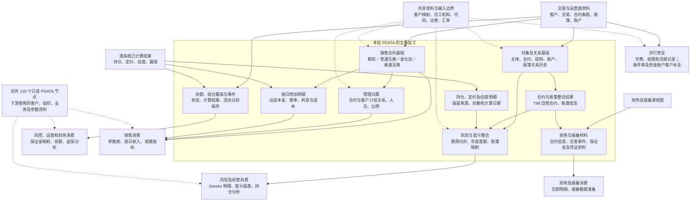

**1. PDATA 整体解释**

**这批 PDATA 的核心作用，是把交易系统中的客户、合约、账户、持仓和业务事件，整理成能够相互关联、保留时间含义、供多个下游复用的数据对象；在此基础上，再形成销售、风险、履保和财务等不同用途的结果。**

它接收的不只有原始交易记录，还包括源系统已经计算好的持仓指标、估值、履保结果，以及财务和报备视图。因此，PDATA 同时承担两种工作：

- **整理业务对象**：统一部分标识、转换代码、拆分合约与结构、维护对象关系和有效历史。
- **组织业务结果**：按业务日期整理持仓和事件，组合合约、账簿、客户及金额，展开逐日信息，形成可供下游继续计算的结果。

实际 SQL 支持上述两种职责。例如，互换合约入模时增加协议修饰符、转换交易对手标识；日终持仓指标大量承接源系统结果；销售附加明细则会展开日期并重新组织动态本金。[合约入模 SQL](E:/02_area/股衍数据-数据cookbook/sql-static-lineage-data/tasks/hiveTask/103941/sql/query.sql:1)、[日终指标 SQL](E:/02_area/股衍数据-数据cookbook/sql-static-lineage-data/tasks/hiveTask-2.0/121575/sql/query.sql:28)、[按日明细 SQL](E:/02_area/股衍数据-数据cookbook/sql-static-lineage-data/tasks/hiveTask-2.0/107491/sql/query.sql:11)。

理解它，首先要分清下面这些对象：

| 对象                     | 回答的问题                                     | 为什么需要单独存在                                                 |
| ------------------------ | ---------------------------------------------- | ------------------------------------------------------------------ |
| 客户、交易对手           | 这项业务涉及谁？                               | 法律主体、源系统客户号、经营归属客户号未必相同。                   |
| 合约                     | 双方持续承担什么权利义务？                     | 合约要素会被持仓、风险、销售和结算共同使用。                       |
| 结构、腿、子交易、观察日 | 合约内部怎样计算和执行？                       | 一份合约可以对应多条计算安排和多个观察日期，不能都压成“一笔交易”。 |
| 账簿、账户、组合及其关系 | 业务记在哪里、资金挂在哪里、哪些合约共同履保？ | 三者承担不同职责，且关系可能随时间变化。                           |
| 持仓、估值、盈亏         | 某天持有什么、价值多少、产生多少损益？         | 状态、价值和期间变化是不同事实。                                   |
| 资金、存续期和结算事件   | 发生过什么变化？                               | 事件流水不能由某天余额或合约快照完整替代。                         |
| 销售、财务和报备结果     | 按某种管理用途，应该怎样组织这些事实？         | 使用范围、编号、时间和金额口径各不相同。                           |

区域中存在几条并行路线：

1. **对象基础路线**：源客户、交易、合约条款 → 主体、合约、结构与关系模型 → 自营合约、账簿等整合结果。
2. **持仓与风险路线**：源持仓、定价、估值结果 → 持仓及指标模型 → 按合约、账簿、子交易等组织的风险和盈亏结果。
3. **销售路线**：不同产品的交易资料 → 销售合约基础 → 管理归属、逐日本金与费用 → 下游销售收入和规模指标。
4. **履约与财务路线**：账户余额、组合履保、业务流水及财务源结果 → 账户／组合／事件结果 → 风控、财务、运营和报备消费。

这些路线有共享对象，但并非依次执行的四个步骤。尤其是**销售基础表直接整合了不少 ODATA 资料，并不是简单从一张 T03 合约表继续加字段得到的。**

范围数字与给定基线一致：**284 个节点、132 个本批有写入关联节点、263 个输出关联任务、151 个只见读取节点、1 个无读写节点。**但这里有一个影响整体理解的修正：

> 151 个只见读取节点中，按固定网络，只有 **31 个被本批 PDATA 输出任务读取**；其余 **120 个出现在下游消费任务中**。后者更适合放在“下游同时使用的其他资料”位置，不能一概画成 PDATA 生产的上游。

这仍是当前交集里的可见范围；范围外生产者继续保留为输入边界。[成员及关系依据](E:/02_area/股衍数据-数据cookbook/sql-static-lineage/tmp/processing-skeleton/table-network.json)

**2. 区域关系图**

图中的实线表示已读 SQL 支持的数据加工或消费关系；虚线表示共享补充资料。节点概括一组对象，连线不表示该组每张表、每个字段都存在依赖。

几个消费方向可以落实到具体结果：

- 日终指标、子交易定价和合约信息共同进入 `dm_rsk_n.otc_opt_greek_val_det_h`；SQL 还会选择定价环境、有效合约及观察规则。[任务 176827](E:/02_area/股衍数据-数据cookbook/sql-static-lineage-data/tasks/sparkIndex/176827/sql/query.sql:248)
- 销售基础、按日附加明细和管理关系进入 `dm_otc_n.otc_sale_daily_rpt`，下游再匹配经营参数、计算收入和人员分配。[任务 118141](E:/02_area/股衍数据-数据cookbook/sql-static-lineage-data/tasks/sparkIndex/118141/sql/query.sql:297)
- 财务合约及交易事件进入香港互换交割明细；下游仍按部门、事件类型、日期和金额筛选。[任务 200199](E:/02_area/股衍数据-数据cookbook/sql-static-lineage-data/tasks/sparkIndex/200199/sql/query.sql:270)

这里的“消费”指 SQL 中存在读取和加工，不代表应用已经收到数据或业务已经验收。

**3. 重要对象和结果对照**

下表中的“一行”描述的是**从 SQL 推导出的逻辑记录含义**。局部存在汇总、排序或去重，不等于已经证明最终结果唯一。

除特别说明外，表名均属于 `pdata_n`。

| 对象或结果                                                                    | 一行、关键标识和时间                                                                                                        | 主要加工、用途及具体疑点                                                                                                                                                                                                                                                                                                                                     |
| ----------------------------------------------------------------------------- | --------------------------------------------------------------------------------------------------------------------------- | ------------------------------------------------------------------------------------------------------------------------------------------------------------------------------------------------------------------------------------------------------------------------------------------------------------------------------------------------------------ |
| `T01_PTY`、`T01_PTY_CUTP`、名称／证件／评级表                                 | 主体身份、交易对手角色及分类属性分别记录。评级还要区分评级类型；部分属性使用快照日期，部分使用有效区间。                    | 给合约、账户和合规消费补充参与方信息。`Pty_Id` 不能直接等同于一个跨系统唯一法律主体。                                                                                                                                                                                                                                                                        |
| `T98_CUTP_BASE_INFO`                                                          | 以交易对手记录为起点，按 `Pty_Id` 关联 ECIF、名称、证件、评级等；`Busi_Date` 为所组织的当日信息。                           | 是交易对手整合结果，不是客户数的天然唯一清单。名称、地址、联系人等关联仍可能扩行；另有多次覆盖写入问题，见后文。[158195](E:/02_area/股衍数据-数据cookbook/sql-static-lineage-data/tasks/hiveTask-2.0/158195/sql/query.sql:485)                                                                                                                               |
| `T03_AGT` 与具体合约表                                                        | `T03_AGT` 的对象范围包含合约、资金账户、保证金账户和账簿等；具体合约表进一步保存产品要素。                                  | 这里的“协议”是模型组织方式，不能全部解释成法律主协议。关联需要协议编号、修饰符以及来源范围。                                                                                                                                                                                                                                                                 |
| `T03_OTC_OPT_COMP_INFO`、`T03_OTC_SWAP_COMP_INFO` 与 `T98_SB_OTC_*_COMP_INFO` | 前者主要承接产品合约要素；后者进一步补客户、内部合约号、账簿、产品及状态。快照日期与起止定价日分开。                        | “合约基础”与“自营合约整合结果”职责不同。后者增加了关联条件，不能假设两者记录数一定相同。[互换基础](E:/02_area/股衍数据-数据cookbook/sql-static-lineage-data/tasks/hiveTask/103941/sql/query.sql:1)、[期权整合](E:/02_area/股衍数据-数据cookbook/sql-static-lineage-data/tasks/hiveTask-2.0/119044/sql/query.sql:82)                                          |
| 互换腿、期权子交易及观察规则表                                                | 腿用 `Leg_Glbl_Seq_No` 等标识；子交易有 `Sub_Trd_Id`；观察规则还区分观察日期、障碍类型或属性类型。                          | 表达合约内部计算安排。观察日条款不等于当天已发生敲入／敲出事件，也不能按条款行数统计合约笔数。[腿](E:/02_area/股衍数据-数据cookbook/sql-static-lineage-data/tasks/hiveTask/103942/sql/query.sql:1)、[观察日票息](E:/02_area/股衍数据-数据cookbook/sql-static-lineage-data/tasks/hiveTask/112813/sql/query.sql:1)                                             |
| `T03_AGT_RELA_H`                                                              | 一段有效期间内的对象关系。除两端编号与修饰符，还要看关系类型和来源。                                                        | 包含合约—账簿、合约—资金账户、互换—互换、账簿—账簿等关系；不能统一叫“合约账簿映射”。                                                                                                                                                                                                                                                                         |
| `T03_OTC_SWAP_COMP_HOLD_INFO`                                                 | 一条源持仓记录，保留持仓编号、合约、腿、标的、多空等；目标日期来自源持仓业务日期。                                          | 把腿和持仓接起来。它比合约更细，一份合约可有多腿、多标的、多持仓记录。[105392](E:/02_area/股衍数据-数据cookbook/sql-static-lineage-data/tasks/hiveTask/105392/sql/query.sql:9)                                                                                                                                                                               |
| `T98_OTC_BOOK_HOLD_SUM`                                                       | 保留 `Src_Hold_Id`、账簿、产品、投资类型、多空等持仓维度。                                                                  | 虽然叫“账簿持有汇总”，已读写入仍保留源持仓编号；不能当作“一账簿一天一行”。它是盈亏加工的重要底座。[106590](E:/02_area/股衍数据-数据cookbook/sql-static-lineage-data/tasks/hiveTask/106590/sql/query.sql:28)                                                                                                                                                  |
| `T98_SB_TIT_DAY_HOLD_INDX`                                                    | 源持仓记录的日终指标，`Src_Hold_Id` 来自 `POSITION_ID`；计算日期和目标 `Busi_Date` 来自 `QUOTE_DATE`。                      | 承接大量源计算结果并转码，不是在 PDATA 从头计算全部风险指标。同表还有不同批次写入，不能只凭日期辨认结果版本。[121575](E:/02_area/股衍数据-数据cookbook/sql-static-lineage-data/tasks/hiveTask-2.0/121575/sql/query.sql:28)                                                                                                                                   |
| `T98_SB_OTC_OPT_SUB_TRD_PRCG_INDX`                                            | 多种计算记录共用一张表：期初、日终、单标的 partial、双标的 cross、压力及 bucket 等。                                        | 行含义需要结合来源、定价日、环境，以及标的／标的对／场景等维度。`Sub_Trd_Id + Busi_Date` 不是可以直接认定的统一键。[cross 分支](E:/02_area/股衍数据-数据cookbook/sql-static-lineage-data/tasks/hiveTask-2.0/154813/sql/query.sql:84)                                                                                                                         |
| `T98_OTC_OPT_COMP_SUB_TRD_PAL_SUM`                                            | 同时存在期权子交易、其他证券持仓、独立费用结果行；年度收益是期间口径，`Busi_Date` 是持仓业务日。                            | 是按风险展示需要重组的盈亏结果，不能整表都解释为“一份期权子交易一天”。[169145](E:/02_area/股衍数据-数据cookbook/sql-static-lineage-data/tasks/hiveTask-2.0/169145/sql/query.sql:3)                                                                                                                                                                           |
| `T03_AST_CRRC_ACCT_BAL`                                                       | 已读保证金账户和资金账户分支分别用账户 ID、修饰符及源业务日期组织余额。                                                     | 两分支都把币种写空，把源 `BALANCE` 写入 `Begn_Bal`。因此不能仅按“分币种账户余额”表名认定粒度，也不能直接把该字段解释成经核实的日初余额。[保证金](E:/02_area/股衍数据-数据cookbook/sql-static-lineage-data/tasks/hiveTask/107280/sql/query.sql:1)、[资金账户](E:/02_area/股衍数据-数据cookbook/sql-static-lineage-data/tasks/hiveTask/112620/sql/query.sql:1) |
| `T03_OTC_CUTP_MARG_ACCT_PERF_GUAR_RSLT`                                       | 本批两项写入实际以 `BUNDLE_ID → Comb_Agt_Grp_Id` 承载组合履保结果；账户、客户和合约字段多处写空。日期来自 `SRC_BUSI_DATE`。 | 说明组合应追保、可提取及履保状态等；不是客户已经补缴的流水，也不能直接按账户编号使用。[147139](E:/02_area/股衍数据-数据cookbook/sql-static-lineage-data/tasks/hiveTask-2.0/147139/sql/query.sql:1)                                                                                                                                                           |
| 保证金／资金／存续期事件表                                                    | 描述一项源事件或流水；应同时保留事件 ID、所属对象、发生日、生效日等。                                                       | 例如保证金变动的发生日来自 `SRC_BUSI_DATE`，生效日来自 `ACTUAL_BUSI_DATE`。两者不能互换。[173965](E:/02_area/股衍数据-数据cookbook/sql-static-lineage-data/tasks/hiveTask-2.0/173965/sql/query.sql:27)                                                                                                                                                       |
| `T98_OTC_DERI_COMP_SALE_INFO`                                                 | 多产品销售合约快照，但四项写入的编号和金额形成方式不同；普通互换分支还存在腿关联带来的扩行条件。                            | 提供销售分析事实，尚不是最终收入。`Grp_Id` 在这里区分四个产品写入分支，不能套用为全仓统一业务维度。                                                                                                                                                                                                                                                          |
| `T98_OTC_COMP_MNG_RELA_INFO`                                                  | 合约管理关系快照，**一行横向放前三组人员、机构和比例**，不是一位人员一行。                                                  | 合约介绍关系优先，缺失时补客户介绍关系，再关联员工和机构信息。[105743](E:/02_area/股衍数据-数据cookbook/sql-static-lineage-data/tasks/hiveTask-2.0/105743/sql/query.sql:101)                                                                                                                                                                                 |
| `T98_OTC_DERI_COMP_SALE_ADTNL_DET`                                            | 从当日销售快照展开到计提日期；目标 `Busi_Date` 是展开后的 `Accrued_Date`。                                                  | 提供逐日本金、费率、利息、成本等。历史日期上的客户、分类等属性可能来自本次快照，不能当成完整历史原貌。[107491](E:/02_area/股衍数据-数据cookbook/sql-static-lineage-data/tasks/hiveTask-2.0/107491/sql/query.sql:40)                                                                                                                                          |
| 财务合约、财务交易事件、T95 报备材料                                          | 分别描述财务口径合约、交易事件和特定报备材料；来源与字段填充范围各异。                                                      | 例如财务互换合约分支把名义本金、期权费写空，期权分支则填源金额。两者不是统一字段完备的财务合约清单。[互换](E:/02_area/股衍数据-数据cookbook/sql-static-lineage-data/tasks/hiveTask-2.0/199176/sql/query.sql:1)、[期权](E:/02_area/股衍数据-数据cookbook/sql-static-lineage-data/tasks/hiveTask-2.0/199178/sql/query.sql:1)                                   |

有一组标识区别尤其重要：

- 模型互换合约的 `Swap_Comp_Agt_Id` 来自源 `KEY_OTC_TRADE_ID`。
- 销售基础表的期权、普通互换、极速互换分支，`Agt_Id` 来自 `INTERNAL_TRADE_ID`；`Inr_Seri_No` 才来自 `KEY_OTC_TRADE_ID`。
- 金仕达分支的 `Agt_Id` 又来自 `KEY_TRADE_COMFIRM_ID`，`Inr_Seri_No` 来自 `CONTRACT_CODE`。

**因此，“字段都叫合约编号”不构成直接关联依据。**[模型编号](E:/02_area/股衍数据-数据cookbook/sql-static-lineage-data/tasks/hiveTask/103941/sql/query.sql:3)、[销售期权编号](E:/02_area/股衍数据-数据cookbook/sql-static-lineage-data/tasks/hiveTask-2.0/86840/sql/query.sql:13)、[销售金仕达编号](E:/02_area/股衍数据-数据cookbook/sql-static-lineage-data/tasks/hiveTask-2.0/86842/sql/query.sql:13)

**4. 必要的复杂加工展开**

**① 对象关系不是每天覆盖一个属性，而是在维护关系的有效历史**

以 `105529` 的合约—账簿写入为例：

| 阶段         | 实际处理                                                                                                                           | 对业务理解的影响                               |
| ------------ | ---------------------------------------------------------------------------------------------------------------------------------- | ---------------------------------------------- |
| 恢复重跑起点 | 去掉当日新开记录，将当日闭链记录的结束日期恢复为开放终点。                                                                         | SQL 包含重复跑同一天时的历史恢复逻辑。         |
| 构造当日关系 | 从交易父表取交易 ID、账簿 ID，再按互换、期权、外汇远期、极速互换资料确定修饰符和关系类型。形成 `TEMP.T03_AGT_RELA_H_TEMP_TIT165`。 | 当日关系不仅是两个 ID，还带对象类型。          |
| 比较历史     | 取当日有效历史，与当日关系按 `Agt_Id + Agt_Modifr` 做全连接，形成 `…MID_TIT165`。                                                  | 区分新增 I、消失 D、变化 U、不变 S。           |
| 开闭有效区间 | 新增／变化开新记录；消失／变化关闭旧记录；不变延续；已关闭历史保留。                                                               | 一行代表一段关系版本，不是一笔当天发生的交易。 |

有效判断是 `Strt_Date ≤ D < End_Date`，属于左闭右开的区间；`2099-12-31` 用作开放终点。账簿变化会产生前后两段关系。

同表的其他写入还维护合约—资金账户、互换—互换及账簿—账簿关系，所以统一的表级说明必须包含**关系类型、来源和两端对象身份**。不能把 `105529` 的比较键推广成整表唯一键。

这一过程随后被自营合约、交易标的及估值整合使用：下游按有效日期选出当时适用的关系，再补账簿名称、部门和用途标志。[地图对应留存版本](E:/02_area/股衍数据-数据cookbook/sql-static-lineage-data/task-projections/tasks/105529/versions/91254c3eaad4d453e7e741c6f85d9ec277de67084a611a0500f336491db255e2.evidence-v3.json)；当前 Pack 中当日关系和比较阶段位于 [create.sql](E:/02_area/股衍数据-数据cookbook/sql-static-lineage-data/tasks/hiveTask/105529/sql/create.sql:30)，开闭链位于 [query.sql](E:/02_area/股衍数据-数据cookbook/sql-static-lineage-data/tasks/hiveTask/105529/sql/query.sql:59)。

**② 销售基础表的四项写入，先分别理解，再谈统一粒度**

| 写入                     | 主要过程                                                                                              | 粒度和金额的关键区别                                                                                     |
| ------------------------ | ----------------------------------------------------------------------------------------------------- | -------------------------------------------------------------------------------------------------------- |
| 期权，`Grp_Id=01`，86840 | 交易父表连接期权合约、账簿、结构、标的及履保资料；限制 OTC／OTC_HK 部门、排除测试账簿，再筛合约状态。 | 初始本金、动态本金和绝对本金取不同源字段，并按条件折算。结构等关联是否一对一，SQL 未整体证明。           |
| 普通互换，`02`，86841    | 同时关联结构腿和非结构腿；持仓先按腿汇总初始与当日本金，再回接合约。                                  | **没有最终按合约重新收敛。**若一合约有多条相关腿，会保留关联组合，不能直接认定合约一天一行。             |
| 金仕达，`03`，86842      | 按确认编号取最新业务日期记录；持仓标的信息再按确认编号汇集。                                          | 初始本金对多空互换使用动态本金，其他类型使用源名义本金；人民币汇率字段为空，统一金额口径仍需确认源定义。 |
| 极速互换，`04`，220650   | 当前范围限 `N_CROSS_DMA_SWAP`；当前动态本金按产品汇总日终持仓；初始本金使用各标的最早保留持仓记录。   | “初始本金”是这些首次持仓金额的汇总，不应未经核对就解释为同一个合约起始日的统一快照。汇率写 1。           |

这解释了为什么同一张销售基础表仍需保留产品分支。它统一了消费接口，但没有抹平各产品的业务差异。[期权](E:/02_area/股衍数据-数据cookbook/sql-static-lineage-data/tasks/hiveTask-2.0/86840/sql/query.sql:182)、[普通互换](E:/02_area/股衍数据-数据cookbook/sql-static-lineage-data/tasks/hiveTask-2.0/86841/sql/query.sql:173)、[金仕达](E:/02_area/股衍数据-数据cookbook/sql-static-lineage-data/tasks/hiveTask-2.0/86842/sql/query.sql:105)、[极速互换](E:/02_area/股衍数据-数据cookbook/sql-static-lineage-data/tasks/hiveTask-2.0/220650/sql/query.sql:127)

**③ 销售基础之后，归属整理与日期展开是两条并行加工**

管理归属任务 `105743`：

1. 客户介绍关系、合约介绍关系分别按比例排序。
2. 关联员工、部门和分公司资料。
3. 按客户号／合约号汇总到临时结果 `otc_div_temp`，把序号 1、2、3 横向放入三组字段。
4. 回接销售合约，使用 `coalesce(合约介绍关系, 客户介绍关系)`，并补充经办人等管理角色。

这里发生了明确的粒度变化：**多条介绍关系 → 一条横向归属结果**。超过前三组的关系没有进入这些输出字段；比例是否完整、总和是否符合业务要求，尚未验证。`coalesce` 也只对 NULL 回退，不能把它理解为所有空字符串都会自动回退。[临时结果及排序](E:/02_area/股衍数据-数据cookbook/sql-static-lineage-data/tasks/hiveTask-2.0/105743/sql/query.sql:11)、[回接合约](E:/02_area/股衍数据-数据cookbook/sql-static-lineage-data/tasks/hiveTask-2.0/105743/sql/query.sql:162)

按日任务 `107491` 则是另一套过程：

| 阶段／临时结果         | 规则与关联                                                                                                         | 粒度变化                                           |
| ---------------------- | ------------------------------------------------------------------------------------------------------------------ | -------------------------------------------------- |
| `info`：生成计提日期   | 读取当日销售快照，以提前终止日优先修正结束日，从起始日与回看 150 天边界形成日期序列。                              | 合约快照记录展开成多个计提日记录。                 |
| `evt`：期权事件累计    | 只取生效的部分终止、提前锁盈事件；先按合约和事件日汇总，再累计变动，延续到下一事件日前。按内部流水号＋计提日关联。 | 事件粒度 → 每日累计本金变动。                      |
| `his_dy`：普通互换持仓 | 只取结构腿，以 `初始价格 × 当前数量` 求和，按交易 ID＋持仓业务日汇总。                                             | 多腿／多持仓 → 合约日金额。                        |
| `ks`、`ks_t`：金仕达   | 动态本金、应计利息、占资成本延续到下一业务记录日前；佣金收入和成本另按实际业务日连接。                             | 状态延续与当日发生额分开。                         |
| `nd`：极速互换         | 取日终持仓，按产品 ID＋源业务日期汇总动态本金。                                                                    | 持仓 → 产品日金额。                                |
| `prop`、`fee`          | 保证金比例、计提费率按各自生效记录向后展开。                                                                       | 参数记录 → 每日适用参数。                          |
| 最终输出               | 按四个 `Grp_Id` 选择本金规则，写入计提日分区。                                                                     | 保留销售快照记录展开后的结果，不再做整表最终去重。 |

因此，它是**用本次快照重建一段逐日分析资料**。例如历史计提日的本金取历史持仓，但客户、标的分类和折算系数可能沿用本次销售快照。它不能被直接当成“那一天所有字段当时是什么”的历史快照。[阶段 SQL](E:/02_area/股衍数据-数据cookbook/sql-static-lineage-data/tasks/hiveTask-2.0/107491/sql/query.sql:40)

两条加工在收入端重新汇合。已读 `118141` 会排除费用互换、极速互换和香港合约，再匹配系数，计算当日收入及人员分配。因此，**进入 PDATA 销售基础，不等于进入这条收入线；动态本金也不等于销售收入。**[下游范围及关联](E:/02_area/股衍数据-数据cookbook/sql-static-lineage-data/tasks/sparkIndex/118141/sql/query.sql:297)

**④ 合约交易标的结果，包含原账簿和映射账簿两条路线**

`107018 → T98_OTC_SWAP_COMP_TRD_UNDRL_INFO` 的内部过程是：

- 从持仓选择本次更新过的业务日期，并覆盖最近七个交易日的检查范围。
- 构造 `MAPPING`：分别处理合约编号匹配、交易对手匹配、无附加条件的账簿映射，最后按“合约＋原账簿＋目标账簿”收敛。
- 主路线连接当日合约、有效关系、结构腿和历史持仓，补证券、汇率与客户。
- 第二条路线使用映射后的目标账簿，重新输出同一合约相关的标的记录。
- 两条路线 `UNION ALL`。

**所以这张结果不只是“合约有哪些股票”。它还表达这些持仓在不同账簿视角下怎样归属。**同一合约、标的、日期出现多行，可能来自账簿映射，也可能来自多个腿或持仓；输出没有保留全部底层持仓区分字段，不能只按“合约＋标的＋日期”去重。

另一个时间区别是：合约及关系按本次日期选择，输出日期来自持仓历史日，汇率也按持仓日匹配。结果是当前对象关系与历史持仓的组合。[映射阶段](E:/02_area/股衍数据-数据cookbook/sql-static-lineage-data/tasks/hiveTask/107018/sql/query.sql:9)、[主路线](E:/02_area/股衍数据-数据cookbook/sql-static-lineage-data/tasks/hiveTask/107018/sql/query.sql:107)、[映射账簿路线](E:/02_area/股衍数据-数据cookbook/sql-static-lineage-data/tasks/hiveTask/107018/sql/query.sql:195)

固定网络中，它目前只有一个可见读取任务，形成跨境合约类型标签。其业务解释可以成立，但不能据此夸大成全区域最主要的输出。

**⑤ 盈亏整合包含费用规则，不能只按表名理解**

`169145 → T98_OTC_OPT_COMP_SUB_TRD_PAL_SUM`：

| 阶段           | 实际行为                                                                                             |
| -------------- | ---------------------------------------------------------------------------------------------------- |
| 选择底座       | 从账簿持有结果中选期权、期货、股票、基金、场内期权，并限制参与风险报告的账簿。                       |
| 补合约及子交易 | 通过产品标识接子交易，再按合约和账簿接自营期权合约。非期权记录的 `Sub_Trd_Id` 使用持仓编号。         |
| 整理费用       | 对 AUTOCALL、区间累积、欧式普通期权，按“合约＋账簿＋业务日”汇总费用收益，形成 `FEE_PDD`、`FEE_PDY`。 |
| 形成收益       | 当日收益加费用收益；年度累计收益使用当前累计减上年末累计，再补费用年度收益。                         |
| 另一条输出分支 | 对上述类型之外的合约，另输出 `StructuredFlows / FEE` 行，`Sub_Trd_Id` 使用合约编号。                 |

这里至少有三种结果行：**子交易盈亏、其他证券持仓盈亏、合约费用行**。费用汇总回接到子交易后是否被重复带入，需要结合实际子交易数量核验；不能整表不分记录类型直接求和。[收益计算](E:/02_area/股衍数据-数据cookbook/sql-static-lineage-data/tasks/hiveTask-2.0/169145/sql/query.sql:49)、[费用汇总](E:/02_area/股衍数据-数据cookbook/sql-static-lineage-data/tasks/hiveTask-2.0/169145/sql/query.sql:100)、[独立费用分支](E:/02_area/股衍数据-数据cookbook/sql-static-lineage-data/tasks/hiveTask-2.0/169145/sql/query.sql:180)

它继续被 OTC 盈亏和风险合约盈亏加工读取，说明 PDATA 在这条路线上已经承担了实际业务结果重组。

互换估值汇总 `107937` 也不能简单叫“把所有腿加总”：

- 固定腿、结构腿、浮动腿收益按类型使用 **`MAX(CASE...)` 横向展开**；
- 金仕达分支把模型合约 ID、账簿 ID 写空，以内部合约号和固定账簿名称承载；
- 另有映射账簿分支；
- 结果被 `dm_hk_n.fin_valu_otc_trs` 读取。

因此，“一合约一天一行”和“同类腿收益全部相加”都不是已经成立的整表定义。[腿收益整理](E:/02_area/股衍数据-数据cookbook/sql-static-lineage-data/tasks/hiveTask/107937/sql/query.sql:70)、[金仕达分支](E:/02_area/股衍数据-数据cookbook/sql-static-lineage-data/tasks/hiveTask/107937/sql/query.sql:108)

**⑥ 组合履保结果，需要通过关系才能连接到账户和合约**

`147139`、`165155` 把源组合履保结果转换到同一目标来源分区，后者取提前批资料，`Real_Src_Tbl` 不同。它们不是天然同时保留的两个批次快照，哪个版本最终可见仍取决于实际执行。

随后 `176874`：

1. 取最近一段日期的组合履保结果。
2. 按组合 ID 接保证金账户—组合映射。
3. 从余额和流水计算截至对应业务日的累计追加、累计提取。
4. 补账户号、交易对手及名称。
5. 限制启用履保、且组合内关联多个期权合约的范围。

这条写入虽然落在 `T98_OTC_COMP_MARG_DET`，却把合约编号写空，并且没有输出组合编号；账户协议 ID 又直接取自上游履保结果，而该上游分支把它写空。

所以，更准确的解释是：**特定多合约组合的履保和账户资金整合记录，而不是逐合约保证金明细。**当前输出还缺少能清楚追溯组合的标识，这会限制它的关联和汇总使用。[两批来源](E:/02_area/股衍数据-数据cookbook/sql-static-lineage-data/tasks/hiveTask-2.0/165155/sql/query.sql:25)、[176874 的输出与连接](E:/02_area/股衍数据-数据cookbook/sql-static-lineage-data/tasks/hiveTask-2.0/176874/sql/query.sql:5)、[组合筛选](E:/02_area/股衍数据-数据cookbook/sql-static-lineage-data/tasks/hiveTask-2.0/176874/sql/query.sql:97)

**⑦ 历史日期回补，是区域里的共同加工职责**

持仓、日终指标、保证金事件等任务，会先生成“本次需要重写哪些业务日期”的临时日期集合，再读取源快照，写入这些日期的目标结果。

但选择日期的规则不同：

- 日终指标 `121575` 同时考虑报价日、更新时间和源目标记录数差异。
- 保证金事件 `173965` 使用当日发生日期及记录数差异。

这意味着，**“每日任务”可能改写历史业务日期**；反过来，记录数没变也不代表金额、状态没有变化。日期选择机制不能被当作完整的数据变更核验。[日终指标日期集合](E:/02_area/股衍数据-数据cookbook/sql-static-lineage-data/tasks/hiveTask-2.0/121575/sql/query.sql:1)、[保证金事件日期集合](E:/02_area/股衍数据-数据cookbook/sql-static-lineage-data/tasks/hiveTask-2.0/173965/sql/query.sql:1)

**5. 对当前地图分类的评估**

**现有六个业务入口多数可以保留为阅读导航，但不足以承担模型分类、粒度说明和加工职责说明。**

| 当前组织             | 有依据的部分                                       | 需要调整的地方                                                                                                                                                                                                                                                                                                     |
| -------------------- | -------------------------------------------------- | ------------------------------------------------------------------------------------------------------------------------------------------------------------------------------------------------------------------------------------------------------------------------------------------------------------------ |
| 客户与参与方         | 主体、名称、证件、评级及交易对手整合确实相互关联。 | 内部机构也是归属和账簿的共享依赖；个人客户整合还服务外围业务，不能全解释为 OTC 客户加工。                                                                                                                                                                                                                          |
| 合约、结构与账簿     | 合约与子交易、腿、观察规则确实需要分开。           | `T03_AGT`、协议关系历史还涉及账户和账簿等对象；把它们只归属于“合约”会遮蔽共享作用。                                                                                                                                                                                                                                |
| 账户、履约与存续事件 | 这些内容共同支撑存续管理。                         | 余额、组合履保、追保记录、发生事件、费用计划必须继续分层解释，不能用一个“生命周期”标签代替粒度。                                                                                                                                                                                                                   |
| 持仓、定价与风险结果 | 可作为使用者入口。                                 | 同时混合了业务对象、源计算结果、加工职责和下游用途；其中既有明细转存，也有费用归并及多种结果行。                                                                                                                                                                                                                   |
| 销售、归属与按日信息 | 实际存在销售基础 → 归属／日明细 → 下游收入的路线。 | “按日”是结果时间形态，“归属”是关系，“销售”是用途，三者应分别记录。                                                                                                                                                                                                                                                 |
| 财务与报备           | 确实存在专门来源和消费方向。                       | 是用途分类；内部仍需区分合约、事件、组合材料、凭证及附件。                                                                                                                                                                                                                                                         |
| 公共支撑             | 字典、精度和指标配置确实支撑加工。                 | 用户、权限和流程记录有自己的对象含义，不全是算法配置。                                                                                                                                                                                                                                                             |
| 用途待解释           | 保留边界的做法合理。                               | 两项已可进一步定位：条件单客户／机构补全、资金账户客户补全。最终应用用途和消费者仍未见证据。[206853](E:/02_area/股衍数据-数据cookbook/sql-static-lineage-data/tasks/sparkIndex/206853/sql/query.sql:1)、[206855](E:/02_area/股衍数据-数据cookbook/sql-static-lineage-data/tasks/sparkIndex/206855/sql/query.sql:1) |

建议采用四个并列维度，作为本轮分类草稿：

| 维度               | 应记录的内容                                                 | 例子                                    |
| ------------------ | ------------------------------------------------------------ | --------------------------------------- |
| 模型主题／业务对象 | 主体、合约、腿、子交易、账户、账簿、组合、事件、参数等       | 组合履保结果的业务对象是组合。          |
| 加工职责           | 转码、标识转换、历史维护、关系补充、日期展开、汇总、回补等   | `107491` 是日期展开与多来源日金额组织。 |
| 结果形态与粒度     | 属性明细、关系区间、快照、事件流水、计算结果、横向整合记录等 | 管理关系是三组归属横向排列的快照。      |
| 下游用途           | 销售、风控、财务、运营、报备、合规及其他应用                 | 同一合约或账簿可以服务多个用途。        |

两处规范问题也需要保留：

- 命名整理稿 §3.1 将 T01 定为当事人、T03 定为协议；§3.4 又分别写成关系／协议、账户／订单，存在冲突。本轮对象解释以字段和 SQL 为依据。[规范冲突位置](E:/02_area/股衍数据-数据cookbook/数综基础信息/数据开发规范-整理版/gf-data-assistant/knowledge/L3-standards/table_naming_standards.md:31)
- T98 的“汇总”不能证明发生了数值聚合。持仓结果保留源持仓编号，销售归属做横向展开，互换估值对腿类型取 MAX，都是实际反例。

分层规范预期 PDATA 承担标准化和基础模型职责；当前 SQL 还明确包含销售日期展开、费用归并及财务用途整合。**规范预期与现有行为应同时展示，不能用规范把当前行为解释掉。**[分层规范](E:/02_area/股衍数据-数据cookbook/数综基础信息/数据开发规范-整理版/gf-data-assistant/knowledge/L3-standards/warehouse-layer-architecture.md:60)

**6. 本轮新增认识与剩余问题**

本轮由实际材料支持的新增认识，主要是：

- **区域边界需要重画**：151 个只读节点中，120 个是当前网络中的下游并用资料；31 个才直接关联本批 PDATA 输出任务。
- **统一表名没有带来统一标识和粒度**：销售合约号、模型协议号、源产品号需要分别解释；同表还可能混合产品、来源和计算场景。
- **账簿关系会改变结果行数**：交易标的、估值等结果包含映射账簿分支。
- **历史结果可能使用当前属性**：销售日明细、交易标的和部分盈亏加工存在当前对象资料与历史业务日结果的组合。
- **风险结果既有承接，也有再加工**：日终指标主要承接源结果；盈亏任务则有明确费用和年度差额规则。
- **履保结果的实际对象是组合**：部分下游再把组合连接到账户，结果表名不能替代对象判断。

仍需明确保留以下问题：

| 问题                   | 已看到的具体证据                                                                                                 | 对理解和使用的影响                                                                                                                                                           |
| ---------------------- | ---------------------------------------------------------------------------------------------------------------- | ---------------------------------------------------------------------------------------------------------------------------------------------------------------------------- |
| 实际唯一性             | 普通互换销售关联多类腿；主体整合存在多个属性关联；映射账簿产生分支。                                             | 不能直接确定统一主键，也不能直接累计全部行的本金、费用或盈亏。                                                                                                               |
| 多次写入的最终保留范围 | `158195` 先覆盖、再从上一交易日补入缺失主体，随后又覆盖同一日期结果。                                            | 若按留存文本顺序执行，不能承诺中间的上一日补入最终仍被保留。[对应 SQL](E:/02_area/股衍数据-数据cookbook/sql-static-lineage-data/tasks/hiveTask-2.0/158195/sql/query.sql:224) |
| 批次覆盖               | 组合履保的普通批和提前批写入相同逻辑来源分区。                                                                   | 表内业务日期不足以证明当前结果来自哪一批，需要执行和版本证据。                                                                                                               |
| 金额口径               | 不同销售分支采用不同本金来源及折算方式；互换估值按腿类型取 MAX。                                                 | 全表统一币种、初始本金定义、同类腿合并规则仍不能直接承诺。                                                                                                                   |
| 临时及未解析节点       | 31 个直接关联输入中，有 15 个带临时／占位特征的节点；`otc_div_temp` 等已能回到任务内阶段，其他名称仍有材料缺口。 | 不能把它们全部当成外部物理输入，更不能把 `${src_table}` 当真实业务表。                                                                                                       |
| 物理输出身份           | 网络中还有 `hive2mysql` 类型任务的配置目标关联。                                                                 | 263 是输出关联任务数，不是已确认的 263 个 Hive 生产程序。                                                                                                                    |
| 最终业务交付           | 当前依据是 SQL、DDL和静态关系。                                                                                  | 尚未证明运行完成、数据到达、实际行唯一或报备成功。                                                                                                                           |

完整成员的覆盖位置如下。这里沿用现有成员集合做核对，分类含义采用本文的修正：

| 成员集合                         |  节点数 | 本轮解释位置                               |
| -------------------------------- | ------: | ------------------------------------------ |
| 主体、客户及内部机构             |      15 | 对象身份与共享主数据                       |
| 协议、合约、结构、账簿及附加材料 |      45 | 合约结构与跨对象关系                       |
| 账户、履约、资金及存续事件       |      22 | 状态、组合结果和事件分别解释               |
| 持仓、估值、定价与风险结果       |      22 | 源结果承接及风险再加工                     |
| 销售基础、归属、参数及按日结果   |       7 | 销售并行路线                               |
| 财务与报备材料                   |       6 | 用途明确、对象仍需区分                     |
| 字典、配置、权限和流程           |      13 | 横向支撑及系统记录旁支                     |
| 两项客户信息补全结果             |       2 | 已定位加工对象，最终应用用途待确认         |
| 本批输出任务直接关联的只读节点   |      31 | 共享输入、临时阶段及未解析边界             |
| 仅在其他消费任务中读取的节点     |     120 | 下游并用资料，尚未逐项深读                 |
| `T99_IDX_RELA_H`                 |       1 | 本批无读写关系，无法从当前网络解释位置     |
| **合计**                         | **284** | **完整成员已定位；并非全部任务语义已解读** |

逐节点名称、生产和消费关联可用[现有页面完整清单](E:/02_area/股衍数据-数据cookbook/sql-static-lineage/docs/processing-map-pdata.html)与[固定表网络](E:/02_area/股衍数据-数据cookbook/sql-static-lineage/tmp/processing-skeleton/table-network.json)核对。未深入部分主要是其余条款细目、各来源／提前批变体、部分外围系统记录和那 120 个下游并用对象；本轮没有把这些对象标成已经完成粒度核验。

材料版本方面：关系范围采用 9 月 5 日发布的固定网络，主要加工解释采用与 9 月 7 日页面完全一致的 263 份投影 SQL。当前 Input Pack 中有 51 份与该留存版本不一致，已抽查包含日期更新和阶段文件调整；本文没有将它们拼接成一次同日运行结论。既有业务知识仅用于概念解释，并与当前读到的 SQL 对照。本轮未修改任何文件。
