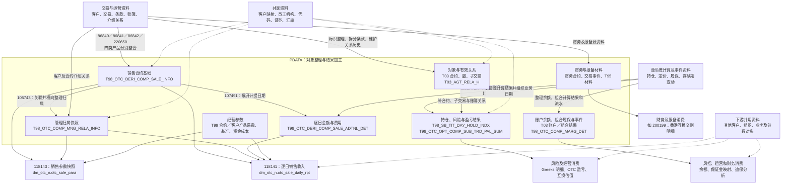

**这批 PDATA 把客户、合约、账簿、持仓和业务事件整理成可关联的数据对象，并进一步形成销售、风险、履保和财务结果。销售路线最能体现这一过程：先整理“销售分析涉及哪些合约”，再分别回答“归属谁”和“每天按什么金额计算”，最后由下游形成收入结果。**

以下承接[第一轮报告](E:/02_area/股衍数据-数据cookbook/sql-static-lineage/docs/processing-map/pdata调研v1.md)，范围仍是本批可见的 PDATA。

实线表示已分析的加工或消费关系；虚线表示共享补充资料。组合节点概括一组对象，代表性表不等于全部成员，也不表示组内每张表都参与每条连线。字典、权限、流程记录，以及条件单和资金账户的客户补全，保留在共享资料或外围旁支的位置。

图中有两个关系需要先看清：**销售基础直接整合了不少源资料，并不必须经过 T03 合约模型；销售参数快照与逐日收入则是并行消费，不能画成“先生成参数快照，再由它生成收入”。**

---

沿销售路线，先认识五项结果。下表的“一行”解释 SQL 组织出来的记录含义，不承诺实际数据已经满足唯一性。

| 结果                                                        | 它解决什么问题                                                   | 一行、标识与日期                                                                                                                                                   |
| ----------------------------------------------------------- | ---------------------------------------------------------------- | ------------------------------------------------------------------------------------------------------------------------------------------------------------------ |
| **销售基础** `pdata_n.T98_OTC_DERI_COMP_SALE_INFO`          | 汇集各产品合约的客户、产品、起止日期、本金及账簿等销售分析资料。 | 某个产品分支在快照日形成的一条销售合约记录。`Agt_Id` 是销售侧关联入口；`Grp_Id` 区分四类写入；`Busi_Date` 是本次快照日期。普通互换的腿关联可能使一个合约保留多行。 |
| **管理归属** `pdata_n.T98_OTC_COMP_MNG_RELA_INFO`           | 给销售合约补充介绍人员、机构、分配比例及经办角色。               | 一条合约归属快照，横向放置前三组介绍关系。`Agt_Id` 承接销售合约号，`Pty_Id` 承接其客户号；`Busi_Date` 是归属快照日期。不是一位人员一行，也不是关系有效区间。       |
| **按日附加明细** `pdata_n.T98_OTC_DERI_COMP_SALE_ADTNL_DET` | 提供每天适用的动态本金、费率、利息和成本。                       | 一条销售基础记录展开到一个计提日后的结果。`Agt_Id`、`Grp_Id` 延续销售范围；**`Busi_Date` 已变成计提日**，加工日期另放在 `Data_Etl_Date` 等字段。                   |
| **销售参数快照** `dm_otc_n.otc_sale_para`                   | 展示本次销售口径下的合约参数、系数与归属。                       | 围绕合约组织的一条参数结果；`Busi_Date` 是本次报告日期。不是逐日收入记录。                                                                                         |
| **逐日销售收入** `dm_otc_n.otc_sale_daily_rpt`              | 把逐日金额、经营系数和管理归属组合成收入及人员分配。             | 某次报告中，一份合约在一个计提日的计算记录；保留产品类型及三组分配字段。**`Busi_Date` 是本次报告日期，`Accrued_Date` 才是收入对应的计提日。**                      |

最后两项的读取关系及日期含义分别见[销售参数 SQL](E:/02_area/股衍数据-数据cookbook/sql-static-lineage-data/tasks/sparkIndex/118143/sql/query.sql:123)和[逐日收入 SQL](E:/02_area/股衍数据-数据cookbook/sql-static-lineage-data/tasks/sparkIndex/118141/sql/query.sql:169)。

**标识需要沿来源理解，不能只看字段名称。**

| 写入范围                 | 销售基础 `Agt_Id` 的来源 | 销售基础 `Inr_Seri_No` 的来源 |
| ------------------------ | ------------------------ | ----------------------------- |
| 期权、普通互换、极速互换 | `INTERNAL_TRADE_ID`      | `KEY_OTC_TRADE_ID`            |
| 金仕达                   | `KEY_TRADE_COMFIRM_ID`   | `CONTRACT_CODE`               |

模型互换合约的 `Swap_Comp_Agt_Id` 则来自 `KEY_OTC_TRADE_ID`。因此，在适用分支内，它对应的是销售基础的 `Inr_Seri_No`，不能因为双方字段都被解释为“合约编号”，就直接拿模型编号关联销售 `Agt_Id`。[第一轮标识对照](E:/02_area/股衍数据-数据cookbook/sql-static-lineage/docs/processing-map/pdata调研v1.md:138)

*示意，非真实数据：*同一份普通互换，源系统技术 ID 为 `K1001`，内部合约号为 `SWAP-A001`。模型合约可能记作 `Swap_Comp_Agt_Id=K1001`；销售基础则记作 `Agt_Id=SWAP-A001、Inr_Seri_No=K1001`。两者描述同一对象，却使用不同关联入口。

其他主要路线也形成了不同含义的结果，应保留各自的位置：

| 路线与代表结果                                                  | 一行及时间怎样理解                                                             | 为什么单独存在                                                                   |
| --------------------------------------------------------------- | ------------------------------------------------------------------------------ | -------------------------------------------------------------------------------- |
| 对象关系：`T03_AGT_RELA_H`                                      | 两端对象在一段有效期间内的关系版本，需要关系类型、编号、修饰符及来源共同解释。 | 合约属于哪个账簿、连接哪个账户可能随时间变化，单个当前属性无法表达历史。         |
| 持仓与风险：`T98_OTC_BOOK_HOLD_SUM`、`T98_SB_TIT_DAY_HOLD_INDX` | 前者保留源持仓编号等维度；后者承接持仓的日终指标，业务日期来自报价日期。       | 持有什么，与该持仓算出的风险指标，是不同事实；“汇总”表名不代表一账簿一天一行。   |
| 盈亏：`T98_OTC_OPT_COMP_SUB_TRD_PAL_SUM`                        | 同表包含子交易盈亏、其他证券持仓盈亏和独立费用行；日期为持仓业务日。           | 已按风险展示需要重组费用和期间收益，不能把全部行解释为同一种子交易记录。         |
| 履保：`T03_OTC_CUTP_MARG_ACCT_PERF_GUAR_RSLT`                   | 已分析写入以 `Comb_Agt_Grp_Id` 承载组合，日期来自源业务日。                    | 组合履保计算结果、账户余额和实际补缴事件分别回答“应怎样”“现有多少”“发生了什么”。 |
| 财务与报备材料                                                  | 财务合约、交易事件、保证金材料及凭证分别保存，字段填充范围随来源而异。         | 它们按财务或报备用途组织资料，不能直接用销售本金或风险估值替代。                 |

这些结果的详细来源沿用[第一轮对象对照](E:/02_area/股衍数据-数据cookbook/sql-static-lineage/docs/processing-map/pdata调研v1.md:117)。

---

**销售基础的形成，先是四类产品各自整理，再写进共同的表。**

| 分支                     | 必要的内部加工                                                               | 对结果的影响                                                                           |
| ------------------------ | ---------------------------------------------------------------------------- | -------------------------------------------------------------------------------------- |
| 期权，`Grp_Id=01`，86840 | 交易连接期权合约、账簿、结构、标的和履保资料，筛选业务范围，按条件折算金额。 | 初始、动态、绝对本金来自不同字段；结构等关联没有整体证明为一对一。                     |
| 普通互换，`02`，86841    | 持仓先按腿汇总本金，再把结构腿、非结构腿及相关金额接回合约。                 | 最终没有重新按合约收敛；多条腿可能形成多条关联组合。                                   |
| 金仕达，`03`，86842      | 按确认编号选最新业务记录，按确认编号汇集持仓标的信息。                       | 多空互换的初始本金使用动态本金，其他类型使用源名义本金，不能统一解释为同一种“初始值”。 |
| 极速互换，`04`，220650   | 当前动态本金按产品汇总日终持仓；初始本金汇集各标的最早保留持仓记录。         | 各标的首次持仓未必发生在同一天，因此初始本金不天然等于合约起始日的一次统一快照。       |

共同表提供了下游读取入口，但各分支的本金形成方式和行数来源仍需保留。[第一轮四项写入分析](E:/02_area/股衍数据-数据cookbook/sql-static-lineage/docs/processing-map/pdata调研v1.md:165)

**基础形成后，105743 整理归属，107491 展开日期；两者分别改变不同维度。**

105743 的过程是：

> 客户介绍关系／合约介绍关系  
> → 分别按比例排序，补员工与机构  
> → `otc_div_temp` 按客户号／合约号横向放置前三组  
> → 回接销售合约，逐字段补充归属  
> → 管理归属快照

合约介绍关系以 `Contract_Code = 销售 Agt_Id` 关联；客户介绍关系通常按销售客户号关联，部分收益凭证还存在客户号调整。

这里需要收紧第一轮的一句话：**SQL 对人员、机构、比例等字段分别使用 `coalesce`，并非把两套归属整体二选一。**某字段在合约级结果中仍为 NULL 时，可以取客户级字段；其他非空字段继续保留合约级值。空字符串也不会因 `coalesce` 自动回退。[归属输出与关联](E:/02_area/股衍数据-数据cookbook/sql-static-lineage-data/tasks/hiveTask-2.0/105743/sql/query.sql:101)

*示意，非真实数据：*介绍关系中甲、乙、丙的比例为 0.6、0.3、0.1，输出会把他们放进同一行的第 1、2、3 组。若合约级某个机构字段为 NULL，而人员和比例已有值，该机构字段可能取客户级结果；于是同一组字段可能混合来源。超过前三组的关系没有进入这些位置，前三组比例是否完整仍需实际数据验证。

107491 的过程则是：

> 当日销售基础  
> → `info` 生成计提日期  
> → 接入逐日事件、持仓及参数  
> → 按产品分支形成金额  
> → 写入计提日分区

它从“起始定价日”和“本次日期往前 150 天”中取较晚者，展开到本次日期。提前终止日优先替代原结束日，参与后续金额规则；**日期序列本身并不是统一截到结束日。**例如期权、普通互换分支对结束日之后的动态本金另行置零。[日期生成与金额规则](E:/02_area/股衍数据-数据cookbook/sql-static-lineage-data/tasks/hiveTask-2.0/107491/sql/query.sql:11)

| 内部结果               | 怎样得到每天的资料                                                             | 关联入口                  |
| ---------------------- | ------------------------------------------------------------------------------ | ------------------------- |
| `evt`：期权事件累计    | 生效的部分终止、提前锁盈事件先按合约和事件日汇总，再累计并延续到下一事件日前。 | `Inr_Seri_No`＋计提日     |
| `his_dy`：普通互换持仓 | 结构腿持仓按“初始价格×当前数量”求和，汇成交易日金额。                          | `Inr_Seri_No`＋持仓业务日 |
| `ks`、`ks_t`：金仕达   | 动态本金、利息和占资成本按状态延续；佣金及其成本按实际业务日连接。             | `Agt_Id`＋日期            |
| `nd`：极速互换         | 日终持仓按产品和源业务日汇总动态本金。                                         | `Otc_Seri_No`＋日期       |
| `prop`、`fee`          | 保证金比例、计提费率按各自有效记录展开到日。                                   | 合约号／产品号＋日期      |

这些名称是任务内部阶段，不应在整体图中被平铺成外部业务输入。

*示意，非真实数据：*9 月 7 日读取一条起始日为 9 月 5 日的销售快照，可生成：

| 销售合约    | 附加明细 `Busi_Date` | 加工日期  |
| ----------- | -------------------- | --------- |
| `SWAP-A001` | 9 月 5 日            | 9 月 7 日 |
| `SWAP-A001` | 9 月 6 日            | 9 月 7 日 |
| `SWAP-A001` | 9 月 7 日            | 9 月 7 日 |

这三行的动态本金可以来自各日历史持仓，而客户、标的分类、初始本金或折算系数仍可能来自 9 月 7 日读取的销售快照。它表达的是**本次加工重建的逐日分析资料**，不能直接当作各历史日期所有属性的原始快照。

其他路线的内部阶段同样决定结果如何使用，但无需重新展开全部任务：

- **关系历史，105529：**构造当日关系，比较新增、消失、变化和不变，再开闭有效区间。若合约 9 月 6 日从账簿 A 转入 B，可以形成 A 的 `[原开始日, 9月6日)` 和 B 的 `[9月6日, 开放终点)` 两段。下游需要明确用哪个日期选关系；部分加工实际将当前关系与历史持仓组合。
- **交易标的，107018：**持仓与合约、腿、有效关系连接后，分别输出原账簿和映射账簿分支，再 `UNION ALL`。因此，同一合约、标的、日期的多行可能表达不同账簿视角。
- **盈亏，169145：**从账簿持仓补合约和子交易，按产品规则归并费用、计算年度差额，部分费用另出一行。结果汇总必须区分记录类型。
- **履保，176874：**组合履保连接账户映射及资金余额、流水，形成特定多合约组合的资金整合记录。该写入虽然进入 `T98_OTC_COMP_MARG_DET`，却没有保留组合编号，合约编号也为空，不能解释为逐合约保证金明细。

上述阶段及后续读取沿用[第一轮复杂加工分析](E:/02_area/股衍数据-数据cookbook/sql-static-lineage/docs/processing-map/pdata调研v1.md:148)。

---

**销售路线在下游重新汇合时，才进入收入计算。**

118143 读取销售基础、管理归属和经营系数，形成 `otc_sale_para` 参数快照。118141 则直接读取销售基础、按日附加明细、管理归属及各类系数，形成 `otc_sale_daily_rpt`。后者主要经历四步：

1. **确定参与范围。**已读版本排除费用互换、极速互换和香港合约，另有归属机构条件及指定合约例外。进入销售基础，只说明拥有销售分析资料。
2. **匹配适用参数。**合约价差系数按计提日匹配；客户产品系数、部分基准和资金成本按起始定价日匹配。因此，“每天算收入”不代表每种参数都取当天版本。
3. **按产品及计提方式计算。**一般分支区分年化与绝对值：年化部分按逐日本金计提，绝对值部分可在起始日确认；金仕达另使用利息、佣金和成本，部分期权还有保底调整。
4. **分配并累计。**调整后的收入直接乘三组 `Allo_Prop`，形成三组分配金额，再计算累计值；人员仍横向保留在同一行。

这些规则见[收入计算](E:/02_area/股衍数据-数据cookbook/sql-static-lineage-data/tasks/sparkIndex/118141/sql/query.sql:227)、[参数及归属关联](E:/02_area/股衍数据-数据cookbook/sql-static-lineage-data/tasks/sparkIndex/118141/sql/query.sql:297)。

*示意，非真实数据：*某个适用“价差与基准均年化”分支的有效计提日，动态本金为 1,000 万，年化价差为 0.6%，年化基准为 0.2%，则该分支调整前的当日计算为：

`1,000万 ×（0.6%＋0.2%）÷ 365 ≈ 219.18`

这解释了本金、系数和收入的关系；实际结果还取决于产品分支及后续调整。比例字段在收入 SQL 中直接参与乘法，其单位、完整性和实际合计不能仅靠上述示意认定。

这里还有一项已确认的补充输入：118141 会读取已有奖励汇总，参与部分期权的保底调整。因此，图中“下游并用资料”包含会实际影响收入的业务结果；目前确认到的是这些读取与计算关系，季度奖励发放的完整接续仍不在本轮已证实范围内。[保底与奖励输入](E:/02_area/股衍数据-数据cookbook/sql-static-lineage-data/tasks/sparkIndex/118141/sql/query.sql:185)

回到日期例子，9 月 7 日形成的收入报告可以同时出现 `Busi_Date=9月7日、Accrued_Date=9月5日／6日／7日` 的多条记录。读取结果时，报告日期用于选择本次输出版本，计提日期用于定位收入对应的那一天。当前 SQL 以销售 `Agt_Id` 连接日明细，未同时用 `Grp_Id` 限定这处关联；所以跨分支同号以及上游扩行是否存在，会直接影响收入行数和累计值，仍不能承诺一个合约每天必然只有一行。

其余路线继续通往已确认的消费方向：持仓指标、定价和合约资料进入 Greeks 明细；盈亏重组结果进入 OTC 盈亏分析；互换估值进入 `dm_hk_n.fin_valu_otc_trs`；财务合约及交易事件进入香港互换交割明细。它们与销售共享部分客户、合约和账簿资料，各自保留不同的对象、日期和金额口径。

本说明沿用第一轮的范围定位：132 个输出关联节点之外，31 个只读节点与本批输出加工直接相关，其中还含任务内临时或未解析对象；另有 120 个只读节点位于下游并用资料侧，不能全部画成 PDATA 上游；`T99_IDX_RELA_H` 在本批没有读写关联。本轮补读的四项销售 SQL 与第一轮留存版本一致。以上解释支持理解静态加工过程，实际唯一性、批次最终覆盖范围及业务端数据到达仍未验证。
