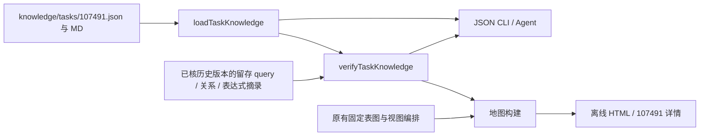
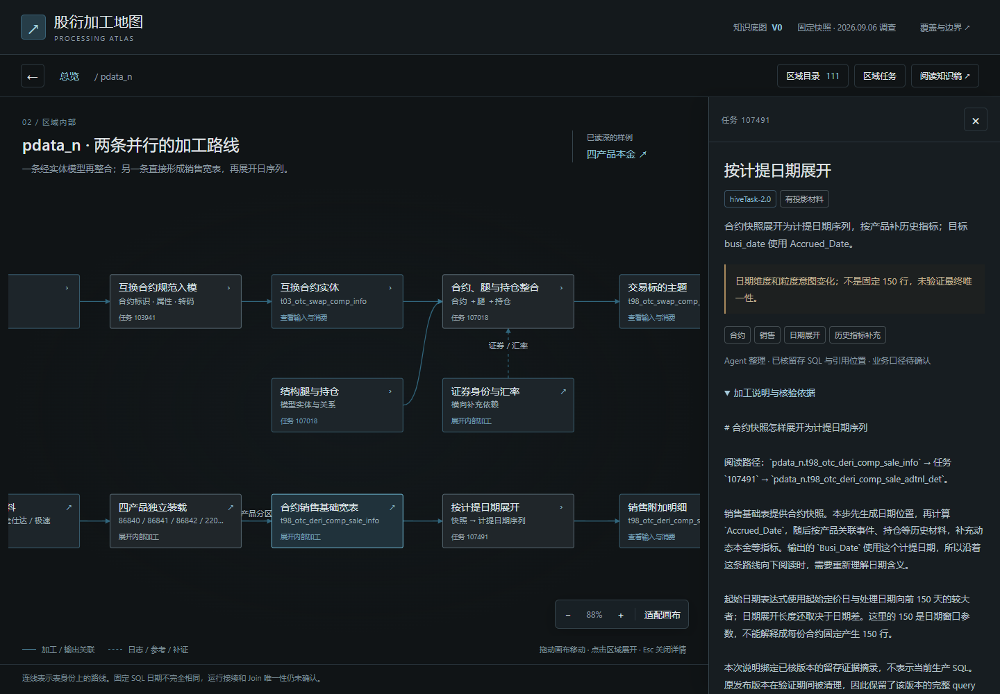

# 共享知识路径验证：107491

路径更新：共享知识现位于 `config/workspace-paths.json` 的 `dataRoot/knowledge`，当前对应 `../sql-static-lineage-data/knowledge`。下文 `knowledge/...` 均相对于 dataRoot；读取脚本仍在代码仓库，命令保持不变。

日期：2026-09-06。范围是一条真实加工链的公共说明与双入口消费，不是全域知识库建设。

## 路径和职责



加工路线：销售基础表 → `107491` → 销售附加明细。原地图已有这条路线；本轮复用地图骨架，将这一个任务的解释从页面内容中抽出，加入业务主题、加工职责与三个可核对的观察引用。

机器材料提供 `posexplode` 展开、`Accrued_Date` 计算、目标 `Busi_Date` 赋值。阅读说明解释日期意义变化，保留最终唯一性与正式业务口径待确认。没有重新解析 SQL，也没有扩展 Facts 或图合同。

## 维护成本的实际边界

可编辑知识只在 `knowledge/tasks/107491.json` 和同名 MD 保存。地图原有三段说明由共享记录派生；CLI 读取同一个 reader。`knowledgeRevision` 同时绑定两份源文件，因此知识修改可以单独被识别。

CLI 普通读取不接触图、SQL 或 evidence 文件。显式核验和地图构建会核对明确绑定的留存证据；核验失败不删除人工内容，也不自动改写它。网页仍需手动重建，不会实时刷新。

未实现主题搜索、自动归纳、业务确认工作流、自动追踪源变更、共享视图配置或全域标注。当前一个任务一份记录，尚未验证多产品、多分区和多人编辑的管理成本。

## 本轮发现并处理的重建断点

原表网络中 24 个代表任务的 `evidencePath` 都已失效。逐个检查对应版本目录后，每个任务都找到一个现存 evidence 文件，其 taskId 与原页面中保存的原始 query SHA-256 一致，且重新计算原文摘要也一致。24 个样本的分区声明与原页面一致。

随后发现第二次断点：刚核验通过的 `107491` evidence 版本在本轮工作期间再次被清理，CLI 的显式核验报缺失。这说明仅替换路径不能满足持续积累。

最终将已成功构建并核验的 HTML 内置材料留存为两个明确的历史输入：

- `knowledge/evidence/107491.json`：完整 query 与三个观察摘录，类型为 `retained_task_evidence_v1`；保留来源 HTML 摘要、旧知识版本和原 evidence 定位。不是完整发布证据，也不表示当前生产版本。
- `fixed-sql.json`：地图既有 24 个代表 SQL 的留存输入。所有样本均未发生地址替换，重新计算正文摘要与此前锁定的原始 query 摘要逐一相同。分区声明也从已核版本保留。重建不再读取这些样本的外部 evidence 文件。

共享 reader 不依赖地图的 SQL 留存文件。它通过 `evidence.kind=retained_excerpt` 读取自己的样例摘录，核对 task、query SHA、观察身份与字符范围。核验结果明确返回 `sourceKind=retained_excerpt`。

原表图和四产品表达式摘录继续使用固定快照。整个地图仍需本地保留那两组 `tmp` 输入；本轮没有制作全地图可搬迁材料包，也未实现通用证据归档或自动刷新。知识正文与这一个样例的证据已保存在 dataRoot/knowledge 中，可独立于上述输入读取。

## 验证记录

定向单元测试覆盖：无 evidence 时读取知识；只修改 MD 后版本变化；真实 task 与 SQL 摘要匹配；SQL 改变、任务错配、观察引用缺失、字符位置错误时拒绝核验；非法任务参数和缺失知识有明确错误。

浏览器主路径已核验：总览进入 PDATA、打开 107491、展开说明与三个观察、返回总览；页面与控制台错误为 0。220650 的次级定位检查未完成，不作为回归结论。

实际样例检查三个观察：日期展开在 query 第 50 行、计提日期计算在第 42 行、目标业务日期赋值在第 38 行。该结果说明引用能回到固定机器材料，不证明正式业务粒度或运行结果。

本次已运行：16 项定向测试通过；真实 CLI 核验三个观察通过；HTML 内置知识与 CLI 结果逐字段一致；地图重建仍为 9 个视图、3,615 个任务、245 组方向和 24 个固定 SQL 样本。源码语法与指定范围差异检查通过。

补充测试边界：`npm test -- --run <文件>` 在本仓库会追加到写死的默认测试清单，不能缩小为单文件。一次误触发及评审中的同类运行观察到 `field-lineage-baseline.test.ts` 两项基线失败、`fill-hive-task-sql-cache.test.ts` 两项 force 缓存测试失败；本轮未排查，也未验证它们是否在本轮修改之前就失败。共享知识使用独立 `npm run test:knowledge`，不能据此宣称全仓测试通过。

复现命令：

```powershell
npm run test:knowledge
node scripts/knowledge/query.mjs --task-id 107491 --verify-evidence
node scripts/processing-map/build.mjs
```

浏览器进入“pdata_n → 按计提日期展开”，展开“加工说明与核验依据”。图上的标签、说明和观察引用应与 CLI 输出对应；知识版本应相同。

最终留存版本再次完成浏览器核验：`sameRecord=true`，页面与 CLI 的完整记录及知识版本一致，浏览器错误为 0。知识版本：`0d29016bdc2c92d3b4dedcb52c5b50e42467c7d75a789ec8c30cb92294103364`。


