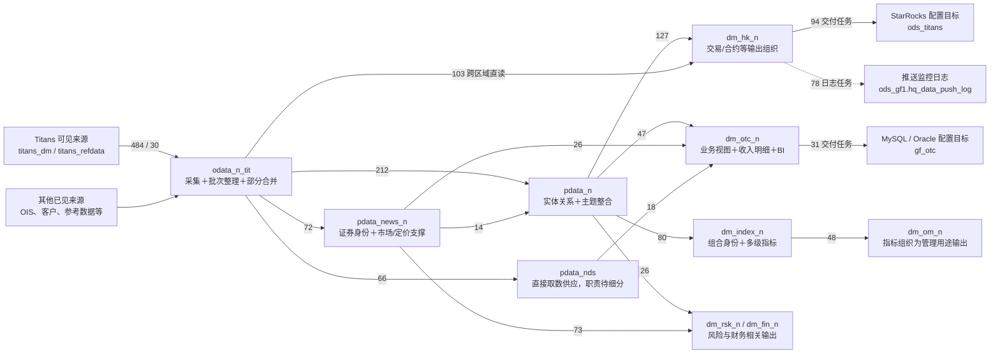
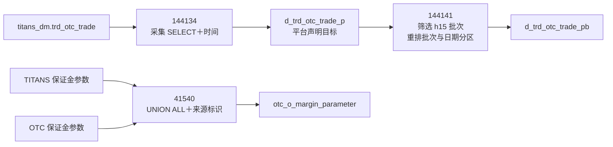
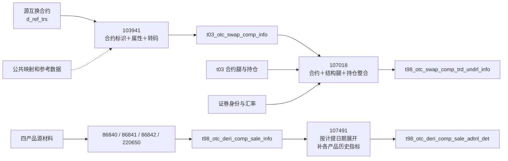
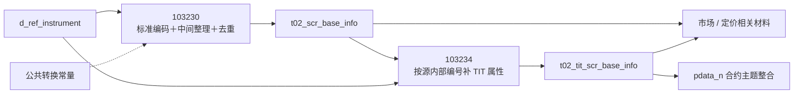
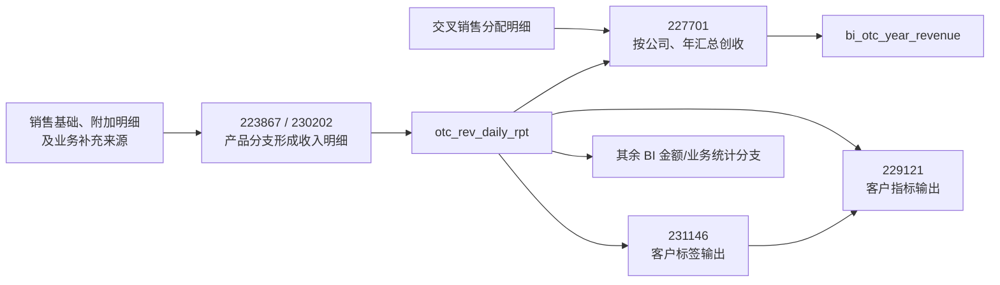
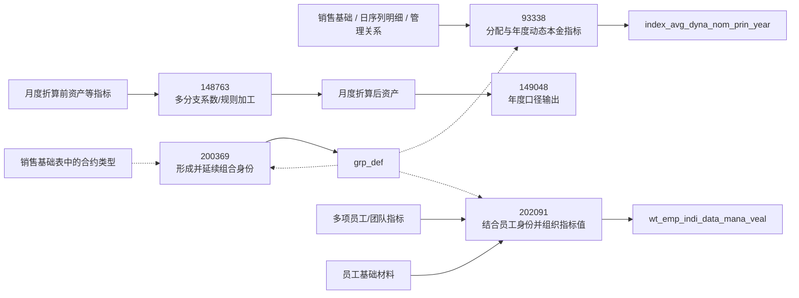

# 股衍数据加工骨架 V0：整体流向与各层内部加工

调查日期：2026-09-06。范围：已发布 `titans-otc` 批次。

**目前看到的体系包含采集、批次整理、多条并行的模型/主题加工、应用内二次加工，以及业务交付和监控日志。它不能压成一条“源 → 贴源 → 宽表 → 集市”的流水线。**

这份第一版先还原主要区域的来去和内部加工形状。全部 111 个 schema 名称已盘点；主体链路结合代表 SQL 解释，其余区域保留在清单中，尚未逐个还原业务职责。分组是可以调整的现状解释，不是已经确认的企业标准分层。

阅读入口：本稿看整体与层内骨架；[全部区域清单](E:/02_area/股衍数据-数据cookbook/sql-static-lineage/docs/processing-skeleton-inventory.md)查覆盖；[本金样例](E:/02_area/股衍数据-数据cookbook/sql-static-lineage/docs/value-case-otc-principal.md)查看一条局部链的字段细节。

## 1. 整体：主流向、并行路线和交付边界

图中数字为“同一任务读取该来源区域且具有该目标区域输出关联”的去重任务数，各方向可重叠，不能相加作总任务量。输出关联可能来自平台配置，不等于 SQL 明确写表或运行已落地；实线也不是逐字段因果。这里只画主体方向，全部方向及成员保存在证据清单。

`pdata_news_n → RF` 的 73 对应 `dm_rsk_n`；`pdata_n → RF` 的 65/26 分别对应风险、财务。图中“其他来源”是省略展开的入口，未逐域核验职责。`ods` 前缀在此不能直接解释为数仓的上游层；样本表明它承载另一数据库上的交付目标或监控日志。

## 2. 来源与 odata：进入仓库后还要整理

| 内部部分 | 输入与加工 | 输出及证据边界 |
| --- | --- | --- |
| 来源采集 | `titans_dm → odata_n_tit` 484 个关联任务均为 `oracle2hive` | 样本 `144134` 读取交易源并补采集时间，目标来自平台声明；没有证明实时数据已同步 |
| 批次/日期整理 | 55 个层内任务输出 `_pb` 表，作为结构分组 | `144141` 把 `_p` 中指定批次读出，将原 `busi_date` 转为 `grp_id`，另写日期分区；其他同组任务未逐条确认 |
| 中间结果归并 | 4 个行情 `_p` 归入基础表、4 个风险 `_tmp` 归入基础表 | 本次只确认连接形状，SQL 职责待详读 |
| 跨来源合并 | 6 个层内任务输出 `otc_o_*` | `41540` 已核实合并 TITANS 与 OTC 保证金参数，并保留 `sys_area_code` |

69 个 odata 层内关联任务对应上表后三组形状（55＋4＋4＋6），包含 56 个 `hiveTask` 和 13 个 `hiveTask-2.0`。这不是 69 个已经完整解释的业务过程。

图中未标 schema 的 `_p`、`_pb` 和 `otc_o_*` 表位于 `odata_n_tit`，OTC 保证金输入来自 `odata_n_ois`。采集目标分区宏与后续读取的 `h15` 尚未匹配到同一运行批次，前一条是表级路线，不是已经确认的批次接续。

**本层的当前解释：**既接收源形态数据，也整理采集批次，并在少数分支提前合并来源。因此下游有的从原始采集表读取，有的从整理结果读取；不能统一要求所有路径都经过 `_pb`。

证据：[来源与交付调查笔记](E:/02_area/股衍数据-数据cookbook/sql-static-lineage/tmp/processing-skeleton/source-and-delivery-notes.md)。

## 3. PDATA：三种职责、两条并行主路线

以下任务数均是图中具有输出关联的任务数；表数是具有输出关联的表节点数。

| 区域 | 任务 / 输出表 | 目前识别的内部结构 |
| --- | ---: | --- |
| `pdata_n` | 263 / 132 | 实体与关系入模、主题整合、直接形成销售宽表、按日期展开明细并存 |
| `pdata_news_n` | 77 / 47 | 共享证券身份、TIT 属性扩展、市场/定价信息的多路供应 |
| `pdata_nds` | 67 / 48 | 66/67 个任务直接读取 odata；已读样本为源形态供应，未见本 schema 内部读写链 |

### 3.1 pdata_n 内部并非只有“先规范模型再宽表”

这里展示表身份上的加工路线，尚未确认各次写入与读取属于可接续的日期分区或运行批次；例如 `103941` 与 `107018` 的固定 SQL 分别带有不同日期字面量。

第一条路线把源合约放入实体模型，再与腿、持仓及市场资料组合。`107018` 的样本还选择“本次更新或最近若干交易日”的持仓日期，不能只按当天快照理解。

第二条路线直接由各产品来源形成统一销售基础表。`107491` 再把当前合约快照展开为计提日期序列，补动态本金等信息，并把 `Accrued_Date` 用作目标 `busi_date`。因此，**沿这条链走一步，日期维度与粒度意图已经发生变化**；本次没有证明 Join 后的行唯一性。

### 3.2 同层连线中哪些是加工，哪些是补充依赖

`pdata_n` 有 136 个任务同时读写本 schema。按输入名称形状分成互斥三组：

| 形状 | 任务数 | 在骨架里如何处理 |
| --- | ---: | --- |
| 同层输入只有 `ref_*` | 62 | 横向参考/转码候选；不逐个画成前后加工阶段 |
| 只有临时、中间或占位来源，可伴参考表 | 35 | 保留内部加工/身份待查区域，不直接宣布为持久资产链 |
| 还读其他实体或主题表 | 39 | 优先展开进一步整合的链路；39 不是连续阶段数 |

这套分组依据名称和网络，尚未逐任务核实。其中 31 个任务的来源出现 `pdata_n.${src_table}` 字面量，明确留作未解析来源。schema 自环不能据此定为业务循环。

输出侧可以先按现有表族定位：`t03` 122 任务/50 表，`t01` 17/12，`t04` 5/4，`t05` 18/12，`t98` 83/40，其余表族 18/14。这是查找入口，命名前缀不等于已确认的业务对象分类。

### 3.3 pdata_news_n 围绕共享身份向外扩展

本区域 62 个同层关联任务中，44 个读取证券基础表、11 个读取 TIT 扩展表、15 个读取公共转换常量，集合可重叠。更适合表现成共享身份支撑多个分支，而非长串步骤。

其他分组包括 `t02_fin_*` 23 任务/15 表、`t02_opt_*` 13/7、`t02_tit_*` 15/10、其余 `t02_*` 18/12、`tyzx_*` 7/2、`nds_*` 1/1。曲线、波动率、产品属性、行情与计算结果还需要继续细分，不能全部统称“行情”。

### 3.4 pdata_nds 保留另一种供应方式

67 个任务中，66 个读取 `odata_n_tit`，1 个读取 `pdata_n`；本批未见内部同 schema 读写任务。包含持仓、参考对象、交易、财务视图、保证金/资金账户等输出表族。

已读样本 `119640` 只按业务分区读取并写出历史持仓字段，没有 Join、聚合或选最新窗口。其余 66 个任务尚未逐条读 SQL，因此这里只确认该例是源形态供应，不把整个区域都断言成原样搬运。

证据：[PDATA 调查笔记](E:/02_area/股衍数据-数据cookbook/sql-static-lineage/tmp/processing-skeleton/pdata-notes.md)、[407 个任务的分组和固定来源](E:/02_area/股衍数据-数据cookbook/sql-static-lineage/tmp/processing-skeleton/pdata-stats.json)。407 个任务完成结构/名称分组，本轮新增核读 SQL 为 6 个；其余 401 个不是已经完成的业务说明。

## 4. DM：多个应用方向，而且仍有层内加工

`dm_*` 在本批共涉及 40 个 schema 名称，其中包含测试命名区域。下面展开主要方向，其余全部列入区域清单；未详读区域不补写未经证实的职责。

| 区域 | 输出关联任务 / 表 | 内部骨架与当前理解 |
| --- | ---: | --- |
| `dm_otc_n` | 83 / 80 | 产品/合约视图、收入明细、BI 再聚合等分支；9 个同层关联任务，全部读取 `otc_rev_daily_rpt` |
| `dm_hk_n` | 214 / 171 | 交易、合约、持仓等输出组织，并被交付任务读取；包含 43 个 `hive2file`，这些输出关联不能全算写表 |
| `dm_index_n` | 131 / 130 | 组合身份、标签与多个级别的指标加工；129 个同层关联任务都读取 `grp_def`，仍需把身份关联与金额加工分别阅读 |
| `dm_om_n` | 56 / 47 | 多项指标结合员工/机构材料，组织为管理用途输出；48 个任务读取 `dm_index_n` |
| `dm_rsk_n` | 95 / 52 | 当前网络显示证券、报价、曲线、合约和账簿等输入汇入风险相关输出；尚未逐族验证是搬运、聚合还是计算 |
| `dm_fin_n` | 45 / 39 | 当前网络显示财务视图、持仓、合约及账户映射等输入；尚未逐族确认财务口径和职责 |

### 4.1 dm_otc_n：收入明细本身还是后续加工的输入

这条收入路线的两个入口在图中分别标注为金仕达多空互换与期权；本轮读了 `223867` 的固定 SQL，另一个入口保留为表级结构证据。`227701` 已确认按公司与年份分别求和期权、互换及跨境创收，并关联交叉销售金额，输出处除以 10,000。其时间条件读取当天分区中去年年初以来的计提日期，不能把“当天分区”理解成“只包含当天业务”。

客户标签到客户指标是已观察到的表级加工路线，尚未逐项核实标签规则。收入链之外还存在合约参数/事件、交易流水、对账准备、市场资料等输出族，第一版保留在应用区域明细中，未将其强行接到收入主线。

### 4.2 dm_index_n 与 dm_om_n：身份关联和指标加工并存

`grp_def` 是高引用对象，本批有 214 个任务读取。已核样本 `200369` 从合约基础表提取类型，再利用已有组合编号形成组合身份；它包含数据派生与已有身份延续，不能笼统叫“手工配置表”。这两处读取在当前表层网络中没有完整表现，本图用虚线注明为 SQL 补证。

`148763` 与 `202091` 的代表表达式分别显示多源指标计算、求和/平均及身份关联。这里只确认这些加工形状，不据此宣布标准资产或绩效口径业务正确。虚线表示身份、参考或 SQL 补充证据，不代表可以忽略的依赖。

证据：[应用区域统计与成员](E:/02_area/股衍数据-数据cookbook/sql-static-lineage/tmp/processing-skeleton/application-summary.json)、[6 个代表任务的固定 SQL 摘录与哈希](E:/02_area/股衍数据-数据cookbook/sql-static-lineage/tmp/processing-skeleton/application-evidence.json)。

## 5. 出口：业务交付、导出、监控日志要分开

| 分支 | 当前证据 | 骨架上的位置 |
| --- | --- | --- |
| `dm_hk_n → ods_titans` | 94 个 `hive2starrocks`，72 个目标表名；`202219` 选取业务行、日期窗口并补时间，目标来自配置 | 业务数据交付边界，未验证目标送达和目标系统后续消费 |
| `dm_hk_n → ods_gf1` | 78 个任务都指向唯一的 `hq_data_push_log`；`226677` 计算源表 `count/max`，并写日志常量 | 监控旁路；日志中的常量 `success` 不能证明业务送达 |
| `dm_otc_n → gf_otc` | 31 个任务，29 个 `hive2mysql`、2 个 `hive2oracle`；代表 `159182` 做字段、枚举和状态转换 | 下游交付及接口适配；同 schema 名可能属于不同引擎，不能据名称认成一个实例 |
| 文件导出 | `196894` 的 query 是读取 DM 表的 SELECT，带空值文本处理和时间；图却把该表记为输出目标，且缺少输入边 | 独立导出分支和证据缺口，不能算该表的建表写者；文件目的地未在本次材料中确认 |

因此，图上的“回到 ods”和“同一表多写者”，需要先看任务类别与输出声明。它们可能分别是交付、日志或导出，不能直接进入架构违规清单。

## 6. 横向依赖与未看清的区域

第一版保留四类会影响阅读的边界：

- **参考与身份依赖。** `ref_cd_cvt_map`、公共证券身份、`grp_def` 等应作为横向支撑展开。数量大或被频繁读取不等于独立业务阶段。
- **临时过程与占位来源。** `temp` 下有 111 个可见节点；部分模板表名、列名疑似被记录为来源。没有核实身份前，不把它们当真实业务区域。
- **图未覆盖的内部加工。** 例如 `103230` 的 SQL 中间写入未全部出现在最终表层输出；`107018` 的部分 CTE 输入、`200369` 的类型来源与自读也未完整呈现在当前网络。层内骨架需要按关键 SQL 补充，不能宣称仅凭图已穷尽所有步骤。
- **尚未深读的应用和外围来源。** 111 个 schema 都已列入索引；主要区域已给代表链，其他区域目前只有输入输出定位。测试命名区域单列，不能自然并入正式业务主线。

本批三个 PDATA 区域中，读 `dm*` 的输出关联任务只观察到一条指向 `dm_fin_test` 的情况，尚未详读。当前没有依据把“pdata 普遍反向读取 dm.grp_def”写成体系特征。

## 7. 这版的证据范围和完成程度

| 项目 | 本次结果 |
| --- | --- |
| 固定发布图版本 | `4f61cee7134b1cba7686191bc0e8606ab28cc4d673935a50298e7ba792babf9a` |
| 全局盘点 | 3,615 任务、2,740 表节点、111 schema 名称；读取前后图均 READY 且版本相同，未发生导出上限截断 |
| 去重关系 | 6,755 个任务—读取表对，2,205 个任务—输出表对，共 8,960 对。原始边记录为 12,256 条，包含读次/写观察，不等于独立关系数 |
| 覆盖状态 | 2,258 PROJECTED；1,177 SCHEDULE_ONLY；180 COLLECTION_FAILED。调度类任务未必应该有 SQL，但仅有调度不能补成数据读写关系 |
| 投影内仍有缺口 | 45 个 PROJECTED 任务无表层关系；另有 8 个任务有输入无输出、74 个有输出无输入。可能包括声明、局部过程或缺证据，不能当成无业务加工 |
| 新增代表核验 | 来源/整理/交付 7 个任务，PDATA 6 个，DM 应用 6 个，共 19 个任务；另引用先前已核验的四产品本金样例 |
| 已完成 | 全量表层盘点、主要区域流向、贴源整理模块、PDATA 并行路线、证券支撑网络、DM 代表加工链、交付/日志区别、明确的未知区域 |
| 尚未完成 | 其余任务逐条加工语义、全部业务职责确认、精确运行批次接续、数据唯一性、全字段口径和运行落地验证 |

**这版能够作为知识积累的加工底图，但仍是有明确空白的第一版。** 接下来的内容可以直接挂在已识别的加工单元及其输入输出上；尚未解释的部分已经有位置和证据入口，无须让读者先替整库分类。

复核材料：[全量表层快照](E:/02_area/股衍数据-数据cookbook/sql-static-lineage/tmp/processing-skeleton/table-network.json)、[全部区域流向及任务集合](E:/02_area/股衍数据-数据cookbook/sql-static-lineage/tmp/processing-skeleton/schema-flows.json)、[区域盘点](E:/02_area/股衍数据-数据cookbook/sql-static-lineage/docs/processing-skeleton-inventory.md)。快照中的任务带固定 evidence 路径，可以继续阅读对应 SQL；SQL 行号均指指定 slot 中的行号，不是 JSON 文件行号。

本次复用了现有连接、发布材料与 Machine Facts。临时脚本只读表层并在本地整理结果，没有改变 Facts、图投影或发布状态。若重跑临时导出，它读取当时 READY 的版本，不能默认与本稿是同一历史批次。
