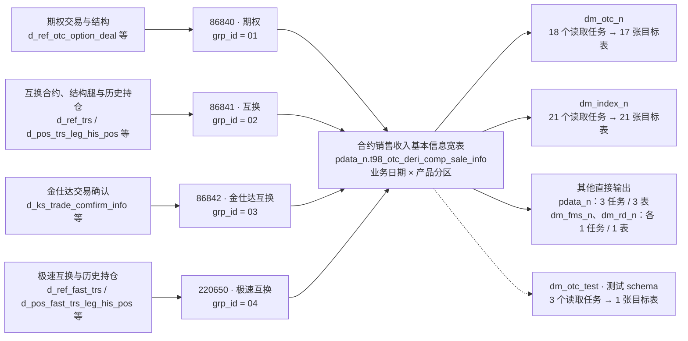

# 第一个价值场景：四路合约本金如何汇成一张宽表

调查日期：2026-09-06。对象：`pdata_n.t98_otc_deri_comp_sale_info`。

**业务问题：使用这张表的“初始名义本金”时，能否把四个产品分区当作同一种金额直接比较或汇总？**

当前证据足以说明四路分别怎么算、如何汇入同一张表，以及一个真实下游怎样使用它；还不足以确认四路金额具有统一的计价币种和“初始”定义。因此，统一汇总口径仍需确认，不能仅凭同列名作出承诺。

最值得带走的三个结果：

- 四个任务分别覆盖 `grp_id=01/02/03/04`。它们是在同一张表里装载不同产品分支，当前没有证据表明它们争写同一分区。
- 极速互换的 `dy.Init_Nom_Prin` 不是简单搬运物理源表的同名字段：本任务先从历史持仓中选记录，再汇总 `dynamic_notional`。
- 已核实一个真实消费者：任务 `103457` 将本表初始本金计算为 `sum(coalesce(Init_Nom_Prin,0)) as Nom_Prin`，任务配置输出至 `dm_otc_n.wt_otc_trade_dtl`。所以口径确认有具体的下游对象，不能只停留在四条公式对比。

## 1. 加工地图：四路汇合，多处使用

下面只展开四路主要来源和直接消费方向。箭头表示图中静态读取与输出目标关系，输出目标可能来自任务配置，不代表已经核验运行落地；34 张直接来源表中的客户、码表、保证金等补充来源合并说明，未画成完整字段血缘。



图中产品名称来自任务名称，并结合本次查看的产品来源与过滤条件理解；它们不是一份新建立的权威产品分类。来源表名在图中省略了 `odata_n_tit` 前缀。

本批图中，四个写入任务共连接 **34 张去重来源表**；这张宽表连接 **47 个直接读取任务、44 张直接目标表**，其中包含单列的测试 schema。47 个读者是表级消费候选，本次只对其中一个验证了本金字段消费。

这意味着该表在结构上充当跨产品的公共合约信息入口，既服务 `dm_otc_n`，也服务其他加工方向。这是根据静态结构作出的建模解释，不代表已确认当初的设计决策。

来源还有客户/交易对手、合约属性、标的、账簿、保证金及参考参数。例如 `odata_n_ois.o_otc_derivative_counterparty`、`odata_n_tit.d_ref_instrument`、`pdata_n.ref_dw_cd_val`。这些来源族是本次阅读归纳，并未逐张完成业务职责确认。

证据：[上游查询快照](E:/02_area/股衍数据-数据cookbook/sql-static-lineage/tmp/otc-principal-value-case/upstream-table-trace.json)、[下游查询快照](E:/02_area/股衍数据-数据cookbook/sql-static-lineage/tmp/otc-principal-value-case/downstream-table-trace.json)。

## 2. 这张宽表如何组织信息

任务附带的建表 SQL 将其称为“场外衍生品合约销售收入基本信息表”。它同时放入合约身份、客户信息、产品分类、本金、日期、产品条款和管理属性。下面的字段族是为了方便阅读而做的人工归纳，不是 Facts 自带的业务分类。

| 阅读问题 | 代表字段 | 解释与边界 |
| --- | --- | --- |
| 这是什么合约？ | `agt_id`、`busi_type`、`src_contr_type`、`src_sub_contr_type` | 提供身份与分类；不同分支的 `agt_id` 来源并不相同 |
| 和谁做、对应什么标的？ | `cutp_pty_id`、`key_cutp_id`、`undrl_ins_id`、`undrl_wd_cd` | 合约关联客户和标的信息；不能只凭字段名证明关联唯一 |
| 规模是多少？ | `init_nom_prin`、`dyna_nom_prin`、`absl_nom_prin`、`cny_ex_rate` | 共用字段名，但本金生成和汇率处理要按产品分支阅读 |
| 金额对应什么时间？ | `busi_date`、`strt_pric_date`、`end_pric_date`、`early_term_date` | 业务分区日期、合约事件日期与源历史日期不能混为一谈 |
| 合约有什么条款？ | `init_marg_prop`、`cms_rate`、`fixed_rate`、`ki_barr_pct`、`ko_barr_pct` | 不同产品共享一套宽表结构，具体适用性仍需产品规则说明 |
| 怎么追踪和管理？ | `data_src_cd`、`task_name`、`data_etl_date`、`book_agt_id`、`book_name` | 提供来源、加工和管理属性 |

**粒度只能给出候选，不能宣布主键。** 四任务均按业务日期和 `grp_id` 执行分区覆盖写入。`86840/86841/220650` 的 `agt_id` 来自 `trade.internal_trade_id`，`86842` 来自 `a.key_trade_comfirm_id`。调查行重复时，可从 `(busi_date, grp_id, agt_id)` 开始检查；目前没有数据验证证明这个组合唯一。

原因是：互换路径连接结构腿与其他腿，极速互换本金先按 instrument 聚合再关联交易，各路还关联客户、码表等信息。局部聚合或主表去重不能保证所有 Join 之后仍是一合约一行。

**建模解释：**“按产品独立加工，再用统一宽表字段供下游读取”符合当前实现。它降低了下游接入不同源表的成本，也把统一字段的业务含义、适用范围和粒度说明变成了必须承担的责任。

证据：[固定 SQL 片段与 DDL 摘录](E:/02_area/股衍数据-数据cookbook/sql-static-lineage/tmp/otc-principal-value-case/sql-evidence.md)、[四写者 Facts 摘录](E:/02_area/股衍数据-数据cookbook/sql-static-lineage/tmp/otc-principal-value-case/four-writer-evidence.json)。

## 3. 初始名义本金：必须读到内层加工

下表中，日期选择均是静态 SQL 的行为，不能由此证明源分区包含完整历史、任务成功运行或结果符合正式业务口径。

| 产品分区 / 任务 | 本金从哪里产生 | 本层如何处理汇率 | 需要业务确认的含义 |
| --- | --- | --- | --- |
| `01` 期权 / `86840` | `d_ref_otc_option_deal.Initial_Notional` 乘汇率选择结果 | 抵押品名义币种为 CNY 时取 1；否则若结算币种为 CNY，取结构表的期初汇率；否则取中间价。中间价按结构开始日期匹配报价日期 | 原始本金计价币种、汇率倍率方向，以及该选择是否实现正式目标单位 |
| `02` 互换 / `86841` | 当前业务分区内，按腿与标的选择 `src_busi_date` 最早记录，再按腿汇总 `Init_Price × Init_Quantity` | `CURRENCY=CNY` 取 1；否则 `BASE_CURRENCY=CNY` 取基础期初汇率；否则 `SETTLEMENT_CURRENCY=CNY` 取结算期初汇率；没有 ELSE | 最早可见历史是否等于业务上的“初始”；是否保证三种币种条件至少命中一种 |
| `03` 金仕达互换 / `86842` | 当前业务分区内，按确认编号取 `business_date` 最新记录；`trs_type='B_LONG_SHORT_SWAP'` 时取 `dynamic_notional`，否则取 `notional` | 这条公式没有汇率乘法；输出 `cny_ex_rate=NULL` | 多空互换以动态本金写入初始本金的产品约定；源金额单位及上游折算阶段 |
| `04` 极速互换 / `220650` | 当前业务分区内的 EOD 历史持仓，按 `(key_instrument_id, wind_code)` 取最早 `src_busi_date` 的记录，再按 instrument 汇总 `dynamic_notional` | 这条本金公式没有汇率乘法；输出 `cny_ex_rate='1'` | 每标的最早可见持仓是否满足正式初始本金定义；源金额单位及上游折算阶段 |

例如极速互换的真实阅读链是：

```text
d_pos_fast_trs_leg_his_pos
  → 当前业务分区中的 EOD_POSITION
  → 每个 instrument / wind_code 取最早 src_busi_date
  → 按 instrument 汇总 dynamic_notional，命名为 Init_Nom_Prin
  → 与交易关联
  → dy.Init_Nom_Prin 写入宽表 grp_id=04
```

所以，“最外层是直接赋值”与“没有中间加工”是两回事。这里也没有明确把所选历史日期与合约开始日比较，不能把实现说明直接写成“取合约成立日本金”。

同样，“公式里没有乘汇率”只能描述本层实现，不能推出上游没折算或金额一定不是人民币。此前“同表有的折人民币、有的不折”应收紧为：**本层汇率处理不同，四路最终单位是否一致尚未确认。**

## 4. 下游实际怎么用：一个已核实的例子

任务 `103457` 读取当天的本表数据，排除 `Src_Contr_Type='FEE_SWAP'`，关联管理关系和客户标签后，再按机构及客户经理条件筛选。任务配置输出至 `dm_otc_n.wt_otc_trade_dtl`；其 query SQL 是 SELECT，目标表证据标记为 `PROFILE_DECLARED / DECLARED`，本次没有核验运行落地。Machine Facts 将聚合表达式的输入绑定到本表 `init_nom_prin`；固定 SQL 的对应公式是：

```sql
sum(coalesce(Init_Nom_Prin, 0)) as Nom_Prin
```

这段公式没有再次统一汇率。其 GROUP BY 保留合约编号、业务类型、源合约类型等维度，因此**不能把它描述成已经把四产品混加**。已确认的是：该下游金额依赖上游本金，且会在聚合前把 NULL 当作 0。

这使“86841 的汇率 CASE 没有 ELSE”成为一个具体的待确认问题：**如果**真实记录未命中任何币种分支而产生 NULL，且进入该下游范围，它会在这条金额计算中被当作 0。当前没有运行数据证明这个条件已经发生。

证据：[下游 Facts 查询](E:/02_area/股衍数据-数据cookbook/sql-static-lineage/tmp/otc-principal-value-case/downstream-principal-processing.json)、[目标声明证据](E:/02_area/股衍数据-数据cookbook/sql-static-lineage/tmp/otc-principal-value-case/downstream-output-evidence.json)、[固定 SQL 片段](E:/02_area/股衍数据-数据cookbook/sql-static-lineage/tmp/otc-principal-value-case/sql-evidence.md)。

## 5. 可以带去讨论的两条发现

| 发现 | 已有证据 | 影响与需要作出的判断 |
| --- | --- | --- |
| 同一个“初始名义本金”字段承载四种产品生成路径 | 四分区、内层公式、历史日期选择和汇率输出均有固定证据 | 请产品/口径负责人逐分区确认：目标金额单位是什么，“初始”对应什么事件或历史日期，是否允许跨产品比较/汇总。确认不同不等于要改 SQL，也可能需要明确字段适用范围 |
| 互换汇率未命中分支的 NULL，可能在下游聚合中变成 0 | `86841` 的 CASE 没有 ELSE；`103457` 对本金使用 `coalesce(...,0)` | 请确认产品约束是否排除所有未命中情况；若不能排除，再针对相关分区核查实际记录和期望处理。当前是条件性风险，尚不是已发生的缺陷 |

本次没有把同表多写者判成重复建设，没有宣布所有 Join 粒度正确，也没有把 47 个表级读者全部标成已受本金问题影响。

## 6. 证据范围与复查入口

本稿基于已发布静态证据，未查询实时业务数据，也未获得正式口径确认。

- 固定图：`titans-otc`，版本 `4f61cee7134b1cba7686191bc0e8606ab28cc4d673935a50298e7ba792babf9a`；发布于 2026-09-05 19:36:23（北京时间）。
- 本批 3,615 个任务中，2,258 个有任务投影，1,177 个仅有调度覆盖，180 个采集失败。关系清单只覆盖本批可见证据，不能作为全系统完整清单。
- 上游查询深度 2：39 节点 / 80 边；下游查询深度 2：92 节点 / 107 边。均未触及边数截断，均在深度边界停止；没有进一步展开 34 张来源表的写者或 44 张目标表的后续消费者。
- 四写者 manifest 标记为 `LEGACY_NOT_L1`。本稿使用其已有静态材料和 SQL 交叉核验，不将 `PROJECTED` 当作 L1 合格、运行成功或业务正确。
- [查询状态](E:/02_area/股衍数据-数据cookbook/sql-static-lineage/tmp/otc-principal-value-case/graph-status.json)、[四路对照原始返回](E:/02_area/股衍数据-数据cookbook/sql-static-lineage/tmp/otc-principal-value-case/principal-compare.json)、[固定来源、哈希与 Facts 摘录](E:/02_area/股衍数据-数据cookbook/sql-static-lineage/tmp/otc-principal-value-case/four-writer-evidence.json)、[带原始 SQL 行号的证据摘录](E:/02_area/股衍数据-数据cookbook/sql-static-lineage/tmp/otc-principal-value-case/sql-evidence.md)。

可复查的现有命令如下；它们查询当前发布版本，重跑时应先核对版本是否与本稿一致。固定快照和摘录保留本次结果。

```powershell
$graphCli = 'E:\02_area\股衍数据-数据cookbook\sql-static-lineage\scripts\lineage-graph.ps1'
& $graphCli status
& $graphCli trace --table pdata_n.t98_otc_deri_comp_sale_info --layer table --depth 2 --limit 150
& $graphCli trace --table pdata_n.t98_otc_deri_comp_sale_info --layer table --direction down --depth 2 --limit 200
& $graphCli compare --task-ids '86840,86841,86842,220650' --column init_nom_prin
& $graphCli processing --task-id 220650 --sql --slot query --line-start 149 --line-count 26 --limit 1
& $graphCli processing --task-id 103457 --text init_nom_prin --limit 10
```

## 7. 这次实际用了哪些能力

这张记录用于后续讨论保留、补充和简化的对象。它描述本次场景，不代表其他场景的需求。

| 能力 | 本次使用方式 | 产生的读者价值 / 暴露的缺口 |
| --- | --- | --- |
| 任务—表图与稳定查询 CLI | 直接使用 | 找到四写者、34 来源表、47 直接读者和真实下游，不需要手工预选全部 SQL |
| Machine Facts 表达式与物理字段绑定 | 直接使用 | 对照本金公式，识别内部聚合，确认下游实际读取的物理字段 |
| 固定 SQL 与建表语句 | 直接使用 | 复核分区、日期选择、Join、字段注释和 CASE 缺省行为 |
| READ_FIELD / WRITE_FIELD 与写观察 | 通过现有比较/字段定位入口间接使用，未手工遍历端口 | 保持输出公式所属任务和写入上下文；本次不能据此证明端口无价值 |
| 跨任务 CONTINUES / CANDIDATE | 未用于本次字段因果结论 | 下游消费用该任务自身的物理输入绑定和 SQL 核实；本次未验证跨多跳字段接续的价值 |
| COLUMN / PHYSICAL_FIELD 目录扩展 | 未使用额外目录扩展；复用正式图已有物理身份 | 这个场景不需要先合并节点身份，也不能替其他场景裁决是否应删除扩展 |
| 来源族、字段族、建模解释 | 人工归纳，并标出依据 | 当前没有直接产出这些阅读组织的消费能力；这正是本稿补上的工作 |
| 统一币种、正式初始定义、真实唯一性 | 尚缺业务或运行证据 | Facts 能提供核实入口，不能替代这些确认 |

本次所有图查询均复用已发布材料，没有生成新投影。交付停在这一个场景，下一步由读者判断：这份说明是否已经比自行翻查 SQL 更容易定位问题、理解加工并发起口径确认。
