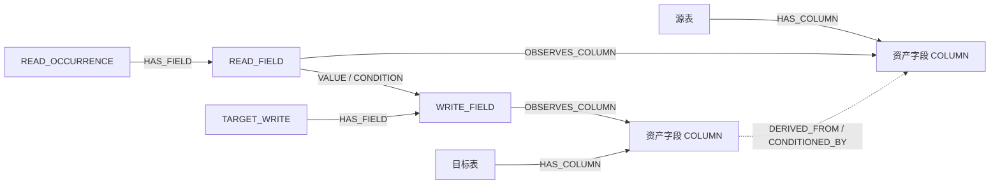

# 资产字段与具体加工的关联

本扩展让资产目录和精细读写关系可以相互定位。它复用 `compileTask` 的读写字段模型，
通过 `compileCatalogTask` 显式启用；不改变当前正在构建的 Neo4j 图、Facts、
任务局部投影或跨任务接续规则。

## 点边含义



`COLUMN` 按已确认的 **平台、数据源、限定表名、列名** 标识。同一资产在不同任务中
得到相同目录 ID；读写字段继续按各自读次和写观察区分。

自连接的同一物理字段可对应多个读取字段。例如 `a.amount + b.amount AS total`，
当结构化字段引用分别确认两个别名的读取位置时，会生成两个 `READ_FIELD`，
各以 `VALUE` 指向同一个 `WRITE_FIELD(total)`。同一别名重复引用仍共用读取字段；
无法唯一定位的引用继续保留未解析状态。此修复需要重新生成 Facts、任务局部投影及图；
仅重新编译旧 Facts 无法恢复已丢失的别名。依赖适配器版本为 `0.5.1`，投影生成器版本为 `1.3.8`。

原有 `PHYSICAL_FIELD` 是输入 Facts 的字段身份，保持原 ID，通过
`IDENTIFIES_COLUMN` 关联目录字段。当前任务投影的表节点没有 `stableTableId`，
因此目录不伪造一个 Facts 输出字段 ID；`COLUMN` 有独立的 `DATASET_COLUMN` 身份范围。

| 层        | 关系                                                              | 用途                                   |
| --------- | ----------------------------------------------------------------- | -------------------------------------- |
| `catalog` | `HAS_COLUMN`、`HAS_FIELD`、`OBSERVES_COLUMN`、`IDENTIFIES_COLUMN` | 目录归属、从资产定位具体加工           |
| `field`   | 既有 `VALUE`、`CONDITION`                                         | 携带读次、写观察的具体字段依赖         |
| `asset`   | `DERIVED_FROM`、`CONDITIONED_BY`                                  | 目标资产字段到源资产字段的局部依赖摘要 |
| `control` | 既有 `DATASET_CONTROL`                                            | 行集控制；保持独立                     |

资产摘要逐条保留 `sourceEdgeId`、写观察、源读次、投影哈希和原边属性，不把值来源与
条件选择混在一起。摘要方向是**目标到源**，与 `field` 层的数据流方向不同。
共享资产可以用于全貌中的对象归并、共同依赖检索；沿资产摘要连通不等于已确认的
跨任务字段路径，更不能据此宣布业务口径等价。

## 缺口与范围

- 只按明确的读写表关联及已确认物理身份建立映射；同名异数据源保持分开。
- 无法确定源读次时，保留逐原边隔离的 `UNRESOLVED_READ_FIELD`，不让共享物理字段
  成为跨任务值流连接点，不生成该边的资产来源摘要。
- 目标表身份不足时保留写入字段，预览通过 `unmappedWriteFields` 列出未映射项。
- 输入完整输出绑定后，常量目标列也能进入目录；它没有虚构的来源边。
  表达式、常量值的完整解释仍需原 Facts，当前扩展没有新增表达式节点。
- 这是已观察字段的目录，不是 DDL 全字段清单，也不承诺完整业务覆盖。

## 调用和离线预览

```ts
import { compileCatalogTask } from "./compile-catalog.ts";
const graph = compileCatalogTask(projection, evidence.bindings);
```

仓库根目录运行，`--projection` 接受完整任务投影或原始磁盘 envelope，
`--bindings` 可传输出绑定的 JSON 数组：

```text
node --import tsx packages/data-graph/src/asset-graph/catalog-preview.ts --projection <projection.json> --bindings <bindings.json> --output <preview.json>
```

该入口验证本地投影内容哈希，保留 1.3 元数据与 gaps；不读取发布 manifest，
不声称校验了当前线上版本。结果包含完整图、映射缺口和计数，控制台只打印计数。

正式发布接入时需要让编译器调用此入口，并将 `ASSET_CATALOG_COMPILER_VERSION`
加入任务编译缓存/owner hash。只改调用却继续沿用旧编译缓存，会漏掉目录关系。
现有 store 的 `field/table/schedule` 查询不能直接当作 `asset` 查询使用；
目录查询需要明确选层及关系方向。这次未改正在运行的发布器和查询服务。

## 本次验证（2026-09-05）

13 项测试通过，覆盖共享字段身份、不同数据源、自连接、多写、常量绑定、条件通道、
未知边界和真实 envelope 读取。另使用已有六任务 1.3 投影离线核验：

- 638 个跨任务目录字段观察，按完整目录身份归并为 343 个字段，其中 130 个出现在多个任务中。
- 210 个已定位读取字段、235 个写入字段全部关联到目录；23 个读次不明的字段依赖保留边界。
- 没有缺失端点的边，`field` 层没有通过共享资产字段连接路径。

六任务运行未提供额外输出绑定，因此真实样例计数仅覆盖现有字段边对应的输出，
不能作常量输出完整性结论。常量目录行为由专门的绑定测试核验。
结果位于仓库 `tmp/asset-catalog-preview/verification-summary.json`；它是本地验证产物，
不是那批 3,615 个任务的发布或业务验收。
